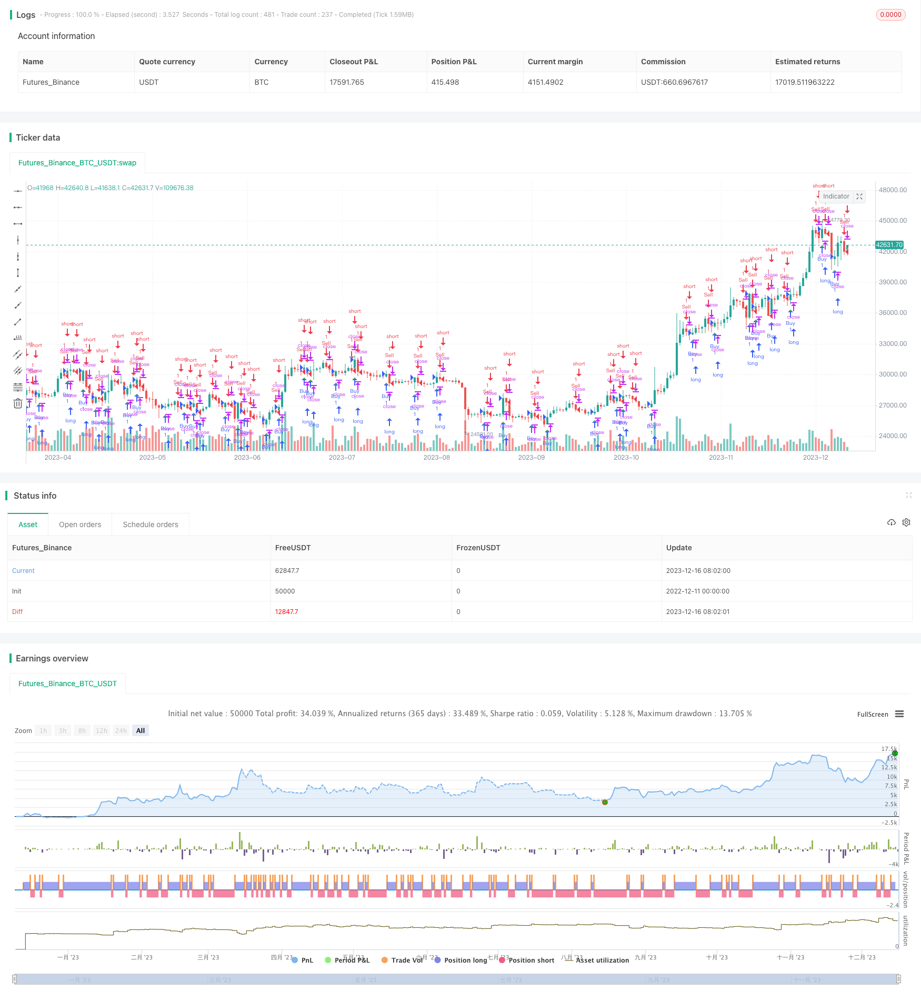

> Name

Heikin-Ashi-05-Change-Short-Period-Trading-Strategy Based on 05 Heikin Change
> Author

ChaoZhang

> Strategy Description


[trans]

## Overview
This strategy is a short-term trading strategy that sends buy and sell signals based on a 0.5% change in Hexton's closing price. It is only applicable to the Hexcel combustion diagram, and the optimal operating periods are 2 hours, 1 hour and 30 minutes.
## Strategy Principle
The core logic of this strategy is: **When the closing price of Hexcel rises 0.5% compared with the closing price of the previous K line, go long; when the closing price of Hexcel falls 0.5% compared with the closing price of the previous K line, go short**.
Specifically, this strategy first calculates the percentage change between the current K-line closing price and the previous K-line closing price, which is `priceChange = close / close[1] - 1`. If `priceChange >= 0.005`, a long signal is issued; if `priceChange <= -0.005`, a short signal is issued.
When sending a signal, the strategy also determines whether there is currently a position. If a position is already held (long or short), the signal will not be sent repeatedly; if there is no position, a corresponding opening signal will be sent based on the buying conditions or selling conditions.
Finally, the strategy also uses `plotshape` to mark buy and sell signals on the chart.
## Strategic Advantages
- Using the Hexagonal rate of change as a trading signal, it is better able to capture the short-term price change trend than simple moving averages and other indicators.
- Sends signals based on only a tiny price change of 0.5%, extremely sensitive and suitable for short-term trading
- The entire strategy logic is very simple and direct, easy to understand and implement
- Can be used in multiple time periods, with strong flexibility
## Risks and Solutions
- The Hexcel combustion chart itself pays more attention to short-term price changes and is easily disturbed by market noise and generates false signals.
  - You can adjust the change rate parameter appropriately, such as changing it to 1% or 2%, to reduce the false signal rate
- If you are too sensitive, you may enter and exit the market too frequently, which will increase transaction costs and taxes.
  - The holding period can be appropriately adjusted, such as holding a position for more than 2 hours each time, to avoid high-frequency trading
- There may be too many buying and selling points marked by the graph, which affects the aesthetics of the chart.
  - Possibility to hide graphic markers and only view entry signals through the strategy log
## Optimization direction
This strategy can be optimized mainly from the following aspects:
1. Based on market volatility and trading style, adjust the price change threshold parameters and find the best parameter combination
2. Add stop-loss logic to limit the maximum loss ratio of a single transaction and control risks.
3. Combine with other indicator filters to avoid unnecessary opening of positions during shock periods
4. Add position management mechanisms, such as fixed quantity opening, index increase, grid trading, etc.
5. Optimize the entry mechanism, avoid frequent bilateral transactions, and use trend or counter-trend methods.
## Summarize
Overall, this strategy is a very simple and direct short-term trading strategy with few parameters, easy to understand and modify. It has a strong ability to catch short-term price changes and is suitable for those who like high-frequency trading. But at the same time, attention should also be paid to controlling the number of transactions and reducing transaction costs. Through some parameter adjustments and optimization, the trading performance of this strategy can be made even better.
||

## Overview  

This is a short-term trading strategy that issues buy and sell signals based on 0.5% changes in the Heikin-Ashi close price. It is only suitable for Heikin-Ashi candlestick charts and works best at periods of 2 hours, 1 hour, and 30 minutes.  

## Strategy Logic

The core logic of this strategy is: **Go long when the Heikin-Ashi close price rises 0.5% compared to the previous candlestick; Go short when the Heikin-Ashi close price falls 0.5% compared to the previous candlestick.**

Specifically, the strategy first calculates the percentage change between the current close price and the previous close price, i.e. `priceChange = close / close[1] - 1`. If `priceChange >= 0.005`, a long signal is issued. If `priceChange <= -0.005`, a short signal is issued.  

When issuing signals, the strategy also judges whether there is an existing position. If already in position (long or short), no signal will be repeated. If there is no position, it will issue open position signals based on the buy or sell conditions.

Finally, `plotshape` is used to mark the buy and sell signals on the chart.  

## Advantages  

- Using Heikin-Ashi rate of change as trading signal, which captures price trend changes better than simple moving average etc.  
- Issuing signals based on tiny 0.5% price changes, making it extremely sensitive and suitable for short-term trading
- Very simple and straightforward logic, easy to understand and implement  
- Applicable to multiple timeframes, highly flexible  

## Risks and Solutions

- Heikin-Ashi itself focuses more on short-term price action, prone to market noise and false signals
  - Adjust parameters like only reacting to 1% or 2% changes to lower false signal rates  
- Too sensitive, may over-trade frequently incurring higher fees
  - Adjust holding period, e.g. 2 hours minimum each trade, to avoid high frequency trading
- Too many graphical markers cluttering the chart  
  - Hide plotshapes and only check signals from strategy log   

## Optimization Directions  

The main aspects to optimize this strategy:

1. Adjust price change threshold based on market volatility and trading style to find optimum parameters
2. Incorporate stop loss to limit max loss percentage per trade  
3. Add filter with other indicators to avoid unnecessary trades during consolidation
4. Introduce position sizing for fixed quantity, exponential, grid trading etc.  
5. Optimize entry mechanisms, avoid whipsaws, trade with trend or counter trend  

## Conclusion  

In summary, this is a very simple, low parameter, easy to understand short-term trading strategy. It catches price changes extremely fast, suitable for high frequency traders. But also need to control number of trades to reduce costs. With several optimization methods, it can achieve even better results.

[/trans]


> Source (PineScript)

``` pinescript
/*backtest
start: 2022-12-11 00:00:00
end: 2023-12-17 00:00:00
period: 1d
basePeriod: 1h
exchanges: [{"eid":"Futures_Binance","currency":"BTC_USDT"}]
*/

//@version=4
strategy("Heikin-Ashi - Change 0.5% short Time Period", shorttitle="Heikin-Ashi - Change 0.5% short Time Period", overlay=true)

// Calculate 0.5% price change
priceChange = close / close[1] - 1

// Buy and Sell Signals
buyp = priceChange >= 0.005
sellp = priceChange <= -0.005

// Initialize position and track the current position
var int position = na

// Strategy entry conditions
buy_condition = buyp and (na(position) or position == -1)
sell_condition = sellp and (na(position) or position == 1)

if buy_condition
    strategy.entry("Buy", strategy.long)
    position := 1

if sell_condition
    strategy.entry("Sell", strategy.short)
    position := -1

// Plot Buy and Sell signals using plotshape
plotshape(series=buy_condition, title="Buy Signal", location=location.belowbar, color=color.green, style=shape.triangleup, size=size.small)
plotshape(series=sell_condition, title="Sell Signal", location=location.abovebar, color=color.red, style=shape.triangledown, size=size.small)

```

> Detail

https://www.fmz.com/strategy/435720

> Last Modified

2023-12-18 12:13:56
