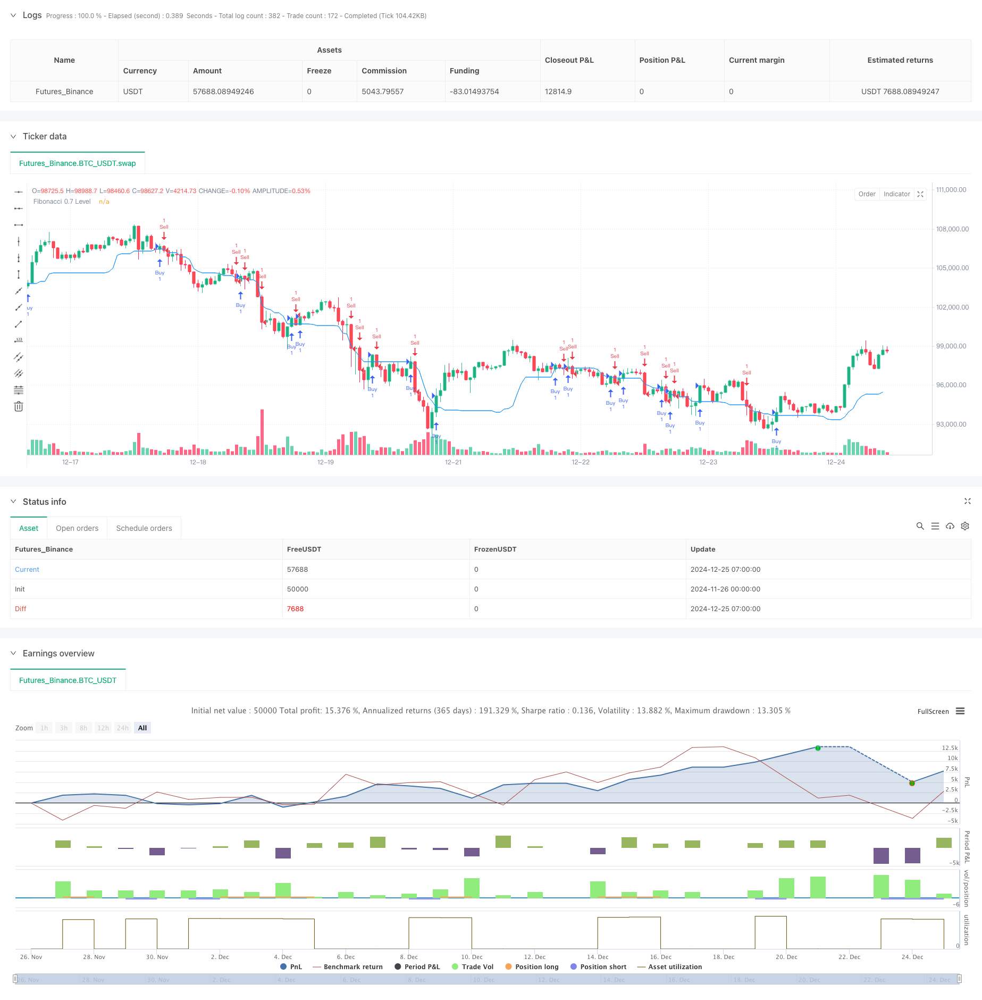

> Name

Quantitative-Trading-Strategy-Based-on-Fibonacci-07-Level-Trend-Breakthrough
> Author

ChaoZhang

> Strategy Description



[trans]
#### Overview
This strategy is a trend breakout trading system based on the Fibonacci 0.7 retracement level. It determines the Fibonacci 0.7 level by calculating the highest and lowest price over a specified lookback period and generates a trading signal when the price breaks through this level. The strategy uses a fixed percentage of take-profit and stop-loss to manage risk, and by default uses 5% of the total account value as the single transaction amount.
#### Strategy Principle
The core logic of the strategy is based on the following key elements:
1. Dynamically calculate Fibonacci levels: within the specified lookback period (default 20 periods), continue to track the highest and lowest prices, and calculate the 0.7 Fibonacci retracement position.
2. Breakthrough signal confirmation: When the closing price breaks through the 0.7 level from below, a long signal is generated; when the closing price breaks through from above, a short signal is generated.
3. Risk management: The system sets symmetrical take-profit and stop-loss conditions. The default take-profit is 1.8% and the stop-loss is 1.2%. This setting reflects the concept of positive expected value.
4. Position management: A fixed proportion of the total account value is used as the opening amount. This method contributes to the dynamic management of funds and the stable control of risks.
#### Strategic Advantages
1. Scientific selection of technical indicators: Fibonacci retracement is a widely recognized technical analysis tool in the market, and the 0.7 level usually represents strong support or resistance.
2. Clear signal logic: Using price breakthroughs as trading trigger conditions avoids the lag that may be caused by complex signal combinations.
3. Reasonable risk-return ratio: The setting of the take-profit and stop-loss ratio reflects positive expected value and is conducive to long-term stable profitability.
4. Flexible fund management: Use account ratio to open positions, and the transaction volume can be automatically adjusted as the account size changes.
#### Strategy Risk
1. Market environment dependence: Frequent false breakthrough signals may occur in volatile markets, increasing transaction costs.
2. Parameter sensitivity: The selection of parameters such as lookback period and take-profit and stop-loss ratio will significantly affect the strategy performance.
3. Impact of slippage: In markets with small trading volumes, you may face greater risks of slippage.
4. Technical limitations: A single technical indicator may not be able to fully capture the multi-dimensional information of the market.
#### Strategy optimization direction
1. Signal filtering: Auxiliary indicators such as trading volume and volatility can be introduced to filter out false breakthrough signals.
2. Dynamic parameters: Consider dynamically adjusting the lookback period and the take-profit and stop-loss ratio based on market volatility.
3. Time filtering: Increase the limit of the trading time window to avoid periods of greater volatility.
4. Multi-cycle verification: Add a confirmation mechanism for multiple time periods to improve signal reliability.
#### Summary
This strategy is based on the classic Fibonacci theory and combines the core elements of trend breakouts and risk management. Although there are certain limitations, through reasonable parameter optimization and signal filtering, it is expected to maintain stable performance in a variety of market environments. The successful operation of the strategy requires traders to deeply understand the market characteristics and make appropriate adjustments and optimizations according to the actual situation. ||
#### Overview
This strategy is a trend breakthrough trading system based on the Fibonacci 0.7 retracement level. It generates trading signals when price breaks through the Fibonacci 0.7 level, which is calculated using the highest and lowest prices within a specified lookback period. The strategy employs fixed percentage take-profit and stop-loss levels for risk management, using 5% of account equity as the default position size.

#### Strategy Principle
The core logic of the strategy is based on the following key elements:
1. Dynamic Fibonacci level calculation: Continuously tracks the highest and lowest prices within the specified lookback period (default 20 periods) and calculates the 0.7 Fibonacci retracement level.
2. Breakthrough signal confirmation: Generates long signals when closing price breaks above the 0.7 level and short signals when it breaks below.
3. Risk management: System implements symmetrical take-profit and stop-loss conditions, with default settings of 1.8% for take-profit and 1.2% for stop-loss, reflecting a positive expected value approach.
4. Position sizing: Uses a fixed percentage of account equity for position sizing, facilitating dynamic money management and consistent risk control.

#### Strategy Advantages
1. Scientific indicator selection: Fibonacci retracement is a widely recognized technical analysis tool, with the 0.7 level typically representing strong support or resistance.
2. Clear signal logic: Uses price breakthrough as trading trigger, avoiding potential lag from complex signal combinations.
3. Reasonable risk-reward ratio: Take-profit and stop-loss ratio settings reflect positive expected value, conducive to long-term stable profits.
4. Flexible money management: Position sizing based on account percentage automatically adjusts trading volume as account size changes.

#### Strategy Risks
1. Market environment dependency: May generate frequent false breakthrough signals in ranging markets, increasing transaction costs.
2. Parameter sensitivity: Choice of lookback period, take-profit, and stop-loss ratios significantly affects strategy performance.
3. Slippage impact: May face significant slippage risk in markets with low trading volume.
4. Technical limitations: Single technical indicator may not fully capture multi-dimensional market information.

#### Strategy Optimization Directions
1. Signal filtering: Can introduce auxiliary indicators like volume and volatility to filter false breakthrough signals.
2. Dynamic parameters: Consider dynamically adjusting lookback period and profit/loss ratios based on market volatility.
3. Time filtering: Add trading time window restrictions to avoid highly volatile periods.
4. Multi-timeframe verification: Add confirmation mechanisms across multiple timeframes to improve signal reliability.

#### Summary
The strategy combines classic Fibonacci theory with core elements of trend breakthrough and risk management. While it has certain limitations, through appropriate parameter optimization and signal filtering, it has the potential to maintain stable performance across various market conditions. Successful strategy implementation requires traders to deeply understand market characteristics and make appropriate adjustments and optimizations based on actual conditions.[/trans]


> Source (PineScript)

``` pinescript
/*backtest
start: 2024-11-26 00:00:00
end: 2024-12-25 08:00:00
period: 1h
basePeriod: 1h
exchanges: [{"eid":"Futures_Binance","currency":"BTC_USDT"}]
*/

//@version=5
strategy("Fibonacci 0.7 Strategy - 60% Win Rate", overlay=true)

// Input parameters
fibonacci_lookback = input.int(20, minval=1, title="Fibonacci Lookback Period")
take_profit_percent = input.float(1.8, title="Take Profit (%)")
stop_loss_percent = input.float(1.2, title="Stop Loss (%)")

// Calculating Fibonacci levels
var float high_level = na
var float low_level = na
if (ta.change(ta.highest(high, fibonacci_lookback)))
    high_level := ta.highest(high, fibonacci_lookback)
if (ta.change(ta.lowest(low, fibonacci_lookback)))
    low_level := ta.lowest(low, fibonacci_lookback)

fib_level_0_7 = high_level - ((high_level - low_level) * 0.7)

// Entry Conditions
buy_signal = close > fib_level_0_7 and close[1] <= fib_level_0_7
sell_signal = close < fib_level_0_7 and close[1] >= fib_level_0_7

// Risk management
long_take_profit = strategy.position_avg_price * (1 + take_profit_percent / 100)
long_stop_loss = strategy.position_avg_price * (1 - stop_loss_percent / 100)
short_take_profit = strategy.position_avg_price * (1 - take_profit_percent / 100)
short_stop_loss = strategy.position_avg_price * (1 + stop_loss_percent / 100)

// Execute trades
if (buy_signal)
    strategy.entry("Buy", strategy.long)
if (sell_signal)
    strategy.entry("Sell", strategy.short)

// Take Profit and Stop Loss
if (strategy.position_size > 0)
    strategy.exit("Take Profit/Stop Loss", "Buy", stop=long_stop_loss, limit=long_take_profit)
if (strategy.position_size < 0)
    strategy.exit("Take Profit/Stop Loss", "Sell", stop=short_stop_loss, limit=short_take_profit)

// Plot Fibonacci Level
plot(fib_level_0_7, color=color.blue, title="Fibonacci 0.7 Level")

```

> Detail

https://www.fmz.com/strategy/476278

> Last Modified

2024-12-27 15:51:13
