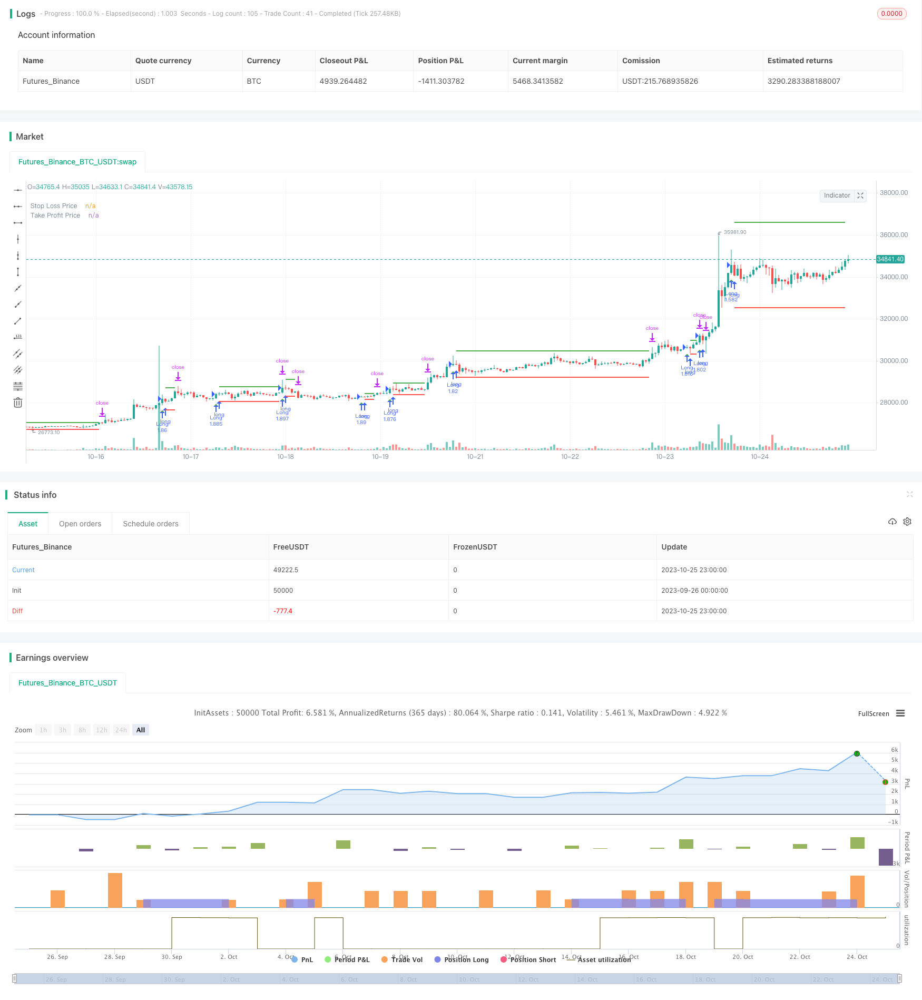

> Name

1-3-1-Red-Green Candlestick-Reversal-Strategy 1-3-1-Red-Green-Candlestick-Reversal-Strategy
> Author

ChaoZhang

> Strategy Description



[trans]

## Overview
1-3-1 The red and green K-line reversal strategy is a strategy for judging buying and selling signals based on the K-line pattern. This strategy looks for buying opportunities by observing whether 1 red K line is reversed by 3 green K lines.
## Principle
The core logic of this strategy is:
1. Determine whether the current K line is a red K line, that is, the closing price is lower than the opening price
2. Determine whether the previous three K lines are all green K lines, that is, the closing price is higher than the opening price.
3. Determine whether the closing price of the last green K line is higher than the previous two green K lines
4. If the above conditions are met, buy at the market price when the red K line closes
5. Set the stop loss price to the lowest price of the red K line
6. The take-profit price is set as the entry price plus the distance from the entry price to the stop-loss price.
With this strategy, we can buy when the red K-line is reversed, because the subsequent trend is likely to be upward. Set stop loss and take profit at the same time to control risks and lock in profits.
## Advantage Analysis
The 1-3-1 red and green K-line reversal strategy has the following advantages:
1. The strategy logic is simple and clear, easy to understand and implement
2. Utilize K-line morphological characteristics without relying on any indicators to avoid problems caused by over-optimization.
3. There are clear entry and exit rules that can be implemented objectively
4. Set stop loss and take profit to control the risk-return ratio of each transaction
5. The backtest results are good and there is a strong possibility of real-time adjustments.
## Risk Analysis
There are also some risks to be aware of with this strategy:
1. The K-line pattern cannot 100% predict the future trend, and there is a certain degree of uncertainty.
2. If you only buy once, the winning rate may not be high due to the particularity of individual stocks.
3. Failure to take into account the trend of the market, and holding when the market continues to fall is risky.
4. There are no transaction fees and slippages, so the actual effect may be worse.
Countermeasures:
1. You can consider combining moving averages and other indicators to filter signals to improve the success rate of buying.
2. Adjust position management and open positions in batches
3. Dynamically adjust the stop loss position or suspend trading according to the market situation
4. Test different stop loss and take profit ratio settings
5. Test the real offer effect after adding transaction costs
## Optimization direction
This strategy can be optimized from the following aspects:
1. Filtering based on market index. You can filter trading signals based on the short-term and medium-term trends of the market, buy when the market rises, and stop trading when the market falls.
2. Consider the confirmation of trading volume. Increase your judgment on the trading volume of the green K-line and only buy when the trading volume is enlarged.
3. Optimize the stop loss and take profit ratio. You can test different stop-loss and take-profit ratios to find the optimal parameter combination. Dynamic stop loss or trailing stop loss can also be set.
4. Optimization of warehouse management. You can open positions in batches and add positions later when conditions are met to reduce the risk of a single transaction.
5. Add more filter conditions. For example, consider moving averages, volatility and other indicators to ensure you buy when the trend is clearer.
6. Big data training to find optimal parameters. Collect a large amount of historical data and use machine learning and other technologies to train optimal parameter thresholds.
## Summarize
The 1-3-1 red and green K-line reversal strategy is generally a simple and practical short-term trading strategy. It has clear entry and exit rules, and the backtesting effect is good. We can improve its real offer effect through some optimization measures and make it a reliable quantitative trading strategy. At the same time, you also need to pay attention to risk control and properly manage funds.
||

## Overview 

The 1-3-1 red green candlestick reversal strategy is a strategy that generates buy and sell signals based on candlestick patterns. It looks for buying opportunities when 1 red candlestick is reversed by 3 subsequent green candlesticks.

## Principles

The core logic of this strategy is:

1. Check if the current candlestick is a red candle, i.e. the close price is lower than the open price
2. Check if the previous 3 candlesticks are green candles, i.e. close price is higher than open price  
3. Check if the last green candle's close price is higher than the previous 2 green candles
4. If the above conditions are met, go long at the close of the red candle 
5. Set stop loss at the lowest price of the red candle
6. Set take profit at entry price plus the distance from entry to stop loss

With this strategy, we can buy when the red candle is reversed, because the subsequent trend is likely to be upwards. Stop loss and take profit are set to control risk and lock in profits.

## Advantage Analysis

The 1-3-1 red green reversal strategy has the following advantages:

1. Simple and clear logic, easy to understand and implement
2. Utilizes candlestick pattern features without reliance on indicators, avoiding overoptimization problems  
3. Has clear entry and exit rules for objective execution
4. Sets stop loss and take profit to control risk/reward of each trade
5. Good backtest results, likely to translate well to live trading

## Risk Analysis

Some risks to note for this strategy:

1. Candlestick patterns cannot perfectly predict future moves, some uncertainty exists
2. Only one entry, may have lower win rate due to stock specifics  
3. No consideration of market trend, risk holding during sustained downtrend
4. Does not account for trading costs and slippage, actual performance may be worse

Solutions:

1. Consider combining with MA etc to filter signals and improve entry success rate
2. Adjust position sizing, scale in across multiple entries 
3. Dynamically adjust stop loss based on market conditions or pause trading
4. Test different stop loss/take profit ratios
5. Test actual performance including trading costs

## Optimization Directions

Some ways this strategy can be optimized:

1. Market index filtering - filter signals based on short/medium term market trend, go long in uptrend and stop trading in downtrend

2. Volume confirmation - only go long if green candle volumes increase 

3. Optimize stop loss/take profit ratios - test different ratios to find optimal parameters

4. Position sizing optimization - scale in across multiple entries to reduce single trade risk

5. Add more filters - e.g. MA, volatility etc to ensure high probability entry

6. Machine learning on big data - collect lots of historical data and train optimal parameter thresholds via ML

## Conclusion

The 1-3-1 red green reversal strategy is overall a simple and practical short term trading strategy. It has clear entry and exit rules and good backtest results. With some optimization measures, it can become a reliable quant trading strategy. Risk management is also important to manage capital properly.

[/trans]


> Source (PineScript)

``` pinescript
/*backtest
start: 2023-09-26 00:00:00
end: 2023-10-26 00:00:00
period: 1h
basePeriod: 15m
exchanges: [{"eid":"Futures_Binance","currency":"BTC_USDT"}]
*/

//@version=5
//by Genma01
strategy("Stratégie tradosaure 1 Bougie Rouge suivi de 3 Bougies Vertes", overlay=true, default_qty_type = strategy.percent_of_equity,  default_qty_value = 100)

// Définir les paramètres
var float stopLossPrice = na
var float takeProfitPrice = na
var float stopLossPriceD = na
var float takeProfitPriceD = na

// Vérifier les conditions
redCandle = close[3] < open[3] and low[3] < low[2] and low[3] < low[1] and low[3] < low[0]
greenCandles = close > open and close[1] > open[1] and close[2] > open[2]
higherClose = close > close[1] and close[1] > close[2]

// Calcul du stop-loss
if (redCandle and greenCandles and higherClose) and strategy.position_size == 0
    stopLossPrice := low[3]

// Calcul du take-profit
if (not na(stopLossPrice))  and strategy.position_size == 0
    takeProfitPrice := close + (close - stopLossPrice)

// Entrée en position long
if (redCandle and greenCandles and higherClose)  and strategy.position_size == 0
    strategy.entry("Long", strategy.long)

// Sortie de la position
if (not na(stopLossPrice))  and strategy.position_size > 0
    strategy.exit("Take Profit/Stop Loss", stop=stopLossPrice, limit=takeProfitPrice)

if strategy.position_size == 0
    stopLossPriceD := na
    takeProfitPriceD := na
else
    stopLossPriceD := stopLossPrice
    takeProfitPriceD := takeProfitPrice


// Tracer le stop-loss et le take-profit sur le graphique
plotshape(series=redCandle and greenCandles and higherClose and strategy.position_size == 0, title="Conditions Remplies", location=location.belowbar, color=color.green, style=shape.triangleup, size=size.small)
plotshape(series=redCandle and greenCandles and higherClose and strategy.position_size == 0, title="Conditions Remplies", location=location.belowbar, color=color.green, style=shape.triangleup, size=size.small)


// Afficher les prix du stop-loss et du take-profit
plot(stopLossPriceD, color=color.red, title="Stop Loss Price", linewidth=2, style = plot.style_linebr)
plot(takeProfitPriceD, color=color.green, title="Take Profit Price", linewidth=2, style = plot.style_linebr)

```

> Detail

https://www.fmz.com/strategy/430364

> Last Modified

2023-10-27 16:00:41
