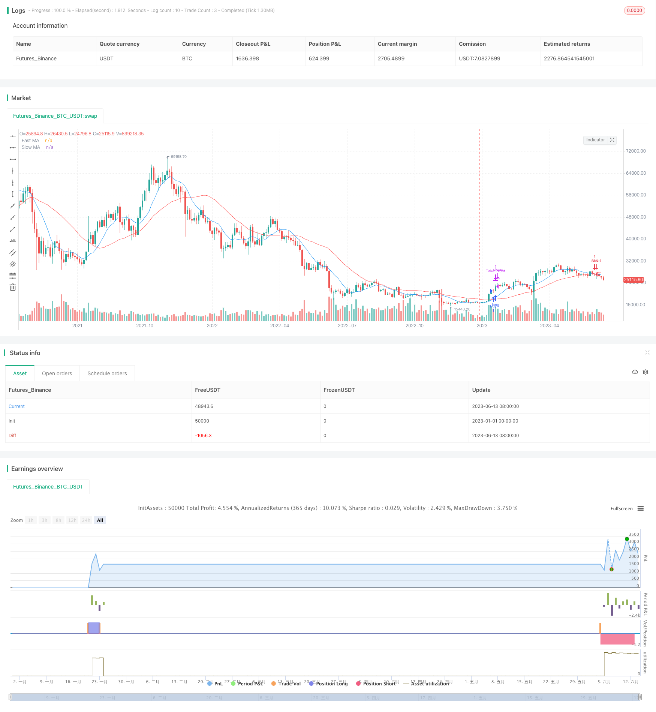

> Name

Moving Average Golden Cross 1 Take Profit Strategy 1-Profit-Moving-Average-Cross-Strategy
> Author

ChaoZhang

> Strategy Description


[trans]

## Overview
This strategy generates a buy signal by calculating the golden cross of the Fast Moving Average (Fast MA) and the Slow Moving Average (Slow MA). When the fast moving average crosses the slow moving average upward, a buy signal is triggered.
At the same time, the strategy will stop profit when the profit reaches 1%. This can help lock in small but steady profits.
This strategy is suitable for stock market environments with obvious trends. It can seize the rising trend in the short and medium term and achieve stable profits.
## Strategy Principle
This strategy is mainly based on the golden cross principle of moving averages. Moving averages can reflect the short- and medium-term trends of stock prices. When the short-term moving average crosses the longer-term moving average, it means that the stock price's upward momentum in the short term is stronger than the long-term trend. This is a strong buy signal.
The length of the fast moving average in the strategy is 10 days, and the length of the slow moving average is 30 days. This can capture the mid-term trend to a certain extent. When the fast line crosses the slow line, a buy signal will be triggered.
In addition, the strategy also sets a 1% profit stop point. In other words, if the profit from holding the position reaches 1%, the profit will be taken out and the profit will be locked. This can help avoid losses if a trend has started to reverse.
## Advantage Analysis
This strategy has the following advantages:
1. Use the moving average indicator, which is simple to understand and easy to implement.
2. The combination of fast and slow moving averages can effectively identify the mid-term trend.
3. The 1% profit-taking point sets a fixed income target, which is conducive to risk control.
This makes the strategy relatively stable overall and can achieve stable profits in markets with obvious trends.
## Risk Analysis
There are also some risks with this strategy:
1. When there is no obvious trend in the market, it is easy to generate false signals and frequent stop losses.
2. Inability to effectively handle complex non-trending markets.
3. Without stop loss settings, it is easy to suffer huge losses.
These risks can be controlled by:
1. Add a combination of other indicators, such as Bollinger Bands, KDJ, etc., to improve the accuracy of signals.
2. Dynamically adjust the parameters of the moving average to adapt to market changes.
3. Add reasonable stop loss points to control single losses.
## Optimization direction
This strategy can be optimized from the following aspects:
1. Test more parameter combinations of fast lines and slow lines to find the best ratio.
2. Add a stop loss point. For example, stop loss when the estimated loss reaches 3% after buying.
3. Combine with other technical indicators, such as MACD, KDJ, etc., to form a multi-factor model to improve signal accuracy.
4. Use automatic parameter optimization methods to find the optimal parameter combination.
## Summarize
Overall, this strategy is a typical moving average strategy. Identify the mid-term trend through a combination of fast and slow moving averages, and lock in stable profits with the 1% take-profit point. The advantage is that it is simple and easy to implement and can capture the rising trend of the stock market to a certain extent. The disadvantage is poor adaptability to complex market conditions. If combined with more technical indicators and the optimization of the stop-loss mechanism, this strategy can achieve more robust performance.
||


## Overview

This strategy generates buy signals when a fast moving average (Fast MA) crosses above a slow moving average (Slow MA).  

It also takes profit when the returns reach 1% to lock in small but consistent profits.

The strategy works well in trending markets with clear trends. It can capture medium-term up trends and achieve steady profits.

## Strategy Logic

The strategy is based on the golden cross of moving averages. Moving averages reflect the medium-term trend of stock prices. When the short-term MA crosses above the longer-term MA, it signals that the short-term upward momentum is stronger than the long-term trend. This is a strong buy signal.

The fast MA in this strategy has a length of 10 days and the slow MA is 30 days. This can capture reasonable trend movements. A long signal is triggered when the fast MA crosses above the slow MA.  

The strategy also sets a 1% take profit point. Positions will be closed when the returns hit 1% to lock in profits. This helps avoid losses from trend reversals.

## Strength Analysis 

The strengths of this strategy are:

1. Simple to understand and implement with moving average indicators.
2. Fast and slow MA combo effective at identifying medium-term trends.  
3. 1% profit target controls risks and locks in consistent gains.

Overall the strategy is quite robust and can achieve steady profits in trending markets.

## Risk Analysis

There are also some risks to consider:

1. More whipsaws and stop loss triggers in range-bound markets without clear trends.
2. Ineffective in complex non-trending markets.  
3. No stop loss so vulnerable to huge sudden losses in volatile markets.

To address these risks:

1. Add other indicators like Bollinger Bands, KDJ for better signal accuracy.
2. Dynamically adjust MA parameters to adapt to changing market conditions. 
3. Add reasonable stop loss points to control downside on losing trades.

## Optimization Opportunities

Some ways to optimize this strategy:

1. Test more fast and slow MA parameter combinations to find optimal settings.
2. Add stop loss. For example, cut loss when trade drops 3%.   
3. Combine with other indicators like MACD, KDJ to form multifactor models and improve signal accuracy.
4. Utilize auto-optimization methods to find the best parameter combinations.  

## Conclusion

The strategy is a typical moving average crossover system. It identifies medium-term trends using fast and slow MA, taking 1% profit along the way. Strengths include simplicity and the ability to ride uptrends for steady gains. Weakness is poorer adaptation to complex, volatile markets. By optimizing with more indicators and stop loss mechanisms, the strategy can achieve more robust performance.

[/trans]

> Strategy Arguments


|Argument|Default|Description|
|----|----|----|
|v_input_1|10|Fast MA Length|
|v_input_2|30|Slow MA Length|
|v_input_3|true|Profit Percentage|


> Source (PineScript)

``` pinescript
/*backtest
start: 2023-01-01 00:00:00
end: 2023-06-15 00:00:00
period: 3d
basePeriod: 1d
exchanges: [{"eid":"Futures_Binance","currency":"BTC_USDT"}]
*/

// This source code is subject to the terms of the Mozilla Public License 2.0 at https://mozilla.org/MPL/2.0/
// © pleasantHead5366

//@version=4
strategy("1% Profit Strategy", overlay=true)

// Input parameters
fastLength = input(10, title="Fast MA Length")
slowLength = input(30, title="Slow MA Length")
profitPercentage = input(1, title="Profit Percentage")

// Calculate moving averages
fastMA = sma(close, fastLength)
slowMA = sma(close, slowLength)

// Plot moving averages on the chart
plot(fastMA, color=color.blue, title="Fast MA")
plot(slowMA, color=color.red, title="Slow MA")

// Trading logic
longCondition = crossover(fastMA, slowMA)
if (longCondition)
    strategy.entry("Buy", strategy.long)

// Close long position when profit reaches 1%
if (strategy.position_size > 0)
    strategy.exit("Take Profit", from_entry="Buy", profit=profitPercentage / 100)

// Plot Buy and Sell signals on the chart
shortCondition = crossunder(fastMA, slowMA)
if (shortCondition)
    strategy.entry("Sell", strategy.short)

```

> Detail

https://www.fmz.com/strategy/434445

> Last Modified

2023-12-06 13:53:36
