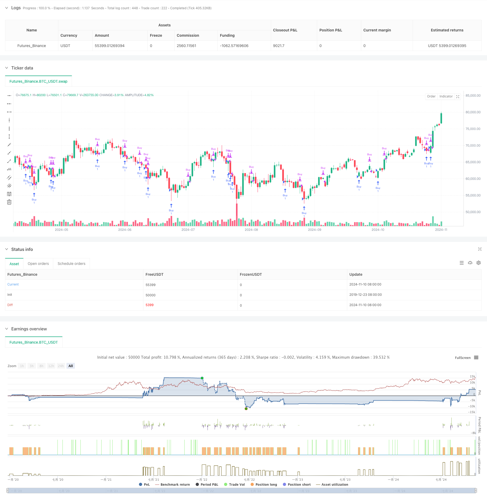

> Name

Dynamic-Holding-Period-Strategy-Based-on-123-Point-Reversal-Pattern
> Author

ChaoZhang

> Strategy Description



[trans]
#### Overview
This strategy is a quantitative trading system based on the recognition of market price patterns. It mainly captures potential market reversal opportunities by identifying the 123-point reversal pattern. The strategy combines dynamic holding period management and moving average filtering to improve the accuracy of transactions through multiple condition verification. This strategy uses a precise mathematical model to define entry points and uses the 200-day moving average as an auxiliary exit condition to form a complete trading system.
#### Strategy Principle
The core logic of the strategy is based on price pattern recognition and specifically includes the following key elements:
1. Design of admission conditions
- The lowest price of the day must be lower than the lowest price of the previous day
- The lowest price on the previous day must be lower than the lowest price 3 days ago
- The lowest price 2 days ago must be lower than the lowest price 4 days ago
- The highest price 2 days ago must be lower than the highest price 3 days ago
When the above four conditions are met at the same time, the system will send a long signal.
2. Exit mechanism design
- Set the default holding period to 7 days
- Use the 200-day simple moving average (SMA) as a dynamic exit condition
- A close signal is triggered when the price touches or exceeds the 200-day moving average
- The position will be automatically closed after the holding time reaches the set number of days.
#### Strategic Advantages
1. High accuracy of shape recognition
- Adopt multiple condition verification mechanism
- Strictly define entry conditions through the relative position of price high and low points
- Reduces the probability of misjudgment
2. Improved risk control
- Set a fixed holding period to limit the maximum loss
- Use long-term moving average as trend filter
- Equipped with dual exit mechanism to protect profits
3. Clear operating rules
- Clear entry and exit conditions
- Parameters can be flexibly adjusted according to market conditions
- Facilitates real-time execution and backtest verification
#### Strategy Risk
1. Limitations of morphological recognition
- May generate false signals in volatile markets
- Accuracy decreases during periods of severe fluctuations
- Need to be verified with other technical indicators
2. Risks of parameter optimization
- Fixed holding periods may not be suitable for all market environments
- Moving average cycle selection affects strategy performance
- Over-optimization may lead to overfitting
3. Market adaptability risk
- Reduced reliability of reversal signals in strong trending markets
- Performance varies greatly under different market conditions
- Requires regular evaluation of strategy effectiveness
#### Strategy optimization direction
1. Optimization of entry signals
- Added transaction volume confirmation mechanism
- Introduce momentum indicator as auxiliary judgment
- Consider adding a volatility filter
2. Improved exit mechanism
- Realize dynamic holding period management
- Added trailing stop function
- Develop multi-level profit targets
3. Enhanced risk control
- Establish a warehouse management system
- Design retracement control mechanism
- Added market sentiment indicator
#### Summary
This strategy provides traders with a reliable tool to capture market reversals through strict pattern recognition and a complete risk control system. Although there are certain limitations, through continuous optimization and appropriate parameter adjustment, this strategy can maintain stable performance in different market environments. It is recommended that traders combine market experience in practical applications and make targeted adjustments to strategies to obtain better trading results.
|| 

#### Overview
This strategy is a quantitative trading system based on market price pattern recognition, primarily designed to capture potential market reversal opportunities by identifying 123-point reversal patterns. The strategy combines dynamic holding period management with moving average filtering, utilizing multiple condition verification to enhance trading accuracy. It employs precise mathematical models for entry point definition and uses a 200-day moving average as an auxiliary exit condition, forming a complete trading system.

#### Strategy Principles
The core logic is based on price pattern recognition, including the following key elements:
1. Entry Condition Design
- Current day's low must be lower than previous day's low
- Previous day's low must be lower than the low from three days ago
- The low from two days ago must be lower than the low from four days ago
- The high from two days ago must be lower than the high from three days ago
When all four conditions are met simultaneously, the system generates a long signal.

2. Exit Mechanism Design
- Default holding period set to 7 days
- Uses 200-day Simple Moving Average (SMA) as dynamic exit condition
- Triggers position closure when price touches or exceeds the 200-day moving average
- Automatic position closure when holding period reaches the set duration

#### Strategy Advantages
1. High Pattern Recognition Accuracy
- Multiple condition verification mechanism
- Strict entry conditions based on relative price high/low positions
- Reduced false signal probability

2. Comprehensive Risk Control
- Fixed holding period limits maximum loss
- Long-term moving average as trend filter
- Dual exit mechanism to protect profits

3. Clear Operating Rules
- Explicit entry and exit conditions
- Flexible parameters adjustable to market conditions
- Easy to implement and backtest

#### Strategy Risks
1. Pattern Recognition Limitations
- May generate false signals in choppy markets
- Reduced accuracy during periods of extreme volatility
- Requires validation with other technical indicators

2. Parameter Optimization Risks
- Fixed holding period may not suit all market environments
- Moving average period selection affects strategy performance
- Over-optimization may lead to overfitting

3. Market Adaptability Risks
- Reduced reliability of reversal signals in strong trend markets
- Performance varies across different market conditions
- Requires periodic strategy effectiveness evaluation

#### Strategy Optimization Directions
1. Entry Signal Enhancement
- Add volume confirmation mechanism
- Incorporate momentum indicators as auxiliary judgment
- Consider adding volatility filters

2. Exit Mechanism Improvement
- Implement dynamic holding period management
- Add trailing stop loss functionality
- Develop multi-level profit targets

3. Risk Control Enhancement
- Establish position management system
- Design drawdown control mechanism
- Add market sentiment indicators

#### Summary
The strategy provides traders with a reliable market reversal capture tool through strict pattern recognition and comprehensive risk control systems. While certain limitations exist, continuous optimization and appropriate parameter adjustments enable the strategy to maintain stable performance across different market environments. Traders are advised to combine market experience with strategy-specific adjustments in practical applications to achieve better trading results.
[/trans]


> Source (PineScript)

``` pinescript
/*backtest
start: 2019-12-23 08:00:00
end: 2024-11-11 00:00:00
period: 1d
basePeriod: 1d
exchanges: [{"eid":"Futures_Binance","currency":"BTC_USDT"}]
*/

// This Pine Script™ code is subject to the terms of the Mozilla Public License 2.0 at https://mozilla.org/MPL/2.0/
// © EdgeTools

//@version=5
strategy("123 Reversal Trading Strategy", overlay=true)

// Input for number of days to hold the trade
daysToHold = input(7, title="Days to Hold Trade")

// Input for 20-day moving average
maLength = input(200, title="Moving Average Length")

// Calculate the 20-day moving average
ma20 = ta.sma(close, maLength)

// Define the conditions for the 123 reversal pattern (bullish reversal)
// Condition 1: Today's low is lower than yesterday's low
condition1 = low < low[1]

// Condition 2: Yesterday's low is lower than the low three days ago
condition2 = low[1] < low[3]

// Condition 3: The low two days ago is lower than the low four days ago
condition3 = low[2] < low[4]

// Condition 4: The high two days ago is lower than the high three days ago
condition4 = high[2] < high[3]

// Entry condition: All conditions must be true
entryCondition = condition1 and condition2 and condition3 and condition4

// Exit condition: Close the position after a certain number of bars or when the price reaches the 20-day moving average
exitCondition = ta.barssince(entryCondition) >= daysToHold or close >= ma20

// Execute buy and sell signals
if (entryCondition)
    strategy.entry("Buy", strategy.long)
if (exitCondition)
    strategy.close("Buy")


```

> Detail

https://www.fmz.com/strategy/471698

> Last Modified

2024-11-12 15:15:46
