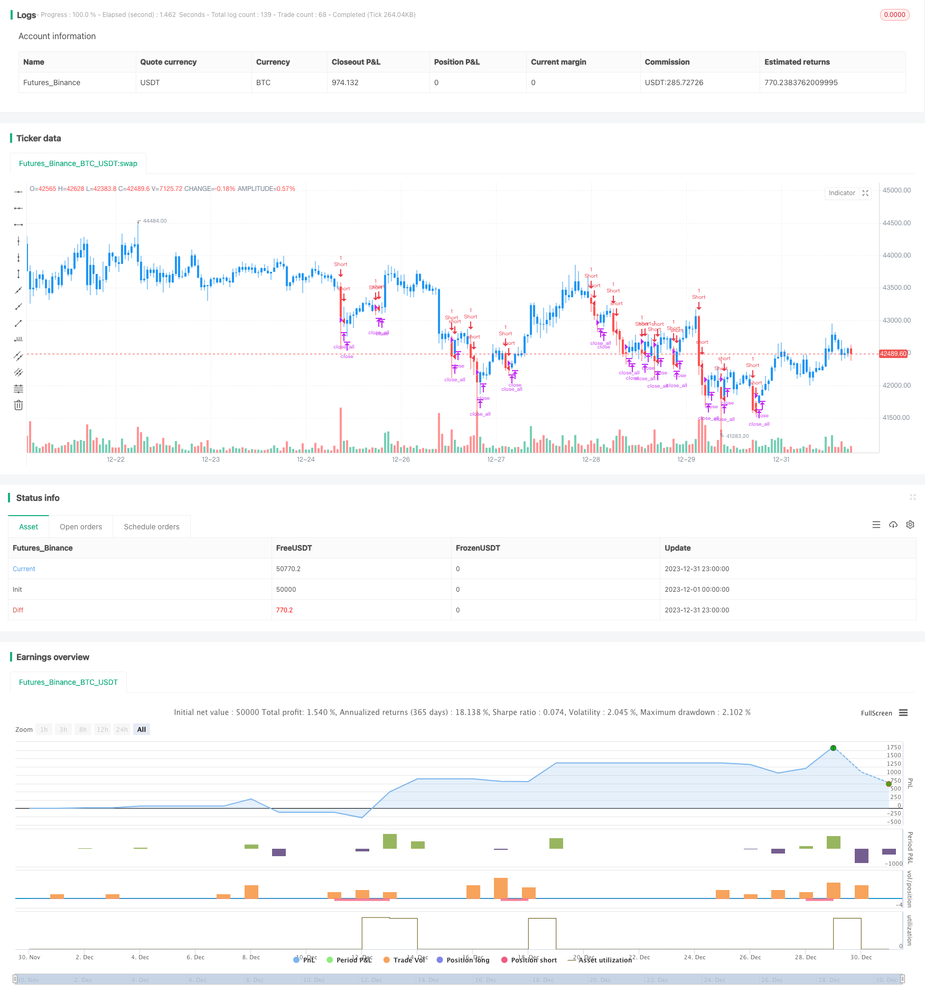

> Name

Peanut-123-Reversal-and-Breakout-Range-Short-term-Trading-Strategy
> Author

ChaoZhang

> Strategy Description


 [trans]
## Overview
The Nut 123 reversal and breakthrough range short-term trading strategy is a combination strategy that integrates the signals of the two sub-strategies of the reversal strategy and the breakthrough strategy, thereby generating more powerful trading signals.
## Strategy Principle
This strategy consists of two sub-strategies:
1. Nut 123 reversal strategy
It is a reversal strategy adapted from the system introduced on page 183 of Ulf Jensen's book. Go long when the closing price is higher than the closing price of the previous day for 2 consecutive days, and the 9-day Stochastic slow line is below 50; go short when the closing price is lower than the closing price of the previous day for 2 consecutive days, and the 9-day Stochastic fast line is above 50.
2. Breakthrough range short-term strategy
It is a short-term strategy that breaks through the lowest price in a specific period as a signal. Go short when the price breaks through the lowest price in the look_bak period.
This combination strategy comprehensively considers the signals of the two sub-strategies. When the two sub-strategies send signals in the same direction at the same time, a trading signal in that direction is generated; when the two sub-strategies send out opposite signals, no actual trading signal is generated.
## Advantage Analysis
This strategy combines the advantages of the two sub-strategies of the reversal strategy and the breakthrough strategy, taking into account more factors, it can filter out some noise transactions and improve the trading winning rate.
1. The reversal strategy can capture short-term reversal opportunities and make profits during the ups and downs adjustment process.
2. The breakthrough strategy can capture the short-term trend after the breakthrough.
3. Combining the signals of two sub-strategies can send out more effective trading signals and filter out noise.
## Risk Analysis
This strategy also has the following risks:
1. Reversal may not happen, and there is a risk of reversal failure.
2. A breakthrough may also be a false breakthrough, and there is a risk of chasing highs and falling lows.
3. Neither sub-strategy is guaranteed to be effective when used alone, and may fail when used in combination.
In response to the above risks, risks can be reduced by optimizing parameters, adjusting the proportion of sub-strategies, and selecting different targets for arbitrage.
## Optimization direction
There is room for further optimization of this strategy:
1. Optimize the parameters of the two sub-strategies to better adapt to different cycles and targets.
2. Add other types of sub-strategies, such as machine learning prediction strategies, to integrate more factors.
3. Dynamically adjust the weights of the two sub-strategies to allow the better-performing sub-strategy to play a greater role in different market environments.
4. Carry out portfolio arbitrage and choose different targets that are not highly correlated and have certain commonalities to trade.
## Summarize
The Nut 123 reversal and breakthrough range short-term trading strategy combines the reversal strategy and the breakthrough strategy at the strategic level by integrating the reversal strategy and the breakthrough strategy. It combines the advantages of the two sub-strategies to a certain extent, and there is room for further optimization. It provides us with a new idea for strategy design, that is, on the basis of retaining the independence of the sub-strategies, integration and combination at the strategic level are carried out to explore more effective trading opportunities.
||

## Overview

The Peanut 123 Reversal and Breakout Range Short-term Trading Strategy is a combination strategy that incorporates the signals from a reversal strategy and a breakout strategy sub-strategies to generate more powerful trading signals.

## Strategy Logic

The strategy consists of two sub-strategies:

1. Peanut 123 Reversal Strategy

    It is an adapted reversal strategy based on the system introduced on P183 of Ulf Jensen's book. It goes long when the close price rises for 2 consecutive days and the 9-day Stochastic Slow line is below 50; It goes short when the close price falls for 2 consecutive days and the 9-day Stochastic Fast line is above 50. 

2. Breakout Range Short Strategy  

    It is a short-term strategy that uses the breakout of the lowest price in a certain look_bak period as the signal. It goes short when the price breaks below the lowest low in the look_bak period.

The combination strategy takes into account the signals from both sub-strategies. It generates actual trading signals only when the two sub-strategies give signals in the same direction. No trading signals will be generated if the two sub-strategies give opposite signals.  

## Advantage Analysis

The strategy combines the advantages of both reversal and breakout sub-strategies and considers more factors. It can filter out some noise trades and improve win rate.

1. The reversal strategy captures short-term reversal opportunities and makes profit during fluctuations.

2. The breakout strategy catches the short-term trend after the breakout. 

3. By combining the signals of two sub-strategies, more effective trading signals can be generated and noise can be filtered out.

## Risk Analysis

The strategy also has the following risks:

1. Reversals may not happen, there are risks of failed reversals.

2. Breakouts can also be false breakouts, there are risks of chasing highs and lows.  

3. Neither of the sub-strategies can ensure effectiveness when used alone, combining them may also fail.

To address these risks, methods like optimizing parameters, adjusting the weighting of sub-strategies, choosing different products for arbitrage can be used to reduce risks.

## Optimization Directions   

There is room for further optimization of the strategy:

1. Optimize the parameters of the two sub-strategies to better adapt to different cycles and different products.

2. Increase other types of sub-strategies, such as machine learning prediction strategies, to incorporate more factors.

3. Dynamically adjust the weighting of the two sub-strategies to give more weight to the better-performed one in different market environments. 

4. Conduct combination arbitrage by selecting products with little correlation but certain commonality.

## Summary  

The Peanut 123 Reversal and Breakout Range Short-term Trading Strategy integrates the reversal and breakout sub-strategies at the strategy level. To some extent, it combines the advantages of the two sub-strategies while having space for further optimization. It provides new ideas for strategy design - conducting integration and combination at the strategy level while preserving the independence of sub-strategies, in order to discover more effective trading opportunities.

[/trans]

> Strategy Arguments


|Argument|Default|Description|
|----|----|----|
|v_input_1|14|Length|
|v_input_2|true|KSmoothing|
|v_input_3|3|DLength|
|v_input_4|50|Level|
|v_input_5|4|Look Bak|
|v_input_6|false|Trade reverse|


> Source (PineScript)

``` pinescript
/*backtest
start: 2023-12-01 00:00:00
end: 2023-12-31 23:59:59
period: 1h
basePeriod: 15m
exchanges: [{"eid":"Futures_Binance","currency":"BTC_USDT"}]
*/

//@version=4
////////////////////////////////////////////////////////////
//  Copyright by HPotter v1.0 01/07/2019
// This is combo strategies for get a cumulative signal. 
//
// First strategy
// This System was created from the Book "How I Tripled My Money In The 
// Futures Market" by Ulf Jensen, Page 183. This is reverse type of strategies.
// The strategy buys at market, if close price is higher than the previous close 
// during 2 days and the meaning of 9-days Stochastic Slow Oscillator is lower than 50. 
// The strategy sells at market, if close price is lower than the previous close price 
// during 2 days and the meaning of 9-days Stochastic Fast Oscillator is higher than 50.
//
// Second strategy
//    Breakout Range Short Strategy
//
// WARNING:
// - For purpose educate only
// - This script to change bars colors.
////////////////////////////////////////////////////////////
Reversal123(Length, KSmoothing, DLength, Level) =>
    vFast = sma(stoch(close, high, low, Length), KSmoothing) 
    vSlow = sma(vFast, DLength)
    pos = 0.0
    pos := iff(close[2] < close[1] and close > close[1] and vFast < vSlow and vFast > Level, 1,
	         iff(close[2] > close[1] and close < close[1] and vFast > vSlow and vFast < Level, -1, nz(pos[1], 0))) 
	pos

BreakoutRangeShort(look_bak) =>
    pos = 0
    xLowest = lowest(low, look_bak)
    pos :=	iff(low < xLowest[1], -1, 0) 
    pos

strategy(title="Combo Backtest 123 Reversal & Breakout Range Short", shorttitle="Combo", overlay = true)
Length = input(14, minval=1)
KSmoothing = input(1, minval=1)
DLength = input(3, minval=1)
Level = input(50, minval=1)
//-------------------------
look_bak = input(4, minval=1, title="Look Bak")
reverse = input(false, title="Trade reverse")
posReversal123 = Reversal123(Length, KSmoothing, DLength, Level)
posBreakoutRangeShort = BreakoutRangeShort(look_bak)
pos = iff(posReversal123 == 1 and posBreakoutRangeShort == 1 , 1,
	   iff(posReversal123 == -1 and posBreakoutRangeShort == -1, -1, 0)) 
possig = iff(reverse and pos == 1, -1,
          iff(reverse and pos == -1, 1, pos))	   
if (possig == 1) 
    strategy.entry("Long", strategy.long)
if (possig == -1)
    strategy.entry("Short", strategy.short)	 
if (possig == 0) 
    strategy.close_all()
barcolor(possig == -1 ? color.red: possig == 1 ? color.green : color.blue )
```

> Detail

https://www.fmz.com/strategy/440369

> Last Modified

2024-01-29 16:31:04
