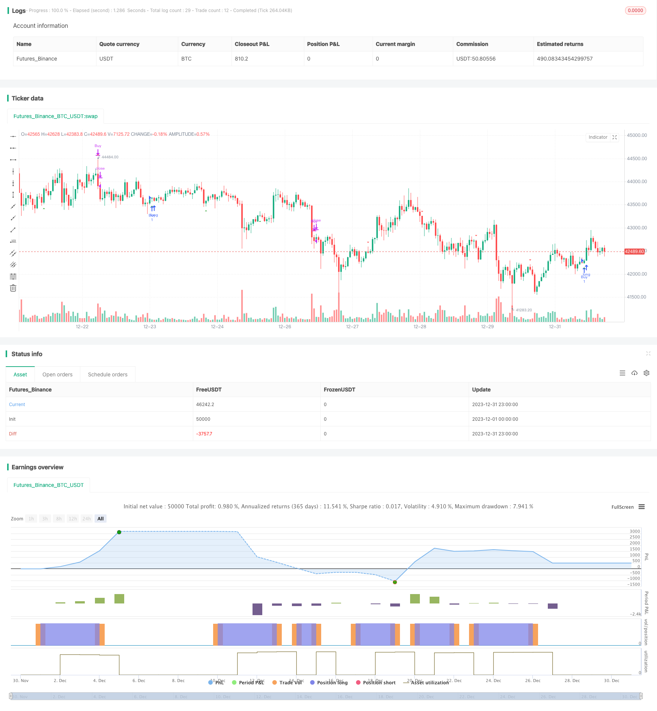

> Name

Cape-Town-15-min-Candle-Breakout-Strategy
> Author

ChaoZhang

> Strategy Description


 [trans]
## Overview
The Camptown 15 Minute Candle Breakout Strategy is a high-frequency trading strategy designed to profitably exploit the volatility of the periods between markets. This strategy captures short-term price fluctuations during determined trading periods by analyzing K-line patterns within a 15-minute time frame to achieve a quick profitable exit.
## Strategy Principle
This strategy mainly determines the closing price and opening price of the K line. If the closing price is greater than the opening price, it indicates that the K line is a long K line, and a buy signal is generated; if the closing price is less than the opening price, it indicates that the K line is a short K line, and a sell signal is generated. At the same time, the strategy also determines whether the current time is within the set trading time range, that is, 16:00 to 16:15 local time in Cape Town, South Africa. Only K-line signals within this time range are captured by the strategy.
Through this method, the strategy can capture short-term fluctuation opportunities in the market during local trading hours, buy and hold when long signals appear, sell for arbitrage when short signals appear, and achieve profits during the gap period when converting from medium to long-term and short-term.
## Advantage Analysis
- Capture market fluctuations at key times: The 16:00 to 16:15 period selected by the strategy is at the alternation of European and American trading periods. The volatility and trend conversion opportunities during this period are greater, and the strategy can effectively capture this historical pattern.
- High trading frequency: 15 minutes is the basic trading cycle. Higher trading frequency can generate more profit opportunities.
- The strategy rules are simple and easy to operate: you only need to judge the two dimensions of K-line form and trading time, which is very simple and easy to practice.
-Short single transaction time: The profit model of the strategy relies on short-term arbitrage in a single transaction, which can quickly switch positions.
- Strong scalability: The strategy framework is simple and universal and can be easily extended to other trading varieties and time ranges.
## Risk Analysis
- Lack of overall trend judgment: The strategy does not consider the overall trend judgment of a higher time dimension and may deviate from the overall market situation.
- Short-term fluctuation risk: Relying too much on short-term fluctuations will increase the risk of loss.
- Trading time risk: Fixed trading hours may miss better trading opportunities or increase the risk of liquidation.
- Overnight position risk: Excessive fluctuations may result in the inability to close the position within the same trading session.
## Optimization direction
- Integrate long-term and short-term judgments: Combine with higher-level trend judgments such as the daily line to avoid deviating from the overall trend.
- Optimize stop loss strategy: Set trailing stop loss to lock in profits and reduce the risk of loss.
- Expand or float the trading time frame: Expand observations to capture more opportunities or avoid the risk of failed position closing.
- Strengthen fund management: optimize position control and risk allocation, and strictly control single losses.

## Summarize
The Camptown 15 Minute Candle Breakout Strategy is a simple yet practical high frequency trading strategy. It makes money by capturing short-term fluctuations as market periods change. This strategy has the advantages of high trading frequency, simple rules, and strong scalability, but it also has certain risks, such as the lack of judgment on the overall trend and the short-term risk of excessive fluctuations. We can optimize this strategy by combining longer-period analysis, establishing a stop-loss mechanism, expanding the selection of trading periods, and other methods to obtain higher strategy efficiency while controlling risks.
||

## Overview

The Cape Town 15-min candle breakout strategy is a high frequency trading strategy that aims to exploit volatility between market sessions for profit. By analyzing the candlestick patterns within the 15-min timeframe during specified trading hours, it captures short-term price fluctuations for quick profitable exits.

## Strategy Logic

The strategy mainly judges the close price and open price of the candlestick. If the close price is greater than the open price, it signals a bullish candle and generates a buy signal. If the close price is less than the open price, it signals a bearish candle and generates a sell signal. It also checks if the current time is within the set trading hour range - 16:00 to 16:15 Cape Town local time - and only signals within this timeframe are captured. 

Through this method, the strategy can capture short-term fluctuations and trend reversal opportunities during the local trading session. It goes long when bullish signals appear and exits the position when bearish signals appear, profiting from price swings during the transition between mid-term and short-term trends.

## Advantage Analysis 

- Captures volatility around market open/close: The 16:00-16:15 timeframe sits between the close of European trading and open of US trading sessions, where volatility and transitions tend to occur more frequently, allowing the strategy to capitalize on recurring historical price patterns.

- High trading frequency: 15-min timeframe allows higher trading frequency and profit potential.

- Simple rules easy to implement: Requires only candlestick pattern and trading time analysis, very simple to put into practice.  

- Short holding period per trade: Profits from short-term scalping, able to switch positions quickly.

- Expandability: Simple framework makes it easy to expand across different products and time ranges.

## Risk Analysis

- Lacks overall trend bias: Strategy does not consider higher timeframe trends so could trade against overall momentum.  

- Short-term volatility risk: Overly reliant on short-term fluctuations which can lead to higher loss risk.

- Trading time frame limitations: Fixed trading window could miss better opportunities outside that timeframe or pose challenges closing positions.

- Overnight position risks: Large price swings could prevent closing positions within the same trading session.

## Optimization Directions

- Incorporate higher timeframe bias: Add analysis of daily or other longer-term trends to avoid trading contrary to momentum.

- Implement stop-loss mechanisms: Use trailing stops to lock in profits and reduce loss risks.

- Expand trading time frame parameters: Widen observational timeframe to capture more opportunities and reduce risk of failed exit executions. 

- Enhance risk management: Optimize trade sizing, risk allocation and loss capping per trade through more rigorous capital management.

## Conclusion

The Cape Town 15-min candle breakout strategy is a simple but practical high frequency strategy. It aims to profit from short-term fluctuations around market open/close transitions. While advantages like high trading frequency, simple rules and expandability exist, risks such as lack of bias against momentum and short-term volatility are also present. Optimization methods like incorporating higher timeframe trends, implementing stop losses, expanding trading hours and enhancing risk management can help improve strategy efficiency while controlling risks.
[/trans]


> Source (PineScript)

``` pinescript
/*backtest
start: 2023-12-01 00:00:00
end: 2023-12-31 23:59:59
period: 1h
basePeriod: 15m
exchanges: [{"eid":"Futures_Binance","currency":"BTC_USDT"}]
*/

//@version=5
strategy("Cape Town 15-Min Candle Strategy", overlay = true)

// Function to check if candle is bullish
isBullish() =>
    close > open

// Function to check if candle is bearish
isBearish() =>
    close < open

// Function to check if current candle is within specified time range (16:00 - 16:15 in Cape Town time)
isInTimeRange() =>
    hour + 2 == 16 and minute >= 0 and minute <= 14

// Entry condition: Buy when candle is bullish and within time range
longCondition = isBullish() and isInTimeRange()

// Exit condition: Sell when candle is bearish and within time range
shortCondition = isBearish() and isInTimeRange()

// Plot buy and sell signals
plotshape(longCondition, style=shape.triangleup, location=location.belowbar, color=color.green, size=size.small, title="Buy Signal")
plotshape(shortCondition, style=shape.triangledown, location=location.abovebar, color=color.red, size=size.small, title="Sell Signal")

// Execute trade logic
strategy.entry("Buy", strategy.long, when = longCondition)
strategy.close("Buy", when = shortCondition)

```

> Detail

https://www.fmz.com/strategy/440562

> Last Modified

2024-01-31 17:15:25
