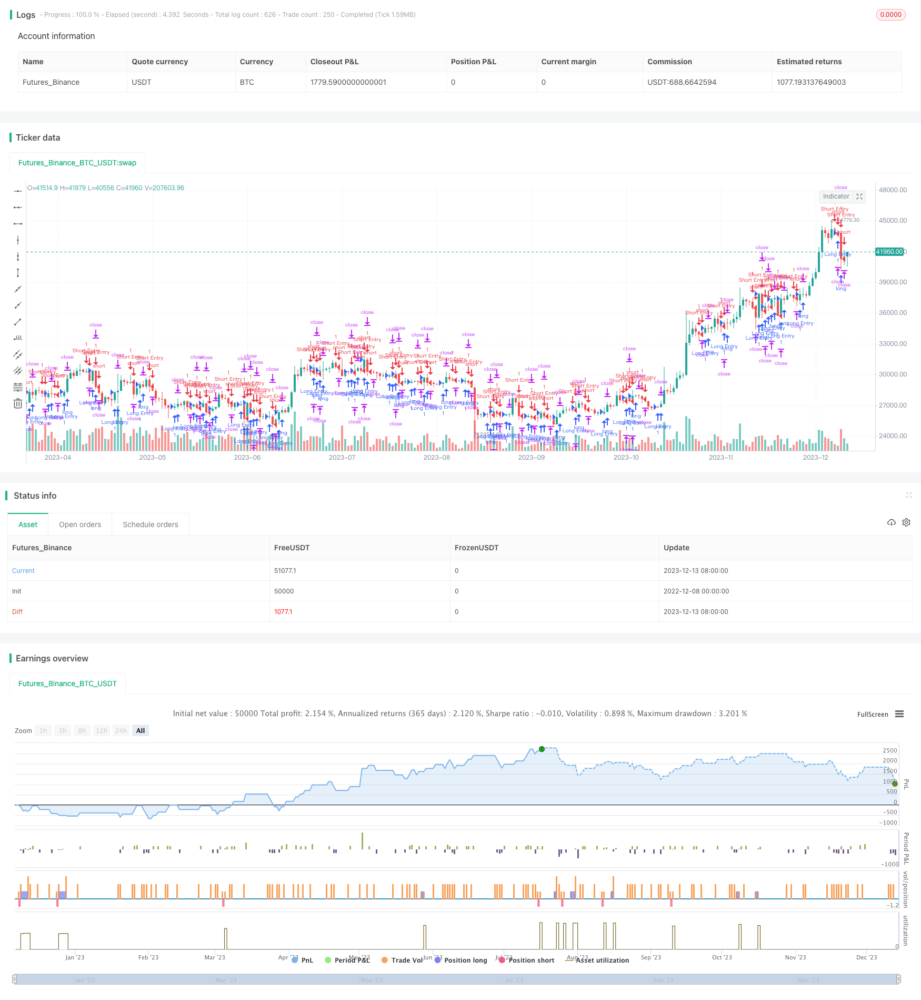

> Name

Cross-trend following arbitrage 181 strategy Valeria-181-Robot-Strategy-Improved-24
> Author

ChaoZhang

> Strategy Description


[trans]

Strategy Overview: This strategy opens long/short positions through the golden cross/dead cross signals of Bollinger Bands. The advantage of the strategy lies in continuous tracking of the trending market, reasonable stop-profit and stop-loss settings, and proper retracement control, which is suitable for medium and long-term operations. It is mainly suitable for markets with obvious trend characteristics such as stock indexes, foreign exchange, and cryptocurrency.
Strategy principle: This strategy mainly consists of three parts: Bollinger Band cross signal, fixed position, and dynamic stop-profit and stop-loss. The Bollinger Bands use the moving average and standard deviation to generate a band area. A long golden cross indicates a breakthrough of the upper rail; a dead cross short indicates a break below the lower rail, which is used as a signal to open a position. The position is fixed at 100%, whether long or short, it is a full position operation. The stop-profit and stop-loss levels will be dynamically adjusted based on the latest opening price to track the trend.
Specifically, Bollinger Bands calculates the band area based on the moving average and standard deviation of closing prices. A buy signal is generated when the price breaks through the upper band; a sell signal is generated when the price falls below the lower band. In this way, you can predict possible price reversals and look for opportunities to build positions. Fixed 100% position can maximize the tracking trend and pursue the highest profit. Dynamic stop-profit and stop-loss are adjusted according to the latest opening price, control the retracement by setting the stop-loss distance reasonably, and appropriately enlarge the stop-profit distance according to the degree of trend fluctuation to obtain more profits.
Strategic advantages detailed:
1. Run across trends and make sustained profits. Crossing the Bollinger Bands to find the trend conversion point is helpful to grasp the main line direction; fixed positions can fully follow the trend and obtain maximum profits.
2. Dynamic stop-profit and stop-loss, and controllable drawdown. Adjust the stop-profit and stop-loss levels based on the latest opening price, and the maximum drawdown can be effectively controlled through reasonable configuration. And adjustments can be made based on market fluctuations.
3. Flexible application and wide applicable market. It is suitable for most markets with trend characteristics, especially for medium and long-term operations such as stock indexes, foreign exchange, and cryptocurrency.
4. The logic is simple, clear and easy to implement. Based on Bollinger Bands trend judgment and fixed position trading, there is no need to judge complex forms or signals, and the program is easy to develop.
5. Use funds efficiently and fully allocate funds. Fixed 100% position can maximize the utilization of funds, and funds can be fully allocated for both short and long positions.
Risks and workarounds detailed:
1. Risk of Bollinger Band failure. When the Bollinger Bands judgment fails, an error signal will be generated. The solution is to combine other indicators to determine the trend direction.
2. Drawback risk. In a volatile market, there will be a certain retracement. It can be controlled by reducing the position and optimizing the stop loss distance.
3. Frequent trading risks. Positions will be stopped and jumped frequently in volatile markets. The stop loss distance can be appropriately relaxed to reduce unnecessary stop losses.
4. Market risk. Faced with unexpected major events, market prices will be abnormal. It is recommended to pay attention to important financial policies and respond in a timely manner.
Strategy optimization suggestions:
1. Also consider other indicators for judgment. For example, combine MACD, KDJ and other technical indicators to avoid misjudgment of Bollinger Bands.
2. Adjust the stop-profit and stop-loss distance according to the market. If the volatility is large, the stop-profit distance should be appropriately enlarged; if the volatility is small, the stop-loss distance should be narrowed.
3. Select reasonable parameters based on market type. For example, for a volatile market, the Bollinger Band standard deviation or moving average period can be appropriately increased.
4. Optimize parameters using machine learning algorithms. Confirm the optimal values ​​of each parameter through algorithm training to achieve better strategy performance.
Summary comment: This strategy is a typical cross-trend arbitrage strategy. It is suitable for markets with obvious trend characteristics and can continue to make profits. The strategy logic is simple and clear, and the program is easy to implement. By properly configuring the stop-profit and stop-loss distances, the maximum drawdown can be effectively controlled. Overall, this strategy has stable returns, is simple, efficient, and easy to implement, and is a highly recommended quantitative strategy.
|| 

Overview: This strategy opens long/short positions based on Bollinger Bands crossover signals and pursues profits in the trending market with stop loss and take profit. Its advantages lie in keep tracking trends, reasonable stop loss and take profit configuration, controllable drawdown, suitable for medium and long term trading, especially in stock index, forex and crypto markets with obvious trending characters.

Principles: The strategy consists of three parts: BB crossover signals, fixed position sizing and dynamic stop loss and take profit. BB crossover system judges the breakout through bands generated by moving averages and standard deviation. Golden cross for long and dead cross for short. Fix 100% position either long or short to maximize profits following trends. Stop loss and take profit levels will be adjusted based on the latest entry price, so as to lock profit and control drawdown along the trend movement. 

Specifically, BB bands are calculated with moving averages and standard deviation of closing prices. Golden cross above upper band gives buy signal while dead cross below lower band gives sell signal. They attempt to identify potential reversal points and trading opportunities. 100% position aims to pursue maximum profits by fully following trends. Dynamic stop loss and take profit are modified based on the latest entry price. Stop loss distance is set reasonably to control drawdown. Take profit distance is set to obtain more profits according to market fluctuation.

Advantages:

1. Keep profits along trends, benefit from main direction through BB signal and full position.  

2. Controllable drawdown via dynamic stop loss and take profit based on entry price. Values can be optimized accordingly.

3. Wide application in major markets with trends, especially suitable for stock index, forex and crypto assets.

4. Simple logic and easy to implement technically with BB and fixed percent. No complex pattern or model judgments.

5. High capital use efficiency by 100% long/short position to maximize capital allocation.

Risks and solutions:

1. Invalid BB signal risks. Will cause wrong trading signals if BB judgment fails,  solved by combining other indicators on trend judgment.

2. Drawdown risks in consolidations, addressed by reducing position sizing and optimizing stop loss distance.  

3. Frequent trading risks in volatile markets with continuous stop loss jump between long and short. Can widen stop loss distance properly to reduce unnecessary triggers. 

4. Market risks from unexpected big events leading to irrational price spikes. Suggest to pay attention to key policies and events.


Optimizations:

1. Consider other indicators like MACD, KDJ together with BB to avoid misjudgments.

2. Adjust stop loss and take profit distances based on market volatility.

3. Select reasonable parameters for different market types. Such as larger standard deviation and moving average period for volatile markets.

4. Optimize parameter values through machine learning algorithms for better performance.

Summary: The strategy is a typical trend following arbitrage system. It keeps profitable along obvious trends in multiple markets. The logic is simple and clean making it easy to implement technically. By configuring proper stop loss and take profit levels, the maximum drawdown can be effectively controlled. In general, this is an efficient trend trading strategy with stable returns, simple logic and easy execution. Highly recommend for quantitative trading.

[/trans]


> Source (PineScript)

``` pinescript
/*backtest
start: 2022-12-08 00:00:00
end: 2023-12-14 00:00:00
period: 1d
basePeriod: 1h
exchanges: [{"eid":"Futures_Binance","currency":"BTC_USDT"}]
*/

//@version=5
strategy("Valeria 181 Bot Strategy Mejorado 2.21", overlay=true, margin_long=100, margin_short=100)
 
var float lastLongOrderPrice = na
var float lastShortOrderPrice = na

longCondition = ta.crossover(ta.sma(close, 1), ta.sma(close, 4))
if (longCondition)
    strategy.entry("Long Entry", strategy.long)  // Enter long

shortCondition = ta.crossunder(ta.sma(close, 1), ta.sma(close, 4))
if (shortCondition)
    strategy.entry("Short Entry", strategy.short)  // Enter short

if (longCondition)
    lastLongOrderPrice := close

if (shortCondition)
    lastShortOrderPrice := close

// Calculate stop loss and take profit based on the last executed order's price
stopLossLong = lastLongOrderPrice - 170  // 10 USDT lower than the last long order price
takeProfitLong = lastLongOrderPrice + 150  // 100 USDT higher than the last long order price
stopLossShort = lastShortOrderPrice + 170  // 10 USDT higher than the last short order price
takeProfitShort = lastShortOrderPrice - 150  // 100 USDT lower than the last short order price

// Apply stop loss and take profit to long positions
strategy.exit("Long Exit", from_entry="Long Entry", stop=stopLossLong, limit=takeProfitLong)

// Apply stop loss and take profit to short positions
strategy.exit("Short Exit", from_entry="Short Entry", stop=stopLossShort, limit=takeProfitShort) 
```

> Detail

https://www.fmz.com/strategy/435464

> Last Modified

2023-12-15 10:13:38
