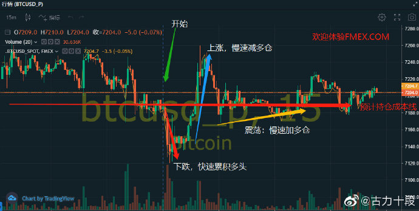

> Name

1btc starts fmex long unlocking strategy, the market outlook is bullish
> Author

gulishiduan_high frequency sorting
> Strategy Description

**FMex sorted mining long version code usage instructions**
//The risk in the margin market is huge, and you may face 100% loss at any time. We are not responsible for 100% loss due to unknown bugs.
//(If you consider short positions or shocks, you can flexibly modify the parameters and code gears accordingly)
//The current maximum position (turn calculation) is recommended to be within 0.5-3 times. If 0.1B, 3 times leverage, the steering position is about 2700, the maximum position is 3200, and adjusted to 10 times leverage, the steering position is 9000u, the maximum position is 10000u, and the single amount can be adjusted to 300-500u
//Real disk address: https://api.fmex.com Test network https://api.fmextest.net//注意：首先手动持仓long1-1000u。
//(Contact WeChat: ying5737)
**Strategy Principle:**

Pictures are for reference only
https://wx1.sinaimg.cn/mw690/c5775633ly1gaajdxk8a8j20u10f4dhx.jpg
Orders placed at the market are randomly executed/This strategy tends to hold long positions by default/
Note: Hold the position long1u-1000u first. //
**- Check whether the existing order exceeds the limit. If it exceeds the limit, cancel the order immediately/
- Check whether the transaction has formed a position. If it is greater than the position xxu, then reduce the position to below the established position/**
**Several pending order situations:**
**Global pending orders:**
In order to distinguish the market maker's strategy, the remote sorting is specifically defined as pending order. The parameters are adjustable, currently around 8 levels.
** Market dealer (handicap near-end order): **
The maximum long position is customized. If it is greater than this position, the position will be reduced approximately every 6 seconds until it is less than the custom parameter.
The maximum short position is customized. If it is greater than this position, the position will be reduced approximately every 6 seconds until it is less than the custom parameter.
If the position is greater than the long position, the long position reduction strategy is initiated, and the pending orders are mainly short: short positions are executed.
If the short position is greater than 1u, start the short position reduction strategy, and the pending order is long: it is very easy to execute multiple orders.
Normal positions (multiple orders are executed randomly due to market fluctuations)
**//The remark description in the parameters is for reference only. You can also add a gear. **The reference is as follows:
order = createOrderPrice({
 symbol: "BTCUSD_P",
type: "LIMIT",
direction: "SHORT",//Select long or short, short or long
post_only: true,
price: lastPrice + 5.5,//The number can be adjusted to 0.5 or a multiple of 0.5
quantity: sp_perAmount,
affiliate_code: "9y40d8"
})

******At your own risk/Parameters are adjustable, WeChat: ying5737**
**Optimization direction: Add moving average or K-line comparison to determine the direction, gear optimization, increase custom order volume, etc./******
> Strategy Arguments


|Argument|Default|Description|
|----|----|----|
|Url|https://api.fmex.com|交易所api地址，正式版改为：https://api.fmex.com|
|maxPrice|30000|Highest price in range|
|minPrice|9000|The lowest price in the range|
|g_maxHoldingLong|21000|Maximum long position size|
|g_maxHoldingShort|5000|Maximum holding amount of short orders|
|sp_baseAmountLong|18000|Position control: restricted positions from long positions to short positions|
|sp_baseAmountShort|600|Position control: Too many short positions, turn to long restricted positions|
|sp_perAmount|800|Market order: single amount. (Depth sorting order volume = market order volume * 3) (normal short order volume = market order volume * 0.6) |
|Interval|3|Polling time (default parameters are enough)|
|RetryInterval|5000|Fault tolerance retry interval (milliseconds) (default parameters are sufficient)|
|Debug|true|Display retry records (default parameters are sufficient)|
|EnableErrorFilter|false|Display retry records and block common network error messages (default parameters are sufficient)|
|ApiList|GetAccount,GetDepth,GetTicker,GetRecords,GetTrades,GetOrders,SetContractType|Fault-tolerant API list (default parameters are sufficient)|

> Source (javascript)

``` javascript
//保证金市场风险巨大，你可能随时面临100%损失。或有不明bug100%损失，概不负责。本策略使用的杠杆相对不大，可放心体验
//注意：默认近端排序不启动(给手动平仓预留空间),多头版先持仓long1u-1000u,空头版先持仓short1u-1000u.用来激活近端排序
var eName = exchange.GetName();
            if (eName == "Futures_FMex") {
                exchange.IO("extend", '{"POST/v3/contracts/orders$":{"affiliate_code":"9y40d8"}}');
            } if (eName == "FCoin") {
                exchange.IO("extend", '{"POST/v2/orders$":{"affiliate_code":"9y40d8"}}');
            }
exchange.IO("base", Url)//（联系微信：）策略仅限个人使用，若用于商业传播，请提前联系
var ordersInfo = {
    buyId: 0,    buyPrice: 0,    sellId: 0,    sellPrice: 0,    minPrice: 0,    maxPrice: 0
}
var depthInfo = {
    asks: [],
    bids: []
}
var symbol = "BTCUSD_P"
function getTicker(symbol) {
    url = "/v2/market/ticker/" + symbol;
    data = _C(exchange.IO,"api", "GET", url);
    return data.data;
}    
function getAccounts() {
    data = _C(exchange.IO,"api", "GET", "/v3/contracts/accounts")
    return data.data;
}
function createOrderPrice(body) {
    parameter = "symbol=" + body.symbol + "&type=" + body.type + "&direction=" + body.direction + "&post_only=" + body.post_only +  "&price=" + body.price + "&quantity=" + body.quantity + "&affiliate_code=9y40d8";   
    resultData = exchange.IO("api", "POST", "/v3/contracts/orders", parameter)
    return resultData;
}
function createOrder(body) {
    parameter = "symbol=" + body.symbol + "&type=" + body.type + "&direction=" + body.direction + "&quantity=" + body.quantity + "&affiliate_code=9y40d8";   
    resultData = exchange.IO("api", "POST", "/v3/contracts/orders", parameter)    
    return resultData;
}
function getOrders() {
    resultData = _C(exchange.IO,"api", "GET", "/v3/contracts/orders/open");
    return resultData.data
}
function cancelOrder(id) {
    if (typeof(id) == 'undefined') {
        return
    }
    resultData = exchange.IO("api", "POST", "/v3/contracts/orders/" + id + "/cancel");//+ id 
    return resultData;    
}
function cancelAllOrder() {
    resultData = exchange.IO("api", "POST", "/v3/contracts/orders/cancel");
    return resultData;    
}
function getPosition() {
    resultData = _C(exchange.IO,"api", "GET", "/v3/broker/auth/contracts/positions");
    return resultData.data;
}
function getMatches(id) {
    resultData = _C(exchange.IO,"api", "GET", "/v3/contracts/orders/" + id + "/matches");
    return resultData.data;
}
function getCandles(resolution, symbol) {
    resultData = _C(exchange.IO,"api", "GET", "/v2/market/candles/" + resolution + "/" + symbol);
    return resultData.data;
}

function cleanPosition() {
    res = getPosition();    
    res.results.forEach(function(it) {
        if (it.symbol == symbol) {
            if (it.quantity) {
                if (it.quantity > g_maxHoldingLong && it.direction.toUpperCase() == 'LONG') { 
                    data = createOrder({symbol: symbol,type: "MARKET",
                        direction: "SHORT",
                        quantity: sp_perAmount 
                    })
                    Log("LONG超最大仓位,减仓");
                }
                if (it.quantity > g_maxHoldingShort && it.direction.toUpperCase() == 'SHORT') {
                    data = createOrder({symbol: symbol,type: "MARKET",
                        direction: 'LONG',
                        quantity: sp_perAmount * 2
                    })
                    Log("SHORT超最大仓位,减仓");
                }
            }
        }
    });
}
// add new 
var hasElephantOrder = false
// var elephantOrder  = []
var elephantOrderTime = 0
function underElephant (ticker) {
    var buyPrice = ticker[2] 
    var sellPrice = ticker[4] 
    var bestAskAmount = ticker[5];
    var bestBidAmount = ticker[3];
    var now = new Date().getTime()
    if (hasElephantOrder) {
        if (now - elephantOrderTime < 3000) {
            return
        }
        // for (var index = 0; index < elephantOrder.length; index++) {
        //     cancelOrder(elephantOrder[index].id)
        //     Sleep(1000)
        // }
        hasElephantOrder = false
    } 
    if (bestBidAmount > 40000 && bestBidAmount > bestAskAmount * 3) {
        //如果，买一档的单量＞万，且买一的单量大于卖一的单量的两倍，挂买2,买3
        //等待三秒，撤单。重新检测，重新挂。
       // order = createOrderPrice({symbol: symbol,type: "LIMIT",direction: "LONG",post_only: true,price: buyPrice - 0.5,quantity: sp_perAmount * 3})
        //Log("大象挂单买2 LONG" );
        // elephantOrder.push(order.data)
        //order = createOrderPrice({symbol: symbol,type: "LIMIT",direction: "LONG",post_only: true,price: buyPrice - 1,quantity: sp_perAmount * 3})
        //Log("大象挂单买3 LONG" );
        order = createOrderPrice({symbol: symbol,type: "LIMIT",direction: "LONG",post_only: true,price: buyPrice - 4.5,quantity: sp_perAmount * 3})
        Log("大象挂单买9 LONG" );
        // elephantOrder.push(order.data)
        order = createOrderPrice({symbol: symbol,type: "LIMIT",direction: "LONG",post_only: true,price: buyPrice - 2,quantity: sp_perAmount * 3})
        Log("大象挂单买4 LONG" );
         order = createOrderPrice({symbol: symbol,type: "LIMIT",direction: "LONG",post_only: true,price: buyPrice - 3,quantity: sp_perAmount * 3})
        Log("大象挂单买6 LONG" );
        // elephantOrder.push(order.data)
        order = createOrderPrice({symbol: symbol,type: "LIMIT",direction: "LONG",post_only: true,price: buyPrice - 4,quantity: sp_perAmount * 3})
        Log("大象挂单买8 LONG" );
        order = createOrderPrice({symbol: symbol,type: "LIMIT",direction: "LONG",post_only: true,price: buyPrice - 5,quantity:sp_perAmount * 3})
        Log("大象挂单买10 LONG" );
        order = createOrderPrice({symbol: symbol,type: "LIMIT",direction: "LONG",post_only: true,price: buyPrice - 5.5,quantity: sp_perAmount * 3})
        Log("大象挂单买11 LONG" );
        // elephantOrder.push(order.data)
        order = createOrderPrice({symbol: symbol,type: "LIMIT",direction: "LONG",post_only: true,price: buyPrice - 6,quantity: sp_perAmount * 3})
        Log("大象挂单买12 LONG" );
         order = createOrderPrice({symbol: symbol,type: "LIMIT",direction: "LONG",post_only: true,price: buyPrice - 6.5,quantity: sp_perAmount * 3})
        Log("大象挂单买13 LONG" );
        // elephantOrder.push(order.data)
        order = createOrderPrice({symbol: symbol,type: "LIMIT",direction: "LONG",post_only: true,price: buyPrice - 7,quantity: sp_perAmount * 3})
        Log("大象挂单买14 LONG" );
        // elephantOrder.push(order.data)
        hasElephantOrder = true
        elephantOrderTime = now
    } else if (bestAskAmount > 40000 && bestAskAmount > bestBidAmount * 3) {
        //如果，卖一档的单量＞X万，且卖一的单量大于买一的单量的Y倍，挂
        //等待三秒，撤单。重新检测，重新挂。
       // order = createOrderPrice({symbol: symbol,type: "LIMIT",direction: "SHORT",post_only: true,price: sellPrice + 1,quantity: sp_perAmount * 3})
       // Log("大象挂单卖2 LONG" );
        // elephantOrder.push(order.data)
      //  order = createOrderPrice({symbol: symbol,type: "LIMIT",direction: "SHORT",post_only: true,price: sellPrice + 2,quantity: sp_perAmount * 3})
       // Log("大象挂单卖3 LONG" );
       // order = createOrderPrice({symbol: symbol,type: "LIMIT",direction: "SHORT",post_only: true,price: sellPrice + 4,quantity: sp_perAmount * 3})
        //Log("大象挂单卖2 LONG" );
        // elephantOrder.push(order.data)
        order = createOrderPrice({symbol: symbol,type: "LIMIT",direction: "SHORT",post_only: true,price: sellPrice + 4,quantity: sp_perAmount * 3})
        Log("大象挂单卖8 LONG" );
        order = createOrderPrice({symbol: symbol,type: "LIMIT",direction: "SHORT",post_only: true,price: sellPrice + 5,quantity: sp_perAmount * 3})
        Log("大象挂单卖10 LONG" );
        // elephantOrder.push(order.data)
        order = createOrderPrice({symbol: symbol,type: "LIMIT",direction: "SHORT",post_only: true,price: sellPrice + 6,quantity: sp_perAmount * 3})
        Log("大象挂单卖12 LONG" );
        order = createOrderPrice({symbol: symbol,type: "LIMIT",direction: "SHORT",post_only: true,price: sellPrice + 7,quantity: sp_perAmount * 3})
        Log("大象挂单卖14 LONG" );
        order = createOrderPrice({symbol: symbol,type: "LIMIT",direction: "SHORT",post_only: true,price: sellPrice + 5.5,quantity: sp_perAmount * 3})
        Log("大象挂单卖10 LONG" );
        // elephantOrder.push(order.data)
        order = createOrderPrice({symbol: symbol,type: "LIMIT",direction: "SHORT",post_only: true,price: sellPrice + 6.5,quantity: sp_perAmount * 3})
        Log("大象挂单卖12 LONG" );
        order = createOrderPrice({symbol: symbol,type: "LIMIT",direction: "SHORT",post_only: true,price: sellPrice + 7.5,quantity: sp_perAmount * 3})
        Log("大象挂单卖14 LONG" );
        // elephantOrder.push(order.data)        
        // elephantOrder.push(order.data)
        hasElephantOrder = true
        elephantOrderTime = now
    }
}
function marketMaker(ticker) {
    Log("市商/排序挖矿**********************************");
    lastPrice = ticker[0] 
    buyPrice = ticker[2] 
    sellPrice = ticker[4] 
    Log("lastPrice："+lastPrice+"：buyPrice："+buyPrice+"：sellPrice：" + sellPrice);
    if (lastPrice == buyPrice) {
        sellPrice = (buyPrice + 0.5).toFixed(1)
    }
    if (lastPrice == sellPrice) {
        buyPrice = (sellPrice - 0.5).toFixed(1)
    }
    Log("buyPrice："+buyPrice+"：sellPrice：" + sellPrice);    
    res = getPosition();
    Log("市商/排序挖矿Position：" + JSON.stringify(res));

    res.results.forEach(function(it) {
        if (it.quantity) {
            var index = 0
            if (it.quantity > sp_baseAmountLong && it.direction.toUpperCase() == 'LONG') {//多仓过多，改变挂单档位,short3-9,long9-10
                for (index = 0; index < 5; index++) {
                    order = createOrderPrice({symbol: symbol, type: "LIMIT", direction: "SHORT",  post_only: true,  price: lastPrice + 2 + 0.5 * index,   quantity: sp_perAmount                   })
                    Log("市商/排序SHORT卖" + (2 + index) );                            
                }
        
                for (index = 0; index < 3; index++) {
                    order = createOrderPrice({ symbol: symbol,  type: "LIMIT",   direction: "LONG",   post_only: true,   price: lastPrice - 4 - (0.5 * index),   quantity: sp_perAmount                 })
                    Log("市商/排序LONG买" + (8 + index));
                }
                
            } else if (it.quantity > sp_baseAmountShort && it.direction.toUpperCase() == 'SHORT' ) {       
                for (index = 0; index < 9; index++) {
                    order = createOrderPrice({symbol: symbol, type: "LIMIT", direction: "LONG",  post_only: true,  price: lastPrice - 1 - 0.5 * index,   quantity: sp_perAmount                   })
                    Log("市商/排序LONG买" + (2 + index) );                            
                }
            } else {//正常持仓状态，long1-10 (非全档)           short789   
                
                //order = createOrderPrice({ symbol: symbol,  type: "LIMIT",  direction: "LONG",   post_only: true,     price: lastPrice - 1,   quantity: sp_perAmount                  })
               // Log("市商/排序LONG2" );
              //  order = createOrderPrice({symbol: symbol,     type: "LIMIT",   direction: "LONG",    post_only: true,    price: lastPrice - 1.5,    quantity: 20                  })
                //Log("市商/排序LONG3" );
                
                order = createOrderPrice({ symbol: symbol,  type: "LIMIT",  direction: "LONG",   post_only: true,         price: lastPrice - 2,      quantity: sp_perAmount                })
                Log("市商/排序LONG4" ); 
                order = createOrderPrice({   symbol: symbol,  type: "LIMIT",   direction: "LONG",    post_only: true,     price: lastPrice - 3,        quantity: sp_perAmount                     })
                Log("市商/排序LONG6" );
                //order = createOrderPrice({  symbol: symbol,   type: "LIMIT",    direction: "LONG",    post_only: true,    price: lastPrice - 3.5,    quantity: sp_perAmount                         })
              //  Log("市商/排序LONG7" );
                order = createOrderPrice({   symbol: symbol,  type: "LIMIT",   direction: "LONG",    post_only: true,     price: lastPrice - 4,        quantity: sp_perAmount                  })
                Log("市商/排序LONG8" );
                order = createOrderPrice({   symbol: symbol,   type: "LIMIT",  direction: "LONG",   post_only: true,      price: lastPrice - 4.5,    quantity: sp_perAmount})
                Log("市商/排序LONG9" );
                order = createOrderPrice({ symbol: symbol,  type: "LIMIT",   direction: "LONG",   post_only: true,   price: lastPrice - 5,   quantity: sp_perAmount               })
                Log("市商/排序LONG买10" );
               // order = createOrderPrice({  symbol: symbol,  type: "LIMIT",   direction: "SHORT",    post_only: true,     price: lastPrice + 3,     quantity: sp_perAmount                   })
               // Log("市商/排序SHORT6" );
                order = createOrderPrice({  symbol: symbol,  type: "LIMIT",   direction: "SHORT",    post_only: true,     price: lastPrice + 4,     quantity: sp_perAmount * 0.6                  })
                Log("市商/排序SHORT7" );
                order = createOrderPrice({  symbol: symbol,     type: "LIMIT",   direction: "SHORT",   post_only: true,  price: lastPrice + 5,     quantity: sp_perAmount  * 0.6                      })
                Log("市商/排序SHORT8" );
                order = createOrderPrice({symbol: symbol,    type: "LIMIT",     direction: "SHORT",  post_only: true,    price: lastPrice + 4.5,quantity: sp_perAmount      * 0.6                     })
                Log("市商/排序SHORT9" ); 
            }
        }
    })
}
var lastPrintfTime = null
function printfBanner() {
    var now = new Date().getTime()

    if (lastPrintfTime == null || now - lastPrintfTime > 60 * 5 * 1000) {
        Log("FMex排序 解锁版本代码使用说明见描述，微信：ying5737）#ff0000")
        lastPrintfTime = now
    }
}

/********************END 市商/排序挖矿***************************************************************************************************/
// 模板初始化时调用
function init() {    // 过滤常见错误
    if (EnableErrorFilter) {
        SetErrorFilter("502:|503:|tcp|character|connection|unexpected|network|timeout|WSARecv|Connect|GetAddr|no such|reset|http|received|EOF|reused");
    }
     _CDelay(RetryInterval)
   // 重定义需要容错的函数
    var names = ApiList.split(',');
    _.each(exchanges, function(e) {
        _.each(names, function(name) {
            if (typeof(e[name]) !== 'function') {
                throw "尝试容错 " + name + " 失败, 请确认存在此API并且输入正确.";
            }
            var old = e[name];
            e[name] = function() {
                var r;
                while (!(r = old.apply(this, Array.prototype.slice.call(arguments)))) {
                    if (Debug) {
                        Log(e.GetLabel(), name, "调用失败", RetryInterval, "毫秒后重试...");
                    }
                    Sleep(RetryInterval);
                }
                return r;
            };
        });
    });
    Log("容错机制开启", names);
}
function checkRisk(ticker) {
    lastPrice = ticker[0]
    if (lastPrice< minPrice || lastPrice > maxPrice) {
        Log(
        '===== 价格已超出箱体震荡区间 [',
        minPrice,
        ',',
        maxPrice,
        ']，挂单暂停 1 分钟，1分钟后重新检测 ====='
        );
        Sleep(1000 * 60);
        return true;
    }
    return false
}
function main() {
    while(true){
        cancelAllOrder();
        tickerInfo = getTicker(symbol);
        ticker = tickerInfo.ticker;
        if (!checkRisk(ticker)) {
            marketMaker(ticker);
            underElephant(ticker)
        }
        cleanPosition();
        printfBanner()
        Sleep(Interval * 1000) 
    }    
}//FMex排序挖矿多头版本代码使用说明见描述。（注意api地址）微信：）
function onexit() {
    Log("已执行退出，同时取消所有订单")
    cancelAllOrder()
}
```

> Detail

https://www.fmz.com/strategy/178347

> Last Modified

2021-12-08 13:53:31
