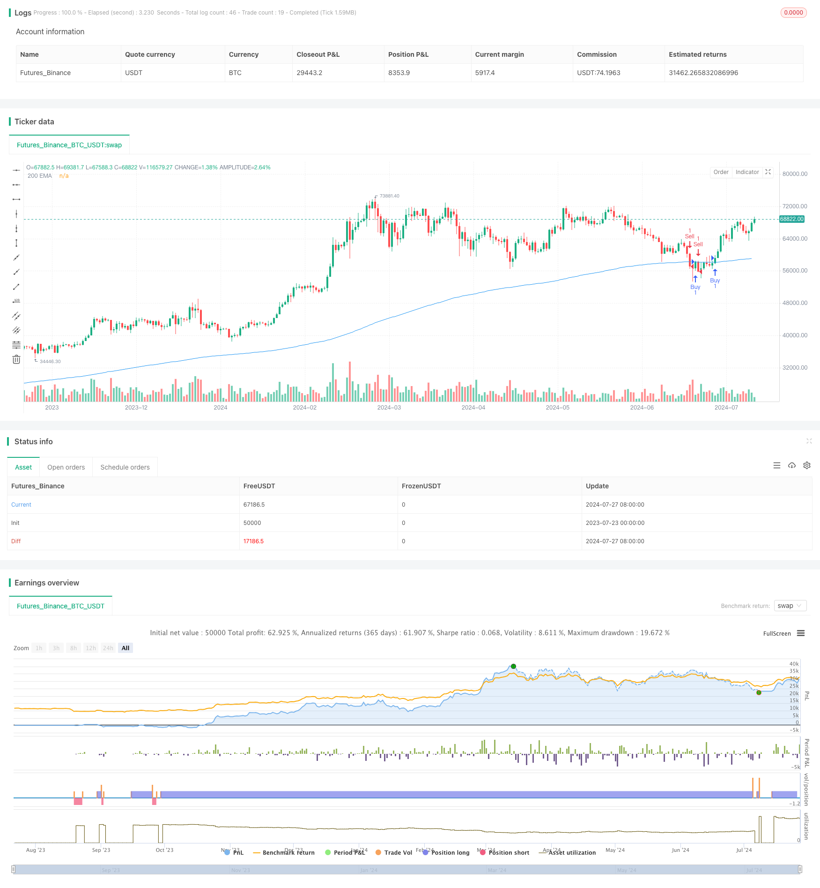

> Name

Adaptive-Trend-Following-Trading-Strategy-200-EMA-Breakout-with-Dynamic-Risk-Management-System
> Author

ChaoZhang

> Strategy Description



[trans]

#### Overview
This strategy is a trend following system based on the 200-day exponential moving average (EMA), combined with dynamic stop loss and profit target setting. It utilizes the 200-day EMA as the primary trend indicator, generating trading signals when price breaks above the EMA. What makes the strategy unique is its customizable risk management parameters, allowing traders to adjust stop loss and profit targets based on their personal risk appetite. In addition, the strategy provides the option to enable or disable long and short strategies respectively, increasing its flexibility and adaptability.
#### Strategy Principle
1. Trend identification: Use the 200-day EMA as an indicator of long-term trends. When the price is above the EMA, it is considered an uptrend; otherwise, it is a downtrend.
2. Entry signals:
   - Long: When the closing price breaks through the 200-day EMA from below, a long signal is triggered.
   - Short selling: When the closing price falls below the 200-day EMA from above, a short selling signal is triggered.
3. Risk management:
   - Stop loss: The default setting is 1% of the entry price, which can be customized.
   - Profit target: The default setting is 2% of the entry price, which can also be customized.
4. Flexibility:
   - Long and short strategies can be enabled or disabled individually.
   - Allows users to adjust EMA period, stop loss and profit percentage based on market conditions and personal preference.
#### Strategic Advantages
1. Trend following: Use the 200-day EMA to effectively capture long-term trends and reduce losses caused by false breakthroughs.
2. Risk control: Provide a clear risk-reward ratio for each trade through adjustable stop loss and profit targets.
3. Strong adaptability: parameters can be adjusted according to different market conditions and personal risk tolerance.
4. Flexible strategy: Able to independently control long and short strategies to adapt to different market environments.
5. Automated execution: Once the parameters are set, the strategy can automatically execute transactions to reduce human emotional interference.
6. Simple and clear: The strategy logic is simple, easy to understand and implement, and is suitable for traders of all levels.
#### Strategy Risk
1. Risk of volatile markets: In sideways or volatile markets, false signals may be triggered frequently, leading to continuous losses.
2. Slippage risk: In a fast market, the actual transaction price may be significantly different from the signal trigger price.
3. Over-reliance on a single indicator: Relying solely on the 200-day EMA may ignore other important market information.
4. Fixed percentage risk: For volatile markets, a fixed percentage stop loss may not be flexible enough.
5. Delay risk: EMA, as a lagging indicator, may not respond in time in the early stages of trend reversal.
Solution:
- Combined with other technical indicators, such as RSI or MACD, to confirm trends.
- Use dynamic stops, such as trailing stops, to adapt to market fluctuations.
- Add volume analysis and improve signal reliability.
- Consider using shorter term moving averages as secondary indicators.
#### Strategy optimization direction
1. Multi-period analysis: Combine EMA of multiple time frames, such as 50-day and 100-day EMA, to improve signal reliability.
2. Dynamic stop loss: Implement dynamic stop loss based on ATR (average true range) to better adapt to market fluctuations.
3. Volume confirmation: Add volume analysis and only confirm trading signals when volume breaks through.
4. Trend strength filter: Use ADX (average trend indicator) to measure trend strength and only trade in strong trends.
5. Backtesting optimization: Conduct extensive backtesting on different markets and time periods to find the optimal parameter combination.
6. Sentiment indicator integration: Consider adding market sentiment indicators, such as VIX, to adjust strategies during extreme market conditions.
7. Machine learning optimization: Use machine learning algorithms to dynamically adjust the EMA period and risk parameters.
These optimization directions aim to improve the robustness and adaptability of the strategy, reduce false signals, and maintain good performance in different market environments.
#### Summarize
The 200 EMA Breakout and Dynamic Risk Management System is a powerful and flexible trend following strategy. It utilizes the widely recognized 200-day EMA to capture long-term trends while providing granular risk control through customizable risk management parameters. The main advantages of the strategy are its simplicity and adaptability, making it suitable for use by all types of traders. However, users need to be aware of potential risks in volatile markets and consider combining with other technical indicators to enhance signal reliability. Through continued optimization and backtesting, this strategy has the potential to become a robust automated trading system capable of performing well under a variety of market conditions.
|| 

#### Overview

This strategy is a trend-following system based on the 200-day Exponential Moving Average (EMA), combined with dynamic stop-loss and take-profit settings. It uses the 200-day EMA as the primary trend indicator, generating trading signals when the price breaks through the EMA. The strategy's unique feature lies in its customizable risk management parameters, allowing traders to adjust stop-loss and take-profit levels according to their personal risk preferences. Additionally, the strategy offers options to enable or disable long and short strategies separately, increasing its flexibility and adaptability.

#### Strategy Principles

1. Trend Identification: Uses the 200-day EMA as an indicator for long-term trends. When the price is above the EMA, it's considered an uptrend; otherwise, it's a downtrend.

2. Entry Signals:
   - Long: A buy signal is triggered when the closing price crosses above the 200-day EMA.
   - Short: A sell signal is triggered when the closing price crosses below the 200-day EMA.

3. Risk Management:
   - Stop Loss: Default setting is 1% below the entry price, customizable.
   - Take Profit: Default setting is 2% above the entry price, also customizable.

4. Flexibility:
   - Long and short strategies can be enabled or disabled independently.
   - Users can adjust the EMA period, stop-loss, and take-profit percentages based on market conditions and personal preferences.

#### Strategy Advantages

1. Trend Following: Effectively captures long-term trends using the 200-day EMA, reducing losses from false breakouts.

2. Risk Control: Provides a clear risk-reward ratio for each trade through adjustable stop-loss and take-profit targets.

3. High Adaptability: Parameters can be adjusted for different market conditions and personal risk tolerance levels.

4. Strategic Flexibility: Ability to control long and short strategies independently, adapting to different market environments.

5. Automated Execution: Once parameters are set, the strategy can execute trades automatically, reducing emotional interference.

6. Simplicity: Strategy logic is simple, easy to understand and implement, suitable for traders of all levels.

#### Strategy Risks

1. Choppy Market Risk: In sideways or volatile markets, frequent false signals may lead to consecutive losses.

2. Slippage Risk: In fast-moving markets, actual execution prices may significantly differ from signal trigger prices.

3. Over-reliance on a Single Indicator: Relying solely on the 200-day EMA may overlook other important market information.

4. Fixed Percentage Risk: For highly volatile markets, fixed percentage stop-losses may not be flexible enough.

5. Lag Risk: As a lagging indicator, EMA may not react timely to trend reversals in their early stages.

Solutions:
- Incorporate other technical indicators, such as RSI or MACD, to confirm trends.
- Use dynamic stop-losses, like trailing stops, to adapt to market volatility.
- Add volume analysis to improve signal reliability.
- Consider using shorter-term moving averages as supplementary indicators.

#### Strategy Optimization Directions

1. Multi-timeframe Analysis: Combine EMAs from multiple timeframes, such as 50-day and 100-day EMAs, to enhance signal reliability.

2. Dynamic Stop-Loss: Implement ATR (Average True Range) based dynamic stop-losses to better adapt to market volatility.

3. Volume Confirmation: Incorporate volume analysis, confirming trade signals only on volume breakouts.

4. Trend Strength Filter: Use ADX (Average Directional Index) to measure trend strength, trading only in strong trends.

5. Backtesting Optimization: Conduct extensive backtests across different markets and time periods to find optimal parameter combinations.

6. Sentiment Indicator Integration: Consider adding market sentiment indicators, like VIX, to adjust the strategy in extreme market conditions.

7. Machine Learning Optimization: Use machine learning algorithms to dynamically adjust EMA periods and risk parameters.

These optimization directions aim to improve the strategy's robustness and adaptability, reduce false signals, and maintain good performance across different market environments.

#### Conclusion

The 200 EMA Breakout with Dynamic Risk Management System is a powerful and flexible trend-following strategy. It leverages the widely respected 200-day EMA to capture long-term trends while providing fine-tuned risk control through customizable risk management parameters. The strategy's main strengths lie in its simplicity and adaptability, making it suitable for traders of all levels. However, users need to be aware of potential risks in choppy markets and consider incorporating additional technical indicators to enhance signal reliability. Through continuous optimization and backtesting, this strategy has the potential to become a robust automated trading system capable of performing well under various market conditions.

[/trans]


> Source (PineScript)

``` pinescript
/*backtest
start: 2023-07-23 00:00:00
end: 2024-07-28 00:00:00
period: 1d
basePeriod: 1h
exchanges: [{"eid":"Futures_Binance","currency":"BTC_USDT"}]
*/

//@version=5
strategy("200 EMA Strategy", overlay=true)

// Input parameters
emaLength = input.int(200, title="EMA Length")
stopLossPercent = input.float(1.0, title="Stop Loss (%)", step=0.1)
takeProfitPercent = input.float(2.0, title="Take Profit (%)", step=0.1)

// Enable buy and sell strategies
enableBuy = input.bool(true, title="Enable Buy Strategy")
enableSell = input.bool(true, title="Enable Sell Strategy")

// Calculate 200 EMA
ema200 = ta.ema(close, emaLength)

// Plot the EMA on the chart
plot(ema200, color=color.blue, title="200 EMA")

// Buy condition: close is above the 200 EMA
if (enableBuy and ta.crossover(close, ema200))
    // Define stop loss and take profit levels
    stopLossPrice = close * (1 - stopLossPercent / 100)
    takeProfitPrice = close * (1 + takeProfitPercent / 100)
    
    // Enter long position
    strategy.entry("Buy", strategy.long)
    
    // Set stop loss and take profit
    strategy.exit("Take Profit/Stop Loss", "Buy", stop=stopLossPrice, limit=takeProfitPrice)

// Sell condition: close is below the 200 EMA
if (enableSell and ta.crossunder(close, ema200))
    // Define stop loss and take profit levels
    stopLossPrice = close * (1 + stopLossPercent / 100)
    takeProfitPrice = close * (1 - takeProfitPercent / 100)
    
    // Enter short position
    strategy.entry("Sell", strategy.short)
    
    // Set stop loss and take profit
    strategy.exit("Take Profit/Stop Loss", "Sell", stop=stopLossPrice, limit=takeProfitPrice)

```

> Detail

https://www.fmz.com/strategy/458077

> Last Modified

2024-07-29 17:11:58
