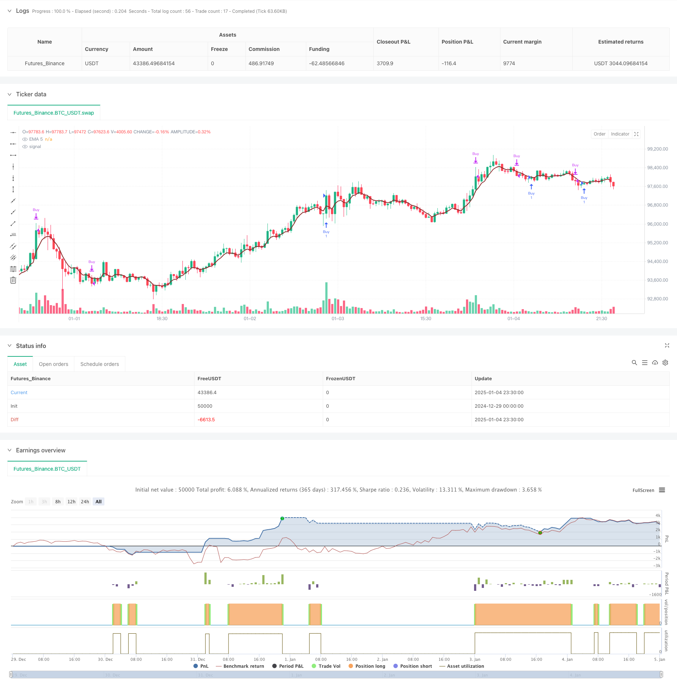

> Name

Trend following strategy optimization model based on 5-day exponential moving average-5-Day-EMA-Based-Trend-Following-Strategy-Optimization-Model
> Author

ChaoZhang

> Strategy Description



[trans]
#### Overview
This strategy is a trend-following trading system based on the 5-day exponential moving average (EMA). By analyzing the position relationship between price and EMA, combined with the dynamic adjustment of stop loss and profit targets, it can grasp the market trend. The strategy adopts a percentage position management method and takes into account transaction cost factors, making it highly practical and flexible.
#### Strategy Principle
The core logic of the strategy is based on the interaction between price and the 5-day EMA to determine the timing of entry. Specifically, when the highest price of the current period is lower than the EMA and there is a breakthrough in the current period, the system will issue a long signal. At the same time, the strategy also includes an optional additional condition, which requires the closing price to be higher than the previous period to increase the reliability of the signal. For risk control, the strategy provides two stop loss methods: dynamic stop loss based on previous lows, and stop loss based on fixed points. The profit target is dynamically set based on the risk-return ratio, ensuring the profit potential of the transaction.
#### Strategic Advantages
1. Strong ability to grasp trends: Through the cooperation of EMA and price, the initial stage of the trend can be effectively captured.
2. Complete risk control: Provide flexible stop loss options, either fixed point stop loss or dynamic stop loss.
3. Reasonable profit targets: Set profit targets based on risk-return ratio to ensure that each transaction has sufficient profit margin.
4. Transaction costs are fully considered: The calculation of transaction costs is added to the strategy, which is more in line with the actual trading environment.
5. Flexible and adjustable parameters: Key parameters such as stop loss distance, risk-return ratio, etc. can be adjusted according to different market conditions.
#### Strategy Risk
1. Risk of false breakthrough: In a volatile market, false breakthrough signals may appear, leading to stop-loss exits.
2. Impact of slippage: In a volatile market, the actual transaction price may deviate greatly from the signal price.
3. EMA lag: As a moving average indicator, EMA has a certain lag, which may cause a slight delay in entry timing.
4. Fund management risk: Fixed percentage position management may lead to excessive capital drawdown when experiencing continuous losses.
#### Strategy optimization direction
1. Multi-period confirmation: You can add longer-period trend confirmation, such as adding the 20-day EMA as a trend direction filter.
2. Volatility adaptation: Introduce the ATR indicator to dynamically adjust stop loss and profit targets, so that the strategy can better adapt to different market fluctuation environments.
3. Position optimization: Position size can be dynamically adjusted based on market volatility and signal strength to improve capital utilization efficiency.
4. Time filtering: Add time filtering conditions to avoid trading during volatile periods such as market opening and closing.
5. Market environment identification: Add a market environment judgment mechanism and adopt different parameter settings under different market conditions.
#### Summary
This is a well-designed and logical trend following strategy that can effectively capture market trends through the combination of EMA indicators and price action. The strategy has a relatively complete mechanism in terms of risk control and income management, and provides multiple optimizable directions, which has strong practical value and room for improvement. In the future, the stability and profitability of the strategy can be further improved by adding multi-period analysis, adjusting the stop loss mechanism, etc. ||
#### Overview
This strategy is a trend-following trading system based on the 5-day Exponential Moving Average (EMA), which analyzes the relationship between price and EMA to capture market trends. The strategy incorporates dynamic adjustment of stop-loss and profit targets, uses percentage-based position management, and considers transaction costs, making it highly practical and flexible.

#### Strategy Principle
The core logic is based on the interaction between price and 5-day EMA to determine entry points. Specifically, a long signal is generated when the previous period's high is below the EMA and the current period shows a breakthrough. The strategy also includes an optional additional condition requiring the closing price to be higher than the previous period to increase signal reliability. For risk control, the strategy offers two types of stop-loss methods: dynamic stop-loss based on previous lows and fixed-point stop-loss. Profit targets are dynamically set based on the risk-reward ratio to ensure trading profit potential.

#### Strategy Advantages
1. Strong trend capture capability: Effectively captures trend initiation phases through the combination of EMA and price action.
2. Comprehensive risk control: Provides flexible stop-loss options, including both fixed-point and dynamic stop-loss methods.
3. Reasonable profit targets: Sets profit objectives based on risk-reward ratio, ensuring sufficient profit potential for each trade.
4. Thorough consideration of transaction costs: Incorporates trading cost calculations, better reflecting real trading conditions.
5. Flexible parameters: Key parameters such as stop-loss distance and risk-reward ratio can be adjusted according to different market conditions.

#### Strategy Risks
1. False breakout risk: May generate false breakout signals in choppy markets, leading to stop-loss exits.
2. Slippage impact: Actual execution prices may significantly deviate from signal prices in volatile markets.
3. EMA lag: As a moving average indicator, EMA has inherent lag, potentially causing delayed entries.
4. Money management risk: Fixed percentage position sizing may lead to excessive drawdowns during consecutive losses.

#### Strategy Optimization Directions
1. Multi-timeframe confirmation: Add longer-period trend confirmation, such as incorporating 20-day EMA as a trend direction filter.
2. Volatility adaptation: Introduce ATR indicator to dynamically adjust stop-loss and profit targets for better adaptation to different market volatility environments.
3. Position optimization: Dynamically adjust position sizes based on market volatility and signal strength to improve capital efficiency.
4. Time filtering: Add time-based filters to avoid trading during highly volatile market opening and closing periods.
5. Market environment recognition: Implement market condition identification mechanisms to use different parameter settings in different market states.

#### Summary
This is a well-designed trend-following strategy with clear logic, effectively capturing market trends through the combination of EMA indicator and price action. The strategy has comprehensive mechanisms for risk control and profit management while offering multiple optimization directions, demonstrating strong practical value and room for improvement. Future enhancements can focus on adding multi-timeframe analysis and adjusting stop-loss mechanisms to further improve strategy stability and profitability.[/trans]


> Source (PineScript)

``` pinescript
/*backtest
start: 2024-12-29 00:00:00
end: 2025-01-05 00:00:00
period: 30m
basePeriod: 30m
exchanges: [{"eid":"Futures_Binance","currency":"BTC_USDT"}]
*/

//@version=5
strategy("Demo GPT - PowerOfStocks 5EMA", overlay=true)

// Inputs
enableSL = input.bool(false, title="Enable Extra SL")
usl = input.int(defval=5, title="SL Distance in Points", minval=1, maxval=100)
riskRewardRatio = input.int(defval=3, title="Risk to Reward Ratio", minval=3, maxval=25)
showSell = input.bool(true, title="Show Sell Signals")
showBuy = input.bool(true, title="Show Buy Signals")
buySellExtraCond = input.bool(false, title="Buy/Sell with Extra Condition")
startDate = input(timestamp("2018-01-01 00:00"), title="Start Date")
endDate = input(timestamp("2069-12-31 23:59"), title="End Date")

// EMA Calculation
ema5 = ta.ema(close, 5)

// Plot EMA
plot(ema5, "EMA 5", color=color.new(#882626, 0), linewidth=2)

// Variables for Buy
var bool longTriggered = na
var float longStopLoss = na
var float longTarget = na

// Variables for Sell (used for signal visualization but no actual short trades)
var bool shortTriggered = na
var float shortStopLoss = na
var float shortTarget = na

// Long Entry Logic
if true
    if (showBuy)
        longCondition = high[1] < ema5[1] and high[1] < high and (not buySellExtraCond or close > close[1])
        if (longCondition and not longTriggered)
            entryPrice = high[1]
            stopLoss = enableSL ? low[1] - usl * syminfo.mintick : low[1]
            target = enableSL ? entryPrice + (entryPrice - stopLoss) * riskRewardRatio : high[1] + (high[1] - low[1]) * riskRewardRatio

            // Execute Buy Order
            strategy.entry("Buy", strategy.long, stop=entryPrice)

            longTriggered := true
            longStopLoss := stopLoss
            longTarget := target

            label.new(bar_index, entryPrice, text="Buy@ " + str.tostring(entryPrice), style=label.style_label_up, color=color.green, textcolor=color.white)

// Short Signal Logic (Visual Only)
if (true)
    if (showSell)
        shortCondition = low[1] > ema5[1] and low[1] > low and (not buySellExtraCond or close < close[1])
        if (shortCondition and not shortTriggered)
            entryPrice = low[1]
            stopLoss = enableSL ? high[1] + usl * syminfo.mintick : high[1]
            target = enableSL ? entryPrice - (stopLoss - entryPrice) * riskRewardRatio : low[1] - (high[1] - low[1]) * riskRewardRatio

            // Visual Signals Only
            label.new(bar_index, entryPrice, text="Sell@ " + str.tostring(entryPrice), style=label.style_label_down, color=color.red, textcolor=color.white)

            shortTriggered := true
            shortStopLoss := stopLoss
            shortTarget := target

// Exit Logic for Buy
if longTriggered
    // Stop-loss Hit
    if low <= longStopLoss
        strategy.close("Buy", comment="SL Hit")
        longTriggered := false

    // Target Hit
    if high >= longTarget
        strategy.close("Buy", comment="Target Hit")
        longTriggered := false

// Exit Logic for Short (Signals Only)
if shortTriggered
    // Stop-loss Hit
    if high >= shortStopLoss
        shortTriggered := false
    // Target Hit
    if low <= shortTarget
        shortTriggered := false

```

> Detail

https://www.fmz.com/strategy/477512

> Last Modified

2025-01-06 10:54:42
