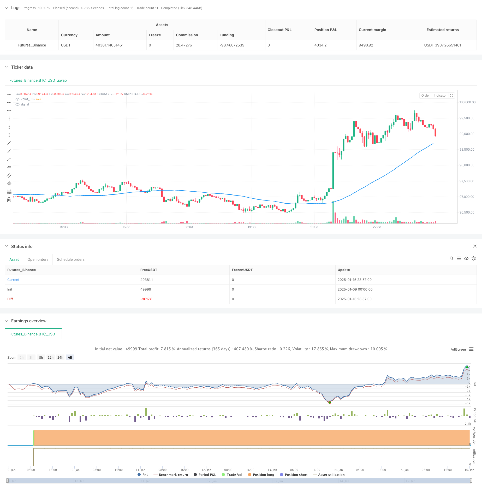

> Name

Year-end-Trend-Following-Momentum-Trading-Strategy60-day-MA-Breakout
> Author

ChaoZhang

> Strategy Description



[trans]
#### Overview
This strategy is a quantitative trading strategy that combines trend following and time exit mechanisms. The core of the strategy is to capture market trends by observing the relationship between price and the 60-day moving average, and at the same time, a year-end forced liquidation mechanism is introduced to control risks. When the closing price breaks through the 60-day moving average and the slope of the moving average is positive, enter the market to go long, and close the position uniformly on the last trading day of each year.
#### Strategy Principle
The strategy is mainly based on the following core elements:
1. Trend judgment: Use the 60-day simple moving average (SMA) as a judgment indicator of the mid-term trend, and confirm the trend direction by calculating the slope of the 14-day moving average.
2. Entry signal: When the price breaks above the 60-day moving average and the slope of the moving average is positive, it indicates that the market may enter an upward trend, and a buy signal is generated at this time.
3. Exit mechanism: The strategy adopts a fixed time exit mechanism and closes all positions on the last trading day of each year. This mechanism can effectively avoid the risk of multi-year position holdings.
4. Trading time management: The strategy has built-in trading date range control and trading day judgment functions to ensure that operations are only performed on valid trading days.
#### Strategic Advantages
1. Strong trend tracking: The moving average system can effectively capture mid- to long-term trends and make full use of market trend opportunities.
2. Improved risk control: The year-end forced liquidation mechanism can effectively control position risks and avoid the uncertainty caused by multi-year positions.
3. Clear operating rules: clear entry and exit conditions, easy to execute and backtest verification.
4. Good adaptability: The strategy parameters are highly adjustable and can be optimized according to different market characteristics.
#### Strategy Risk
1. Moving average lag: The moving average has a certain lag, which may cause a slight delay in entry timing.
2. Not applicable to volatile markets: In sideways volatile markets, frequent false breakthrough signals may occur.
3. Fixed position closing risk: Forced position closing at the end of the year may lead to early exit in a good trend.
4. Parameter sensitivity: The strategy effect is more sensitive to parameter settings such as the moving average period.
#### Strategy optimization direction
1. Add trend confirmation indicators: RSI, MACD and other indicators can be introduced to assist in judging trends and improve the accuracy of entry.
2. Optimize the exit mechanism: stop loss and take profit conditions can be added, and exit does not completely rely on time.
3. Dynamic adjustment parameters: The moving average period can be dynamically adjusted according to market volatility.
4. Increase position management: Introduce ATR and other indicators to control positions and improve the efficiency of fund use.
#### Summary
This strategy builds a relatively robust trading system by combining trend following and time management. The strategy logic is simple and clear, easy to understand and implement, and has good practicality. Through reasonable parameter optimization and supplementation of risk control measures, this strategy is expected to achieve stable returns in actual transactions. ||
#### Overview
This strategy combines trend following with a time-based exit mechanism. The core concept is to capture market trends by monitoring price relationships with the 60-day moving average while incorporating a year-end forced liquidation mechanism for risk control. Long positions are entered when the closing price breaks above the 60-day MA with a positive slope, and all positions are closed on the last trading day of each year.

#### Strategy Principles
The strategy is based on several core elements:
1. Trend Determination: Uses a 60-day Simple Moving Average (SMA) as a medium-term trend indicator, with a 14-day slope calculation to confirm trend direction.
2. Entry Signal: Buy signals are generated when price breaks above the 60-day MA with a positive slope, indicating a potential uptrend.
3. Exit Mechanism: Implements a fixed time-based exit, closing all positions on the last trading day of each year to avoid cross-year position risks.
4. Trading Time Management: Incorporates date range control and trading day validation to ensure operations only occur on valid trading days.

#### Strategy Advantages
1. Strong Trend Following: Effectively captures medium to long-term trends through the moving average system.
2. Robust Risk Control: Year-end forced liquidation effectively manages position risk and eliminates cross-year uncertainties.
3. Clear Operating Rules: Entry and exit conditions are well-defined, facilitating execution and backtesting.
4. High Adaptability: Strategy parameters can be adjusted to accommodate different market characteristics.

#### Strategy Risks
1. MA Lag: Moving averages have inherent lag, potentially causing delayed entry timing.
2. Poor Performance in Ranging Markets: May generate frequent false breakout signals in sideways markets.
3. Fixed Exit Risk: Year-end forced liquidation might lead to premature exit from good trends.
4. Parameter Sensitivity: Strategy performance is sensitive to MA period and other parameter settings.

#### Optimization Directions
1. Additional Trend Confirmation: Consider incorporating RSI, MACD for improved trend validation.
2. Enhanced Exit Mechanism: Add stop-loss and take-profit conditions rather than relying solely on time-based exits.
3. Dynamic Parameter Adjustment: Implement dynamic MA period adjustment based on market volatility.
4. Position Management: Introduce ATR-based position sizing for improved capital efficiency.

#### Summary
This strategy creates a relatively robust trading system by combining trend following with time management. Its simple and clear logic makes it easy to understand and implement, offering good practical utility. With appropriate parameter optimization and supplementary risk control measures, the strategy shows potential for generating stable returns in real trading conditions.[/trans]


> Source (PineScript)

``` pinescript
/*backtest
start: 2025-01-09 00:00:00
end: 2025-01-16 00:00:00
period: 3m
basePeriod: 3m
exchanges: [{"eid":"Futures_Binance","currency":"BTC_USDT","balance":49999}]
*/

//@version=5
strategy("Buy above 60-day MA, Sell at year-end", overlay=true, pyramiding=1)

// Define inputs for start and end dates
startDate = input(defval=timestamp("2010-01-01"), title="Start Date")
endDate = input(defval=timestamp("2024-12-31"), title="End Date")

// Define 60-day moving average
length = input.int(defval=60, title="MA Length", minval=1)
ma = ta.sma(close, length)
slope = ta.sma(ma, 14) - ta.sma(ma, 14)[1]

// Check if current bar is within the specified date range
withinDateRange = true

// Function to check if a day is a trading day (Monday to Friday)
isTradingDay(day) => true

// Check if current bar is the last trading day of the year
// Check if current bar is the last trading day of the year
isLastTradingDayOfYear = false
yearNow = year(time)
if (month == 12 and dayofmonth == 31)
    isLastTradingDayOfYear := isTradingDay(time)
else if (month == 12 and dayofmonth == 30)
    isLastTradingDayOfYear := isTradingDay(time) and not isTradingDay(time + 86400000)
else if (month == 12 and dayofmonth == 29)
    isLastTradingDayOfYear := isTradingDay(time) and not isTradingDay(time + 86400000) and not isTradingDay(time + 86400000 * 2)

// Plot moving average
plot(ma, color=color.blue, linewidth=2)

// Buy when closing price crosses above 60-day MA and up trend
if (withinDateRange and ta.crossover(close, ma) and slope > 0)
    strategy.entry("Buy", strategy.long)

// Sell all positions at the last trading day of the year
if (isLastTradingDayOfYear)
    strategy.close_all(comment="Sell at year-end")

// Plot buy and sell signals
//plotshape(series=ta.crossover(close, ma), location=location.belowbar, color=color.green, style=shape.labelup, text="Buy")
//plotshape(series=isLastTradingDayOfYear, location=location.abovebar, color=color.red, style=shape.labeldown, text="Sell")

```

> Detail

https://www.fmz.com/strategy/478705

> Last Modified

2025-01-17 14:55:20
