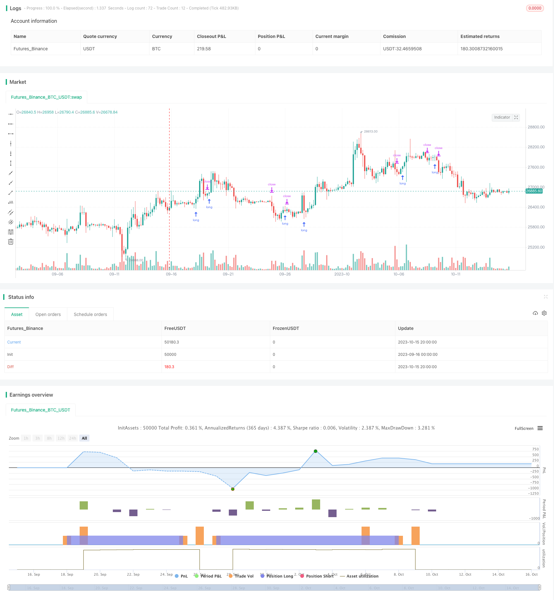

> Name

Williams-9-Days-Breakout-Strategy
> Author

ChaoZhang

> Strategy Description



[trans]


### Overview
This strategy is based on Larry Williams' 9-day breakthrough concept. It determines the trend by monitoring the direction of the 9-day moving average, enters the market at the breakthrough point, and follows the trend.
### Strategy Principles
- Use the 9-day exponential moving average EMA as an indicator to determine trends
- When the price breaks above the EMA from below, it is judged to be bullish and purchased.
- When the price breaks above the EMA below, it is judged to be bearish and sold.
- Buy signal: The opening price is below the 9-day EMA and the closing price is above the 9-day EMA
- Sell signal: The opening price is above the 9-day EMA and the closing price is below the 9-day EMA
Specifically:
1. Calculate 9-day EMA
2. Determine whether the K-line of the day meets the buying conditions, that is, the opening price is lower than the 9-day EMA and the closing price is higher than the 9-day EMA.
3. If satisfied, enter the market at the closing price and go long, and set the stop loss price to the previous high point.
4. Determine whether the K-line of the day meets the selling conditions, that is, the opening price is higher than the 9-day EMA and the closing price is lower than the 9-day EMA.
5. If satisfied, exit and sell at the previous long entry point, and set the take profit price to the previous low.
The above constitutes the complete buying and selling logic.
### Advantage Analysis
This is a simpler trend following strategy with the following advantages:
1. Using EMA to determine the trend direction can effectively filter out the noise of small price fluctuations.
2. Enter the market at the EMA breakthrough point to catch the trend turning point in time
3. Use the previous high point as stop loss and the previous low point as take profit to lock in the trend and make profits.
4. The trading rules are clear and simple, easy to understand and implement, and suitable for novices to learn.
5. High capital utilization efficiency, no need to hold positions throughout the process, only short-term positions at trend breakthrough points
### Risk and Optimization
This strategy also has some risks and shortcomings, which can be further optimized from the following aspects:
1. The EMA cycle is set to 9 days, which may not be flexible enough for different varieties and market conditions. An adaptive EMA cycle can be introduced.
2. It may be too simple to only use the 9-day EMA to judge the trend. Multiple time period EMA or other indicators can be introduced for combined judgment.
3. Transaction costs and slippage are not considered, which will have a greater impact on profits and losses in real transactions.
4. No stop-loss and stop-profit ratios are set, and the risk-return ratio of a single transaction cannot be controlled.
5. The entry signal may fluctuate multiple times, resulting in multiple unnecessary small orders. Filter conditions can be set.
In summary, this strategy can be improved from aspects such as dynamic parameter optimization, multi-factor judgment, transaction cost management, risk and return control, etc., to make the strategy more robust and adaptable to different market conditions.
### Summarize
Williams' 9-day breakthrough strategy is a relatively classic short-term trend strategy. The core idea is simple and clear. Use EMA to determine the trend direction, enter the market at the breakthrough point, follow the trend and stop profits and losses at the right time. This strategy is easy to understand and implement, and has high efficiency in using funds, but it also has some shortcomings. Through multi-angle optimization, we can make the strategy parameters more dynamic and flexible, the judgment rules more rigorous and comprehensive, and the risk and return control more complete, thereby adapting to a wider range of market conditions and improving strategy stability and profitability.
||


### Overview

This strategy is based on the 9-day breakout concept of Larry Williams, by monitoring the direction of 9-day moving average to determine the trend, and taking positions at breakout points to follow the trend.

### Strategy Logic

- Use 9-day EMA as an indicator to judge the trend 
- When price breaks out above EMA from below, it is judged as bullish and long position is taken
- When price breaks out below EMA from above, it is judged as bearish and short position is taken
- Buy signal: Opening price is lower than 9-day EMA, closing price is higher than 9-day EMA
- Sell signal: Opening price is higher than 9-day EMA, closing price is lower than 9-day EMA

Specifically:

1. Calculate the 9-day EMA
2. Check if the candle of the day satisfies the buy condition, i.e. opening price is lower than 9-day EMA, closing price is higher than 9-day EMA
3. If satisfied, take long position at closing price, with stop loss set at previous high
4. Check if the candle of the day satisfies the sell condition, i.e. opening price is higher than 9-day EMA, closing price is lower than 9-day EMA  
5. If satisfied, exit the previous long position, with take profit set at previous low

The above constitutes the complete logic of buy and sell.

### Advantage Analysis 

This is a relatively simple trend following strategy with the following strengths:

1. Using EMA to judge trend direction can effectively filter out price noise
2. Taking positions at EMA breakout can timely capture trend reversal  
3. Adopting previous high as stop loss and previous low as take profit can lock in trend profits
4. The trading rules are clear and simple, easy to understand and implement, suitable for beginners
5. High capital usage efficiency, no need to hold positions all the time, only short-term positions at trend breakouts

### Risks and Optimization

The strategy also has some risks and deficiencies, which can be further optimized from the following aspects:

1. The 9-day EMA period setting may not be flexible enough for different products and market conditions, adaptive EMA period can be introduced
2. Using only 9-day EMA to judge trend may be too simple, multiple time frame EMAs or other indicators can be combined  
3. Transaction costs and slippage are not considered, which can significantly affect PnL in live trading
4. No stop loss and take profit ratios are set, unable to control risk reward of individual trades
5. Entry signals may oscillate multiple times, generating unnecessary small orders, filters can be added

In summary, the strategy can be improved through dynamic parameter optimization, multifactor judgement, transaction cost management, risk-reward control etc, to make the strategy more robust across different market conditions.  

### Conclusion

The Williams 9-day breakout strategy is a relatively classic short-term trend following strategy. The core idea is simple and clear, using EMA to determine trend direction, taking positions at breakout points, following the trend and managing risks. The strategy is easy to understand and implement, with high capital usage efficiency, but also has some deficiencies. We can optimize it from multiple perspectives to make the parameters more dynamic, judgement rules more rigorous, risk control more complete, thereby adapting to a wider range of market conditions and improving the stability and profitability.

[/trans]


> Source (PineScript)

``` pinescript
/*backtest
start: 2023-09-16 00:00:00
end: 2023-10-16 00:00:00
period: 4h
basePeriod: 15m
exchanges: [{"eid":"Futures_Binance","currency":"BTC_USDT"}]
*/

//@version=3
strategy("larry willians teste2", overlay=true)

//Window of time
start     = timestamp(2019, 00, 00, 00, 00)  // backtest start window
finish    = timestamp(2019, 12, 31, 23, 59)        // backtest finish window
window()  => true // create function "within window of time"  

ema9=ema(close,9) // Ema de 9 periodos

//Condições de compra
c1= (open< ema9 and close > ema9) //abrir abaixo da ema9 e fechar acima da ema9

if(window())
    if(c1)
        strategy.entry("Compra", true, stop = high) // Coloca ordem stopgain no topo anterior
    else
        strategy.cancel("Compra") // Cancela a ordem se o proximo candle não "pegar"
        
//codições de venda
v1= (open> ema9 and close < ema9) // abrir acima da ema9 e fechar abaixo ema9

if(window())
    if (v1)
        strategy.exit("Venda", from_entry = "Compra", stop = low) // Saida da entrada com stop no fundo anterior
    else
        strategy.cancel("Venda") //Cancela a ordem se o proximo candle não "pegar"


```

> Detail

https://www.fmz.com/strategy/429463

> Last Modified

2023-10-17 13:51:15
