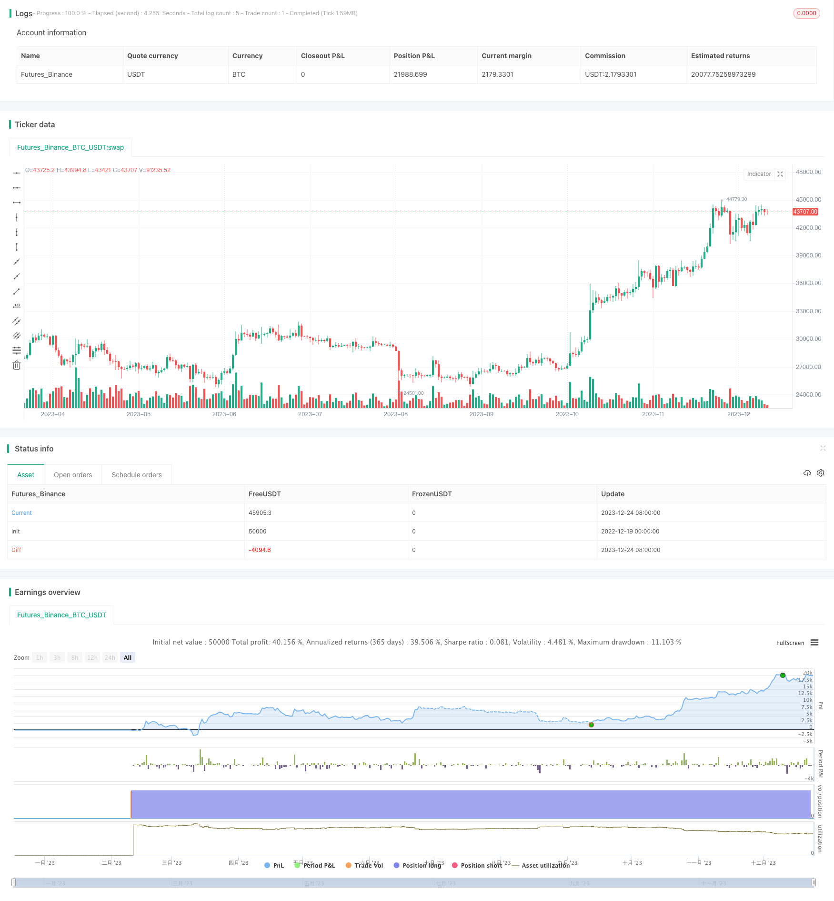

> Name

A-DMI-Stochastic-Trading-Strategy-with-Dynamic-Stop-loss
> Author

ChaoZhang

> Strategy Description


[trans]

### Overview
This strategy uses a combination of the trend index and the stochastic indicator to generate trading signals. The DI+, DI- and ADX lines in the trend index are used to judge the direction and strength of the trend, and the %K line in the stochastic indicator is used to judge whether it is overbought or oversold. The strategy generates a long signal when DI+ is above DI-, ADX is above 25 and %K is below 20; it generates a short signal when DI- is above DI+, ADX is above 25 and %K is above 80. At the same time, the strategy uses an innovative dynamic stop loss method, using the highest price and lowest price after the last entry point as dynamic stop loss levels to effectively control risks.
### Strategy Principles
The core logic of this strategy is based on the following parts:
1. **Judge the trend by trend index**: Use DI+, DI- and ADX to judge the direction and strength of the market trend. When DI+ is higher than DI-, it indicates a bullish trend; when DI- is higher than DI+, it indicates a short trend. ADX is used to judge the strength of the trend. The larger the value, the more obvious the trend.
2. **Stochastic indicator determines overbought and oversold**: The %K line in the stochastic indicator shows the position of the current closing price relative to the highest and lowest prices within a certain period, and is used to determine whether the market is overbought and oversold. When %K is below 20, it is oversold, and when it is above 80, it is overbought.
3. **Signal generation logic**: Combining the trend index and stochastic indicator, this strategy generates a long signal when DI+ is higher than DI- (long trend), ADX is higher than 25 (more obvious trend) and %K is lower than 20 (oversold); it generates a short signal when DI- is higher than DI+ (short trend), ADX is higher than 25 and %K is higher than 80 (overbought).
4. **Dynamic Stop Loss Method**: Record the highest price and lowest price after the last entry point, and use them as dynamic stop loss levels. This allows you to lock in profits or control risk based on market fluctuations.
### Advantage Analysis
This strategy mainly has the following advantages:
1. Combined with the dual judgment of trend index and stochastic indicator, the reliability is high. The trend index determines the main trend direction, and the stochastic indicator captures local characteristics. The two complement each other.
2. Innovative dynamic stop loss mechanism. Setting stop loss points based on recent fluctuations can control risks based on actual market conditions, and the stop loss effect is good.
3. The strategy has fewer parameters and is easy to implement. The main parameter is only the indicator calculation length, which is easy to adjust and optimize the strategy.
4. Can be widely applied to different varieties and cycles. This strategy can be used in financial markets such as stocks, forex, and cryptocurrencies.
5. Written using pine script, it can be applied directly in the trading platform, which is convenient and fast.
### Risk Analysis
There are also some risks that need to be noted in this strategy:
1. When the trend fluctuates, it is easy to generate false signals. At this time, ADX is relatively low, so positions should be reduced to avoid risks.
2. The stochastic indicator itself is a posteriori indicator, and the market may have reversed when the signal is generated. It should be appropriately combined with other leading indicators.
3. The dynamic stop loss mechanism cannot completely avoid the impact of huge market conditions. It is recommended to set the stop loss distance reasonably.
4. Improper parameter settings will also affect the strategy effect. Appropriate indicator length parameters should be chosen.
5. The overall market environment needs to be closely tracked. When a major black swan event occurs, the strategy should be suspended to avoid abnormal losses.
### Optimization direction
This strategy can be optimized from the following aspects:
1. Add other judgment indicators to form multiple filters and improve the reliability of signals. For example, adding moving average to determine the trend, MACD to determine the divergence, etc.
2. Optimize parameter settings and select the best parameter combination. You can determine the most appropriate indicator length by backtesting historical data.
3. Set different parameters according to different varieties and trading cycles. Varieties suitable for high-frequency trading can shorten the calculation cycle.
4. Combine the getInfo function and logging function to output detailed transaction logs and indicator data to facilitate strategy analysis and optimization.
5. Add chart drawing in the pine editor to display trading signal points. At the same time, the movement of the stop loss line can be displayed.
6. Develop an alarm function to send message reminders when specific conditions are met to facilitate timely intervention in transactions.

### Summarize
This strategy comprehensively uses the advantages of trend index and stochastic indicator to determine the trend direction while locating overbought and oversold areas, thereby generating trading signals. At the same time, the innovatively designed dynamic stop loss method makes risk control more intelligent and automated. The signal of this strategy is relatively reliable, has a wide range of applications, and is easy to use. It is an efficient and practical quantitative trading strategy. Through continuous optimization and improvement, this strategy is expected to achieve even better strategic performance.
|| 

### Overview  

This trading strategy combines the Directional Movement Index (DMI) and Stochastic Oscillator to generate trading signals. The DMI, with its DI+, DI- lines and Average Directional Index (ADX), gauges trend strength and direction. The strategy goes long (buy) when DI+ is above DI-, ADX is above 25 and Stochastic %K is below 20 (oversold). It goes short (sell) when DI- is above DI+, ADX remains above 25 and Stochastic %K exceeds 80 (overbought). Dynamic stop-loss levels based on recent highest and lowest closes enhance risk control.

### Strategy Logic

The strategy is based on the following key components:

1. **DMI for trend identification**: DI+, DI- and ADX lines of DMI determine market trend direction and strength. DI+ above DI- signals an uptrend while DI- above DI+ signals a downtrend. Higher ADX values indicate stronger trend.  

2. **Stochastic for overbought/oversold**:%K line of Stochastic shows current close relative to recent highest and lowest. Values below 20 imply oversold while above 80 overbought.

3. **Signal logic**:Combining DMI and Stochastic, the strategy goes long when DI+>DI-(uptrend), ADX>25 (trend strength) and Stochastic %K <20 (oversold). It goes short when DI->DI+ (downtrend), ADX>25 and %K>80 (overbought).  

4. **Dynamic stop-loss**: Recent highest and lowest closes after entry are used as dynamic stop-loss levels, enabling adaptive risk control.

### Advantage Analysis  

The main advantages of this strategy are:

1. Higher reliability using dual confirmation from DMI (trend) & Stochastic (overbought/oversold). 

2. Innovative dynamic stop loss based on recent price swings enables better risk control.

3. Fewer parameters makes optimization and implementation easy. 

4. Wide adaptability across financial markets (stocks, forex, crypto etc.) and timeframes.

5. Pine script allows direct application on trading platforms. Convenient.

### Risk Analysis

Some risks to consider:

1. Potential false signals in trending markets when ADX is low. Reduce position sizing.

2. Stochastic is a lagging indicator. Market may have reversed at signal time. Combine with leading indicators.  

3. Dynamic stops cannot fully avoid huge trend swings. Reasonable stop distance is essential.  

4. Inadequate parameter tuning negatively impacts performance. Optimal lengths should be set.

5. Black swan events require strategy suspension to prevent abnormal losses.

### Optimization Directions

Some ways to enhance the strategy:

1. Adding filters with more indicators like moving averages and MACD increases signal reliability.  

2. Parameter optimization through backtesting helps discover optimal settings. 

3. Customize parameters based on instrument and timeframe. Faster instruments can use shorter lengths.  

4. Incorporate detailed log outputs using getInfo() to enable easier analysis and refinement.

5. Plot signal points and stop-loss lines on chart for additional insights. 

6. Develop custom alerts to receive timely notifications allowing quick interventions.

### Conclusion
This strategy combines the strengths of DMI and Stochastic Oscillator to identify trend direction and overbought/oversold levels for trade entries. The innovative dynamic stop loss mechanism also enables smarter risk control. With reliable signals, wide applicability, ease of use and customization, this is an efficient algorithmic trading strategy. Further optimizations can lead to superior performance.  
[/trans]

> Strategy Arguments


|Argument|Default|Description|
|----|----|----|
|v_input_1|14|DMI Length|
|v_input_2|25|ADX Threshold|
|v_input_3|14|Stochastic %K Length|
|v_input_4|3|Stochastic %D Length|


> Source (PineScript)

``` pinescript
/*backtest
start: 2022-12-19 00:00:00
end: 2023-12-25 00:00:00
period: 1d
basePeriod: 1h
exchanges: [{"eid":"Futures_Binance","currency":"BTC_USDT"}]
*/

//@version=5
strategy("DMI with Stochastic and Dynamic Stop-Loss", shorttitle="DMI_Stoch_SL", overlay=true)

length = input(14, title="DMI Length")
adxThreshold = input(25, title="ADX Threshold")
stochKLength = input(14, title="Stochastic %K Length")
stochDLength = input(3, title="Stochastic %D Length")

[diPlus, diMinus, adx] = ta.dmi(length, length)
stochKLine = ta.stoch(close, high, low, stochKLength)

var float lowestClose = na
var float highestClose = na
lowestClose := na(lowestClose) ? close : math.min(lowestClose, close)
highestClose := na(highestClose) ? close : math.max(highestClose, close)

longCondition = (diPlus > diMinus) and (adx > adxThreshold) and (stochKLine < 20)
shortCondition = (diMinus > diPlus) and (adx > adxThreshold) and (stochKLine > 80)

if longCondition
    strategy.entry("Buy", strategy.long)
    strategy.exit("Exit Buy", "Buy", stop=lowestClose)

if shortCondition
    strategy.entry("Sell", strategy.short)
    strategy.exit("Exit Sell", "Sell", stop=highestClose)
```

> Detail

https://www.fmz.com/strategy/436634

> Last Modified

2023-12-26 14:30:23
