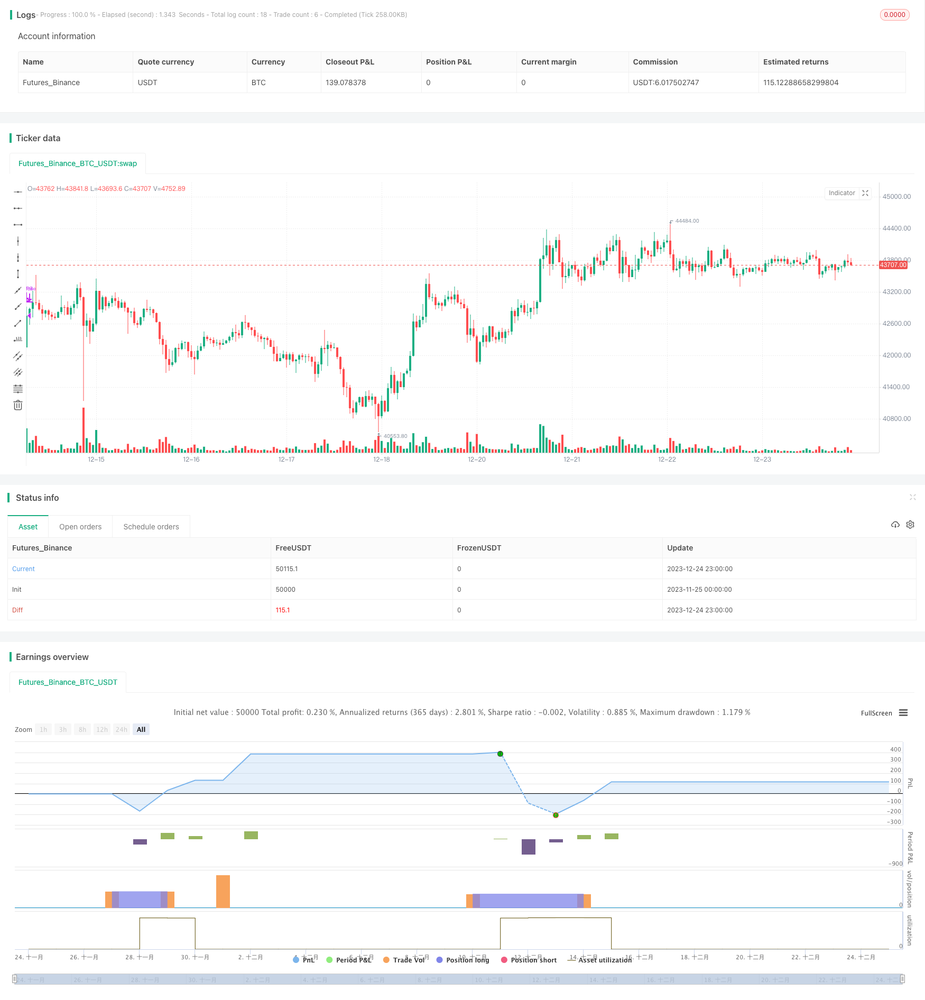

> Name

Moving Average and Deviation Indicator Multi-Period Trading Strategy A-Multi-Period-Trading-Strategy-Based-on-Moving-Averages
> Author

ChaoZhang

> Strategy Description


[trans]

## Overview
This strategy combines three indicators: moving average, Bollinger Bands and relative strength index to conduct multi-cycle stock trading. When buying, it will consider three conditions: the fast moving average crosses the slow moving average, the relative strength indicator is below 50, and the closing price is below the middle track of the Bollinger Bands. When selling, two conditions will be considered: the relative strength indicator is above 70 and the closing price is above the upper Bollinger Band.
## Strategy Principle
This strategy mainly uses three indicators to make judgments. The first is the MACD indicator, which consists of two moving averages with different periods, one fast and one slow. When the fast line crosses the slow line, a buy signal is generated. The second indicator is Bollinger Bands, which consists of three lines: the middle track, the upper track, and the lower track. When the price is close to the lower track, it is the trough buying point of the oscillation, and when the price is close to the upper track, it is the peak where stop loss is required. The third indicator is RSI, which reflects the speed and degree of change of security price movements, and can find buying troughs and selling peaks.
In specific transactions, this strategy first requires that the fast moving average crosses the slow moving average, indicating that the stock price has increased momentum and can be bought. At the same time, the RSI is required to be below 50, indicating that the stock price may be in the oversold zone, which is a buying opportunity. In addition, the closing price is also required to be lower than the middle track of the Bollinger Bands, indicating that the stock price is at the bottom, which is also a relatively good buying point.
In terms of take profit and stop loss, when the RSI is higher than 70, it means that the stock price may be in the overbought zone, indicating that the upward momentum is weakening, and a profit stop should be considered. In addition, when the closing price is higher than the upper Bollinger Band, it also indicates that the stock price may be too high and there is a risk of falling back, so profit should be taken appropriately.
## Strategic Advantages
This strategy comprehensively uses the advantages of the three indicators of moving average, Bollinger Bands and RSI, which can more accurately determine the timing of buying and selling. The specific advantages are as follows:
1. The moving average can determine the rising momentum of the stock price, the middle track of the Bollinger Bands can find the buying point at the bottom of the stock price, and the RSI can prevent buying the high point of the stock. The combination of the three can determine a better buying opportunity in the mid-term when the stock price is rising.
2. The combination of RSI and the Bollinger Band upper track can well grasp the peak of the stock price, avoid overbought phenomena, and take profits in a timely manner.
3. Apply multi-cycle judgment to seize trading opportunities at different levels and expand profit margins.
4. The trading logic of this strategy is simple, clear and easy to understand, and is suitable for medium and long-term investment.
## Strategy Risk
Although this strategy combines multiple indicator judgments to increase the accuracy of trading decisions. However, there are still the following major risks:
1. Parameter setting risks. The parameters of the moving average, Bollinger Bands and RSI need to be adjusted according to the actual situation. If the parameters are set improperly, the trading effect will be affected.
2. The long market has better applicability. In a bear market, the stock price falls faster and the stop-loss measures of this strategy may not have time to take effect.
3. Single stock risk. This strategy is more suitable for investment portfolios. Single stock risks still exist and investments need to be diversified.
4. Transaction frequency may be too high. If the parameters are set properly, this strategy may trade frequently. This adds to transaction costs and taxes.
Corresponding solutions:
1. The parameters should be adjusted based on the backtest data to make the frequency of the indicator's signal more appropriate.
2. The moving average period can be appropriately adjusted to reduce the frequency of purchases and reduce losses.
3. Increase investment varieties and reduce single stock risks through diversified investments.
4. Appropriately relax the buying and profit-taking conditions and reduce the frequency of transactions.
## Strategy optimization direction
There is still room for further optimization of this strategy:
1. More indicator filters can be introduced, such as trading volume indicators, to ensure that trading volume is amplified when buying and increase decision-making accuracy.
2. You can add a position management module to dynamically adjust positions according to market conditions.
3. It can be combined with deep learning algorithms to automatically optimize parameter settings through training on a large amount of data.
4. More time period judgments can be added to expand the scope of application.
## Summarize
Generally speaking, this strategy has clear logic and is easy to understand. It comprehensively uses multiple indicators to judge, which reduces false signals to a certain extent. By optimizing parameters and adding more technical indicators, the accuracy of decision-making can be further improved and the robustness of the strategy can be enhanced. This strategy is more suitable for medium and long-term investments and can also be used for quantitative trading. However, no strategy can completely avoid market risks, and position size and stop loss points need to be controlled.
|| 


## Overview

This strategy combines three indicators - moving averages, Bollinger Bands and the Relative Strength Index (RSI) for multi-period stock trading. It considers crossovers of fast and slow moving averages, RSI below 50 and close price below BB middle band when buying. It considers RSI above 70 and close price above BB upper band when selling.

## Strategy Logic  

The strategy mainly utilizes three indicators for decision making. Firstly, the MACD indicator comprised of fast and slow moving averages. Crossovers of the fast line above the slow line generate buy signals. Secondly, the Bollinger Bands with middle, upper and lower bands. Prices near the lower band present buying opportunities in swing lows, while prices near the upper band present selling opportunities at swing highs. Lastly, the RSI reflects the velocity and rate of change of the price action and identifies potential swing highs and swing lows.

Specifically, the strategy first requires the fast moving average crossing above the slow moving average, indicating strengthening uptrend that suggests buying. It also requires RSI below 50, showing the price may be in oversold levels and presenting buying opportunities. In addition, it requires the close price below BB middle band, indicating the price swing low and a good entry point.   

For profit taking and stop loss, when RSI rises above 70, it indicates the price may be in overbought levels and uptrend momentum is waning, suitable for taking profit. Also when close price rises above BB upper band, it signals elevated risk of pullback, appropriate for profit taking.

## Advantages

The strategy combines the strengths of moving averages, Bollinger Bands and RSI to more precisely decide entry and exit points. The main advantages are:

1. Moving averages determine price uptrend momentum. BB middle band pinpoints swing lows for entry. RSI avoids buying at price peaks. The three together provide relatively ideal buying opportunities during price uptrends.  

2. The combination of RSI and BB upper band captures price swing highs well for taking profit to avoid overbought conditions.

3. Multi-period assessments allow capturing trading opportunities across timeframes to maximize profits. 

4. The logical trading rules make the strategy easily understandable for medium to long term investments.

## Risks

Despite combining indicators to improve decision accuracy, key risks exist:

1. Parameter setting risks. The parameters for the indicators need empirical adjustment. Inadequate tuning impacts strategy performance.

2. More suitable for bull markets. In bear markets, speed of price falls may make stop losses ineffective.

3. Single stock risks remain despite portfolio. Need to diversify investments across assets.  

4. Potentially excessive trading frequency. Optimal parameter setting may result in frequent trades, incurring higher transaction costs and taxes.

Solutions:

1. Adjust parameters based on backtests to achieve suitable signal frequency.  

2. Tune moving average periods to moderate entry frequency and minimize losses.  

3. Diversify investments across more assets to minimize single stock risks.  

4. Relax buying and profit-taking criteria moderately to reduce trade frequency.

## Enhancement Opportunities

There remains further room for optimizations:

1. Add more filters like volume to ensure amplified volumes on buys, improving decision accuracy.

2. Incorporate position sizing modules to dynamically size positions based on market conditions.

3. Utilize deep learning algorithms to auto-tune parameters through training across large datasets.

4. Introduce more timeframes for judgments to expand applicability.

## Conclusion

Overall the strategy has clear, easy-to-understand logic, synergizing indicators to reduce false signals. Further parameter tuning and adding indicators can continue enhancing robustness and decision precision. It suits medium to long term investments and quantitative trading. Nonetheless, no strategy eliminates market risks fully. Appropriate position sizing and stop loss levels are always necessary.

[/trans]

> Strategy Arguments


|Argument|Default|Description|
|----|----|----|
|v_input_1|0|Version: 1.0.1|
|v_input_2_close|0|Source: close|high|low|open|hl2|hlc3|hlcc4|ohlc4|
|v_input_3|12|(?MACD)Fast Length|
|v_input_4|26|Slow Length|
|v_input_5|9|Signal Smoothing|
|v_input_6|0|Oscillator MA Type: EMA|SMA|
|v_input_7|0|Signal Line MA Type: EMA|SMA|
|v_input_8|20|(?Bollindger Bands)Length|
|v_input_9|2|StdDev|
|v_input_10|14|(?RSI)Length|
|v_input_11|false|(?Stop Loss)╔══════   Enable   ══════╗|
|v_input_12|0|Based on: Percent|ATR|
|v_input_13|10|ATR   Mult|
|v_input_14|14|Length|
|v_input_15|10|Percent|


> Source (PineScript)

``` pinescript
/*backtest
start: 2023-11-25 00:00:00
end: 2023-12-25 00:00:00
period: 1h
basePeriod: 15m
exchanges: [{"eid":"Futures_Binance","currency":"BTC_USDT"}]
*/

//
//@author Alorse
//@version=4
strategy("MACD + BB + RSI [Alorse]", shorttitle="BB + MACD + RSI [Alorse]", overlay=true, pyramiding=0, currency=currency.USD, default_qty_type=strategy.percent_of_equity, initial_capital=1000, default_qty_value=20, commission_type=strategy.commission.percent, commission_value=0.01) 

txtVer = "1.0.1"
version = input(title="Version", type=input.string, defval=txtVer, options=[txtVer], tooltip="This is informational only, nothing will change.")
src = input(title="Source", type=input.source, defval=close)

// MACD
fast_length = input(title="Fast Length", type=input.integer, defval=12, group="MACD")
slow_length = input(title="Slow Length", type=input.integer, defval=26, group="MACD")
signal_length = input(title="Signal Smoothing", type=input.integer, minval = 1, maxval = 50, defval = 9, group="MACD")
sma_source = input(title="Oscillator MA Type", type=input.string, defval="EMA", options=["SMA", "EMA"], group="MACD")
sma_signal = input(title="Signal Line MA Type", type=input.string, defval="EMA", options=["SMA", "EMA"], group="MACD")
fast_ma = sma_source == "SMA" ? sma(src, fast_length) : ema(src, fast_length)
slow_ma = sma_source == "SMA" ? sma(src, slow_length) : ema(src, slow_length)
macd = fast_ma - slow_ma
signal = sma_signal == "SMA" ? sma(macd, signal_length) : ema(macd, signal_length)

// Bollinger Bands
bbGroup = "Bollindger Bands"
length = input(20, title="Length", group=bbGroup)
mult = input(2.0, title="StdDev", minval=0.001, maxval=5, group=bbGroup)

basis = sma(src, length)
dev = mult * stdev(src, length)
upper = basis + dev
lower = basis - dev

// RSI
rsiGroup = "RSI"
lenRSI = input(14, title="Length", minval=1, group=rsiGroup)
// lessThan = input(50, title="Less than", minval=1 , maxval=100, group=rsiGroup)
RSI = rsi(src, lenRSI)

// Strategy Conditions
buy = crossover(macd, signal) and RSI < 50 and close < basis
sell = RSI > 70 and close > upper


// Stop Loss
slGroup = "Stop Loss"
useSL = input(false, title="╔══════   Enable   ══════╗", group=slGroup, tooltip="If you are using this strategy for Scalping or Futures market, we do not recommend using Stop Loss.")
SLbased = input(title="Based on", type=input.string, defval="Percent", options=["ATR", "Percent"], group=slGroup, tooltip="ATR: Average True Range\nPercent: eg. 5%.")
multiATR = input(10.0, title="ATR   Mult", type=input.float, group=slGroup, inline="atr")
lengthATR = input(14, title="Length", type=input.integer, group=slGroup, inline="atr")
SLPercent = input(10, title="Percent", type=input.float, group=slGroup) * 0.01

longStop = 0.0
shortStop = 0.0

if SLbased == "ATR"
    longStop := valuewhen(buy, low, 0) - (valuewhen(buy, rma(tr(true), lengthATR), 0) * multiATR)
    longStopPrev = nz(longStop[1], longStop)
    longStop := close[1] > longStopPrev ? max(longStop, longStopPrev) : longStop

    shortStop := (valuewhen(sell, rma(tr(true), lengthATR), 0) * multiATR) + valuewhen(sell, high, 0)
    shortStopPrev = nz(shortStop[1], shortStop)
    shortStop := close[1] > shortStopPrev ? max(shortStop, shortStopPrev) : shortStop
if SLbased == "Percent"
    longStop  := strategy.position_avg_price * (1 - SLPercent)
    shortStop := strategy.position_avg_price * (1 + SLPercent)

strategy.entry("Long", true, when=buy)
strategy.close("Long", when=sell, comment="Exit")

if useSL
    strategy.exit("Stop Loss", "Long", stop=longStop)

```

> Detail

https://www.fmz.com/strategy/436593

> Last Modified

2023-12-26 10:13:34
