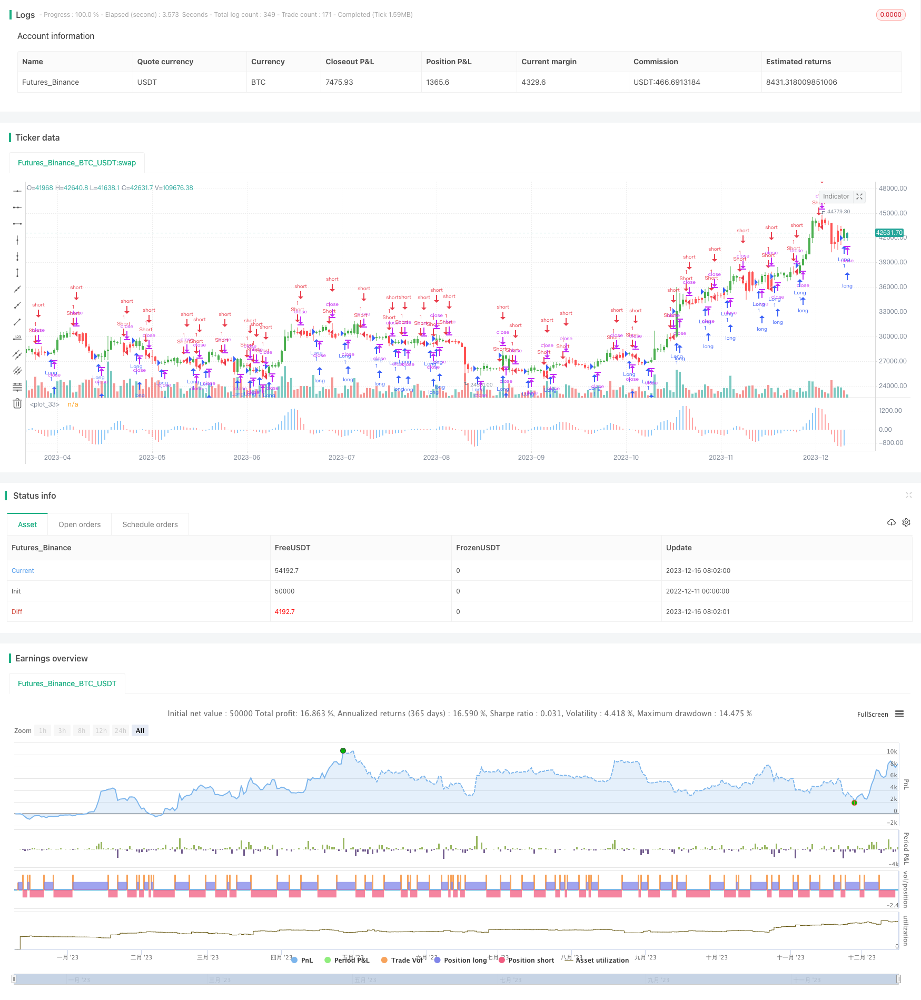

> Name

AC-Backtest-Strategy-of-Williams-Indicator AC-Backtest-Strategy-of-Williams-Indicator
> Author

ChaoZhang

> Strategy Description


 [trans]

## Overview
This strategy is based on the Awesome Oscillator (AO) in the William indicator designed by the famous trading expert Bill Williams. By calculating the difference between the mid-price moving averages of different periods, it forms an oscillator for diagnosing trends and market momentum, and designs corresponding trading signals to guide buying and selling.
## Strategy Principle
The core indicator of this strategy is the Articulated Oscillator (AO), whose calculation formula is:
AO = SMA(mid price, 5 days) - SMA(mid price, 34 days)
Among them, the mid-price is defined as (highest price + lowest price)/2. This formula extracts price momentum information from the mid-price SMA of two different periods. By calculating the difference between the fast SMA (5-day) and the slow SMA (34-day), when the fast line is higher than the slow line, it is a buy signal, and when the fast line is lower than the slow line, it is a sell signal.
In this strategy, in order to filter the error signal, a 5-day SMA operation is performed on AO. And a reversal mode is set up, which can achieve different trading directions by reversing the long/short signal. When the AO value is higher than before, it is regarded as a buying opportunity and marked as a blue bar; when the AO value is not higher than before, it is regarded as a selling opportunity and marked as a red bar.
## Strategic Advantages
1. Using the mid-price instead of the closing price can reduce the impact of false breakthroughs on SMA and improve stability.
2. Combination of fast and slow SMA to capture market changes sensitively
3. SMA double filtering to remove high-frequency noise and improve signal quality
4. Parameters can be flexibly adjusted to adapt to different market environments
5. Intuitive columnar display of buying and selling points makes it easy to judge operations.
## Risks and Solutions
1. It is necessary to carefully evaluate the frequency of market fluctuations and adjust parameters to prevent overfitting.
2. Multiple misoperations may occur in volatile markets. The stop loss range can be appropriately relaxed or the position size can be reduced
3. Backtest data is unreliable, and the actual offer may be different from the simulation. It is recommended to verify the real offer of multiple combinations and build positions in batches.
## Optimization direction
1. Add filters such as trading volume indicators to improve signal quality
2. Add a stop-loss strategy to control individual loss operations
3. Optimize position management and increase or decrease positions according to market fluctuations
4. Combine with other indicators to determine the trend direction and prevent the reversal of a volatile market.
## Summary
This strategy uses an exquisite oscillator designed with a mid-price fast and slow SMA structure to diagnose market momentum changes, and the buying and selling signals are intuitive and clear. However, it may be affected by shocks and reversals, and parameters and stop loss strategies need to be appropriately adjusted to improve stability. On the premise of controlling risks, this strategy is simple and practical and deserves further optimization and application.
||


## Overview
This strategy is based on the Awesome Oscillator (AO) in the Williams Indicator designed by famous trader Bill Williams. By calculating the difference between median price SMAs of different periods, it forms an oscillating indicator to diagnose trends and market momentum and designs corresponding trading signals to guide long and short.

## Principle  
The core indicator of this strategy is the Awesome Oscillator (AO), which is calculated as:
AO = SMA(Median Price, 5 days) - SMA(Median Price, 34 days)
Where the Median Price is defined as (Highest Price + Lowest Price)/2. This formula extracts price momentum information from two SMAs of the median price over different periods. Buying signals are generated when the fast SMA (5 days) is higher than the slow SMA (34 days), and selling signals are generated when the fast SMA is lower than the slow SMA.

To filter erroneous signals, this strategy also applies a 5-day SMA operation on AO. A reverse mode is provided where reversing the long/short signals realizes different trading directions. When AO is higher than the previous value, it is considered a buying opportunity and marked as a blue bar. When AO is not higher than the previous value, it is considered a selling opportunity and marked as a red bar.


## Advantages
1. Using median price instead of close price reduces the impact of false breakouts on SMA and improves stability  
2. Fast and slow SMA combination sensitively captures market changes
3. Double SMA filtering removes high frequency noise and improves signal quality  
4. Flexible parameter adjustment adapts to different market environments 
5. Intuitive bar display of trading points for easy judgment of operations


## Risks and Solutions
1. Evaluate market volatility frequency cautiously to prevent overfitting by adjusting parameters  
2. Multiple erroneous operations may occur in oscillating markets. Relax stop loss range properly or reduce position scale
3. Unreliable backtest data, actual performance may differ from simulation. Suggest combining multi-leg actual trading and split batch positions

## Optimization Directions  
1. Increase filters like trading volume to improve signal quality
2. Incorporate stop loss strategies to control individual operation losses  
3. Optimize position management, add or reduce positions according to market volatility
4. Combine other indicators to determine trend direction to prevent oscillation reversals
   

## Conclusion
This strategy utilizes the Awesome Oscillator designed with fast and slow median price SMA structure to diagnose market momentum changes, with intuitive and clear trading signals. But it is subject to impacts of oscillation and reversal, requiring proper parameter tuning and stop loss strategies to improve stability. With effective risk control, this strategy is simple, practical and worth further optimization and application.

[/trans]

> Strategy Arguments


|Argument|Default|Description|
|----|----|----|
|v_input_1|34|Length Slow|
|v_input_2|5|Length Fast|
|v_input_3|false|Trade reverse|


> Source (PineScript)

``` pinescript
/*backtest
start: 2022-12-11 00:00:00
end: 2023-12-17 00:00:00
period: 1d
basePeriod: 1h
exchanges: [{"eid":"Futures_Binance","currency":"BTC_USDT"}]
*/

//@version=2
////////////////////////////////////////////////////////////
//  Copyright by HPotter v1.0 28/12/2016
//    This indicator plots the oscillator as a histogram where blue denotes 
//    periods suited for buying and red . for selling. If the current value 
//    of AO (Awesome Oscillator) is above previous, the period is considered 
//    suited for buying and the period is marked blue. If the AO value is not 
//    above previous, the period is considered suited for selling and the 
//    indicator marks it as red.
//
// You can change long to short in the Input Settings
// Please, use it only for learning or paper trading. Do not for real trading.
////////////////////////////////////////////////////////////
strategy("Bill Williams. Awesome Oscillator (AC)")
nLengthSlow = input(34, minval=1, title="Length Slow")
nLengthFast = input(5, minval=1, title="Length Fast")
reverse = input(false, title="Trade reverse")
xSMA1_hl2 = sma(hl2, nLengthFast)
xSMA2_hl2 = sma(hl2, nLengthSlow)
xSMA1_SMA2 = xSMA1_hl2 - xSMA2_hl2
xSMA_hl2 = sma(xSMA1_SMA2, nLengthFast)
nRes =  xSMA1_SMA2 - xSMA_hl2
cClr = nRes > nRes[1] ? blue : red
pos = iff(nRes > nRes[1], 1,
	   iff(nRes < nRes[1], -1, nz(pos[1], 0))) 
possig = iff(reverse and pos == 1, -1,
          iff(reverse and pos == -1, 1, pos))	   
if (possig == 1) 
    strategy.entry("Long", strategy.long)
if (possig == -1)
    strategy.entry("Short", strategy.short)	   	    
barcolor(possig == -1 ? red: possig == 1 ? green : blue )
plot(nRes, style=histogram, linewidth=1, color=cClr)
```

> Detail

https://www.fmz.com/strategy/435716

> Last Modified

2023-12-18 12:03:38
