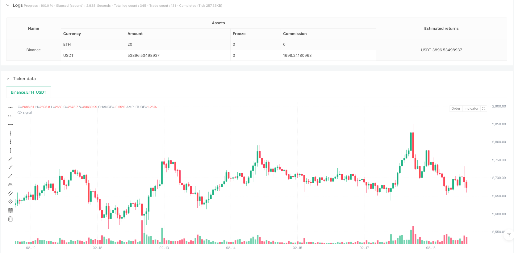
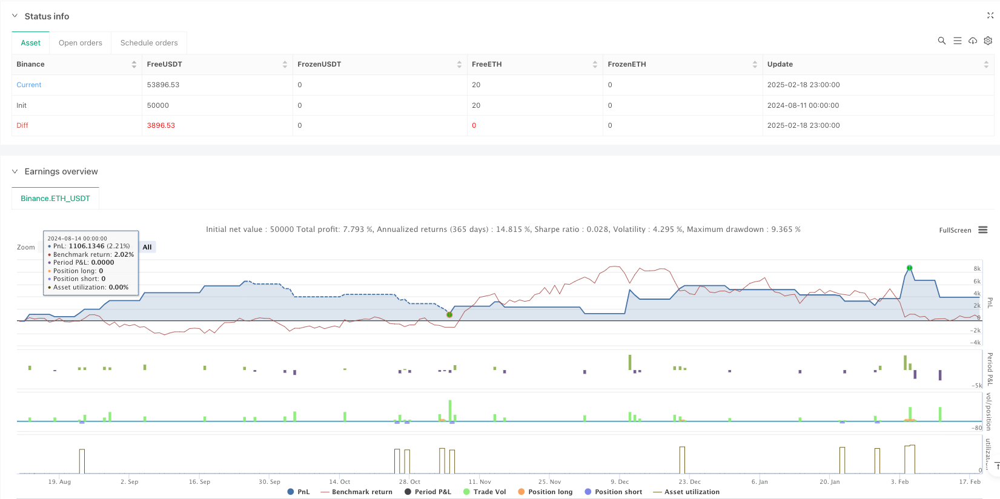

> Name

Three-Line-Strike-Momentum-Trend-Following-Strategy-with-ADX-Filter
> Author

ianzeng123

> Strategy Description





[trans]
#### Overview
This strategy is a trend following trading system based on three-line breakout patterns and ADX trend filtering. The strategy identifies the breakout pattern after three consecutive candles in the same direction, combines the ADX indicator to confirm the trend strength, and uses ATR to dynamically set the take-profit and stop-loss positions. This method not only ensures the reliability of entry signals, but also effectively controls risks.
#### Strategy Principle
The core logic of the strategy includes the following key elements:
1. Identification of three-line breakthrough patterns: The long pattern requires three consecutive negative lines followed by a large positive line breakthrough; the short pattern requires three consecutive positive lines followed by a large negative line breakthrough.
2. ADX trend strength confirmation: Use the ADX indicator to determine the current trend strength. A trading signal will be generated only when the ADX value exceeds the set threshold (default 25).
3. ATR dynamic take profit and stop loss: use the ATR value to dynamically calculate the take profit and stop loss positions, where the take profit is set to 2 times ATR and the stop loss is set to 1 times ATR.
4. Transaction execution logic: When the conditions for pattern recognition and trend strength are met, the system will automatically execute the position opening operation and set corresponding stop-profit and stop-loss orders at the same time.
#### Strategic Advantages
1. High signal reliability: Combined with double confirmation of price patterns and trend indicators, the reliability of trading signals is significantly improved.
2. Reasonable risk control: ATR is used to dynamically set stop-profit and stop-loss, which can adaptively adjust risk control parameters according to market volatility.
3. High degree of systematization: The strategy logic is clear and the parameters are highly adjustable, making it easy to conduct systematic transactions.
4. Strong adaptability: It can be applied to different markets and time periods, and has good universality.
#### Strategy Risk
1. False breakthrough risk: False breakthrough signals may appear in volatile markets, resulting in trading losses.
2. Slippage risk: Since the strategy uses market orders for entry, it may face significant slippage in markets with poor liquidity.
3. Parameter sensitivity: The strategy effect is sensitive to parameters such as ADX threshold and ATR cycle, and needs to be optimized for different markets.
4. Trend dependence: The strategy may not perform well in volatile markets and is more suitable for market environments with obvious trends.
#### Strategy optimization direction
1. Pattern recognition enhancement: More price pattern verification conditions can be added, such as considering the ratio of the body to the shadow line of the candle line.
2. Trend confirmation improvement: Other trend indicators such as MACD or moving average crossover can be introduced as auxiliary confirmation.
3. Optimization of stop-profit and stop-loss: ATR multiples can be dynamically adjusted according to different market characteristics, or trailing stop-loss methods can be used.
4. Trading time optimization: You can add trading time filtering to avoid trading during periods of greater market volatility.
#### Summary
The Three Line Breakout Momentum Trend Following Strategy is a complete trading system that combines classic price patterns and technical indicators. Through ADX trend filtering and ATR dynamic risk control, this strategy can better control risks while ensuring trading opportunities. Although there are some limitations, through reasonable parameter optimization and strategy improvement, this strategy has good practical application value. ||
#### Overview
This strategy is a trend-following trading system based on the Three-Line Strike pattern combined with ADX trend filtering. It identifies breakthrough patterns after three consecutive candlesticks in the same direction, confirms trend strength using the ADX indicator, and sets dynamic take-profit and stop-loss levels using ATR. This approach ensures both signal reliability and effective risk control.

#### Strategy Principles
The core logic includes several key elements:
1. Three-Line Strike Pattern Recognition: Bullish pattern requires three consecutive red candles followed by a larger green breakout candle; bearish pattern requires three consecutive green candles followed by a larger red breakout candle.
2. ADX Trend Strength Confirmation: Uses the ADX indicator to judge current trend strength, generating trading signals only when ADX value exceeds the set threshold (default 25).
3. ATR Dynamic Take-Profit and Stop-Loss: Uses ATR values to dynamically calculate take-profit and stop-loss positions, with TP set at 2x ATR and SL at 1x ATR.
4. Trade Execution Logic: When pattern recognition and trend strength conditions are met, the system automatically executes position opening and sets corresponding TP/SL orders.

#### Strategy Advantages
1. High Signal Reliability: Combines price patterns and trend indicators for dual confirmation, significantly improving trading signal reliability.
2. Reasonable Risk Control: Uses ATR for dynamic TP/SL setting, adapting risk control parameters to market volatility.
3. High Systematization: Clear strategy logic with adjustable parameters, suitable for systematic trading.
4. Strong Adaptability: Applicable to different markets and timeframes with good universality.

#### Strategy Risks
1. False Breakout Risk: May generate false breakout signals in ranging markets, leading to trading losses.
2. Slippage Risk: Due to market order entries, significant slippage may occur in less liquid markets.
3. Parameter Sensitivity: Strategy performance is sensitive to parameters like ADX threshold and ATR period, requiring optimization for different markets.
4. Trend Dependency: Strategy may underperform in ranging markets, more suitable for trending market conditions.

#### Strategy Optimization Directions
1. Pattern Recognition Enhancement: Add more price pattern validation conditions, such as considering candlestick body-to-wick ratios.
2. Trend Confirmation Improvement: Introduce additional trend indicators like MACD or moving average crossovers for auxiliary confirmation.
3. Take-Profit/Stop-Loss Optimization: Dynamically adjust ATR multipliers based on market characteristics or implement trailing stops.
4. Trading Time Optimization: Add trading time filters to avoid trading during highly volatile market periods.

#### Summary
The Three-Line Strike Momentum Trend Following Strategy is a complete trading system combining classical price patterns and technical indicators. Through ADX trend filtering and ATR dynamic risk control, this strategy maintains trading opportunities while effectively controlling risk. Despite some limitations, through proper parameter optimization and strategy improvements, this strategy has good practical application value.[/trans]


> Source (PineScript)

``` pinescript
/*backtest
start: 2024-08-11 00:00:00
end: 2025-02-19 00:00:00
period: 1h
basePeriod: 1h
exchanges: [{"eid":"Binance","currency":"ETH_USDT"}]
*/

// Copyright ...
// Based on the TMA Overlay by Arty, converted to a simple strategy example.
// Pine Script v5

//@version=5
strategy(title='3 Line Strike [TTF] - Strategy with ATR and ADX Filter',
     shorttitle='3LS Strategy [TTF]',
     overlay=true,
     initial_capital=100000,
     default_qty_type=strategy.percent_of_equity,
     default_qty_value=100,
     pyramiding=0)

// -----------------------------------------------------------------------------
//                               INPUTS
// -----------------------------------------------------------------------------

// ATR and ADX Inputs
atrLength = input.int(title='ATR Length', defval=14, group='ATR & ADX')
adxLength = input.int(title='ADX Length', defval=14, group='ATR & ADX')
adxThreshold = input.float(title='ADX Threshold', defval=25, group='ATR & ADX')

// ### 3 Line Strike
showBear3LS = input.bool(title='Show Bearish 3 Line Strike', defval=true, group='3 Line Strike',
     tooltip="Bearish 3 Line Strike (3LS-Bear) = 3 zelené sviečky, potom veľká červená sviečka (engulfing).")
showBull3LS = input.bool(title='Show Bullish 3 Line Strike', defval=true, group='3 Line Strike',
     tooltip="Bullish 3 Line Strike (3LS-Bull) = 3 červené sviečky, potom veľká zelená sviečka (engulfing).")

// -----------------------------------------------------------------------------
//                          CALCULATIONS
// -----------------------------------------------------------------------------

// Calculate ATR
atr = ta.atr(atrLength)

// Calculate ADX components manually
tr = ta.tr(true)
plusDM = ta.change(high) > ta.change(low) and ta.change(high) > 0 ? ta.change(high) : 0
minusDM = ta.change(low) > ta.change(high) and ta.change(low) > 0 ? ta.change(low) : 0
smoothedPlusDM = ta.rma(plusDM, adxLength)
smoothedMinusDM = ta.rma(minusDM, adxLength)
smoothedTR = ta.rma(tr, adxLength)

plusDI = (smoothedPlusDM / smoothedTR) * 100
minusDI = (smoothedMinusDM / smoothedTR) * 100

dx = math.abs(plusDI - minusDI) / (plusDI + minusDI) * 100
adx = ta.rma(dx, adxLength)

// Helper Functions
getCandleColorIndex(barIndex) =>
    int ret = na
    if (close[barIndex] > open[barIndex])
        ret := 1
    else if (close[barIndex] < open[barIndex])
        ret := -1
    else
        ret := 0
    ret

isEngulfing(checkBearish) =>
    sizePrevCandle = close[1] - open[1]
    sizeCurrentCandle = close - open
    isCurrentLargerThanPrevious = math.abs(sizeCurrentCandle) > math.abs(sizePrevCandle)

    if checkBearish
        isGreenToRed = (getCandleColorIndex(0) < 0) and (getCandleColorIndex(1) > 0)
        isCurrentLargerThanPrevious and isGreenToRed
    else
        isRedToGreen = (getCandleColorIndex(0) > 0) and (getCandleColorIndex(1) < 0)
        isCurrentLargerThanPrevious and isRedToGreen

isBearishEngulfing() => isEngulfing(true)
isBullishEngulfing() => isEngulfing(false)

is3LSBear() =>
    is3LineSetup = (getCandleColorIndex(1) > 0) and (getCandleColorIndex(2) > 0) and (getCandleColorIndex(3) > 0)
    is3LineSetup and isBearishEngulfing()

is3LSBull() =>
    is3LineSetup = (getCandleColorIndex(1) < 0) and (getCandleColorIndex(2) < 0) and (getCandleColorIndex(3) < 0)
    is3LineSetup and isBullishEngulfing()

// Signals
is3LSBearSig = is3LSBear() and adx > adxThreshold
is3LSBullSig = is3LSBull() and adx > adxThreshold

// Take Profit and Stop Loss
longTP = close + 2 * atr
longSL = close - 1 * atr
shortTP = close - 2 * atr
shortSL = close + 1 * atr

// -----------------------------------------------------------------------------
//                          STRATEGY ENTRY PRÍKAZY
// -----------------------------------------------------------------------------
if (showBull3LS and is3LSBullSig)
    strategy.entry("3LS_Bull", strategy.long, comment="3LS Bullish")
    strategy.exit("Exit Bull", from_entry="3LS_Bull", limit=longTP, stop=longSL)

if (showBear3LS and is3LSBearSig)
    strategy.entry("3LS_Bear", strategy.short, comment="3LS Bearish")
    strategy.exit("Exit Bear", from_entry="3LS_Bear", limit=shortTP, stop=shortSL)

```

> Detail

https://www.fmz.com/strategy/482921

> Last Modified

2025-02-20 17:46:30
