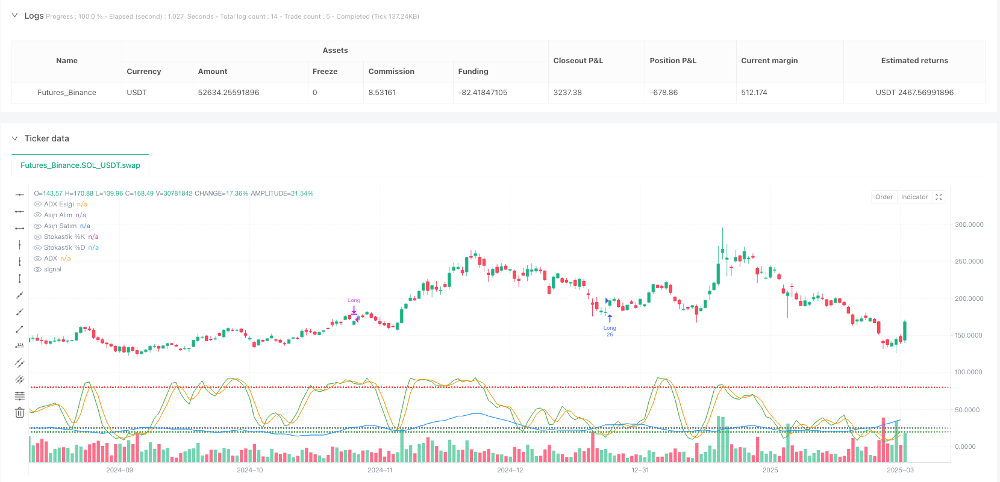
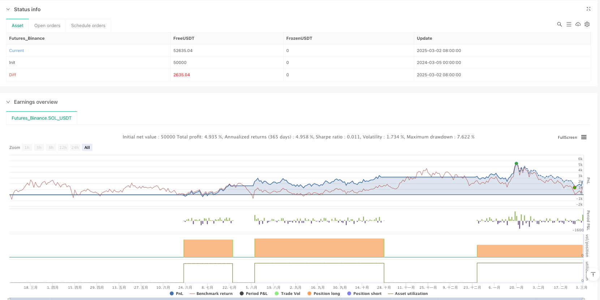

> Name

Trend Confirmation Stochastic-Oscillation-Strategy-Dynamic-Market-Identification-System-Combining-ADX-and-Stochastic-Indicators
> Author

ianzeng123

> Strategy Description





[trans]
#### Overview
The Trend Confirmation Stochastic Oscillator Strategy is a quantitative trading system that combines the Average Directional Index (ADX) and the Stochastic Oscillator. The core idea of ​​this strategy is to use the overbought and oversold areas of the stochastic indicator and the cross signals of the %K and %D lines to capture potential entry and exit points when a strong trend is confirmed. The strategy first uses ADX to confirm whether the market is in an obvious trend. When the ADX value exceeds the set threshold (default is 25), it indicates that the market has a strong enough trend; then it combines the upward crossing signal of the stochastic indicator in the oversold area as a buying condition, and the downward crossing signal in the overbought area as a selling condition. This combination method effectively filters out false signals in weak trend environments and improves the reliability of the strategy.
#### Strategy Principle
The core principle of this strategy is based on the synergy of two main indicators:
1. **Manual calculation of ADX (Average Directional Index)**:
   - Calculation of rising momentum (plusDM) and falling momentum (minusDM), and judging the direction of price movement by comparing the changes in high and low points on adjacent trading days
   - True volatility (TR) calculation, taking into account the current day's price range and the difference from the previous trading day's closing price
   - Average True Range (ATR) is calculated using Wilder's smoothed average method
   - Calculation and standardization of positive directional indicator (+DI) and negative directional indicator (-DI)
   - Directional index (DX) is calculated by the ratio of the difference and sum of +DI and -DI
   - The final ADX value is obtained by applying RMA (Wilder Smoothed Average) to the DX value
2. **Application of Stochastic Oscillator**:
   - %K line calculation is based on the relative position of the current closing price within a specific period range
   - The smooth %K line is processed by SMA smoothing to improve signal stability
   - The %D line serves as the moving average of the %K line to further smooth fluctuations
3. **Signal generation logic**:
   - Buy signal: When the ADX value is greater than the set threshold (25), a strong trend is confirmed, and the stochastic indicator is in the oversold area (K<20), and the %K line crosses the %D line
   - Sell signal: When the ADX value is greater than the set threshold, a strong trend is confirmed, and the stochastic indicator is in the overbought area (K>80), and the %K line crosses the %D line.
This design enables the strategy to capture overbought and oversold price reversal opportunities in a strong trend environment, effectively avoiding the risk of frequent trading in trendless or weak trend markets.
#### Strategic Advantages
An in-depth analysis of the code implementation of this strategy can summarize the following significant advantages:
1. **Trend Confirmation Filtering**: Filter out weak trend or volatile market signals through the ADX threshold (default 25), and only execute transactions when a clear trend is established, greatly reducing false signals in volatile markets.
2. **Accurate entry and exit timing**: Combined with the overbought and oversold areas and cross signals of the stochastic indicator, it can capture potential reversal points when the price reaches extreme positions, improving the accuracy of entry and exit.
3. **Highly customizable**: The strategy provides multiple adjustable parameters, including ADX cycle, trend intensity threshold, various parameters of the stochastic indicator and overbought and oversold levels. Users can optimize and adjust according to different market environments and personal preferences.
4. **Intuitive graphical display**: The strategy displays the ADX value and the %K and %D lines of the stochastic indicator on the chart, as well as the relevant threshold levels, making it easier for traders to intuitively understand the current market status and potential signals.
5. **Complete alarm system**: Integrated alarm condition settings, which can achieve seamless connection with third-party platforms (such as 3Commas) through Webhook to achieve automated transaction execution.
6. **Fund Management Mechanism**: The strategy uses the account net value percentage method for position management by default (default is 10%), providing a basic risk control mechanism.
7. **Manual implementation of technical indicators**: The ADX indicator uses manual calculation instead of directly calling library functions, which not only demonstrates the transparency of the calculation process, but also provides convenience for possible custom modifications.
#### Strategy Risk
Although this strategy has many advantages, there are still the following potential risks in practical application:
1. **Lagging response to trend turning points**: The ADX indicator itself is a lagging indicator and may not be able to capture the initial stage or turning point of the trend in time, resulting in delayed entry opportunities or missing part of the market. Solution: Consider combining more sensitive short-term price breakthrough indicators as auxiliary confirmation.
2. **Stochastic False Signal**: In a strong unidirectional trend, the stochastic indicator may remain in the overbought or oversold area for a long time, generating premature reversal signals. Solution: You can increase the position limit or introduce trend direction filter conditions.
3. **Parameter sensitivity**: Strategy performance is highly dependent on parameter settings, and different market environments may require different parameter combinations. Solution: It is recommended to conduct historical backtesting to find the optimal parameters for a specific market, or consider implementing an adaptive parameter approach.
4. **Lack of stop-loss mechanism**: The current strategy only has entry and exit conditions and no clear stop-loss mechanism. It may face large losses in extreme market environments. Solution: Add dynamic stop loss or fixed percentage stop loss conditions based on volatility.
5. **Single signal dependence**: The strategy only relies on the combined signals of ADX and stochastic indicators, lacking multi-angle market analysis. Solution: Volume indicators or other technical indicators can be introduced as additional confirmation conditions.
6. **Fighting Strong Trend Risk**: When the market is in a very strong one-way trend, reversal trading may face the risk of "going against the trend". Solution: Increase trend direction judgment and only take transactions in the direction of the trend.
#### Optimization direction
Based on the principles of the strategy and existing risks, the following are several optimization directions worth considering:
1. **Adaptive parameter system**: The ADX threshold and the overbought and oversold levels of the stochastic indicator are designed as adaptive parameters based on historical volatility, allowing the strategy to dynamically adjust sensitivity according to market conditions. This improvement can enable the strategy to maintain consistent performance in different market environments without requiring frequent manual adjustment of parameters.
2. **Trend direction filter**: Add trend direction judgment (such as using the relationship between +DI and -DI), so that the strategy only looks for long opportunities in the upward trend and short selling opportunities in the downward trend, avoiding the high risk of counter-trend operations.
3. **Multiple time frame analysis**: Introduce a trend confirmation mechanism with a higher time frame to ensure that the trading direction is consistent with the larger cycle trend and improve the winning rate.
4. **Dynamic Stop Loss System**: Design dynamic stop loss based on ATR or volatility to protect existing profits and limit the maximum loss risk of a single transaction.
5. **Trading volume confirmation**: Add trading volume analysis as a signal confirmation condition, and only execute transactions when supported by trading volume to avoid false signals in low liquidity environments.
6. **Entry Optimization**: Consider the batch opening strategy, allocate funds proportionally after the initial signal is triggered, and then increase the position as the price develops in a favorable direction to reduce the risk of single-point entry.
7. **Machine learning enhancement**: Introduce a simple machine learning model to classify and score historical signals, identify pattern features with high probability of success, and improve strategy selectivity.
8. **Trading Session Filter**: Increase trading session limits, avoid market periods with low liquidity or high volatility, and reduce risks caused by abnormal trends.
These optimization directions aim to improve the adaptability, robustness and long-term profitability of the strategy so that it can maintain relatively stable performance in various market environments.
#### Summary
The trend confirmation stochastic oscillation strategy combines the overbought and oversold characteristics of the ADX trend strength indicator and the stochastic indicator to build a complete trading system with both a trend confirmation mechanism and price extreme reversal signals. The core advantage of this strategy is that it can effectively filter noise signals in a weak trend environment, only execute transactions when an obvious trend is confirmed, and use the stochastic indicator to capture potential price reversal points.
The strategy implements the manual calculation process of the ADX indicator, demonstrates the mathematical principles behind technical indicators, and provides high flexibility and adaptability through parametric design. At the same time, the integrated alarm system facilitates automated docking with external trading platforms.
Although there are risks such as lag in trend judgment, false signals of the stochastic indicator, and lack of a perfect stop loss mechanism, these risks can be effectively managed through the recommended optimization directions, such as adaptive parameters, trend direction filtering, multi-time frame analysis, dynamic stop loss and other measures.
Overall, this strategy provides a framework that balances trend following and reversal trading, and is suitable for use in markets with clear trend characteristics. Through reasonable parameter adjustment and optimization improvements, it has the potential to become a robust trend trading system.
 ||
#### Overview
The Trend Confirmation Stochastic Oscillation Strategy is a quantitative trading system that combines the Average Directional Index (ADX) and the Stochastic Oscillator. The core concept of this strategy is to identify potential entry and exit points by using the overbought/oversold regions of the Stochastic indicator and the crossover signals between %K and %D lines, but only when a strong trend has been confirmed. The strategy first uses ADX to verify whether the market is in a significant trend, with an ADX value exceeding a set threshold (default 25) indicating sufficient trend strength. It then combines Stochastic indicator signals, using crossovers in the oversold region as buy conditions and crossovers in the overbought region as sell conditions. This combination method effectively filters out false signals in weak trend environments, improving the strategy's reliability.
#### Strategy Principles
The core principle of this strategy is based on the coordinated work of two main indicators:

1. **Manual Calculation of ADX (Average Directional Index)**:
   - Calculation of upward momentum (plusDM) and downward momentum (minusDM) by comparing high and low point changes between adjacent trading days
   - True Range (TR) calculation, considering the current day's price range and the difference from the previous day's closing price
   - Average True Range (ATR) calculation using Wilder's smoothing method
   - Calculation and standardization of Positive Directional Indicator (+DI) and Negative Directional Indicator (-DI)
   - Direction Index (DX) calculation through the ratio of the difference and sum of +DI and -DI
   - Final ADX value derived by applying RMA (Wilder's Moving Average) to the DX value

2. **Application of the Stochastic Oscillator**:
   - %K line calculation based on the relative position of the current closing price within a specific period range
   - Smoothed %K line through SMA processing, improving signal stability
   - %D line as a moving average of the %K line, further smoothing fluctuations

3. **Signal Generation Logic**:
   - Buy signal: When the ADX value is greater than the set threshold (25), confirming a strong trend, while the Stochastic indicator is in the oversold region (K<20), and the %K line crosses above the %D line
   - Sell signal: When the ADX value is greater than the set threshold, confirming a strong trend, while the Stochastic indicator is in the overbought region (K>80), and the %K line crosses below the %D line

This design enables the strategy to capture overbought/oversold reversal opportunities in price during strong trend environments, effectively avoiding the risk of frequent trading in trendless or weak trend markets.

#### Strategy Advantages
In-depth analysis of the strategy's code implementation reveals the following significant advantages:

1. **Trend Confirmation Filtering**: By using an ADX threshold (default 25) to filter out signals in weak trend or oscillating markets, the strategy only executes trades when a clear trend is established, significantly reducing false signals in oscillating markets.

2. **Precise Entry and Exit Timing**: By combining the overbought/oversold regions of the Stochastic indicator with crossover signals, the strategy can capture potential reversal points when prices reach extreme positions, improving the precision of entries and exits.

3. **High Customizability**: The strategy provides multiple adjustable parameters, including ADX period, trend strength threshold, various Stochastic indicator parameters, and overbought/oversold levels, allowing users to optimize and adjust according to different market environments and personal preferences.

4. **Intuitive Graphical Display**: The strategy displays ADX values and the Stochastic indicator's %K and %D lines on the chart, as well as relevant threshold levels, making it easy for traders to intuitively understand the current market status and potential signals.

5. **Comprehensive Alert System**: The strategy integrates alert condition settings, enabling seamless connection with third-party platforms (such as 3Commas) through Webhooks for automated trade execution.

6. **Capital Management Mechanism**: The strategy adopts a percentage of account equity approach for position management (default 10%), providing a basic risk control mechanism.

7. **Manual Implementation of Technical Indicators**: The ADX indicator uses manual calculation methods rather than directly calling library functions, not only demonstrating the transparency of the calculation process but also providing convenience for possible custom modifications.

#### Strategy Risks
Despite its many advantages, the strategy still has the following potential risks in practical application:

1. **Delayed Reaction to Trend Turning Points**: The ADX indicator itself is a lagging indicator and may not capture the initial phase or turning points of a trend in a timely manner, leading to delayed entry timing or missing part of the market movement. Solution: Consider incorporating more sensitive short-term price breakthrough indicators as auxiliary confirmation.

2. **False Signals from Stochastic Indicator**: In strong unidirectional trends, the Stochastic indicator may remain in overbought or oversold regions for extended periods, generating premature reversal signals. Solution: Add holding time restrictions or introduce trend direction filtering conditions.

3. **Parameter Sensitivity**: Strategy performance is highly dependent on parameter settings, and different market environments may require different parameter combinations. Solution: Recommend historical backtesting to find optimal parameters for specific markets, or consider implementing adaptive parameter methods.

4. **Lack of Stop-Loss Mechanism**: The current strategy only has entry and exit conditions without a clear stop-loss mechanism, potentially facing significant losses in extreme market environments. Solution: Add dynamic stop-loss based on volatility or fixed percentage stop-loss conditions.

5. **Single Signal Dependence**: The strategy relies solely on the combination of ADX and Stochastic indicator signals, lacking multi-angle market analysis. Solution: Introduce volume indicators or other technical indicators as additional confirmation conditions.

6. **Risk of Counter-Trend Trading**: When the market is in an extremely strong unidirectional trend, reversal trading may face the risk of "going against the trend." Solution: Add trend direction judgment, only taking trades in the direction of the trend.

#### Optimization Directions
Based on the principles of the strategy and existing risks, here are several optimization directions worth considering:

1. **Adaptive Parameter System**: Design the ADX threshold and the Stochastic indicator's overbought/oversold levels as adaptive parameters based on historical volatility, allowing the strategy to dynamically adjust sensitivity according to market conditions. This improvement can enable the strategy to maintain consistent performance in different market environments without frequent manual parameter adjustments.

2. **Trend Direction Filtering**: Add trend direction judgment (such as using the relationship between +DI and -DI), making the strategy only look for long opportunities in uptrends and short opportunities in downtrends, avoiding the high risk of counter-trend operations.

3. **Multi-Timeframe Analysis**: Introduce higher timeframe trend confirmation mechanisms to ensure that the trading direction aligns with larger cycle trends, improving win rates.

4. **Dynamic Stop-Loss System**: Design dynamic stop-losses based on ATR or volatility to protect existing profits and limit the maximum loss risk of single trades.

5. **Volume Confirmation**: Add volume analysis as a signal confirmation condition, only executing trades when supported by volume, avoiding false signals in low liquidity environments.

6. **Entry Optimization**: Consider a phased position building strategy, allocating funds proportionally after the initial signal triggers, and increasing positions as prices develop in a favorable direction, reducing single-point entry risk.

7. **Machine Learning Enhancement**: Introduce simple machine learning models to classify and score historical signals, identifying pattern features with high probability of success, improving strategy selectivity.

8. **Trading Session Filter**: Add trading session restrictions to avoid low liquidity or high volatility market sessions, reducing risks brought by abnormal price movements.

These optimization directions aim to improve the strategy's adaptability, robustness, and long-term profitability, enabling it to maintain relatively stable performance in various market environments.

#### Conclusion
The Trend Confirmation Stochastic Oscillation Strategy constructs a complete trading system with both trend confirmation mechanisms and price extreme reversal signals by combining the ADX trend strength indicator and the overbought/oversold characteristics of the Stochastic indicator. The core advantage of this strategy lies in its ability to effectively filter noise signals in weak trend environments, only executing trades when a clear trend is confirmed, and using the Stochastic indicator to capture potential price reversal points.

The strategy implements the manual calculation process of the ADX indicator, showcasing the mathematical principles behind technical indicators, and provides high flexibility and adaptability through parameterized design. At the same time, the integrated alert system facilitates automated connection with external trading platforms.

Although there are risks such as lagging trend judgment, false signals from the Stochastic indicator, and lack of a comprehensive stop-loss mechanism, these risks can be effectively managed through the suggested optimization directions, such as adaptive parameters, trend direction filtering, multi-timeframe analysis, and dynamic stop-losses.

Overall, this strategy provides a framework that balances trend following and reversal trading, suitable for application in markets with clear trend characteristics. Through reasonable parameter adjustments and optimization improvements, it has the potential to become a robust trend trading system.
[/trans]


> Source (PineScript)

``` pinescript
/*backtest
start: 2024-03-05 00:00:00
end: 2025-03-03 08:00:00
period: 1d
basePeriod: 1d
exchanges: [{"eid":"Futures_Binance","currency":"SOL_USDT"}]
*/

//@version=5
strategy("MY3 ADX+Stokastik", overlay=true, initial_capital=10000, default_qty_type=strategy.percent_of_equity, default_qty_value=10)

// ADX Parametreleri
adxPeriod    = input.int(14, title="ADX Periyodu", minval=1)
adxThreshold = input.float(25.0, title="Trend Gücü Eşiği", step=0.1)

// Stokastik Parametreleri
stochKPeriod    = input.int(14, title="Stokastik %K Periyodu", minval=1)
stochSmoothK    = input.int(3, title="Stokastik Smooth", minval=1)
stochDPeriod    = input.int(3, title="Stokastik %D Periyodu", minval=1)
stochOverbought = input.int(80, title="Aşırı Alım Seviyesi", minval=50)
stochOversold   = input.int(20, title="Aşırı Satım Seviyesi", maxval=50)

// ADX Hesaplaması (Manuel)
// Hesaplamada kullanılan temel unsurlar
upMove   = high - high[1]
downMove = low[1] - low
plusDM  = (upMove > downMove and upMove > 0) ? upMove : 0.0
minusDM = (downMove > upMove and downMove > 0) ? downMove : 0.0

// True Range hesaplaması
tr0 = high - low
tr1 = math.abs(high - close[1])
tr2 = math.abs(low - close[1])
trueRange = math.max(math.max(tr0, tr1), tr2)

// ATR hesaplaması: Wilder'in Yumuşak Ortalaması
atrValue = ta.rma(trueRange, adxPeriod)
plusDI   = 100 * ta.rma(plusDM, adxPeriod) / atrValue
minusDI  = 100 * ta.rma(minusDM, adxPeriod) / atrValue
dx       = 100 * math.abs(plusDI - minusDI) / (plusDI + minusDI)
adxValue = ta.rma(dx, adxPeriod)

// Stokastik Hesaplaması
k = ta.sma(ta.stoch(close, high, low, stochKPeriod), stochSmoothK)
d = ta.sma(k, stochDPeriod)

// Alım ve Satım Koşulları:
// Alım: ADX belirlenen eşik üzerinde ve Stokastik, aşırı satım bölgesinde (k < stochOversold) iken %K, %D kesişimi yukarı doğru.
buySignal = (adxValue > adxThreshold) and ta.crossover(k, d) and (k < stochOversold)
// Satım: ADX belirlenen eşik üzerinde ve Stokastik, aşırı alım bölgesinde (k > stochOverbought) iken %K, %D kesişimi aşağı doğru.
sellSignal = (adxValue > adxThreshold) and ta.crossunder(k, d) and (k > stochOverbought)

// İşlem Emirleri
if (buySignal)
    strategy.entry("Long", strategy.long)
if (sellSignal)
    strategy.close("Long")

// Göstergelerin Grafik Üzerinde Gösterimi
plot(adxValue, color=color.blue, title="ADX")
hline(adxThreshold, color=color.gray, linestyle=hline.style_dotted, title="ADX Eşiği")
plot(k, color=color.green, title="Stokastik %K")
plot(d, color=color.orange, title="Stokastik %D")
hline(stochOverbought, color=color.red, linestyle=hline.style_dotted, title="Aşırı Alım")
hline(stochOversold, color=color.green, linestyle=hline.style_dotted, title="Aşırı Satım")

// 3Commas için Uyarı Koşulları (Webhook entegrasyonu için kullanılacak)
alertcondition(buySignal, title="Alım Uyarısı", message="BUY_SIGNAL")
alertcondition(sellSignal, title="Satım Uyarısı", message="SELL_SIGNAL")

```

> Detail

https://www.fmz.com/strategy/484911

> Last Modified

2025-03-05 09:42:05
