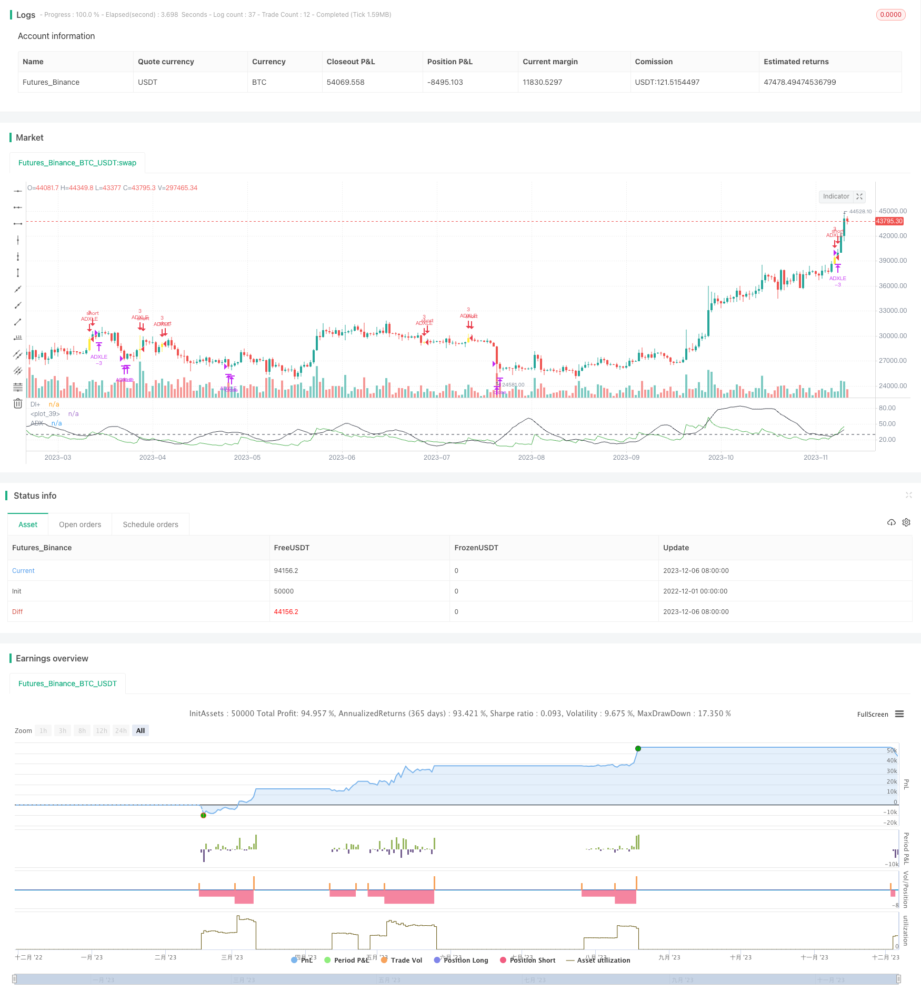

> Name

Trend Index Average Crossover ADX Trading Strategy ADX-Crossover-Trend-Trading-Strategy
> Author

ChaoZhang

> Strategy Description


[trans]

## Overview
This strategy combines the use of the Moving Average (ADX) indicator and the Upward Movement Index (DI+) to provide a basis for judging market direction and trends. It also uses fast and slow moving averages to determine the trading direction and holding time. It is a trend-following trading strategy. This strategy can effectively capture short- and medium-term reversal points, and performs better in markets with low volatility and obvious trends.
## Principle
The core logic of this strategy is that when the +DI line breaks through ADX from below, a buy signal is generated, and when the +DI line falls below ADX from above, a sell signal is generated. Therefore, this strategy relies on the crossover between the DI and ADX indicators to determine market trends and reversal points. At the same time, the relationship between fast and slow moving averages is used to judge the overall market trend. Only when the fast EMA is higher than the slow EMA will a trading signal be considered.
Specifically, a buy signal is issued when the following conditions are met:
1. Fast EMA is higher than slow EMA
2. The +DI line breaks through the ADX line from below
3. ADX value is lower than the threshold level of 30
A sell signal is issued when the following conditions are met:
1. ADX value is higher than the threshold level of 30
2. The +DI line falls below the ADX line from above
This strategy also adds stop-loss logic, which will exit all positions when the price is lower than the stop-loss price.
## Advantages
This strategy combines DI, ADX and moving average indicators to effectively determine the turning point of market trends. Has the following advantages:
1. Use DI and ADX indicators to determine trend reversal signals and accurately locate entry and exit points.
2. The fast and slow EMA filtering system provides general trend judgment and avoids wrong transactions.
3. Use the ADX value to determine the strength of the trend and only trade when the trend is weak to avoid the risk of false breakthroughs.
4. Add a stop-loss mechanism to control downside risks
5. Strict entry conditions to avoid the risks of high buying and agiri selling
6. Clear exit conditions, timely stop loss and take profit
## Risk
There are also some risks to be aware of with this strategy:
1. The ADX indicator has hysteresis and may miss the best time for price reversal.
2. When the market fluctuates greatly, ADX and DI indicators will produce more false signals
3. Improper setting of fast and slow moving averages may lead to missed trading opportunities or incorrect filtering of signals.
4. The stop-loss price setting is too loose and cannot effectively control risks.
To address these risks, improvements can be made by optimizing ADX and moving average parameters, adjusting stop loss levels, and combining other indicators to confirm signals.
## Optimization direction
There is room for further optimization of this strategy:
1. You can test ADX with different length periods to find the best parameter combination
2. You can add other indicators, such as RSI, Bollinger Bands, etc. to confirm trading signals
3. Can automatically optimize parameter combinations and trading rules based on machine learning algorithms
4. You can hedge late trading risks by dynamically adjusting stop loss levels
5. A multi-factor scoring model can be established to make entry and exit rules more robust
## Summarize
The ADX cross trend strategy is relatively stable overall and can effectively capture the reversal space in the early stage of fluctuations, but attention needs to be paid to controlling risks. By further optimizing parameter settings and strict entry and stop loss rules, better risk-adjusted returns can be obtained. This strategy is suitable for long-term holding and short-term trading accounts.
|| 

## Overview  

This strategy combines Directional Movement Index (ADX), Plus Directional Indicator (DI+) and fast and slow moving averages to determine market direction and holding period. It belongs to trend-following trading strategies. The strategy can effectively capture reversal points on medium and short terms and performs well in low volatility and obvious trending markets.   

## Principles  

The core logic of this strategy is to generate buy signals when the +DI line crosses above the ADX line from the bottom up, and generate sell signals when the +DI line crosses below the ADX line from the top down. Therefore, this strategy relies on the crossover between DI and ADX to determine market trends and reversal points. At the same time, the relationship between fast and slow moving averages is used to determine the overall market trend. Trading signals will only be considered when the fast EMA is above the slow EMA.

Specifically, a buy signal will be triggered when the following conditions are met:  
1. Fast EMA is above slow EMA
2. +DI line crosses ADX line upward  
3. ADX value is below 30 threshold   

A sell signal will be triggered when the following conditions are met:
1. ADX value exceeds 30 threshold  
2. +DI line crosses ADX line downward

The strategy also incorporates stop loss logic to exit all positions when the price falls below the stop loss level.  

## Advantages

The strategy combines DI, ADX and moving average indicators to effectively determine turns in market trends. The main advantages are:

1. Utilize DI and ADX crossovers to accurately determine entry and exit points  
2. Fast and slow EMA filter system to determine overall market trend, avoiding bad trades
3. Use ADX values to determine trend strength, only trading when trend is weak, avoiding false breakouts  
4. Incorporate stop loss mechanism to control downside risk 
5. Strict entry conditions avoid buying tops and selling bottoms
6. Clear exit rules allow for timely stop losses and profit taking

## Risks  

There are some risks to note with this strategy:
  
1. ADX indicator has lagging effect, could miss best timing for price reversals
2. More false signals may occur when market volatility is high  
3. Improper fast and slow EMA settings could lead to missing trades or filtering valid signals 
4. Stop loss level set too wide fails to effectively control risk

These risks can be addressed through optimizing ADX and moving average parameters, adjusting stop loss level, adding filters for confirmation etc.

## Enhancement Opportunities

There is room for further enhancements:
  
1. Test ADX of different length periods to find optimal combinations  
2. Add other indicators like RSI, Bollinger Bands for signal confirmation   
3. Utilize machine learning algorithms to automatically optimize parameters and rules
4. Dynamically adjust stop loss levels to mitigate late stage risks 
5. Build multifactor scoring model to make entry and exit criteria more robust

## Conclusion  

In general this ADX crossover trend strategy is quite stable, able to effectively capture reversals early on, but risk control is critical. Further optimizing parameters, strictly following entry rules and stop loss can lead to good risk-adjusted returns. The strategy suits long-term accounts holding medium to short term positions.

[/trans]

> Strategy Arguments


|Argument|Default|Description|
|----|----|----|
|v_input_1|11|ADX Length|
|v_input_2|30|threshold|
|v_input_3|13|Fast EMA|
|v_input_4|55|Slow EMA|
|v_input_5|8|Stop Loss|


> Source (PineScript)

``` pinescript
/*backtest
start: 2022-12-01 00:00:00
end: 2023-12-07 00:00:00
period: 1d
basePeriod: 1h
exchanges: [{"eid":"Futures_Binance","currency":"BTC_USDT"}]
*/

// This source code is subject to the terms of the Mozilla Public License 2.0 at https://mozilla.org/MPL/2.0/
// © mohanee

//@version=4
//ADX strategy
SmoothedTrueRange=0.00
SmoothedDirectionalMovementPlus=0.00
SmoothedDirectionalMovementMinus=0.00


strategy(title="ADX strategy", overlay=false,pyramiding=3, default_qty_type=strategy.fixed, default_qty_value=3,    initial_capital=10000, currency=currency.USD)

len = input(11, title="ADX Length", minval=1)
threshold = input(30, title="threshold", minval=5)

fastEma=input(13, title="Fast EMA",minval=1, maxval=50)
slowEma=input(55, title="Slow EMA",minval=10, maxval=200)
stopLoss =input(8, title="Stop Loss",minval=1)   //


TrueRange = max(max(high-low, abs(high-nz(close[1]))), abs(low-nz(close[1])))
DirectionalMovementPlus = high-nz(high[1]) > nz(low[1])-low ? max(high-nz(high[1]), 0): 0
DirectionalMovementMinus = nz(low[1])-low > high-nz(high[1]) ? max(nz(low[1])-low, 0): 0


SmoothedTrueRange:= nz(SmoothedTrueRange[1]) - (nz(SmoothedTrueRange[1])/len) + TrueRange

SmoothedDirectionalMovementPlus := nz(SmoothedDirectionalMovementPlus[1]) - (nz(SmoothedDirectionalMovementPlus[1])/len) + DirectionalMovementPlus
SmoothedDirectionalMovementMinus:= nz(SmoothedDirectionalMovementMinus[1]) - (nz(SmoothedDirectionalMovementMinus[1])/len) + DirectionalMovementMinus

DIPlus = SmoothedDirectionalMovementPlus / SmoothedTrueRange * 100
DIMinus = SmoothedDirectionalMovementMinus / SmoothedTrueRange * 100
DX = abs(DIPlus-DIMinus) / (DIPlus+DIMinus)*100
ADX = sma(DX, len)

plot(DIPlus, color=color.green, title="DI+")
//plot(DIMinus, color=color.red, title="DI-")
plot(ADX, color=color.black, title="ADX")
hline(threshold, color=color.black, linestyle=hline.style_dashed)

fastEmaVal=ema(close,fastEma)
slowEmaVal=ema(close,slowEma)


//long condition
longCondition=  ADX < threshold  and crossover(DIPlus,ADX)  and fastEmaVal > slowEmaVal


barcolor(longCondition ? color.yellow: na)

strategy.entry(id="ADXLE", long=true,  when= longCondition  and strategy.position_size<1) 

barcolor(strategy.position_size>1 ? color.blue: na)
bgcolor(strategy.position_size>1 ? color.blue: na)


//Add
strategy.entry(id="ADXLE", comment="Add", long=true,  when= strategy.position_size>1 and close<strategy.position_avg_price and crossover(DIPlus,ADX) ) 


//calculate stop Loss
stopLossVal =  strategy.position_avg_price -  (strategy.position_avg_price*stopLoss*0.01)

strategy.close(id="ADXLE",comment="SL Exit",    when=close<stopLossVal)   //close all on stop loss


//exit condition
exitCondition=  ADX > threshold  and crossunder(DIPlus,ADX) // and fastEmaVal > slowEmaVal
strategy.close(id="ADXLE",comment="TPExitAll",    qty=strategy.position_size ,   when= exitCondition)   //close all     
```

> Detail

https://www.fmz.com/strategy/434707

> Last Modified

2023-12-08 15:49:12
