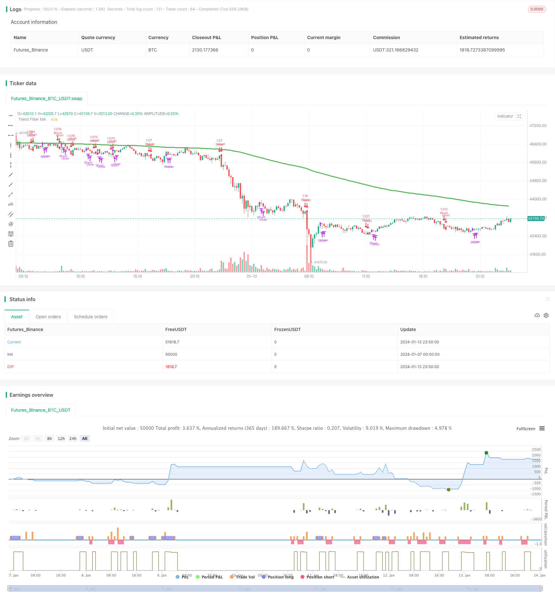

> Name

ADX Dynamic Average Trend Indicator Strategy ADX-Dynamic-Trend-Strategy
> Author

ChaoZhang

> Strategy Description


 [trans]

## Overview
The ADX dynamic average trend indicator strategy is a quantitative trading strategy that uses the ADX indicator to determine the strength and direction of the market trend. This strategy determines whether there is a trend in the market by calculating the average directional index (ADX), and determines the direction of the trend by calculating the positive indicator (DI+) and negative indicator (DI-), thereby generating buy and sell signals.
## Strategy Principle
This strategy first uses the ADX indicator to determine whether there is a trend in the market. ADX is higher than the key value set by the user (default is 23), indicating a strong market trend. When the current value of ADX is higher than the value of ADX n days before (n is the number of lookback days set by the user, the default is 3 days), it means that ADX is rising and the market trend is forming.
The strategy then uses DI+ and DI- to determine the direction of the market trend. When DI+ is higher than DI-, it means the market is in an upward trend; when DI+ is lower than DI-, it means the market is in a downward trend.
Finally, the strategy comprehensively judges the situation of ADX and DI and generates specific buy and sell signals:
1. When ADX rises, is higher than the key value, and DI+ is higher than DI-, a buy signal is generated
2. When ADX rises, is higher than the key value, and DI+ is lower than DI-, a sell signal is generated
3. When ADX turns downward, a closing signal is generated
The strategy also provides functions such as moving average filtering and customized backtesting time ranges, which can be configured as needed.
## Advantage Analysis
The ADX dynamic average trend indicator strategy has the following advantages:
1. Can automatically determine the existence of market trends and avoid invalid transactions
2. Can automatically determine the market trend direction and conduct trend tracking
3. Provide clear logic for buying when the trend exists/closing when the trend disappears
4. Configurable moving average for filtering to avoid false breakthroughs
5. Configurable backtest time range for historical testing
6. Indicators and parameters are adjustable and can be optimized for different varieties.
## Risk Analysis
There are also some risks with this strategy:
1. The ADX indicator lags behind and may miss early opportunities in the trend.
2. Long and short judgments rely on the DI indicator. The DI indicator is sensitive and may produce erroneous signals.
3. Moving average filtering may miss short-term opportunities
4. Improper backtest time range may lead to overfitting
5. Improper setting of indicator parameters may affect the strategy effect.
To reduce risk, consider the following:
1. Appropriately shorten the ADX parameters to reduce lag
2. Adjust or delete DI filtering to prevent false signals
3. Appropriately shorten the moving average period
4. Expand the backtest time range and conduct full sample testing
5. Optimize indicator parameters and find the best settings
## Optimization direction
This strategy can be optimized from the following aspects:
1. Combine multiple stocks for portfolio testing to diversify single stock risks
2. Add stop loss logic to control single loss
3. Combine with other indicators for combined verification to improve signal accuracy
4. Introduce machine learning algorithms to determine buying and selling signals
5. Add automatic parameter optimization module to realize dynamic parameter adjustment
## Summarize
The ADX dynamic average trend indicator strategy uses ADX to determine the existence of the trend and DI to determine the direction of the trend. It generates trading signals when the trend exists, and the strategy idea is clear. This strategy can automatically determine trends, track trends, and avoid invalid transactions in non-trending markets to a certain extent. With certain optimization, this strategy can become a powerful tool for medium and long-term quantitative trading.
|| 

## Overview

The ADX Dynamic Trend Strategy is a quantitative trading strategy that utilizes the ADX indicator to determine the strength and direction of market trends. It generates buy and sell signals by calculating the Average Directional Index (ADX) to judge if a trend exists in the market and by calculating the Positive Directional Indicator (DI+) and Negative Directional Indicator (DI-) to determine the direction of the trend.

## Trading Logic

The strategy first uses the ADX indicator to determine if a trend exists in the market. When ADX is above a user-defined key level (default 23), it signals that the market trend is relatively strong. When the current ADX value is higher than the ADX value n days ago (n is the user-defined lookback period, default 3 days), it signals that ADX is rising and a trend is forming in the market.  

The strategy then utilizes DI+ and DI- to determine the direction of the market trend. When DI+ is higher than DI-, it signals an uptrend in the market. When DI+ is lower than DI-, it signals a downtrend in the market.

Finally, the strategy combines the ADX and DI analysis to generate specific buy and sell signals:  

1. When ADX rises and is above key level and DI+ is higher than DI-, a buy signal is generated
2. When ADX rises and is above key level and DI+ is lower than DI-, a sell signal is generated  
3. When ADX turns to decrease, a flatten position signal is generated

The strategy also provides features like moving average filtering and customizable backtesting time range.

## Advantage Analysis

The ADX Dynamic Trend Strategy has the following advantages:

1. Automatically detect the existence of market trends, avoiding ineffective trading
2. Automatically determine the direction of market trends for trend following
3. Clear logic of buying on trend existence and flattening on trend disappearance  
4. Configurable moving average filtering avoids false breakouts
5. Customizable backtesting time range for historical testing
6. Adjustable indicator parameters for optimization across different products

## Risk Analysis  

The strategy also has some risks:

1. ADX indicator has lagging effect, possibly missing early trend opportunities
2. Trend direction reliance on DI may produce false signals as DI is sensitive
3. Moving average filter may miss short-term opportunities  
4. Improper backtesting time frame may cause overfitting
5. Improper indicator parameters may affect strategy performance

To mitigate risks, the following can be considered:

1. Shorten ADX parameters to reduce lagging 
2. Remove or adjust DI filter to prevent false signals
3. Shorten moving average period  
4. Expand backtesting time frame for full sample testing
5. Optimize parameters to find best settings

## Enhancement Opportunities

The strategy can be enhanced from the following aspects:

1. Portfolio testing across multiple stocks to diversify single-stock risk
2. Add stop loss logic to control per trade loss
3. Combine with other indicators for signal verification to improve accuracy 
4. Introduce machine learning algorithms for buy/sell signal generation
5. Add auto parameter tuning module for dynamic adjustment

## Conclusion

The ADX Dynamic Trend Strategy utilizes ADX to determine trend existence and DI for trend direction. It generates trading signals when a trend exists and flattens positions when the trend disappears. The logic is clear. By automatically detecting and tracking trends, ineffective trading can be avoided to some extent in non-trending markets. With proper enhancement, this strategy can become a powerful tool for medium-to-long term quantitative trading.

[/trans]

> Strategy Arguments


|Argument|Default|Description|
|----|----|----|
|v_input_1|2019|From Year|
|v_input_2|true|From Month|
|v_input_3|true|From Day|
|v_input_4|9999|To Year|
|v_input_5|true|To Month|
|v_input_6|true|To Day|
|v_input_7|14|ADX Smoothing|
|v_input_8|14|DI Period|
|v_input_9|23|Keylevel for ADX|
|v_input_10|3|Lookback Period for Slope|
|v_input_11|true|Use MA for Filtering?|
|v_input_12|0|MA Type For Filtering: EMA|SMA|
|v_input_13|200|MA Period for Filtering|


> Source (PineScript)

``` pinescript
/*backtest
start: 2024-01-07 00:00:00
end: 2024-01-14 00:00:00
period: 10m
basePeriod: 1m
exchanges: [{"eid":"Futures_Binance","currency":"BTC_USDT"}]
*/

//@version=4
// This source code is subject to the terms of the Mozilla Public License 2.0 at https://mozilla.org/MPL/2.0/
// © millerrh with inspiration from @9e52f12edd034d28bdd5544e7ff92e 
//The intent behind this study is to look at ADX when it has an increasing slope and is above a user-defined key level (23 default). 
//This is to identify when it is trending.
//It then looks at the DMI levels.  If D+ is above D- and the ADX is sloping upwards and above the key level, it triggers a buy condition.  Opposite for short.
//Can use a user-defined moving average to filter long/short if desried.
// NOTE: THIS IS MEANT TO BE USED IN CONJUNCTION WITH MY "ATX TRIGGER" INDICATOR FOR VISUALIZATION. MAKE SURE SETTINGS ARE THE SAME FOR BOTH.

strategy("ADX | DMI Trend", overlay=true, initial_capital=10000, currency='USD', 
   default_qty_type=strategy.percent_of_equity, default_qty_value=100, commission_type=strategy.commission.percent, commission_value=0.04)

// === BACKTEST RANGE ===
From_Year  = input(defval = 2019, title = "From Year")
From_Month = input(defval = 1, title = "From Month", minval = 1, maxval = 12)
From_Day   = input(defval = 1, title = "From Day", minval = 1, maxval = 31)
To_Year    = input(defval = 9999, title = "To Year")
To_Month   = input(defval = 1, title = "To Month", minval = 1, maxval = 12)
To_Day     = input(defval = 1, title = "To Day", minval = 1, maxval = 31)
Start  = timestamp(From_Year, From_Month, From_Day, 00, 00)  // backtest start window
Finish = timestamp(To_Year, To_Month, To_Day, 23, 59)        // backtest finish window

// == INPUTS ==
// ADX Info
adxlen = input(14, title="ADX Smoothing")
dilen = input(14, title="DI Period")
keyLevel = input(23, title="Keylevel for ADX")
adxLookback = input(3, title="Lookback Period for Slope")

// == FILTERING ==
// Inputs
useMaFilter = input(title = "Use MA for Filtering?", type = input.bool, defval = true)
maType = input(defval="EMA", options=["EMA", "SMA"], title = "MA Type For Filtering")
maLength   = input(defval = 200, title = "MA Period for Filtering", minval = 1)

// Declare function to be able to swap out EMA/SMA
ma(maType, src, length) =>
    maType == "EMA" ? ema(src, length) : sma(src, length) //Ternary Operator (if maType equals EMA, then do ema calc, else do sma calc)
maFilter = ma(maType, close, maLength)
plot(maFilter, title = "Trend Filter MA", color = color.green, linewidth = 3, style = plot.style_line, transp = 50)

// Check to see if the useMaFilter check box is checked, this then inputs this conditional "maFilterCheck" variable into the strategy entry 
maFilterCheck = if useMaFilter == true
    maFilter
else
    close

// == USE BUILT-IN DMI FUNCTION TO DETERMINE ADX AND BULL/BEAR STRENGTH
[diplus, diminus, adx] = dmi(dilen, adxlen)

buySignal = (adx[0]-adx[adxLookback] > 0) and adx > keyLevel and diplus > diminus  and close >= maFilterCheck
// buySignalValue = valuewhen(buySignal, close, 0)
shortSignal = (adx[0]-adx[adxLookback] > 0) and adx > keyLevel and diplus < diminus  and close <= maFilterCheck
// shortSignalValue = valuewhen(shortSignal, close, 0)
sellCoverSignal = adx[0]-adx[adxLookback] < 0

// == ENTRY & EXIT CRITERIA
// Triggers to be TRUE for it to fire of the BUY Signal : (opposite for the SELL signal).
// (1): Price is over the 200 EMA line. (EMA level configurable by the user)
// (2): "D+" is OVER the "D-" line
// (3): RSI 7 is under 30 (for SELL, RSI 7 is over 70)
// 1* = The ultimate is to have a combination line of 3 EMA values, EMA 14, EMA 50 and EMA 200 - And if price is over this "combo" line, then it's a strong signal

// == STRATEGY ENTRIES/EXITS == 
strategy.entry("Long", strategy.long, when = buySignal)
strategy.close("Long", when = sellCoverSignal)
strategy.entry("Short", strategy.short, when = shortSignal)
strategy.close("Short", when = sellCoverSignal)
    
// == ALERTS == 
// alertcondition(buySignal, title='ADX Trigger Buy', message='ADX Trigger Buy')
// alertcondition(sellSignal, title='ADX Trigger Sell', message='ADX Trigger Sell')
```

> Detail

https://www.fmz.com/strategy/438826

> Last Modified

2024-01-15 15:32:45
