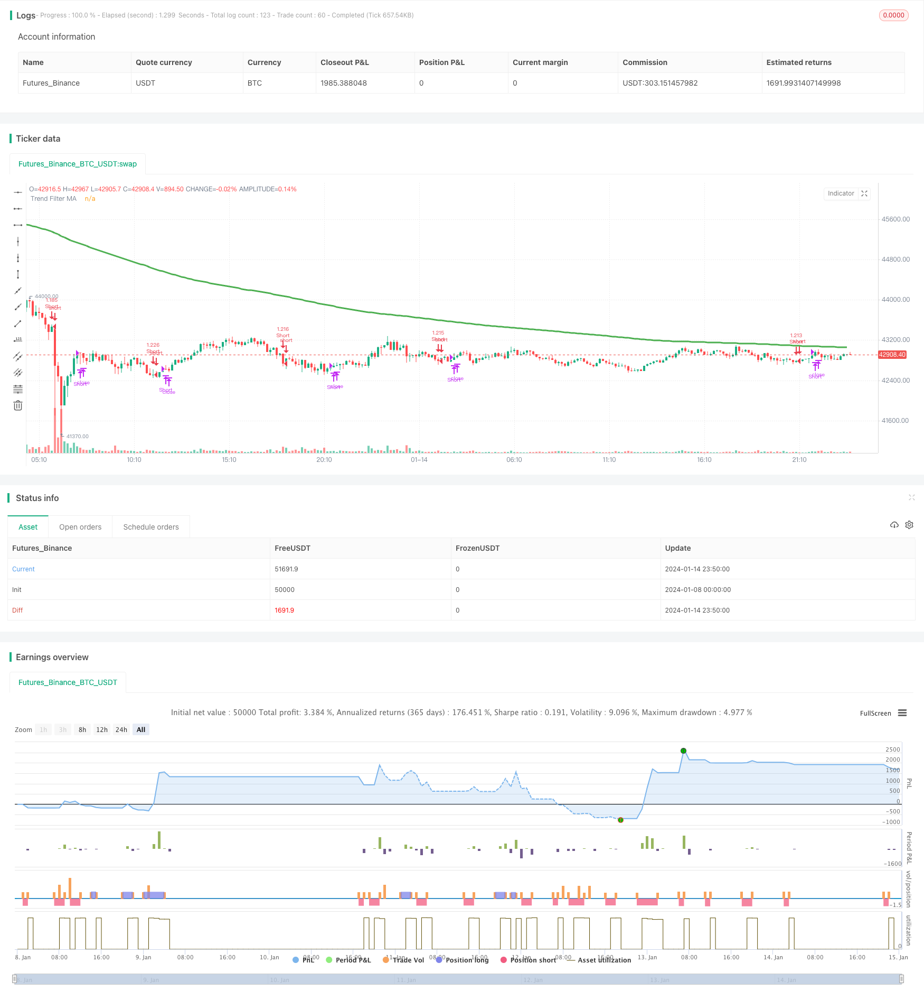

> Name

ADX Momentum Trend Strategy ADX-Momentum-Trend-Strategy
> Author

ChaoZhang

> Strategy Description



[trans]
## Overview
This strategy determines the market trend based on the ADX indicator, combines the DMI indicator to determine the long and short direction, uses the ADX slope to determine the strength of the trend, sets the ADX key value to filter non-trending markets, and assists the moving average to filter trading signals.
## Strategy Principle
1. Calculate ADX, DI+, DI- indicators.
2. ADX slope > 0, indicating an increasing trend; the key value is set to 23, which is used to filter non-trending markets.
3. DI+ is higher than DI-, indicating that the power of bulls is greater than the power of shorts, which is a bullish signal.
4. When moving average filtering is enabled, a long signal will only be generated when the closing price is higher than the moving average.
5. Close the position when ADX slope <0, indicating that the trend has subsided.
## Advantage Analysis
1. Auxiliary MA filtering can reduce noise trading in non-trending markets. 
2. ADX slope judgment strength can accurately judge the development of the trend.
3. DI judgment direction and ADX judgment strength form a relatively complete trend trading decision-making system.  
4. Drawbacks and P/L ratios are expected to outperform simple moving average strategies.
## Risk Analysis
1. If the ADX indicator sets different parameters, the results will be quite different.
2. Before DMI has fully determined the long and short direction, it may send out wrong signals.  
3. There is a certain lag, which reduces the efficiency of the strategy.
## Optimization direction
1. Optimize the ADX parameter combination and find the best parameters.  
2. Add a stop-loss strategy to avoid the expansion of a single loss.
3. Try filtering signals in combination with other indicators. For example, RSI, Bollinger Bands.
## Summarize
This strategy makes full use of ADX's advantages in judging trends and trend strength, and cooperates with the DMI indicator to judge the direction to form a complete trend tracking system. At the same time, the auxiliary moving average can effectively filter out the noise in non-trending markets. Parameter optimization and indicator combination can further improve strategy stability and efficiency. Generally speaking, this strategy combines the characteristics of trend judgment and direction judgment and is expected to obtain good returns.
||

## Overview  

This strategy uses the ADX indicator to determine the market trend, combines with the DMI indicator to determine direction, utilizes the ADX slope to gauge trend strength, sets the ADX key level to filter non-trending markets, and uses a moving average to filter trade signals.

## Strategy Logic   

1. Calculate the ADX, DI+, and DI- indicators.  
2. ADX slope > 0 indicates an increasing trend; key level is set to 23 to filter non-trending markets.
3. DI+ above DI- signifies bullish momentum overrides bearish momentum, giving a buy signal. 
4. When moving average filter is enabled, only generate buy signals when close is above the moving average.  
5. Close positions when ADX slope < 0, indicating fading trend.   

## Advantage Analysis   

1. MA filter reduces noise trades in non-trending markets.   
2. ADX slope accurately determines trend strength.
3. DI indicates direction combined with ADX for strength forms a robust trend trading system.   
4. Expect lower drawdown and higher profit factor than simple MA strategies.  

## Risk Analysis

1. ADX results vary significantly with different input parameters.  
2. DMI may give false signals before direction is clearly determined.   
3. Some lag exists, reducing strategy efficiency.  

## Optimization Directions  

1. Optimize ADX parameters for best results. 
2. Add stop loss to limit loss on single trades. 
3. Try combining other indicators to filter signals, e.g. RSI, Bollinger Bands.  

## Summary

This strategy fully utilizes ADX’s strength in determining trend and momentum, combined with DMI for direction analysis, forming a complete trend following system. The MA filter effectively reduces noise. Further parameter tuning and indicator combinations may improve robustness and efficiency. In summary, by incorporating trend, momentum and direction analysis, this strategy has the potential to achieve strong returns.  

[/trans]

> Strategy Arguments


|Argument|Default|Description|
|----|----|----|
|v_input_1|2019|From Year|
|v_input_2|true|From Month|
|v_input_3|true|From Day|
|v_input_4|9999|To Year|
|v_input_5|true|To Month|
|v_input_6|true|To Day|
|v_input_7|14|ADX Smoothing|
|v_input_8|14|DI Period|
|v_input_9|23|Keylevel for ADX|
|v_input_10|3|Lookback Period for Slope|
|v_input_11|true|Use MA for Filtering?|
|v_input_12|0|MA Type For Filtering: EMA|SMA|
|v_input_13|200|MA Period for Filtering|


> Source (PineScript)

``` pinescript
/*backtest
start: 2024-01-08 00:00:00
end: 2024-01-15 00:00:00
period: 10m
basePeriod: 1m
exchanges: [{"eid":"Futures_Binance","currency":"BTC_USDT"}]
*/

//@version=4
// This source code is subject to the terms of the Mozilla Public License 2.0 at https://mozilla.org/MPL/2.0/
// © millerrh with inspiration from @9e52f12edd034d28bdd5544e7ff92e 
//The intent behind this study is to look at ADX when it has an increasing slope and is above a user-defined key level (23 default). 
//This is to identify when it is trending.
//It then looks at the DMI levels.  If D+ is above D- and the ADX is sloping upwards and above the key level, it triggers a buy condition.  Opposite for short.
//Can use a user-defined moving average to filter long/short if desried.
// NOTE: THIS IS MEANT TO BE USED IN CONJUNCTION WITH MY "ATX TRIGGER" INDICATOR FOR VISUALIZATION. MAKE SURE SETTINGS ARE THE SAME FOR BOTH.

strategy("ADX | DMI Trend", overlay=true, initial_capital=10000, currency='USD', 
   default_qty_type=strategy.percent_of_equity, default_qty_value=100, commission_type=strategy.commission.percent, commission_value=0.04)

// === BACKTEST RANGE ===
From_Year  = input(defval = 2019, title = "From Year")
From_Month = input(defval = 1, title = "From Month", minval = 1, maxval = 12)
From_Day   = input(defval = 1, title = "From Day", minval = 1, maxval = 31)
To_Year    = input(defval = 9999, title = "To Year")
To_Month   = input(defval = 1, title = "To Month", minval = 1, maxval = 12)
To_Day     = input(defval = 1, title = "To Day", minval = 1, maxval = 31)
Start  = timestamp(From_Year, From_Month, From_Day, 00, 00)  // backtest start window
Finish = timestamp(To_Year, To_Month, To_Day, 23, 59)        // backtest finish window

// == INPUTS ==
// ADX Info
adxlen = input(14, title="ADX Smoothing")
dilen = input(14, title="DI Period")
keyLevel = input(23, title="Keylevel for ADX")
adxLookback = input(3, title="Lookback Period for Slope")

// == FILTERING ==
// Inputs
useMaFilter = input(title = "Use MA for Filtering?", type = input.bool, defval = true)
maType = input(defval="EMA", options=["EMA", "SMA"], title = "MA Type For Filtering")
maLength   = input(defval = 200, title = "MA Period for Filtering", minval = 1)

// Declare function to be able to swap out EMA/SMA
ma(maType, src, length) =>
    maType == "EMA" ? ema(src, length) : sma(src, length) //Ternary Operator (if maType equals EMA, then do ema calc, else do sma calc)
maFilter = ma(maType, close, maLength)
plot(maFilter, title = "Trend Filter MA", color = color.green, linewidth = 3, style = plot.style_line, transp = 50)

// Check to see if the useMaFilter check box is checked, this then inputs this conditional "maFilterCheck" variable into the strategy entry 
maFilterCheck = if useMaFilter == true
    maFilter
else
    close

// == USE BUILT-IN DMI FUNCTION TO DETERMINE ADX AND BULL/BEAR STRENGTH
[diplus, diminus, adx] = dmi(dilen, adxlen)

buySignal = (adx[0]-adx[adxLookback] > 0) and adx > keyLevel and diplus > diminus  and close >= maFilterCheck
// buySignalValue = valuewhen(buySignal, close, 0)
shortSignal = (adx[0]-adx[adxLookback] > 0) and adx > keyLevel and diplus < diminus  and close <= maFilterCheck
// shortSignalValue = valuewhen(shortSignal, close, 0)
sellCoverSignal = adx[0]-adx[adxLookback] < 0

// == ENTRY & EXIT CRITERIA
// Triggers to be TRUE for it to fire of the BUY Signal : (opposite for the SELL signal).
// (1): Price is over the 200 EMA line. (EMA level configurable by the user)
// (2): "D+" is OVER the "D-" line
// (3): RSI 7 is under 30 (for SELL, RSI 7 is over 70)
// 1* = The ultimate is to have a combination line of 3 EMA values, EMA 14, EMA 50 and EMA 200 - And if price is over this "combo" line, then it's a strong signal

// == STRATEGY ENTRIES/EXITS == 
strategy.entry("Long", strategy.long, when = buySignal)
strategy.close("Long", when = sellCoverSignal)
strategy.entry("Short", strategy.short, when = shortSignal)
strategy.close("Short", when = sellCoverSignal)
    
// == ALERTS == 
// alertcondition(buySignal, title='ADX Trigger Buy', message='ADX Trigger Buy')
// alertcondition(sellSignal, title='ADX Trigger Sell', message='ADX Trigger Sell')
```

> Detail

https://www.fmz.com/strategy/438952

> Last Modified

2024-01-16 15:57:17
