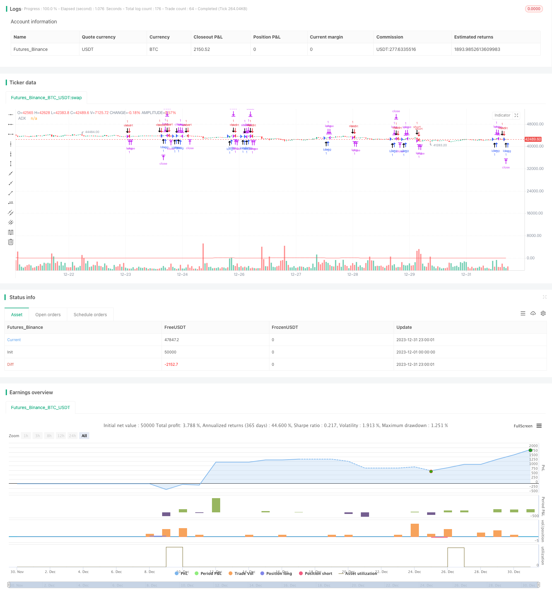

> Name

Crude-Oil-ADX-Trend-Following-Strategy based on ADX indicator
> Author

ChaoZhang

> Strategy Description


 [trans]

## Overview
This strategy is adapted from Kevin Davey's free crude oil futures trading strategy. This strategy uses the ADX indicator to judge the trend of the crude oil market and combines it with the price breakthrough principle to implement a simple and practical automatic crude oil trading strategy.
## Strategy Principle
1. Calculate the 14-period ADX indicator
2. When ADX>10, it is considered that the market has a trend
3. If the closing price is higher than the closing price before 65 K lines, it indicates a price breakthrough and is a long position signal.
4. If the closing price is lower than the closing price before the 65th K line, it indicates a price breakthrough and is a short position signal.
5. Set stop loss and take profit after entering the market
This strategy mainly relies on the ADX indicator to determine the trend, and generates trading signals based on price breakthroughs in a fixed period under trend conditions. The entire strategy logic is very simple and clear.
## Strategic advantage analysis
- Use ADX to determine trends to avoid missing trend opportunities
- A fixed period price breakthrough generates a signal, and the backtesting effect is better
- The code is intuitive and concise, easy to understand and modify
- Kevin Davey's many years of real-time verification, non-curve fitting
## Strategy risk analysis
- ADX, as the main indicator, is sensitive to parameter selection and breakthrough cycle selection.
- Fixed cycle breakthroughs may miss some opportunities
- Improper stop-loss and stop-profit settings may increase losses
- There may be differences between the actual results and the backtest results
## Strategy optimization direction
- Optimize ADX parameters and breakout cycle
- Increase dynamic adjustment of positions
- Continuously modify and improve strategies based on backtest results and real-time verification
-Introducing machine learning and deep learning technology for strategy optimization
## Summarize
This strategy is generally a very practical crude oil trading strategy. It uses the ADX indicator to judge the trend very reasonably, the price breakthrough principle is simple and effective, and the backtesting effect is good. At the same time, as Kevin Davey's public free strategy, it has strong practical reliability. Although there is some room for improvement in the strategy, for beginners and traders with small funds, this strategy is a very suitable choice for entry and practice.
|| 

## Overview

This strategy is adapted from Kevin Davey's free crude oil futures trading strategy. It utilizes the ADX indicator to determine the trend in the crude oil market and, combined with the price breakout principle, implements a simple and practical automated trading strategy for crude oil.

## Strategy Principle  

1. Calculate the 14-period ADX indicator
2. When ADX>10, the market is considered to have a trend
3. If the closing price is higher than the closing price 65 bars ago, it indicates a price breakout and a long signal
4. If the closing price is lower than the closing price 65 bars ago, it indicates a price breakout and a short signal
5. Set stop loss and take profit after entering the position

The strategy mainly relies on the ADX indicator to determine the trend, and generates trading signals based on fixed-cycle price breakouts under trend conditions. The overall strategy logic is very simple and clear.

## Advantage Analysis

- Use ADX to determine trends and avoid missing trend opportunities
- Fixed-cycle price breakouts generate signals with good backtest results  
- Intuitive and simple code, easy to understand and modify
- Kevin Davey's multi-year live trading verification, non-curve fitting

## Risk Analysis  

- As the main indicator, ADX is sensitive to parameter selection and breakout cycle selection
- Fixed-cycle breakouts may miss some opportunities
- Improper stop loss and take profit settings may increase losses
- There may be differences between live trading and backtest results

## Optimization Directions

- Optimize ADX parameters and breakout cycles
- Increase dynamic adjustment of position size
- Continuously modify and improve the strategy based on backtest results and live trading verification  
- Introduce machine learning and deep learning techniques for strategy optimization

## Summary

Overall this is a very practical crude oil trading strategy. It uses the ADX indicator to determine the trend very reasonably. The price breakout principle is simple and effective with good backtest results. At the same time, as Kevin Davey's public free strategy, it has very strong reliability in actual combat. Although there is still room for improvement in the strategy, it is a very suitable choice for beginners and small capital traders to get started and practice.

[/trans]

> Strategy Arguments


|Argument|Default|Description|
|----|----|----|
|v_input_1|14|ADX Smoothing|
|v_input_2|14|DI Length|


> Source (PineScript)

``` pinescript
/*backtest
start: 2023-12-01 00:00:00
end: 2023-12-31 23:59:59
period: 1h
basePeriod: 15m
exchanges: [{"eid":"Futures_Binance","currency":"BTC_USDT"}]
*/

// Strategy idea coded from EasyLanguage to Pinescript
//@version=5
strategy("Kevin Davey Crude free crude oil strategy", shorttitle="CO Fut", format=format.price, precision=2, overlay = true, calc_on_every_tick = true)
adxlen = input(14, title="ADX Smoothing")
dilen = input(14, title="DI Length")
dirmov(len) =>
	up = ta.change(high)
	down = -ta.change(low)
	plusDM = na(up) ? na : (up > down and up > 0 ? up : 0)
	minusDM = na(down) ? na : (down > up and down > 0 ? down : 0)
	truerange = ta.rma(ta.tr, len)
	plus = fixnan(100 * ta.rma(plusDM, len) / truerange)
	minus = fixnan(100 * ta.rma(minusDM, len) / truerange)
	[plus, minus]
adx(dilen, adxlen) =>
	[plus, minus] = dirmov(dilen)
	sum = plus + minus
	adx = 100 * ta.rma(math.abs(plus - minus) / (sum == 0 ? 1 : sum), adxlen)
sig = adx(dilen, adxlen)
plot(sig, color=color.red, title="ADX")

buy = sig > 10 and (close - close[65]) > 0 and (close - close[65])[1] < 0
sell = sig > 10 and (close - close[65]) < 0 and (close - close[65])[1] > 0

plotshape(buy, style = shape.arrowup, location = location.belowbar,size = size.huge)
plotshape(sell, style = shape.arrowdown, location = location.abovebar,size = size.huge)

if buy
	strategy.entry("long", strategy.long)
if sell
	strategy.entry("short", strategy.short)

if strategy.position_size != 0
	strategy.exit("long", profit = 450, loss = 300)
	strategy.exit("short", profit = 450, loss = 300)


// GetTickValue() returns the currency value of the instrument's
// smallest possible price movement.
GetTickValue() =>
    syminfo.mintick * syminfo.pointvalue

// On the last historical bar, make a label to display the
// instrument's tick value
if barstate.islastconfirmedhistory
    label.new(x=bar_index + 1, y=close, style=label.style_label_left,
         color=color.black, textcolor=color.white, size=size.large, 
         text=syminfo.ticker + " has a tick value of:\n" + 
             syminfo.currency + " " + str.tostring(GetTickValue()))
```

> Detail

https://www.fmz.com/strategy/439983

> Last Modified

2024-01-25 15:18:15
