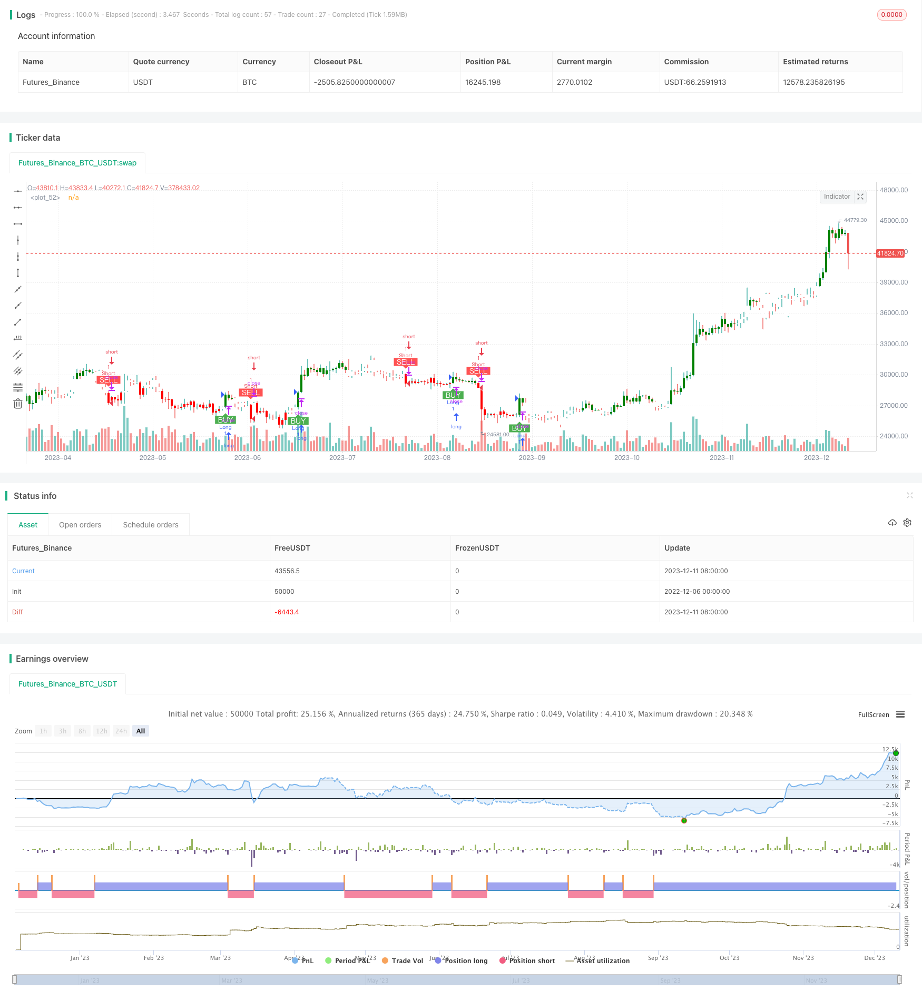

> Name

ADX-and-MACD-Indicators-based-Trading-Strategy ADX-and-MACD-Indicators-based-Trading-Strategy
> Author

ChaoZhang

> Strategy Description


[trans]

## Overview
The strategy is called "Trend following strategy based on ADX and MACD indicators". It uses the average trend indicator (ADX) to determine the direction and strength of the trend, and combines the long and short signals of the moving average convergence indicator (MACD) to achieve trend following transactions. This strategy will only open a long or short position when ADX indicates a strong trend and MACD issues a trading signal.
## Strategy Principle
This strategy determines the direction and strength of the market trend by calculating ADX and +DI and -DI curves. When the +DI curve crosses above the -DI curve, it is a long market, and when the -DI curve crosses below the +DI curve, it is a short market. This alone is not enough. When the ADX value is greater than 20, it means that the trend is strong enough. At this time, combined with the golden cross signal of the difference between the MACD indicator (macdline) and the signal value (signalline), buy and sell the product to achieve trend following transactions.
Specifically, the trading signal logic of the strategy is:
Bull signal: when +DI > -DI and the MACD difference line crosses the signal line from bottom to top
Short signal: when -DI> +DI and the MACD difference line crosses the signal line from top to bottom
According to this logic, this strategy can capture better entry opportunities in strong trends.
## Strategic Advantages
The biggest advantage of this strategy is that it takes into account both trend judgment and entry timing, allowing traders to find better entry points when the market has strong directionality, which greatly improves the stability and profitability of the system.
In addition, this strategy also introduces stop-loss logic. When the position loss exceeds the user-defined stop loss price, the strategy will actively stop the loss and effectively control the loss of individual transactions. This is also a highlight of this strategy.
## Strategy Risk
Although this strategy has certain advantages, there are also some risks that you need to be wary of:
1. The trading signals composed of ADX and MACD may fail or generate erroneous signals under certain market conditions, resulting in unnecessary losses;
2. The user-defined stop loss price may be exceeded, causing losses beyond expectations;
3. In a reversal market, the strategy may produce too many invalid transactions and consume transaction costs.
To reduce these risks, it is recommended to optimize the parameter settings of ADX and MACD, implement strict fund management strategies, and adjust stop loss logic to adapt to different market conditions.
## Strategy optimization direction
This strategy still has some room for optimization:
1. More indicators can be introduced to form stronger trading signals, such as combining volatility indicators to limit trading;
2. The parameters of ADX and MACD can be automatically optimized through machine learning methods;
3. An adaptive stop-loss mechanism can be established to allow the stop-loss price to dynamically track market fluctuations.
Through these methods, it is expected to further enhance the stability and profitability of the strategy.
## Summarize
In general, the trend following strategy based on ADX and MACD indicators has the advantages of judging the trend direction, finding better entry opportunities, setting stop loss logic, etc., and is a trading system worth considering. With Parameters optimization and risk control in place, this strategy can obtain a good return on investment. However, traders still need to be alert to the potential risks and pay close attention to changes in the market environment. Through systematic monitoring and optimization, this strategy is expected to achieve sustained Alpha.

||


## Overview

The strategy is named "Trend Following Strategy Based on ADX and MACD Indicators". It utilizes Average Directional Movement Index (ADX) to determine the trend direction and strength, combined with the trading signals from Moving Average Convergence Divergence (MACD), to implement trend following trades. It will establish long or short positions only when ADX indicates a strong trend and MACD gives out trading signals.

## Strategy Logic  

The strategy calculates the ADX and +DI, -DI lines to judge market trend direction and intensity. When +DI line crosses above -DI, it is an uptrend; when -DI drops below +DI, it is a downtrend. Additionally, when ADX reading is above 20, it indicates the trend is strong enough. The strategy then takes MACD indicator’s difference value (macdline) and signal line (signalline) crossings as buy and sell signals, to carry out trend following trades.  

Specifically, the trading signals logic is:

Long signal: +DI > -DI and MACD difference line crosses above signal line  
Short signal: -DI > +DI and MACD difference line crosses below signal line

With this logic, the strategy is able to capture optimal entry timing within strong trends.

## Advantages

The biggest advantage of this strategy is that it takes both trend judgment and entry timing selection into consideration, allowing traders to find relatively good entry points when there is a strong directional market. This greatly improves the stability and profitability of the system.

In addition, a stop loss logic is also implemented. It will cut losses actively if the position loss exceeds user defined stop loss price. This is also a highlight of the strategy.  

## Risks

Although the strategy has some merits, there are still risks to be awared of:

1. The trading signals composed of ADX and MACD may fail or give false signals in certain market situations, incurring unnecessary losses.

2. The user defined stop loss price could be penetrated, leading to losses beyond expectation. 

3. Too many ineffective trades may occur in ranging markets, consuming transaction costs.

To mitigate these risks, parameters optimization of ADX and MACD is recommended, as well as implementing strict money management rules. Stop loss logic should also be adjusted accordingly in different market environments.

## Enhancement Directions 

There is still room for enhancement on this strategy:

1. More indicators could be introduced to form stronger trading signals, e.g. combining volatility index to limit trades.

2. ADX and MACD parameters could be auto optimized via machine learning.

3. An adaptive stop loss mechanism can be established for dynamic tracking of market fluctuation.

These methods may help to further improve the stability and profitability of the strategy.


## Conclusion  

In conclusion, the Trend Following Strategy Based on ADX and MACD Indicators has merits in determining trend direction, finding optimal entry timing, setting stop loss logic etc, making it a considerable trading system. Given proper parameters tuning and risk control, it is capable of harvesting decent investment returns. But traders should still be cautious of the potential risks, and closely monitor the changing market environments. With systemic monitoring and enhancement, the strategy has the potential to achieve sustainable alpha.

[/trans]

> Strategy Arguments


|Argument|Default|Description|
|----|----|----|
|v_input_1|true|Show BUY/SELL Signals|
|v_input_2|true|Show Candle Colors|
|v_input_3|14|ADX Length|
|v_input_4|10|ADX Smoothing|
|v_input_5_close|0|MACD Source: close|high|low|open|hl2|hlc3|hlcc4|ohlc4|
|v_input_6|12|MACD Fast Length|
|v_input_7|26|MACD Slow Length|
|v_input_8|9|MACD Signal Length|
|v_input_9|green|Up Candle Color|
|v_input_10|red|Down Candle Color|
|v_input_11|100|Stop Loss Price|


> Source (PineScript)

``` pinescript
/*backtest
start: 2022-12-06 00:00:00
end: 2023-12-12 00:00:00
period: 1d
basePeriod: 1h
exchanges: [{"eid":"Futures_Binance","currency":"BTC_USDT"}]
*/

//@version=5
strategy("TUE ADX/MACD Confluence V1.0", overlay=true)

showsignals = input(true, title="Show BUY/SELL Signals")
showcandlecolors = input(true, title="Show Candle Colors")
length = input(14, title="ADX Length")
smoothing = input(10, title="ADX Smoothing")
macdsource = input(close, title="MACD Source")
macdfast = input(12, title="MACD Fast Length")
macdslow = input(26, title="MACD Slow Length")
macdsignal = input(9, title="MACD Signal Length")
colorup = input(color.green, title="Up Candle Color")
colordown = input(color.red, title="Down Candle Color")

/////////////////////////////////////////////////////////////////////////////////////////////// ADX AND MACD CALC
[diplus, diminus, adx] = ta.dmi(length, smoothing)

[macdline, signalline, histline] = ta.macd(macdsource, macdfast, macdslow, macdsignal)

//////////////////////////////////////////////////////////////////////////////////////////////TRADE CALC

longcheck = diplus > diminus and macdline > signalline
shortcheck = diminus > diplus and signalline > macdline

int trade = 0

//Open from nothing

if trade == 0 and longcheck
    trade := 1

else if trade == 0 and shortcheck
    trade := -1
    
//Reversal

else if trade == 1 and shortcheck
    trade := -1
    
else if trade == -1 and longcheck
    trade := 1
    
//Keep status quo until crossover

else
    trade := trade[1]

//////////////////////////////////////////////////////////////////////////////////////////////PLOT 

colors = longcheck ? colorup : shortcheck ? colordown : color.white

plotcandle(open, high, low, close, color = showcandlecolors ? colors : na)

plotshape(trade[1] != 1 and trade == 1 and showsignals, style=shape.labelup, text='BUY', textcolor=color.white, color=color.green, size=size.small, location=location.belowbar)
plotshape(trade[1] != -1 and trade == -1 and showsignals, style=shape.labeldown, text='SELL', textcolor=color.white, color=color.red, size=size.small, location=location.abovebar)

///////////////////////////////////////////////////////////////////////////////////////////// ALERTS

// Add Stop Loss
stopLossPrice = input(100, title="Stop Loss Price")

if trade == 1
    strategy.entry("Long", strategy.long)

if trade == -1
    strategy.entry("Short", strategy.short)

if trade == 1 and close < close[1] - stopLossPrice
    strategy.close("LongExit")

if trade == -1 and close > close[1] + stopLossPrice
    strategy.close("ShortExit")

```

> Detail

https://www.fmz.com/strategy/435252

> Last Modified

2023-12-13 15:45:24
