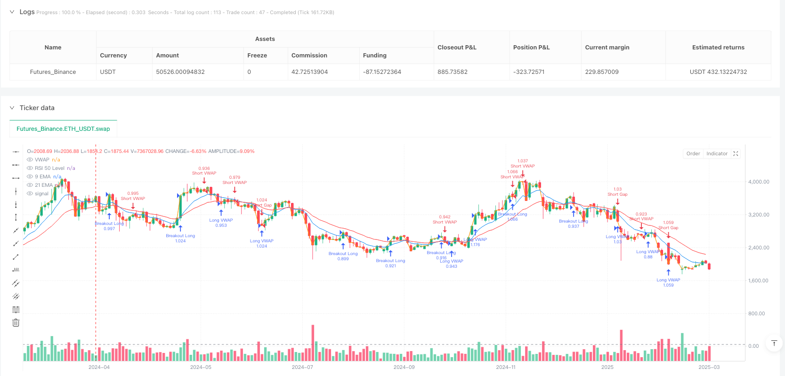
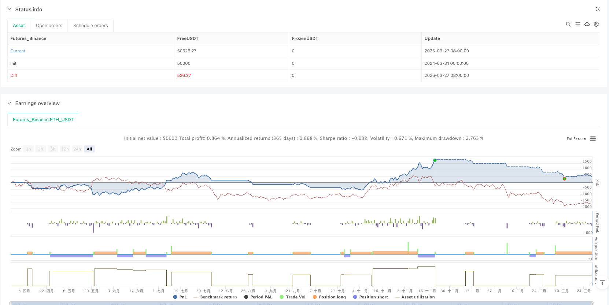

> Name

AI-Driven-Dynamic-Volatility-Adaptive-Trend-Breakout-Trading-Strategy
> Author

ianzeng123

> Strategy Description





[trans]

## Strategy Overview
This strategy is an AI-enhanced trading system that combines multiple market condition analysis and dynamic risk management capabilities. It mainly uses EMA (Exponential Moving Average), VWAP (Volume Weighted Average Price) and volatility indicator ATR (Average True Range) to identify market trends and potential trading opportunities. The strategy integrates three core trading logics: gap covering trading, VWAP momentum trading, and volatility compression breakout trading, and dynamically adjusts position size through AI-assisted risk management tools to adapt to different market environments.
## Strategy Principle
The core principle of this strategy is to identify high-win trading opportunities through multi-dimensional market analysis and implement intelligent risk control at the same time. Specifically, the strategy includes the following key components:
1. **AI Risk Management Tool**: Assess market volatility by comparing the relationship between the current ATR and its 10-day simple moving average, and dynamically adjust the position size accordingly. Reduce positions in high-volatility environments and increase positions in low-volatility environments to achieve adaptive risk control.
2. **Market status detection**: The strategy uses the difference between the 50-day EMA and the 200-day EMA and the 14-day RSI indicator to determine whether the market is in an upward trend, a downward trend, or sideways, and provides market environment reference for subsequent trading decisions.
3. **Volatility Forecast**: By monitoring whether the ATR change rate exceeds 50% of the current ATR, we can predict possible significant price fluctuations and provide forward-looking guidance for trading decisions.
4. **Three trading logics**:
   - Gap Covering Trading: The strategy looks for mean reversion opportunities when a large gap occurs and price is at a specific position relative to VWAP.
   - VWAP Momentum Trading: When price breaks or falls below VWAP, the strategy follows this momentum signal to trade.
   - Volatility Compression Breakout Trading: When a market breaks out after experiencing low liquidity compression, the strategy captures this explosive opportunity.
5. **Smart Stop Loss and Take Profit**: Set dynamic stop loss and take profit levels based on multiples of ATR, allowing risk management to adapt to current market volatility.
## Strategic Advantages
An in-depth analysis of the code implementation of this strategy can summarize the following significant advantages:
1. **Multi-dimensional market analysis**: Combined with technical indicators, volatility analysis and market status detection, comprehensively evaluate market conditions and improve signal quality.
2. **Adaptive Risk Management**: Through the AI-assisted dynamic position adjustment mechanism, it can effectively respond to different volatility environments and control risks while maintaining profit potential.
3. **Diversified trading logic**: Integrate three different trading logics: gap, VWAP and volatility compression, so that the strategy can adapt to a variety of market environments and is not restricted by a single market condition.
4. **Forward-looking fluctuation prediction**: Monitor potential large fluctuations through the ATR change rate, providing early warning for trading decisions, helping to avoid high-risk periods or capture big market trends.
5. **Visualized market status**: The strategy provides intuitive label display of market status to help traders quickly understand the current market environment and assist in decision-making.
6. **Accurate dynamic stop-loss and take-profit**: Stop-loss and take-profit settings based on ATR ensure that the risk-reward ratio is always maintained at a reasonable level and can adapt to changes in market volatility.
## Strategy Risk
Despite the sophisticated design of this strategy, the following potential risks and challenges exist:
1. **False breakthrough risk**: In breakthrough trading after volatility compression, you may face false breakthrough problems, leading to unnecessary losses. The solution is to add confirmation indicators such as volume breakouts or multi-time frame confirmations.
2. **Parameter sensitivity**: The period settings of EMA and ATR have a significant impact on strategy performance, and different market environments may require different parameter settings. It is recommended to optimize parameters under different market conditions through backtesting.
3. **Gap Risk**: Reliance on the previous closing price to calculate gap size may be inaccurate under certain market conditions, especially after major news or important events over the weekend. Consider incorporating more time frame data to improve the accuracy of your gap assessment.
4. **Misjudgment of market status**: During the market transition period, the trend strength indicator may lag behind, resulting in inaccurate judgment of market status. Additional trend confirmation indicators can be introduced to reduce misjudgments.
5. **Volatility mutation risk**: In extreme market events, volatility may suddenly increase sharply, exceeding the expected range of the strategy, affecting the risk control effect. It is recommended to set absolute risk limits to ensure that the maximum risk is within the controllable range regardless of the ATR calculation result.
## Strategy optimization direction
Based on in-depth analysis of the code, this strategy can be optimized in the following directions:
1. **Add machine learning model**: Upgrade the existing AI concept to a real machine learning model, and optimize the accuracy of judgment of market status and volatility prediction through historical data training. The reason for this is that the current "AI" part is mainly rule-based calculations, and the introduction of machine learning can capture more complex market patterns.
2. **Integrate More Time Frames**: Consider signals from multiple time frames in the decision-making process to reduce false signals and improve trading accuracy. Confirming low time frame signals with high time frames can significantly improve the robustness of the strategy.
3. **Introducing volume analysis**: Use volume data as an additional confirmation factor, especially in breakout trading, where volume breakouts often provide more reliable signals. Such optimization can reduce losses caused by false breakthroughs.
4. **Optimize market status detection**: Use more complex algorithms (such as adaptive Markov models) to detect market status, replacing simple EMA difference judgment to improve the accuracy and timeliness of market status identification.
5. **Stop Loss Strategy Optimization**: Implement the trailing stop function to protect profits earned in trending markets while avoiding premature exits due to market noise. This optimization can improve the profit-loss ratio of the strategy.
6. **Added risk balancing mechanism**: Dynamically adjust fund allocation based on the historical performance of different trading signals, and allocate more funds to signal types that have historically performed better. This approach can adaptively optimize the efficiency of capital use.
7. **Add seasonal analysis**: For a specific trading product, consider its historical seasonal pattern and adjust strategy parameters or signal thresholds in specific periods. This optimization can take advantage of the cyclical characteristics of the market to improve the winning rate.
## Summarize
This AI-driven dynamic volatility adaptive trend breakout trading strategy is a comprehensive trading system that provides traders with a comprehensive decision-making framework by integrating multiple technical indicators, market state analysis, and dynamic risk management. Its core strength lies in its ability to adapt—whether it is to adapt to different market conditions or volatility environments, the strategy can adjust accordingly.
The strategy combines three different trading logics, allowing it to find opportunities under different market conditions, while AI-assisted risk management ensures that risks are effectively controlled while pursuing returns. By implementing the recommended optimization measures, especially the introduction of true machine learning models, multi-timeframe analysis and advanced risk management techniques, the strategy has the potential to become an even more robust and efficient trading tool.
This strategy provides a solid starting point for traders looking to establish a systematic approach to trading in the markets, and its modular design allows for customization and expansion based on personal trading style and risk appetite. It is worth noting that although the strategy contains "AI" elements, to realize its full potential requires further integration of true machine learning technology to achieve more accurate market analysis and predictions. ||
## Strategy Overview

This strategy is an AI-enhanced trading system that combines multiple market condition analyses with dynamic risk management capabilities. It primarily utilizes EMA (Exponential Moving Average), VWAP (Volume Weighted Average Price), and the volatility indicator ATR (Average True Range) to identify market trends and potential trading opportunities. The strategy integrates three core trading logics: gap fill trading, VWAP momentum trading, and volatility compression breakout trading, while using AI-assisted risk management tools to dynamically adjust position sizes to adapt to different market environments.

## Strategy Principles

The core principle of this strategy is to identify high-probability trading opportunities through multi-dimensional market analysis while implementing intelligent risk control. Specifically, the strategy includes the following key components:

1. **AI Risk Management Tool**: Evaluates market volatility by comparing the current ATR with its 10-day simple moving average, and dynamically adjusts position sizes accordingly. It reduces positions in high-volatility environments and increases them in low-volatility environments, achieving adaptive risk control.

2. **Market Regime Detection**: The strategy uses the difference between the 50-day EMA and 200-day EMA, along with the 14-day RSI indicator, to determine whether the market is in an uptrend, downtrend, or ranging state, providing market context for subsequent trading decisions.

3. **Volatility Forecasting**: Predicts significant price movements by monitoring whether the ATR change rate exceeds 50% of the current ATR, providing forward-looking guidance for trading decisions.

4. **Three Trading Logics**:
   - Gap Fill Trading: When a significant gap occurs and the price is at a specific position relative to VWAP, the strategy seeks mean reversion opportunities.
   - VWAP Momentum Trading: When the price breaks above or below VWAP, the strategy follows this momentum signal for trading.
   - Volatility Compression Breakout Trading: When the market experiences a breakout after low liquidity compression, the strategy captures this explosive opportunity.

5. **Intelligent Stop-Loss and Take-Profit**: Sets dynamic stop-loss and take-profit levels based on ATR multiples, adapting risk management to current market volatility.

## Strategy Advantages

Analyzing the code implementation of this strategy, the following significant advantages can be summarized:

1. **Multi-dimensional Market Analysis**: Combines technical indicators, volatility analysis, and market regime detection to comprehensively evaluate market conditions and improve signal quality.

2. **Adaptive Risk Management**: Effectively handles different volatility environments through AI-assisted dynamic position adjustment mechanisms, controlling risk while maintaining profit potential.

3. **Diversified Trading Logic**: Integrates three different trading logics—gap, VWAP, and volatility compression—enabling the strategy to adapt to various market environments without being limited to a single market condition.

4. **Forward-looking Volatility Prediction**: Monitors potential large fluctuations through ATR change rates, providing early warnings for trading decisions, helping to avoid high-risk periods or capture major market moves.

5. **Visualization of Market State**: Provides intuitive market state label displays, helping traders quickly understand the current market environment to aid decision-making.

6. **Precise Dynamic Stop-Loss and Take-Profit**: ATR-based stop-loss and take-profit settings ensure that risk-reward ratios always remain at reasonable levels and can adapt to changes in market volatility.

## Strategy Risks

Despite its sophisticated design, the strategy still faces the following potential risks and challenges:

1. **False Breakout Risk**: In breakout trading after volatility compression, there may be false breakouts leading to unnecessary losses. The solution is to add confirmation indicators, such as volume breakouts or multi-timeframe confirmation.

2. **Parameter Sensitivity**: EMA and ATR period settings significantly impact strategy performance, and different market environments may require different parameter settings. It is recommended to optimize parameters through backtesting under different market conditions.

3. **Gap Risk**: Relying on the previous closing price to calculate gap size may be inaccurate under certain market conditions, especially after major news or important weekend events. Consider incorporating data from multiple timeframes to improve the accuracy of gap assessment.

4. **Market Regime Misjudgment**: During market transitions, trend strength indicators may lag, leading to inaccurate market state judgments. Additional trend confirmation indicators can be introduced to reduce misjudgments.

5. **Volatility Mutation Risk**: In extreme market events, volatility may suddenly increase dramatically, exceeding the expected range of the strategy and affecting the effectiveness of risk control. It is advisable to set absolute risk limits to ensure maximum risk remains controllable regardless of ATR calculation results.

## Strategy Optimization Directions

Based on in-depth analysis of the code, the strategy can be optimized in the following directions:

1. **Incorporate Machine Learning Models**: Upgrade the existing AI concepts to true machine learning models, trained on historical data, to optimize the accuracy of market state judgment and volatility prediction. This is because the current "AI" portions are primarily rule-based calculations; introducing machine learning can capture more complex market patterns.

2. **Integrate Multiple Timeframes**: Consider signals from multiple timeframes in the decision-making process to reduce false signals and improve trading precision. Confirming lower timeframe signals with higher timeframe analysis can significantly enhance the robustness of the strategy.

3. **Introduce Volume Analysis**: Use volume data as an additional confirmation factor, especially in breakout trading, as volume breakouts typically provide more reliable signals. This optimization can reduce losses from false breakouts.

4. **Optimize Market Regime Detection**: Use more complex algorithms (such as adaptive Markov models) to detect market states, replacing simple EMA difference judgments to improve the accuracy and timeliness of market state recognition.

5. **Stop-Loss Strategy Optimization**: Implement trailing stop-loss functionality to protect profits in trending markets while avoiding premature exits due to market noise. This optimization can improve the strategy's profit-to-loss ratio.

6. **Add Risk Balancing Mechanism**: Dynamically adjust capital allocation based on the historical performance of different signal types, allocating more capital to historically better-performing signal types. This approach can adaptively optimize capital utilization efficiency.

7. **Add Seasonality Analysis**: For specific trading products, consider their historical seasonal patterns to adjust strategy parameters or signal thresholds during specific periods. This optimization can leverage market cyclical characteristics to improve win rates.

## Summary

This AI-driven dynamic volatility-adaptive trend breakout trading strategy is a comprehensive trading system that provides traders with a complete decision-making framework by integrating multiple technical indicators, market state analysis, and dynamic risk management. Its core advantage lies in its adaptability—whether adapting to different market states or volatility environments, the strategy can make corresponding adjustments.

The strategy combines three different trading logics, allowing it to find opportunities under different market conditions, while AI-assisted risk management ensures effective risk control while pursuing returns. By implementing the suggested optimization measures, especially introducing true machine learning models, multi-timeframe analysis, and advanced risk management techniques, the strategy has the potential to become a more robust and efficient trading tool.

For traders looking to establish systematic trading methods in the market, this strategy provides a solid starting point, with its modular design allowing for customization and expansion according to personal trading styles and risk preferences. It is worth noting that although the strategy contains "AI" elements, to fully realize its potential, further integration of true machine learning technology is needed to achieve more precise market analysis and prediction.[/trans]


> Source (PineScript)

``` pinescript
/*backtest
start: 2024-03-31 00:00:00
end: 2025-03-29 08:00:00
period: 2d
basePeriod: 2d
exchanges: [{"eid":"Futures_Binance","currency":"ETH_USDT"}]
*/

//@version=6
strategy("AI-Enhanced NKD CME Trading Strategy", overlay=true)

// ? Input Parameters
fastEMA = input(9, title="Fast EMA Length")
slowEMA = input(21, title="Slow EMA Length")
atrMultiplierSL = input(1.5, title="ATR Multiplier for Stop Loss")
atrMultiplierTP = input(3, title="ATR Multiplier for Take Profit")
atrLen = input(14, title="ATR Length")

// ? AI-Based Risk Management Tool
// Adjusts position sizes dynamically based on volatility
riskFactor = ta.sma(ta.atr(14), 10) / ta.atr(14)
positionSize = 1 / riskFactor  // Smaller size in high volatility, larger in low volatility

// ? AI-Powered Market Regime Detection
// Detects if the market is trending, ranging, or mean-reverting
trendStrength = ta.ema(close, 50) - ta.ema(close, 200)
rsiTrend = ta.rsi(close, 14)
marketRegime = trendStrength > 0 ? "Trending Up" : trendStrength < 0 ? "Trending Down" : "Range"

// ? AI-Powered Volatility Forecasting
// Uses ATR spikes to detect upcoming high-impact moves
volatilitySpike = ta.change(ta.atr(atrLen)) > ta.atr(atrLen) * 0.5  // ATR jump > 50% indicates potential spike

// ? Indicators Calculation
emaFast = ta.ema(close, fastEMA)
emaSlow = ta.ema(close, slowEMA)
vw = ta.vwap(close)
atr = ta.atr(atrLen)

// ? Gap Resolution Trade Logic
preMarketClose = request.security(syminfo.tickerid, "30", close[1])
gapSize = math.abs(close - preMarketClose)

// Long Entry: Gap Down Mean Reversion
longGapCondition = close > emaFast and gapSize > 50 and close < vw
shortGapCondition = close < emaFast and gapSize > 50 and close > vw

// ? VWAP Momentum Trade Logic
longVWAPCondition = ta.crossover(close, vw)
shortVWAPCondition = ta.crossunder(close, vw)

// ? Volatility Compression Squeeze
lowLiquidityCondition = ta.lowest(low, 10) == low and gapSize < 30
breakoutCondition = ta.highest(high, 10) == high and gapSize > 30

// ? Risk Management (AI-Driven)
longStopLoss = close - (atrMultiplierSL * atr)
longTakeProfit = close + (atrMultiplierTP * atr)

shortStopLoss = close + (atrMultiplierSL * atr)
shortTakeProfit = close - (atrMultiplierTP * atr)

// ? Strategy Execution with AI Risk Management
if longGapCondition and positionSize > 0
    strategy.entry("Long Gap", strategy.long, qty=positionSize)
    strategy.exit("Exit Long", from_entry="Long Gap", stop=longStopLoss, limit=longTakeProfit)

if shortGapCondition and positionSize > 0
    strategy.entry("Short Gap", strategy.short, qty=positionSize)
    strategy.exit("Exit Short", from_entry="Short Gap", stop=shortStopLoss, limit=shortTakeProfit)

if longVWAPCondition and positionSize > 0
    strategy.entry("Long VWAP", strategy.long, qty=positionSize)
    strategy.exit("Exit Long VWAP", from_entry="Long VWAP", stop=longStopLoss, limit=longTakeProfit)

if shortVWAPCondition and positionSize > 0
    strategy.entry("Short VWAP", strategy.short, qty=positionSize)
    strategy.exit("Exit Short VWAP", from_entry="Short VWAP", stop=shortStopLoss, limit=shortTakeProfit)

if breakoutCondition and positionSize > 0
    strategy.entry("Breakout Long", strategy.long, qty=positionSize)
    strategy.exit("Exit Breakout", from_entry="Breakout Long", stop=longStopLoss, limit=longTakeProfit)

// ? Visualization (Fixed xloc.bar issue)
plot(emaFast, color=color.blue, title="9 EMA")
plot(emaSlow, color=color.red, title="21 EMA")
plot(vw, color=color.orange, title="VWAP")
hline(50, "RSI 50 Level", color=color.gray)

// ✅ Fix for xloc.bar Issue
// Pine Script does not allow labels or text to be drawn using xloc.bar, so we use a regular label with dynamic updates
var label marketLabel = label.new(x=bar_index, y=high, text="", color=color.white, textcolor=color.black, size=size.small)
label.set_text(marketLabel, "Market Regime: " + marketRegime)
label.set_x(marketLabel, bar_index)
label.set_y(marketLabel, high)

```

> Detail

https://www.fmz.com/strategy/488865

> Last Modified

2025-03-31 13:17:17
