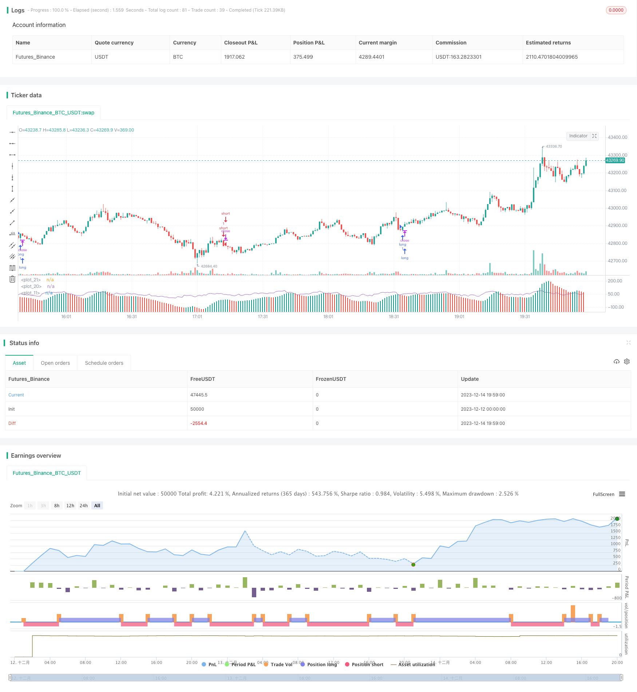

> Name

Trend following strategy based on AO indicator and moving average AO-Indicator-Based-Trend-Following-Strategy
> Author

ChaoZhang

> Strategy Description



 [trans]

#### Overview
This strategy uses the Awesome Oscillator (AO) indicator to determine the trend direction and combines it with the moving average to confirm the trend. It is a trend following strategy. When the AO indicator crosses the 0 axis and the fast line crosses the slow line, go long. When the AO indicator crosses the 0 axis and the fast line crosses the slow line, go short. Use the directionality of the trend to make profits.
#### Strategy Principle
This strategy is mainly based on the AO indicator to determine the trend direction. The AO indicator is calculated based on the difference between the midpoint of the }-{ line and the 5-period and 34-period simple moving averages. It belongs to the Momentum category indicator. When the AO indicator is positive, it means that the short-term moving average is higher than the long-term moving average, Should be interpreted as a bullish sign. On the contrary, when AO is negative, it means that the short-term moving average is lower than the long-term moving average, Should be interpreted as a bearish sign.
Therefore, the AO indicator can effectively determine the direction of the trend. When AO crosses above the 0 axis, it means that the market trend has turned bullish, and you should go long; when AO crosses below the 0 axis, it means that the market trend has turned bearish, and you should go short.
In addition, this strategy also adds 20-period and 200-period moving averages. The angles of these two moving averages represent the direction of the mid- to long-term trend. It is not enough to rely solely on the AO indicator to judge the short-term trend direction. Confirmation of the mid- to long-term trend is also needed, so the moving average is added to the judgment.
When the fast moving average crosses the slow moving average and the medium and long-term trend turns bullish, we go long when the AO crosses the 0 axis and make profits as the trend goes higher; when the fast moving average crosses below the slow moving average and the medium and long-term trend turns bearish, we go short when the AO crosses the 0 axis and make profits as the trend goes lower.
#### Strategic Advantages
1. Use the AO indicator to determine the short-term trend direction with high accuracy.
2. Adding moving averages to determine mid- and long-term trends can effectively filter out false breakthroughs
3. Quick profits, suitable for short-term operations
#### Risk Analysis
1. When the AO indicator crosses the 0 axis and the moving average sends a short signal, the price may continue to rise for a while before turning downward, and there is a risk of antry.
2. When the AO indicator crosses the 0 axis and the moving average sends a long signal, the price may continue to fall for a period of time before turning upward, and there is a risk of antry.
3. The risk of large-scale marginal effects. After the market breaks through important technical positions, the AO indicator may become confused, resulting in false signals.
#### Optimization direction
1. You can test moving average combinations with different parameters, such as 10-period and 50-period, to find a more matching moving average.
2. Other indicators can be added to the combination, such as RSI indicator, to make the signal more reliable
3. The fixed stop loss ratio can be optimized to make the risk-return ratio of the strategy better
#### Summarize
This strategy is a simple trend following strategy. It is correct to use the AO indicator to determine the short-term trend and confirm the mid- and long-term trends. The combination of AO indicator and moving average is widely used and relatively mature, and this strategy also has strong reliability. Through further parameter optimization and combination indicator optimization, the effect of this strategy can be made even better.
||

#### Overview

This strategy uses the Awesome Oscillator (AO) indicator to determine the trend direction and moving averages to confirm the trend. It belongs to the trend following strategy. It goes long when the AO indicator crosses above the 0 level and the fast MA crosses above the slow MA, and goes short when the AO crosses below the 0 level and the fast MA crosses below the slow MA, taking advantage of the directionality of trends to profit.

#### Strategy Logic

This strategy mainly relies on the AO indicator to determine the short-term trend direction. The AO indicator is calculated based on the difference between the 5-period and 34-period simple moving averages of the mid-price. It belongs to the Momentum category of indicators. When the AO is positive, it means the short-term MA is above the long-term MA, which should be interpreted as a bullish sign. When the AO is negative, it means the short-term MA is below the long-term MA, which should be interpreted as a bearish sign.

Therefore, the AO indicator can effectively determine the direction of the trend. When the AO crosses above the 0 level, it signals that the market trend has turned bullish and we should go long. When the AO crosses below the 0 level, it signals that the market trend has turned bearish and we should go short.  

In addition, this strategy also incorporates the 20-period and 200-period moving averages. The slope of these two MAs represents the direction of the medium to long-term trend. Judging only by the AO indicator for the short-term trend direction is not enough, confirmation from the mid-long term trend is also needed, hence the addition of the MA crossover rules.

When the fast MA crosses above the slow MA, the mid-long term trend turns bullish, we go long when the AO crosses above 0 to ride the uptrend. When the fast MA crosses below the slow MA, the mid-long term trend turns bearish, we go short when the AO crosses below 0 to ride the downtrend.

#### Advantages

1. Accurately determining short-term trend direction using the AO indicator  
2. Adding MA filters to confirm mid-long term trend, effectively avoiding false breakouts
3. Fast profits, suitable for short-term trading

#### Risk Analysis  

1. Risk of failed entry when going short. Price may continue going up for some time after AO crosses below 0 and MA signals sell before turning down.  
2. Risk of failed entry when going long. Price may continue going down for some time after AO crosses above 0 and MA signals buy before turning up.
3. Risk of distorted AO signals at major technical levels.

#### Improvement Directions

1. Test different MA combinations to find better settings, e.g. 10- and 50-period MAs
2. Add other indicators like RSI for signal confirmation 
3. Optimize stop loss percentage for better risk/reward ratio

#### Conclusion

This is a simple trend following strategy. Using the AO to determine short-term trend direction confirmed by mid-long term MAs is logically sound. The combination of AO and MAs sees widespread usage and is relatively mature. This strategy is also very reliable. Further optimization of parameters and other indicators can improve strategy performance.

[/trans]

> Strategy Arguments


|Argument|Default|Description|
|----|----|----|
|v_input_bool_1|true|long|
|v_input_bool_2|true|short|
|v_input_float_1|10|profit|
|v_input_float_2|5|stop|


> Source (PineScript)

``` pinescript
/*backtest
start: 2023-12-12 00:00:00
end: 2023-12-14 20:00:00
period: 1m
basePeriod: 1m
exchanges: [{"eid":"Futures_Binance","currency":"BTC_USDT"}]
*/

// https://www.youtube.com/watch?v=zr3AVwjCtDA

//@version=5
strategy(title="Bingx ESTRATEGIA de Trading en 1 minuto ", shorttitle="AO")
long = input.bool(true, "long")
short = input.bool(true, "short")
profit = (input.float(10, "profit") / 100) + 1
stop = (input.float(5, "stop") / 100) + 1
ao = ta.sma(hl2,5) - ta.sma(hl2,34)
diff = ao - ao[1]
plot(ao, color = diff <= 0 ? #F44336 : #009688, style=plot.style_columns)
changeToGreen = ta.crossover(diff, 0)
changeToRed = ta.crossunder(diff, 0)
alertcondition(changeToGreen, title = "AO color changed to green", message = "Awesome Oscillator's color has changed to green")
alertcondition(changeToRed, title = "AO color changed to red", message = "Awesome Oscillator's color has changed to red")

ema20 = ta.ema(close, 20)
ema200 = ta.ema(close, 200)
rsi = ta.rsi(close, 7)
plot(rsi)
plot(0, color=color.white)
var float pentry = 0.0
var float lentry = 0.0
var bool oab = false
// oab := ta.crossover(ao, 0) ? true : ta.crossover(0, ao) ? false : oab[1]

if long and close > open and ta.crossover(close, ema20) and ema20 > ema200 and ao > 0 and rsi > 50
    strategy.entry("long", strategy.long)
    pentry := close
strategy.exit("exit long", "long", limit=pentry * profit, stop=pentry / stop)

if short and close < open and ta.crossunder(close, ema20) and ema20 < ema200 and ao < 0 and rsi < 50
    strategy.entry("short", strategy.short)
    lentry := close
strategy.exit("exit short", "short", limit=lentry / profit, stop=lentry * stop)
```

> Detail

https://www.fmz.com/strategy/435945

> Last Modified

2023-12-20 11:59:48
