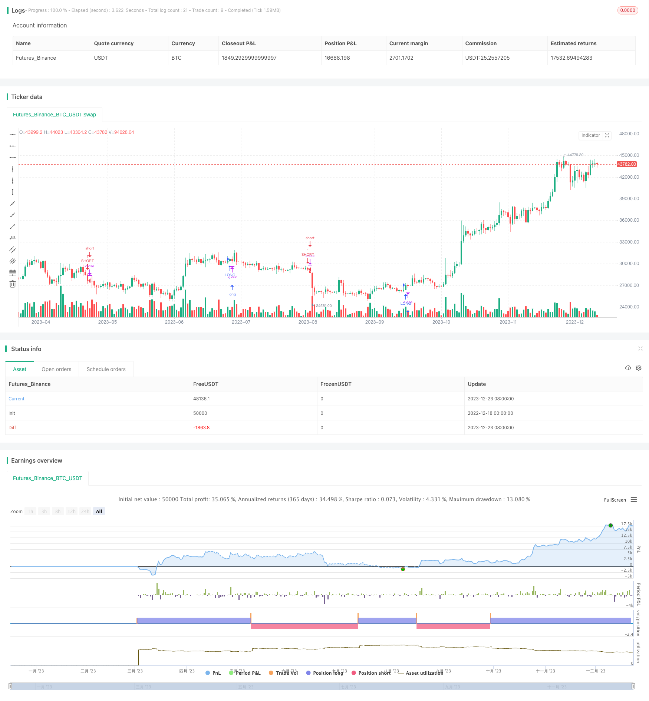

> Name

EMA Crossover Intraday Trading Strategy Based on AO Oscillator EMA-Crossover-Intraday-Trading-Strategy-Based-on-AO-Oscillator
> Author

ChaoZhang

> Strategy Description


[trans]

## Overview
This strategy is a day trading strategy that uses the intersection of the AO oscillator and the EMA moving average. The main idea is to generate a trading signal when the AO indicator crosses the zero axis and the fast EMA line crosses the mid-term EMA line.
## Strategy Principle
This strategy mainly uses two indicators for entry and exit:
1. AO oscillator: This indicator is the difference between the 5-day high and low price average and the 34-day high and low price average, and is used to determine the current market trend. When AO is positive, it means that it is currently in an upward trend, and when it is negative, it means that it is currently in a downward trend.
2. EMA moving average: The strategy uses two EMAs on the 3rd and 20th for calculation. The 3-day EMA represents the short-term trend, and the 20-day EMA represents the mid-term trend. A buy signal is generated when the short-term EMA breaks through the mid-term EMA from below, and a sell signal is generated when it breaks below the mid-term EMA.
The entry condition for this strategy is that when the AO indicator crosses the zero axis and the EMA appears a golden cross or a dead cross, a trading signal will be generated. This can avoid false signals when the AO indicator fluctuates. The exit condition is that all positions are closed after the end of London trading time.
## Advantage Analysis
This strategy mainly has the following advantages:
1. Use the AO indicator to ensure accurate judgment of the general trend and avoid losses caused by false EMA breakthroughs;
2. The combination of dual indicators can filter out some noise and make the signal clearer;
3. Only trade during the main trading hours to avoid overnight risks;
4. The strategy logic is simple and clear, easy to understand and implement;
5. No need for optimization and curve fitting, the parameters are stable;
## Risk Analysis
There are also some risks with this strategy:
1. The risk of expanding intraday trading losses. When a major black swan event occurs, failure to stop losses in the short term may result in larger losses;
2. Risks caused by false breakthroughs of the EMA indicator. When the market is in a volatile stage, EMA may cross multiple times causing false signals;
3. Parameter fixation may lack adaptability. Parameters need to be adjusted in different market cycles;
In order to avoid these risks, we can set up a stop-loss mechanism or adjust parameters according to different cycles to make the strategy more flexible.
## Optimization direction
For this strategy, the main optimization direction lies in parameter adjustment:
1. Adjustment of EMA cycle. You can test shorter period EMA combinations, or add more EMAs to build trading signals;
2. Adjustment of AO parameters. Test the impact of different long and short cycle parameters on AO indicators;
3. Add other auxiliary indicators. For example, add the RSIbord indicator to avoid the risk of overbought and oversold;
4. Adjustment of trading hours. Test the effects of different regions or longer trading hours.
By adjusting parameters and adding new indicators, the strategy can become more robust and efficient.
## Summarize
In general, this trading strategy combines the trend judgment indicator AO and the short- and medium-term EMA crossover to construct a simple and practical intraday trading strategy. It has the advantages of clear strategic signals and easy implementation. At the same time, there are also some defects of fixed parameters. Through continuous testing and optimization, the strategy can be further improved and become more stable and adaptable to the needs of the market. It provides a very good option for day traders.
||


## Overview  

This is an intraday trading strategy that utilizes the AO oscillator and EMA crossovers to generate trading signals. The main idea is to enter trades when the AO crosses its zero line concurrently with the fast EMA crossing over the medium-term EMA line.

## Strategy Logic  

The strategy mainly relies on two indicators for entries and exits:   

1. AO Oscillator: It measures the difference between 5-period and 34-period HL2 averages to gauge current trend direction. Positive AO represents an upward trend while negative AO signals a downward trend.   

2. EMA Crossover: The strategy uses a 3-period EMA for short-term trend and a 20-period EMA for medium-term trend direction. A golden cross with the 3EMA moving up through the 20EMA generates buy signals while a death cross with the 3EMA crossing down through the 20EMA produces sell signals.

Trades are entered only when the AO crosses its zero line concurrently with an EMA crossover. This avoids wrong signals when the AO is oscillating. Exits happen after the London session closes by flattening all positions.

## Advantage Analysis   

The main advantages of this strategy are:

1. AO oscillator ensures accurate trend direction for reliable signals;  
2. Dual-indicator combo filters out noise for high-confidence signals;
3. Trading only during major sessions avoids overnight risks;  
4. Simple and clear logic makes it easy to understand and implement;
5. No optimization or curve-fitting needed with stable parameters.  

## Risk Analysis

Some risks to note include:
  
1. Risk of extended losses without timely stop-loss in black swan events;  
2. Whipsaws from false EMA crossovers in ranging markets;
3. Lack of adaptiveness from fixed parameters across changing market cycles.  

Risks can be mitigated via stop losses, adaptive parameters tuned to varying cycles etc.

## Optimization Directions   

Main optimization directions are around parameter tuning:

1. Adjust EMA periods to test shorter-term combos or additional EMAs in signal generation; 
2. Tune AO parameters to assess impact on the oscillator;  
3. Add supplementary indicators like RSIbord to avoid overbought/oversold conditions;
4. Adjust trading session timings to test different regions or longer durations.

Parameter tweaks and additional filters can enhance the strategy’s robustness and efficiency.  

## Conclusion  

In summary, this intraday trading tactic combines the AO trend gauge with EMA crossovers to craft a simple yet practical approach. It has clear signals that are easy to implement but lacks adaptive parameters. Further testing and refinements can improve its stability and alignment with varying market landscapes. Overall it presents retail intraday traders with an excellent choice.  

[/trans]

> Strategy Arguments


|Argument|Default|Description|
|----|----|----|
|v_input_1|3|Length|
|v_input_2_close|0|Source: close|high|low|open|hl2|hlc3|hlcc4|ohlc4|
|v_input_3|20|Length|
|v_input_4_close|0|Source: close|high|low|open|hl2|hlc3|hlcc4|ohlc4|
|v_input_5|false|Reverse position ?|


> Source (PineScript)

``` pinescript
/*backtest
start: 2022-12-18 00:00:00
end: 2023-12-24 00:00:00
period: 1d
basePeriod: 1h
exchanges: [{"eid":"Futures_Binance","currency":"BTC_USDT"}]
*/

//@version=4
//@author SoftKill21

strategy(title="MA cross + AO", shorttitle="MA_AO")
ao = sma(hl2,5) - sma(hl2,34)

len = input(3, minval=1, title="Length")
src = input(close, title="Source")
out = ema(src, len)

len1 = input(20, minval=1, title="Length")
src1 = input(close, title="Source")
out1 = sma(src1, len1)

timeinrange(res, sess) => time(res, sess) != 0
londopen = timeinrange(timeframe.period, "0300-1100") 
nyopen = timeinrange(timeframe.period, "0800-1600") 

longC = crossover(out,out1) and ao>0 and londopen
shortC = crossunder(out,out1) and ao<0 and londopen

invert = input(title="Reverse position ?", type=input.bool, defval=false)

if(invert==false)
    strategy.entry("LONG",1,when=longC)
    strategy.entry("SHORT",0,when=shortC)


if(invert==true)
    strategy.entry("short",0,when=longC)
    strategy.entry("long",1,when=shortC)
    
strategy.close_all(when= not (londopen))


```

> Detail

https://www.fmz.com/strategy/436475

> Last Modified

2023-12-25 10:53:48
