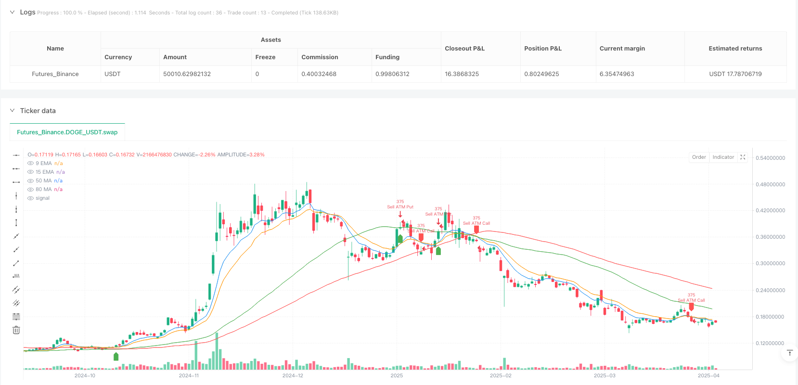
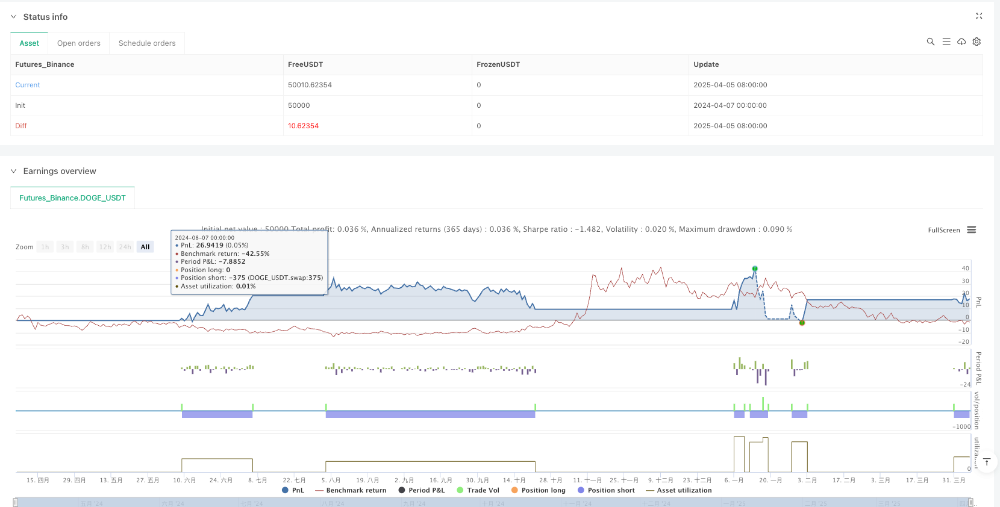

> Name

Dynamic-Trend-Filtered-ATM-Option-Selling-Strategy-with-EMA-Crossover-and-RSI-Momentum-Confirmation
> Author

ianzeng123

> Strategy Description





[trans]

#### Overview
The Dynamic Trend Filtered ATM Options Selling Strategy is an intraday trading strategy that is primarily based on a combination of short- and medium-term moving averages and momentum indicators to determine the best time to sell options. This strategy utilizes the 9/15 Exponential Moving Average (EMA) crossover signal as the primary entry trigger, while incorporating the 50/80 Moving Average (MA) as an overall market trend filter, and the Relative Strength Index (RSI) for momentum confirmation. To avoid overnight risk, the strategy ensures that all trades are automatically closed before the market closes (15:24 IST), making this strategy particularly suitable for day traders who do not want to take on overnight risk.
#### Strategy Principle
The core principle of this strategy is to sell ATM (at-the-money) options in a clear trend environment, and use a multi-layer technical indicator filtering system to improve trading accuracy:
1. **Trend Identification Layer**: Use the 50-day and 80-day moving averages (MA) to determine the medium-term trend direction of the market. When the price is below these two moving averages, it is considered to be in a downward trend, and it is suitable to sell call options (CE); when the price is above these two moving averages, it is considered to be in an upward trend, and it is suitable to sell put options (PE).
2. **Short-term signal layer**: Use the intersection of the 9-day and 15-day exponential moving averages (EMA) to capture short-term trend shifts. When the 9EMA crosses below the 15EMA, it indicates that the short-term trend has turned downward, and call options can be sold based on the downward trend background; when the 9EMA crosses above the 15EMA, it indicates that the short-term trend has turned upward, and put options can be sold based on the upward trend background.
3. **Momentum Confirmation Layer**: Use the RSI(14) indicator for additional momentum confirmation. When the RSI is below 50, downward momentum is confirmed; when the RSI is above 50, upward momentum is confirmed.
4. **At-the-money option positioning**: The strategy automatically calculates and rounds to the nearest 50-point price as the execution price of the ATM option, ensuring that the contract with the best liquidity is traded.
5. **Risk Management Mechanism**: Each transaction uses a fixed position size of 375 lots, and sets a 50-point stop loss and a 50-point take-profit, while forcing all open positions to be closed before the market closes (15:24).
#### Strategic Advantages
1. **Multi-layer filtering system**: By combining three different technical indicators (MA, EMA and RSI), a powerful multi-layer filtering system is formed, which effectively reduces false signals and improves the accuracy of trading.
2. **Trend and Momentum Synergy**: The strategy only enters the market when the trend and momentum are consistent, ensuring that transactions follow the main direction of the market and increasing the probability of success.
3. **Precise risk control**: By setting fixed stop-loss and take-profit points (50 points), the risk and return ratio of each transaction is clear and predictable, which contributes to stable fund management.
4. **Avoid overnight risk**: The mechanism of automatically closing positions before the market close effectively avoids the gap risk and time value attenuation problems that overnight positions may face in the options market.
5. **Liquidity Optimization**: Focus on trading ATM (at-the-money) options. These contracts usually have the best liquidity and the smallest bid-ask spread, reducing transaction costs.
6. **Clear strategy logic**: The entry and exit conditions are clear and specific, without subjective judgment, and are suitable for systematic automatic trading implementation.
#### Strategy Risk
1. **Moving Average Lagging Risk**: Moving averages are essentially lagging indicators, which may produce delayed signals in highly volatile markets, resulting in poor entry timing.
2. **Fixed Stop Loss Limit**: The strategy uses a fixed 50 pip stop loss. In an environment of increased market volatility, this may result in frequent stops, while the actual trend direction may still be correct.
3. **Trend Turning Point Risk**: Near the main trend turning point, indicator signals may be confused, resulting in erroneous trading signals.
4. **Liquidity Risk**: Although ATM options are generally liquid, under certain market conditions (such as around major announcements), liquidity may suddenly decrease, resulting in increased slippage.
5. **Market consolidation risk**: During the sideways consolidation phase, prices fluctuate frequently near the moving average, which may lead to frequent and unreliable signals, increasing transaction costs and the possibility of wrong transactions.
Ways to avoid these risks include pausing strategy runs before important economic data or company announcements, adding additional market volatility filters, considering adjusting stop losses under different market conditions, and adding consolidating market identification mechanisms to avoid trading in unsuitable market conditions.
#### Strategy optimization direction
1. **Dynamic Stop Loss Mechanism**: Change the fixed 50-point stop loss to a dynamic stop loss based on the current market volatility, such as setting a stop loss based on a multiple of ATR (true fluctuation range), which can better adapt to different market environments.
2. **Add Volatility Filter**: Introduce VIX or other volatility indicators as additional filtering conditions to avoid entering or resizing positions during periods of extremely high volatility.
3. **Time weighting factor**: Introduce trading session filtering to avoid high volatility periods before the market opens and closes, or adjust strategy parameters during these periods.
4. **Multiple time frame confirmation**: Add trend confirmation in higher time frames, for example, combined with daily trend judgment, only enter the market when the daily trend and short-term signals are consistent.
5. **Partial Profit Locking Mechanism**: Implement a stepped profit strategy, lock part of the profit when the transaction reaches a certain profit, and set a more relaxed profit-taking target for the remaining part.
6. **Parameter Optimization and Backtesting**: Perform parameter optimization on 9/15 EMA and 50/80 MA to find the parameter combination that performs best under different market cycles.
7. **Add Implied Volatility Analysis**: Add the consideration of implied volatility to options trading, and give priority to selling option series with relatively high implied volatility.
The purpose of these optimization directions is to make the strategy more flexible and better able to adapt to different market environments, while improving profitability and reducing risks. In particular, the introduction of dynamic stop loss mechanisms and volatility filters can significantly improve the adaptability of the strategy under different market conditions.
#### Summarize
The dynamic trend filtering ATM option selling strategy is an intraday option selling system with a clear structure and rigorous logic. It accurately captures high-probability trading opportunities in the market by combining trend tracking and momentum confirmation technology. The core advantage of this strategy lies in its multi-layer filtering mechanism and strict risk management system, which can effectively control the risk of a single transaction and avoid overnight risks through the forced liquidation mechanism before the market closes.
Although this strategy has clear trading logic and risk control mechanism, it still faces potential risks such as moving average lag, fixed stop loss restrictions and changes in market environment. By introducing optimization measures such as dynamic stop loss, volatility filtering and multi-time frame confirmation, the robustness and adaptability of the strategy can be further improved.
This strategy provides a reliable framework for investors who want to systematically trade options selling in the intraday market. However, in practical applications, it is recommended that investors first fully test in a simulation environment and make appropriate parameter adjustments based on personal risk tolerance and market environment to achieve the best trading results. ||
#### Overview

The Dynamic Trend-Filtered ATM Option Selling Strategy is an intraday trading approach that combines short-term and medium-term moving averages with momentum indicators to identify optimal option selling opportunities. This strategy utilizes the 9/15 Exponential Moving Average (EMA) crossover signals as the primary entry trigger, while incorporating 50/80 Moving Average (MA) as an overall market trend filter, and the Relative Strength Index (RSI) for momentum confirmation. To eliminate overnight risk, the strategy ensures all trades are automatically closed before market close (15:24 IST), making it particularly suitable for intraday traders who prefer not to carry overnight positions.

#### Strategy Principles

The core principle of this strategy is to sell At-The-Money (ATM) options in clearly defined trend environments, using a multi-layered technical indicator filtering system to enhance trade accuracy:

1. **Trend Identification Layer**: The 50-day and 80-day Moving Averages (MA) are used to determine the medium-term market trend direction. When price is below both MAs, the market is considered in a downtrend, suitable for selling Call options (CE); when price is above both MAs, the market is in an uptrend, suitable for selling Put options (PE).

2. **Short-term Signal Layer**: The 9-day and 15-day Exponential Moving Averages (EMA) crossovers are used to capture short-term trend shifts. When the 9 EMA crosses below the 15 EMA, it indicates a bearish short-term trend shift, which combined with a downtrend background allows for Call option selling; when the 9 EMA crosses above the 15 EMA, it indicates a bullish short-term trend shift, suitable for Put option selling in an uptrend context.

3. **Momentum Confirmation Layer**: The RSI(14) indicator provides additional momentum confirmation. When RSI is below 50, it confirms bearish momentum; when RSI is above 50, it confirms bullish momentum.

4. **ATM Option Positioning**: The strategy automatically calculates and rounds to the nearest 50-point price level as the strike price for ATM options, ensuring trades are executed on contracts with optimal liquidity.

5. **Risk Management Mechanism**: Each trade uses a fixed position size of 375 contracts, with a 50-point stop loss and 50-point take profit, along with mandatory closing of all open positions before market close (15:24).

#### Strategy Advantages

1. **Multi-layered Filtering System**: By combining three different technical indicators (MA, EMA, and RSI), the strategy forms a robust multi-layered filtering system that effectively reduces false signals and improves trading accuracy.

2. **Trend and Momentum Synergy**: The strategy only enters trades when both trend and momentum are aligned, ensuring trades follow the main market direction, increasing the probability of success.

3. **Precise Risk Control**: With fixed stop loss and take profit levels (50 points), the risk and reward ratio for each trade is clear and predictable, contributing to stable money management.

4. **Avoidance of Overnight Risk**: The automatic position closing mechanism before market close effectively eliminates the gap risk and time value decay issues often associated with overnight options positions.

5. **Liquidity Optimization**: Focus on trading ATM options, which typically have the best liquidity and smallest bid-ask spreads, reduces transaction costs.

6. **Clear Strategy Logic**: Entry and exit conditions are specific and objective, without subjective judgment components, making it suitable for systematic automated trading implementation.

#### Strategy Risks

1. **Moving Average Lag Risk**: Moving averages are inherently lagging indicators and may produce delayed signals in volatile markets, leading to suboptimal entry timing.

2. **Fixed Stop Loss Limitation**: The strategy uses a fixed 50-point stop loss, which in environments of increased market volatility might lead to frequent stop-outs while the actual trend direction might still be correct.

3. **Trend Reversal Point Risk**: Near major trend turning points, indicator signals may become confusing, resulting in incorrect trading signals.

4. **Liquidity Risk**: Although ATM options typically have good liquidity, under specific market conditions (such as before and after major announcements), liquidity may suddenly decrease, leading to increased slippage.

5. **Market Consolidation Risk**: During sideways consolidation phases, price frequently fluctuates around moving averages, potentially causing frequent and unreliable signals, increasing trading costs and the possibility of erroneous trades.

Methods to mitigate these risks include: pausing strategy operation before important economic data or company announcements, adding additional market volatility filters, considering adjusting stop loss magnitude in different market conditions, and adding consolidation market identification mechanisms to avoid trading in unsuitable market environments.

#### Strategy Optimization Directions

1. **Dynamic Stop Loss Mechanism**: Replace the fixed 50-point stop loss with a volatility-based dynamic stop loss, such as setting stop loss based on multiples of the ATR (Average True Range), to better adapt to different market environments.

2. **Add Volatility Filter**: Introduce VIX or other volatility indicators as additional filtering conditions to avoid entering positions during extremely high volatility periods or to adjust position sizing.

3. **Time-weighted Factors**: Introduce trading session filtering to avoid high volatility periods at market opening and before closing, or adjust strategy parameters during these periods.

4. **Multi-timeframe Confirmation**: Add higher timeframe trend confirmation, such as incorporating daily trend judgment, only entering trades when daily trends and short-term signals are aligned.

5. **Partial Profit Locking Mechanism**: Implement a tiered profit-taking strategy, securing partial gains when trades reach certain profit levels, with the remainder set for more relaxed profit targets.

6. **Parameter Optimization and Backtesting**: Optimize the 9/15 EMA and 50/80 MA parameters to find the best parameter combinations across different market cycles.

7. **Add Implied Volatility Analysis**: Incorporate implied volatility considerations in options trading, prioritizing selling options series where implied volatility is relatively high.

These optimization directions aim to make the strategy more flexible, better able to adapt to different market environments, while improving profitability and reducing risk. Particularly, the introduction of dynamic stop loss mechanisms and volatility filters can significantly enhance strategy adaptability across different market conditions.

#### Conclusion

The Dynamic Trend-Filtered ATM Option Selling Strategy is a clearly structured, logically rigorous intraday option selling system that precisely captures high-probability trading opportunities through the combination of trend following and momentum confirmation techniques. The core advantages of this strategy lie in its multi-layered filtering mechanism and strict risk management system, which effectively control single trade risk while avoiding overnight risk through the pre-market close mandatory position closing mechanism.

Although the strategy has clear trading logic and risk control mechanisms, it still faces potential risks such as moving average lag, fixed stop loss limitations, and market environment changes. By introducing optimizations like dynamic stop losses, volatility filtering, and multi-timeframe confirmation, the strategy's robustness and adaptability can be further enhanced.

For investors looking to conduct systematic option selling in the intraday market, this strategy provides a reliable framework. However, in practical application, it is recommended that investors first conduct thorough testing in a simulated environment and make appropriate parameter adjustments based on personal risk tolerance and market conditions to achieve optimal trading results.[/trans]


> Source (PineScript)

``` pinescript
/*backtest
start: 2024-04-07 00:00:00
end: 2025-04-06 00:00:00
period: 1d
basePeriod: 1d
exchanges: [{"eid":"Futures_Binance","currency":"DOGE_USDT"}]
*/

//@version=5
strategy("ATM Option Selling Strategy", overlay=true, default_qty_type=strategy.fixed, default_qty_value=375)

// Input parameters
ema9 = ta.ema(close, 9)
ema15 = ta.ema(close, 15)
ma50 = ta.sma(close, 50)
ma80 = ta.sma(close, 80)
rsi = ta.rsi(close, 14)

// Define ATM Strike Price (Rounding to nearest 50)
atmStrike = math.round(close / 50) * 50  // Corrected function

// Sell ATM Call & Put Conditions
sellCallCondition = close < ma50 and close < ma80 and ta.crossunder(ema9, ema15) and rsi < 50
sellPutCondition = close > ma50 and close > ma80 and ta.crossover(ema9, ema15) and rsi > 50

// Define Stop Loss & Take Profit (50 Points)
pointValue = syminfo.mintick * 100  // Assuming 1 point = 1 price unit
takeProfit = 50 * pointValue
stopLoss = 50 * pointValue

// Market Close Exit Time (3:24 PM IST) - Ensures exit before next day
exitTime = (hour == 15 and minute == 24)

// Plot EMAs & MAs
plot(ema9, color=color.blue, title="9 EMA")
plot(ema15, color=color.orange, title="15 EMA")
plot(ma50, color=color.green, title="50 MA")
plot(ma80, color=color.red, title="80 MA")

// Sell ATM Call Option when Sell Condition Triggers
if sellCallCondition
    strategy.entry("Sell ATM Call", strategy.short, qty=375)
    strategy.exit("Exit Call", from_entry="Sell ATM Call", limit=close - takeProfit, stop=close + stopLoss)

// Sell ATM Put Option when Buy Condition Triggers
if sellPutCondition
    strategy.entry("Sell ATM Put", strategy.short, qty=375)
    strategy.exit("Exit Put", from_entry="Sell ATM Put", limit=close - takeProfit, stop=close + stopLoss)

// **Force Exit All Trades at 3:24 PM IST**
if exitTime
    strategy.close_all(comment="Market Close Exit")

// Plot Sell Signals
plotshape(series=sellCallCondition, location=location.abovebar, color=color.red, style=shape.labeldown, title="Sell Call")
plotshape(series=sellPutCondition, location=location.belowbar, color=color.green, style=shape.labelup, title="Sell Put")

```

> Detail

https://www.fmz.com/strategy/489651

> Last Modified

2025-04-07 13:29:42
