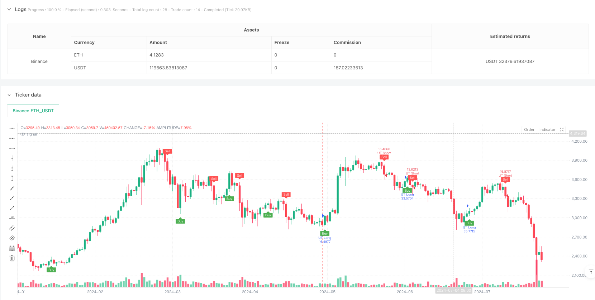
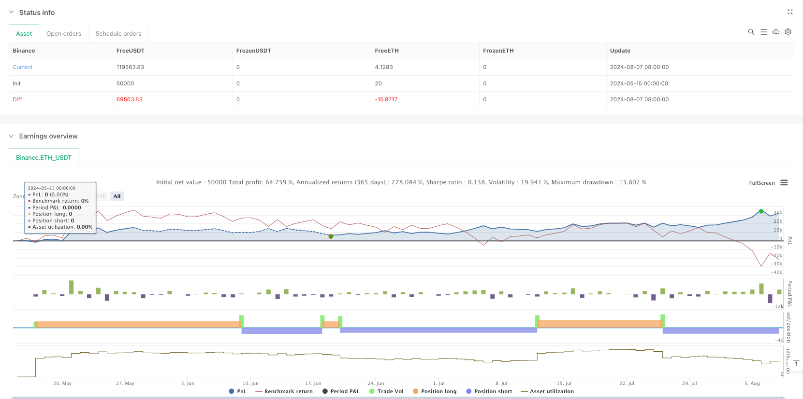

> Name

ATR Dynamic Trend Following and Moving Average Crossover Trading Strategy-ATR-Dynamic-Trend-Following-and-EMA-Crossover-Trading-Strategy
> Author

ianzeng123

> Strategy Description





[trans]
#### Overview
This is a trend following strategy based on the ATR (Average True Range) indicator that combines dynamic stops with moving average crossover signals. This strategy determines market volatility by calculating ATR and uses this information to establish dynamic trailing stops. When the price and EMA (exponential moving average) break through the ATR trailing stop line, a trading signal is generated. The strategy also provides the option of using ordinary K-lines or Ping An K-lines for calculation, which increases the flexibility of the strategy.
#### Strategy Principle
The core logic of the strategy is based on the following key calculations:
1. Use the ATR indicator to measure market volatility, the cycle is adjustable
2. Calculate the dynamic stop loss distance based on the ATR value and adjust it through the sensitivity parameter a
3. Construct an ATR trailing stop loss line, which is dynamically adjusted as the price moves.
4. Use the intersection of the 1-period EMA and the ATR trailing stop line to determine the trading signal
5. Open a long position when the EMA breaks through the ATR trailing stop loss line upwards, and a short position when it breaks downwards.
6. You can choose to use the ordinary closing price or the HLC3 price of Ping An K-line as the calculation basis.
#### Strategic Advantages
1. Strong dynamic adaptability: ATR trailing stop loss can be automatically adjusted according to market volatility, so that the strategy can maintain stability in different market environments.
2. Improved risk control: continuous protection of positions through dynamic stop loss lines
3. Good parameter adjustability: the ATR cycle and sensitivity can be adjusted to adapt to different market characteristics
4. The signal is clear and reliable: combined with the moving average crossover, it provides clear entry and exit signals.
5. Simple calculation logic: clear strategy logic, easy to understand and maintain
6. Good visualization effect: Provides graphical display of trading signals and trends
#### Strategy Risk
1. Risk of volatile market: Frequent false breakthrough signals may occur in a volatile market.
2. Impact of slippage: Under rapid market conditions, you may face larger slippage, which will affect your strategy performance.
3. Parameter sensitivity: Different parameter combinations may lead to large differences in strategy performance
4. Trend dependence: The performance of the strategy in non-trending markets may not be ideal.
5. Stop loss width: abnormal ATR value may lead to unreasonable stop loss position
#### Strategy optimization direction
1. Add trend filter: introduce additional trend judgment indicators to reduce false signals in volatile markets
2. Optimization parameter adaptation: develop a mechanism to automatically optimize the ATR period and sensitivity
3. Improve signal confirmation: increase trading volume or other technical indicators as signal confirmation
4. Improve the stop loss mechanism: add the combination of fixed stop loss and trailing stop loss based on ATR
5. Increase position management: dynamically adjust position size according to market volatility
#### Summary
This is a complete trading strategy that combines a dynamic trailing stop and moving average system. Capture the characteristics of market fluctuations through the ATR indicator, and use moving average crossovers to provide trading signals, forming a logically rigorous trading system. The advantage of the strategy lies in its dynamic adaptability and risk control capabilities, but it also needs to pay attention to its performance in sideways markets. There is room for further improvement of the strategy through the suggested optimization directions. ||
#### Overview
This is a trend following strategy based on the ATR (Average True Range) indicator, combining dynamic stop-loss and EMA crossover signals. The strategy calculates ATR to determine market volatility and uses this information to establish a dynamic trailing stop line. Trading signals are generated when price and EMA (Exponential Moving Average) break through the ATR trailing stop line. The strategy also offers the option to use regular or Heikin Ashi candles for calculations, adding flexibility.

#### Strategy Principles
The core logic of the strategy is based on the following key calculations:
1. Using ATR indicator to measure market volatility with adjustable period
2. Calculating dynamic stop-loss distance based on ATR value, adjusted by sensitivity parameter a
3. Building ATR trailing stop line that dynamically adjusts with price movement
4. Using 1-period EMA crossover with ATR trailing stop line to determine trading signals
5. Opening long positions when EMA breaks above ATR trailing stop line, short when breaking below
6. Option to use regular closing price or Heikin Ashi HLC3 price as calculation basis

#### Strategy Advantages
1. Strong Dynamic Adaptability: ATR trailing stop automatically adjusts to market volatility, maintaining strategy stability in different market conditions
2. Comprehensive Risk Control: Continuous position protection through dynamic stop-loss line
3. Good Parameter Adjustability: Can adapt to different market characteristics by adjusting ATR period and sensitivity
4. Clear and Reliable Signals: Provides clear entry and exit signals through EMA crossover
5. Concise Calculation Logic: Clear strategy logic, easy to understand and maintain
6. Good Visualization: Provides graphical display of trading signals and trends

#### Strategy Risks
1. Choppy Market Risk: May generate frequent false breakout signals in sideways markets
2. Slippage Impact: May face significant slippage in fast markets, affecting strategy performance
3. Parameter Sensitivity: Different parameter combinations may lead to large performance variations
4. Trend Dependency: Strategy may not perform well in non-trending markets
5. Stop-Loss Range: Abnormal ATR values may lead to unreasonable stop-loss positions

#### Strategy Optimization Directions
1. Add Trend Filter: Introduce additional trend judgment indicators to reduce false signals in choppy markets
2. Optimize Parameter Adaptation: Develop mechanism to automatically optimize ATR period and sensitivity
3. Improve Signal Confirmation: Add volume or other technical indicators for signal confirmation
4. Enhance Stop-Loss Mechanism: Combine fixed and trailing stops with ATR-based stops
5. Add Position Management: Dynamically adjust position size based on market volatility

#### Summary
This is a complete trading strategy combining dynamic trailing stops and moving average systems. It captures market volatility characteristics through the ATR indicator and provides trading signals using EMA crossover, forming a logically rigorous trading system. The strategy's strengths lie in its dynamic adaptability and risk control capabilities, but attention needs to be paid to its performance in sideways markets. Through the suggested optimization directions, there is room for further improvement of the strategy.[/trans]


> Source (PineScript)

``` pinescript
/*backtest
start: 2024-05-15 00:00:00
end: 2024-08-08 00:00:00
period: 1d
basePeriod: 1d
exchanges: [{"eid":"Binance","currency":"ETH_USDT"}]
*/

//@version=6
strategy(title="UT Bot Strategy", overlay=true, default_qty_type=strategy.percent_of_equity, default_qty_value=100)

// Inputs
a = input.float(1, title="Key Value. 'This changes the sensitivity'")
c = input.int(10, title="ATR Period")
h = input.bool(false, title="Signals from Heikin Ashi Candles")

// Calculate ATR
xATR = ta.atr(c)
nLoss = a * xATR

// Source for calculations
src = h ? request.security(syminfo.tickerid, timeframe.period, hlc3) : close

// ATR Trailing Stop logic
var float xATRTrailingStop = na
if (not na(xATRTrailingStop[1]) and src > xATRTrailingStop[1] and src[1] > xATRTrailingStop[1])
    xATRTrailingStop := math.max(xATRTrailingStop[1], src - nLoss)
else if (not na(xATRTrailingStop[1]) and src < xATRTrailingStop[1] and src[1] < xATRTrailingStop[1])
    xATRTrailingStop := math.min(xATRTrailingStop[1], src + nLoss)
else
    xATRTrailingStop := src > xATRTrailingStop[1] ? src - nLoss : src + nLoss

// Position logic
var int pos = 0
if (not na(xATRTrailingStop[1]) and src[1] < xATRTrailingStop[1] and src > xATRTrailingStop[1])
    pos := 1
else if (not na(xATRTrailingStop[1]) and src[1] > xATRTrailingStop[1] and src < xATRTrailingStop[1])
    pos := -1
else
    pos := pos[1]

xcolor = pos == -1 ? color.red : pos == 1 ? color.green : color.blue

// Entry and Exit Signals
ema = ta.ema(src, 1)
above = ta.crossover(ema, xATRTrailingStop)
below = ta.crossover(xATRTrailingStop, ema)

buy = src > xATRTrailingStop and above
sell = src < xATRTrailingStop and below

// Strategy Execution
if (buy)
    strategy.entry("UT Long", strategy.long)
if (sell)
    strategy.entry("UT Short", strategy.short)

// Plotting and Alerts
plotshape(buy, title="Buy", text='Buy', style=shape.labelup, location=location.belowbar, color=color.green, textcolor=color.white, size=size.tiny)
plotshape(sell, title="Sell", text='Sell', style=shape.labeldown, location=location.abovebar, color=color.red, textcolor=color.white, size=size.tiny)

barcolor(src > xATRTrailingStop ? color.green : src < xATRTrailingStop ? color.red : na)

alertcondition(buy, title="UT Long", message="UT Long")
alertcondition(sell, title="UT Short", message="UT Short")

```

> Detail

https://www.fmz.com/strategy/483117

> Last Modified

2025-02-27 16:57:27
