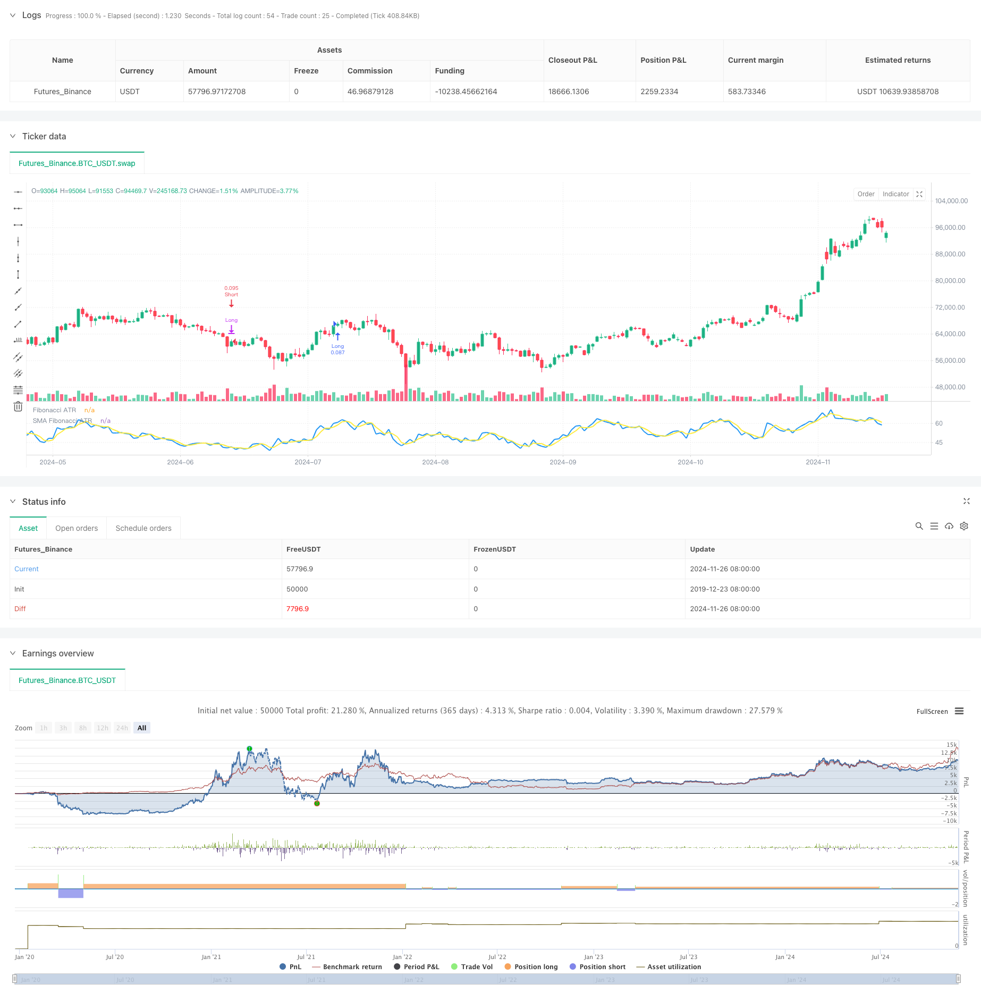

> Name

ATR Fusion Trend Optimization Model Strategy-ATR-Fusion-Trend-Optimization-Model-Strategy
> Author

ChaoZhang

> Strategy Description



[trans]
#### Overview
This strategy is an advanced trend following system based on ATR and Fibonacci sequence weighting. It builds a responsive and adaptable trading model by combining volatility analysis over multiple time periods with Fibonacci weighted averages. The core of this strategy is to better capture market trends through dynamic weight allocation and use ATR to achieve precise profit taking.
#### Strategy Principle
The strategy adopts a multi-level technical indicator combination method: first calculate the true fluctuation range (TR) and buying pressure (BP), and then calculate the pressure ratio of each period based on the Fibonacci sequence time period (8, 13, 21, 34, 55). By applying different weights (5, 4, 3, 2, 1) to different periods, a weighted average is constructed, and 3-period SMA smoothing is further applied. The system triggers trading signals based on the intersection of SMA and preset thresholds (58.0 and 42.0), and uses ATR to design a four-step profit-taking mechanism.
#### Strategic Advantages
1. Multi-dimensional analysis: Combining data from multiple time periods to provide a more comprehensive market perspective
2. Dynamic adaptation: Adapt to market fluctuations through ATR to improve strategy stability
3. Intelligent profit-making: the four-step profit-making mechanism can be flexibly adjusted in different market environments
4. Controllable risks: clear entry and exit conditions to reduce risks caused by subjective judgments
5. Systematic operation: The strategy logic is clear and easy to implement quantitatively and verify through backtesting.
#### Strategy Risk
1. Parameter sensitivity: multiple thresholds and weight parameters need to be carefully adjusted
2. Hysteresis risk: SMA smoothing may cause signal delay
3. Dependence on market environment: False signals may occur in volatile markets
4. Parameter adaptation: parameters need to be re-optimized under different market conditions
Solution: It is recommended to conduct sufficient parameter optimization and backtesting, and dynamically adjust parameters according to different market stages.
#### Strategy optimization direction
1. Parameter adaptation: develop adaptive parameter adjustment mechanism to improve strategy adaptability
2. Market screening: Add a market environment identification module to execute transactions under suitable market conditions.
3. Signal optimization: Introduce auxiliary confirmation indicators to improve signal reliability
4. Enhanced risk control: Added dynamic stop loss and position management modules
5. Retracement control: Add maximum retracement limit to improve strategy stability
#### Summary
This strategy builds a comprehensive trend following system by integrating ATR and Fibonacci weighted average techniques. Its advantage lies in multi-dimensional analysis and dynamic adaptability, but it also requires attention to parameter optimization and market environment screening. Through continuous optimization and enhanced risk control, the strategy is expected to maintain stable performance in different market environments. ||
#### Overview
This strategy is an advanced trend following system based on ATR and Fibonacci weighted averages. It combines volatility analysis across multiple timeframes with Fibonacci weighted averaging to create a responsive and adaptive trading model. The core strength lies in its dynamic weight allocation for better trend capture and precise profit-taking using ATR.

#### Strategy Principle
The strategy employs a multi-layered technical indicator approach: It first calculates True Range (TR) and Buying Pressure (BP), then computes pressure ratios based on Fibonacci sequence periods (8,13,21,34,55). Different weights (5,4,3,2,1) are applied to different periods to construct a weighted average, further smoothed by a 3-period SMA. Trading signals are triggered by SMA crossovers with preset thresholds (58.0 and 42.0), and a four-step profit-taking mechanism is designed using ATR.

#### Strategy Advantages
1. Multi-dimensional analysis: Combines data from multiple timeframes for a comprehensive market perspective
2. Dynamic adaptation: Adapts to market volatility through ATR, enhancing strategy stability
3. Intelligent profit-taking: Four-step profit mechanism flexibly adjusts to different market conditions
4. Controlled risk: Clear entry and exit conditions reduce subjective judgment risks
5. Systematic operation: Clear strategy logic, easy to quantify and backtest

#### Strategy Risks
1. Parameter sensitivity: Multiple thresholds and weight parameters require careful adjustment
2. Lag risk: SMA smoothing may cause signal delays
3. Market environment dependence: May generate false signals in ranging markets
4. Parameter fitting: Parameters need optimization for different market conditions
Solution: Recommend thorough parameter optimization and backtesting, with dynamic parameter adjustment for different market phases.

#### Strategy Optimization Directions
1. Parameter adaptation: Develop adaptive parameter adjustment mechanisms
2. Market filtering: Add market environment recognition module
3. Signal optimization: Introduce auxiliary confirmation indicators
4. Risk control enhancement: Add dynamic stop-loss and position management
5. Drawdown control: Implement maximum drawdown limits

#### Summary
This strategy integrates ATR and Fibonacci weighted averages to build a comprehensive trend following system. Its strengths lie in multi-dimensional analysis and dynamic adaptation capabilities, while attention must be paid to parameter optimization and market environment filtering. Through continuous optimization and risk control enhancement, the strategy can maintain stable performance across different market conditions.[/trans]


> Source (PineScript)

``` pinescript
/*backtest
start: 2019-12-23 08:00:00
end: 2024-11-27 00:00:00
period: 1d
basePeriod: 1d
exchanges: [{"eid":"Futures_Binance","currency":"BTC_USDT"}]
*/

// This Pine Script™ code is subject to the terms of the Mozilla Public License 2.0 at https://mozilla.org/MPL/2.0/
// © PresentTrading

// The Fibonacci ATR Fusion Strategy is an advanced trading methodology that uniquely integrates Fibonacci-based weighted averages with the Average True Range (ATR) to 
// identify and exploit significant market trends. Unlike traditional strategies that rely on single indicators or fixed parameters, this approach leverages multiple timeframes and 
// dynamic volatility measurements to enhance accuracy and adaptability. 

//@version=5
strategy("Fibonacci ATR Fusion - Strategy [presentTrading]", overlay=false, precision=3, commission_value= 0.1, commission_type=strategy.commission.percent, slippage= 1, currency=currency.USD, default_qty_type = strategy.percent_of_equity, default_qty_value = 10, initial_capital=10000)

// Calculate True High and True Low
tradingDirection = input.string(title="Trading Direction", defval="Both", options=["Long", "Short", "Both"])

// Trading Condition Thresholds
long_entry_threshold = input.float(58.0, title="Long Entry Threshold")
short_entry_threshold = input.float(42.0, title="Short Entry Threshold")
long_exit_threshold = input.float(42.0, title="Long Exit Threshold")
short_exit_threshold = input.float(58.0, title="Short Exit Threshold")

// Enable or Disable 4-Step Take Profit
useTakeProfit = input.bool(false, title="Enable 4-Step Take Profit")

// Take Profit Levels (as multiples of ATR)
tp1ATR = input.float(3.0, title="Take Profit Level 1 ATR Multiplier")
tp2ATR = input.float(8.0, title="Take Profit Level 2 ATR Multiplier")
tp3ATR = input.float(14.0, title="Take Profit Level 3 ATR Multiplier")

// Take Profit Percentages
tp1_percent = input.float(12.0, title="TP Level 1 Percentage", minval=0.0, maxval=100.0)
tp2_percent = input.float(12.0, title="TP Level 2 Percentage", minval=0.0, maxval=100.0)
tp3_percent = input.float(12.0, title="TP Level 3 Percentage", minval=0.0, maxval=100.0)

true_low = math.min(low, close[1])
true_high = math.max(high, close[1])

// Calculate True Range
true_range = true_high - true_low

// Calculate BP (Buying Pressure)
bp = close - true_low

// Calculate ratios for different periods
calc_ratio(len) =>
    sum_bp = math.sum(bp, len)
    sum_tr = math.sum(true_range, len)
    100 * sum_bp / sum_tr

// Calculate weighted average of different timeframes
weighted_avg = (5 * calc_ratio(8) + 4 * calc_ratio(13) + 3 * calc_ratio(21) + 2 * calc_ratio(34) + calc_ratio(55)) / (5 + 4 + 3 + 2 + 1)
weighted_avg_sma = ta.sma(weighted_avg,3)

// Plot the indicator
plot(weighted_avg, "Fibonacci ATR", color=color.blue, linewidth=2)
plot(weighted_avg_sma, "SMA Fibonacci ATR", color=color.yellow, linewidth=2)

// Define trading conditions
longCondition = ta.crossover(weighted_avg_sma, long_entry_threshold)  // Enter long when weighted average crosses above threshold
shortCondition = ta.crossunder(weighted_avg_sma, short_entry_threshold) // Enter short when weighted average crosses below threshold
longExit = ta.crossunder(weighted_avg_sma, long_exit_threshold)
shortExit = ta.crossover(weighted_avg_sma, short_exit_threshold)


atrPeriod = 14
atrValue = ta.atr(atrPeriod)

if (tradingDirection == "Long" or tradingDirection == "Both")
    if (longCondition)
        strategy.entry("Long", strategy.long)
        // Set Take Profit levels for Long positions
        if useTakeProfit
            tpPrice1 = strategy.position_avg_price + tp1ATR * atrValue
            tpPrice2 = strategy.position_avg_price + tp2ATR * atrValue
            tpPrice3 = strategy.position_avg_price + tp3ATR * atrValue
            // Close partial positions at each Take Profit level
            strategy.exit("TP1 Long", from_entry="Long", qty_percent=tp1_percent, limit=tpPrice1)
            strategy.exit("TP2 Long", from_entry="Long", qty_percent=tp2_percent, limit=tpPrice2)
            strategy.exit("TP3 Long", from_entry="Long", qty_percent=tp3_percent, limit=tpPrice3)
    if (longExit)
        strategy.close("Long")

if (tradingDirection == "Short" or tradingDirection == "Both")
    if (shortCondition)
        strategy.entry("Short", strategy.short)
        // Set Take Profit levels for Short positions
        if useTakeProfit
            tpPrice1 = strategy.position_avg_price - tp1ATR * atrValue
            tpPrice2 = strategy.position_avg_price - tp2ATR * atrValue
            tpPrice3 = strategy.position_avg_price - tp3ATR * atrValue
            // Close partial positions at each Take Profit level
            strategy.exit("TP1 Short", from_entry="Short", qty_percent=tp1_percent, limit=tpPrice1)
            strategy.exit("TP2 Short", from_entry="Short", qty_percent=tp2_percent, limit=tpPrice2)
            strategy.exit("TP3 Short", from_entry="Short", qty_percent=tp3_percent, limit=tpPrice3)
    if (shortExit)
        strategy.close("Short")
```

> Detail

https://www.fmz.com/strategy/473263

> Last Modified

2024-11-28 17:06:21
