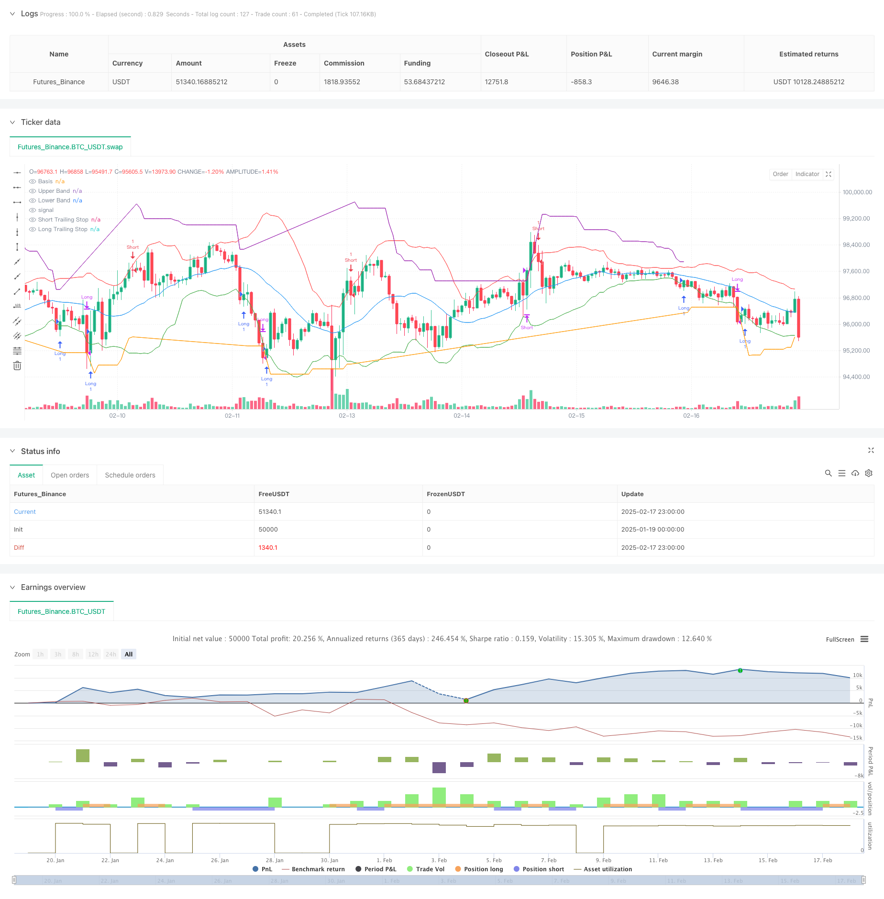

> Name

Adaptive Bollinger Bands ATR Trailing Stop Trading Strategy-Adaptive-Bollinger-Bands-ATR-Trailing-Stop-Trading-Strategy
> Author

ChaoZhang

> Strategy Description



[trans]
#### Overview
This strategy is an adaptive trading system that combines Bollinger Bands and ATR trailing stops. The strategy determines the entry signal through the breakthrough of the upper and lower Bollinger Bands, and uses dynamic trailing stop loss based on ATR to manage risks and determine the timing of exit. This strategy can capture trend opportunities when the market trend is obvious, while providing protection in volatile markets.
#### Strategy Principle
The core logic of the strategy consists of two main parts:
1. Entry signal system: Using Bollinger Bands (BB) as the main indicator, a long signal is generated when the price breaks through the lower track, and a short signal is generated when the price breaks through the upper track. The Bollinger Band parameters are set to the 20-period moving average as the middle track, and the standard deviation multiple is 2.0.
2. Stop loss management system: 14-period ATR is used as the volatility reference, and the multiplier is 3.0. When holding a long position, the stop loss line will move up as the price rises and vice versa. This dynamic stop-loss mechanism can allow profits to grow naturally while effectively controlling drawdowns.
#### Strategic Advantages
1. Strong adaptability: Both Bollinger Bands and ATR are indicators calculated based on actual market fluctuations and can automatically adapt to different market environments.
2. Perfect risk control: through ATR dynamic stop loss, you can stop the loss in time without exiting the strong trend prematurely.
3. Clear signals: Entry and exit signals are based on clear price breakthroughs and do not require subjective judgment.
4. High degree of visualization: The strategy clearly marks all signal points on the chart to facilitate analysis and optimization.
#### Strategy Risk
1. Risk of volatile market: In a market without an obvious trend, false breakthrough signals may occur frequently, leading to continuous stop losses.
2. Slippage risk: When the market fluctuates violently, the actual transaction price may deviate greatly from the theoretical signal price.
3. Parameter sensitivity: The strategy effect is relatively sensitive to the parameter settings of Bollinger Bands and ATR, and needs to be optimized for different market environments.
#### Strategy optimization direction
1. Add trend filter: You can add additional trend judgment indicators, only open positions when the trend is clear, and reduce false signals in volatile markets.
2. Optimize stop loss parameters: The ATR multiplier can be dynamically adjusted according to different market conditions, and a looser stop loss can be adopted when volatility is high.
3. Introducing position management: A dynamic position system can be designed based on ATR to automatically adjust the opening size under different fluctuation environments.
4. Add time filtering: You can avoid transactions in periods of high volatility such as the release of important economic data.
#### Summary
This strategy combines Bollinger Bands and ATR trailing stop loss to build a trading system with both trend capture and risk control capabilities. The adaptive nature of the strategy enables it to maintain stability in different market environments, while the clear signal system provides an objective basis for trading. There is room for further improvement of the strategy through the suggested optimization directions. In practical applications, it is recommended that investors make targeted adjustments to parameters based on their own risk preferences and characteristics of trading varieties. ||
#### Overview
This strategy is an adaptive trading system that combines Bollinger Bands and ATR trailing stop loss. It uses Bollinger Bands breakouts for entry signals while implementing an ATR-based dynamic trailing stop loss for risk management and exit timing. The strategy is designed to capture trending opportunities while providing protection in ranging markets.

#### Strategy Principles
The core logic consists of two main components:
1. Entry Signal System: Uses Bollinger Bands (BB) as the primary indicator, generating long signals when price breaks above the lower band and short signals when price breaks below the upper band. BB parameters are set to 20-period moving average as the middle band with a standard deviation multiplier of 2.0.
2. Stop Loss Management System: Employs a 14-period ATR with a multiplier of 3.0 for volatility reference. The stop loss line moves up with price increases during long positions and vice versa. This dynamic stop loss mechanism allows profits to grow naturally while effectively controlling drawdowns.

#### Strategy Advantages
1. High Adaptability: Both Bollinger Bands and ATR are calculated based on actual market volatility, automatically adapting to different market conditions.
2. Comprehensive Risk Control: The ATR dynamic stop loss enables timely exits while avoiding premature exits in strong trends.
3. Clear Signals: Entry and exit signals are based on definitive price breakouts, requiring no subjective judgment.
4. High Visualization: The strategy clearly marks all signal points on the chart, facilitating analysis and optimization.

#### Strategy Risks
1. Ranging Market Risk: In markets without clear trends, frequent false breakouts may lead to consecutive stop losses.
2. Slippage Risk: During high volatility periods, actual execution prices may significantly deviate from theoretical signal prices.
3. Parameter Sensitivity: Strategy performance is sensitive to Bollinger Bands and ATR parameter settings, requiring optimization for different market environments.

#### Strategy Optimization Directions
1. Add Trend Filters: Additional trend identification indicators can be incorporated to open positions only in clear trends, reducing false signals in ranging markets.
2. Optimize Stop Loss Parameters: ATR multiplier can be dynamically adjusted based on different market conditions, using wider stops in high volatility periods.
3. Implement Position Sizing: Design a dynamic position sizing system based on ATR to automatically adjust position size in different volatility environments.
4. Include Time Filters: Avoid trading during high volatility periods such as major economic data releases.

#### Summary
The strategy combines Bollinger Bands and ATR trailing stop loss to create a trading system that balances trend capture and risk control capabilities. Its adaptive nature maintains stability across different market environments, while the clear signal system provides objective trading criteria. The suggested optimization directions offer room for further improvement. In practical application, investors should adjust parameters according to their risk preferences and specific trading instrument characteristics.[/trans]


> Source (PineScript)

``` pinescript
/*backtest
start: 2025-01-19 00:00:00
end: 2025-02-18 00:00:00
period: 1h
basePeriod: 1h
exchanges: [{"eid":"Futures_Binance","currency":"BTC_USDT"}]
*/

//@version=5
strategy("ATR Trailing Stop Loss with Bollinger Bands", overlay=true)

// Input parameters for Bollinger Bands
bb_length = input.int(20, title="Bollinger Bands Length")
bb_stddev = input.float(2.0, title="Bollinger Bands Std Dev")

// Input parameters for ATR Trailing Stop Loss
atr_length = input.int(14, title="ATR Length")
atr_multiplier = input.float(3.0, title="ATR Multiplier")

// Calculate Bollinger Bands
basis = ta.sma(close, bb_length)
upper_band = ta.sma(close, bb_length) + ta.stdev(close, bb_length) * bb_stddev
lower_band = ta.sma(close, bb_length) - ta.stdev(close, bb_length) * bb_stddev

// Calculate ATR
atr = ta.atr(atr_length)

// Trailing Stop Loss Calculation
var float long_stop = na  // Explicitly define as float type
var float short_stop = na // Explicitly define as float type

if (strategy.position_size > 0)
    long_stop := close - atr * atr_multiplier
    long_stop := math.max(long_stop, nz(long_stop[1], long_stop))
else
    long_stop := na

if (strategy.position_size < 0)
    short_stop := close + atr * atr_multiplier
    short_stop := math.min(short_stop, nz(short_stop[1], short_stop))
else
    short_stop := na

// Entry and Exit Conditions
long_condition = ta.crossover(close, lower_band)  // Enter long when price crosses above lower band
short_condition = ta.crossunder(close, upper_band)  // Enter short when price crosses below upper band

exit_long_condition = ta.crossunder(close, long_stop)  // Exit long when price crosses below trailing stop
exit_short_condition = ta.crossover(close, short_stop)  // Exit short when price crosses above trailing stop

// Execute Trades
if (long_condition)
    strategy.entry("Long", strategy.long)

if (short_condition)
    strategy.entry("Short", strategy.short)

if (exit_long_condition)
    strategy.close("Long")

if (exit_short_condition)
    strategy.close("Short")

// Plot Bollinger Bands
plot(basis, color=color.blue, title="Basis")
plot(upper_band, color=color.red, title="Upper Band")
plot(lower_band, color=color.green, title="Lower Band")

// Plot Trailing Stop Loss
plot(strategy.position_size > 0 ? long_stop : na, color=color.orange, title="Long Trailing Stop")
plot(strategy.position_size < 0 ? short_stop : na, color=color.purple, title="Short Trailing Stop")

// Labels for Entry and Exit
if (long_condition)
    label.new(bar_index, low, text="Entry Long", style=label.style_circle, color=color.green, textcolor=color.white, size=size.small)

if (short_condition)
    label.new(bar_index, high, text="Entry Short", style=label.style_circle, color=color.red, textcolor=color.white, size=size.small)

if (exit_long_condition)
    label.new(bar_index, low, text="Exit Long", style=label.style_circle, color=color.blue, textcolor=color.white, size=size.small)

if (exit_short_condition)
    label.new(bar_index, high, text="Exit Short", style=label.style_circle, color=color.orange, textcolor=color.white, size=size.small)
```

> Detail

https://www.fmz.com/strategy/482593

> Last Modified

2025-02-19 11:00:57
