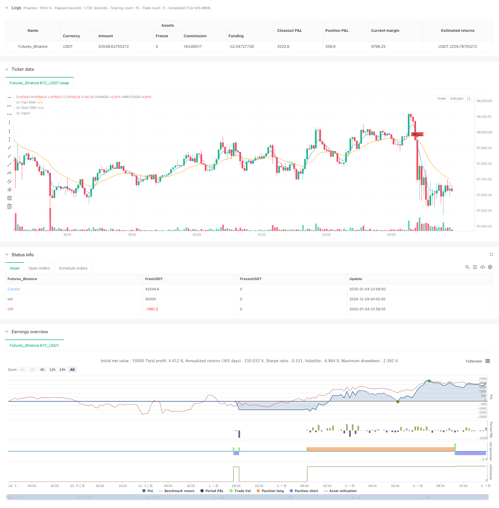

> Name

Advanced-EMA-Crossover-Trend-Following-Strategy-with-ATR-Based-Dynamic-Stop-Management-System
> Author

ChaoZhang

> Strategy Description



[trans]
#### Overview
This strategy is a trend following trading system that combines moving average crossover signals with dynamic risk management. It uses fast and slow exponential moving averages (EMA) to identify market trends, combined with the average true range (ATR) indicator to optimize entry timing. At the same time, the strategy integrates triple protection mechanisms of percentage stop loss, target profit and trailing stop loss.
#### Strategy Principle
The core logic of the strategy is based on the following key elements:
1. Use 5-period and 20-period EMA crossovers to determine trend direction
2. Enhance the reliability of trading signals through ATR multiple filtering
3. Trigger a trading signal when an EMA crossover occurs and price breaks out of the ATR channel
4. Immediately after opening a position, set a fixed stop loss of 1% and a profit target of 5%
5. Use ATR-based trailing stops to protect profits
6. Long and short two-way trading to fully seize market opportunities
#### Strategic Advantages
1. The signal system combines trend and volatility indicators to improve the accuracy of trading
2. The dynamic ATR channel can adapt to the fluctuation characteristics of different market environments.
3. The triple risk control mechanism provides comprehensive protection for transactions
4. The parameters are highly adjustable and can be optimized according to different market characteristics.
5. The system has a high degree of automation, which reduces the emotional impact of human intervention.
#### Strategy Risk
1. EMA crossover may cause lag, and the best entry point may be missed in a violently volatile market.
2. Fixed percentage stops may not be flexible enough during periods of high volatility
3. Frequent transactions may bring higher handling fee costs
4. Frequent false signals may occur in range-bound markets
5. Trailing stop loss may exit early in a rapid retracement
#### Strategy optimization direction
1. Introduce trading volume indicators to verify the validity of the trend
2. Add a market environment identification mechanism and use different parameters under different market conditions.
3. Optimize ATR multiples and establish an adaptive dynamic parameter system
4. Combine more technical indicators to filter out false signals
5. Develop more flexible fund management solutions
#### Summary
This is a well designed and logical trend following strategy. Capturing trends through moving average crossovers, using ATR to control risks, and combining with multiple stop-loss mechanisms form a complete trading system. The main advantage of the strategy is its comprehensive risk control and high degree of customizability, but you need to pay attention to the problems of false signals and transaction costs in real trading. There is room for further improvement of the strategy through the suggested optimization directions. ||
#### Overview
This strategy is a trend following trading system that combines EMA crossover signals with dynamic risk management. It uses fast and slow Exponential Moving Averages (EMA) to identify market trends and incorporates the Average True Range (ATR) indicator to optimize entry timing. The strategy also integrates three layers of protection: percentage-based stop loss, take profit, and trailing stop.

#### Strategy Principles
The core logic is based on the following key elements:
1. Uses 5-period and 20-period EMA crossovers to determine trend direction
2. Enhances signal reliability through ATR multiplier filtering
3. Triggers trading signals when EMA crosses occur and price breaks ATR channel
4. Sets immediate 1% fixed stop loss and 5% profit target upon position entry
5. Employs ATR-based trailing stop to protect profits
6. Trades both long and short directions to capture all market opportunities

#### Strategy Advantages
1. Signal system combines trend and volatility indicators for improved accuracy
2. Dynamic ATR channel adapts to volatility characteristics in different market conditions
3. Triple risk control mechanism provides comprehensive protection
4. Highly adjustable parameters for optimization across different market characteristics
5. High level of automation reduces emotional interference in trading decisions

#### Strategy Risks
1. EMA crossovers may lag in volatile markets, potentially missing optimal entry points
2. Fixed percentage stops may lack flexibility during high volatility periods
3. Frequent trading might incur significant transaction costs
4. May generate frequent false signals in ranging markets
5. Trailing stops might exit positions prematurely during quick retracements

#### Optimization Directions
1. Incorporate volume indicators to validate trend strength
2. Add market regime identification mechanism for parameter adaptation
3. Optimize ATR multiplier with adaptive dynamic parameter system
4. Integrate additional technical indicators to filter false signals
5. Develop more flexible capital management solutions

#### Summary
This is a well-designed trend following strategy with clear logic. It captures trends through EMA crossovers, manages risk using ATR, and incorporates multiple stop loss mechanisms to form a complete trading system. The strategy's main advantages lie in its comprehensive risk control and high customizability, but attention must be paid to false signals and transaction costs in live trading. Through the suggested optimization directions, there is room for further improvement in the strategy's performance.[/trans]


> Source (PineScript)

``` pinescript
/*backtest
start: 2024-12-29 00:00:00
end: 2025-01-05 00:00:00
period: 2m
basePeriod: 2m
exchanges: [{"eid":"Futures_Binance","currency":"BTC_USDT"}]
*/

// This Pine Script™ code is subject to the terms of the Mozilla Public License 2.0 at https://mozilla.org/MPL/2.0/
// © jesusperezguitarra89

//@version=6
strategy("High Profit Buy/Sell Signals", overlay=true)

// Parámetros ajustables
fastLength = input.int(5, title="Fast EMA Length")
slowLength = input.int(20, title="Slow EMA Length")
atrLength = input.int(10, title="ATR Length")
atrMultiplier = input.float(2.5, title="ATR Multiplier")
stopLossPercent = input.float(1.0, title="Stop Loss %")
takeProfitPercent = input.float(5.0, title="Take Profit %")
trailingStop = input.float(2.0, title="Trailing Stop %")

// Cálculo de EMAs
fastEMA = ta.ema(close, fastLength)
slowEMA = ta.ema(close, slowLength)

// Cálculo del ATR
atr = ta.atr(atrLength)

// Señales de compra y venta
longCondition = ta.crossover(fastEMA, slowEMA) and close > slowEMA + atrMultiplier * atr
shortCondition = ta.crossunder(fastEMA, slowEMA) and close < slowEMA - atrMultiplier * atr

// Dibujar señales en el gráfico
plotshape(series=longCondition, location=location.belowbar, color=color.green, style=shape.labelup, text="BUY")
plotshape(series=shortCondition, location=location.abovebar, color=color.red, style=shape.labeldown, text="SELL")

// Estrategia de backtesting para marcos de tiempo en minutos
if longCondition
    strategy.entry("Buy", strategy.long)
    strategy.exit("Take Profit", from_entry="Buy", limit=close * (1 + takeProfitPercent / 100), stop=close * (1 - stopLossPercent / 100), trail_points=atr * trailingStop)
if shortCondition
    strategy.entry("Sell", strategy.short)
    strategy.exit("Take Profit", from_entry="Sell", limit=close * (1 - takeProfitPercent / 100), stop=close * (1 + stopLossPercent / 100), trail_points=atr * trailingStop)

// Mostrar EMAs
plot(fastEMA, color=color.blue, title="Fast EMA")
plot(slowEMA, color=color.orange, title="Slow EMA")

```

> Detail

https://www.fmz.com/strategy/477584

> Last Modified

2025-01-06 15:35:07
