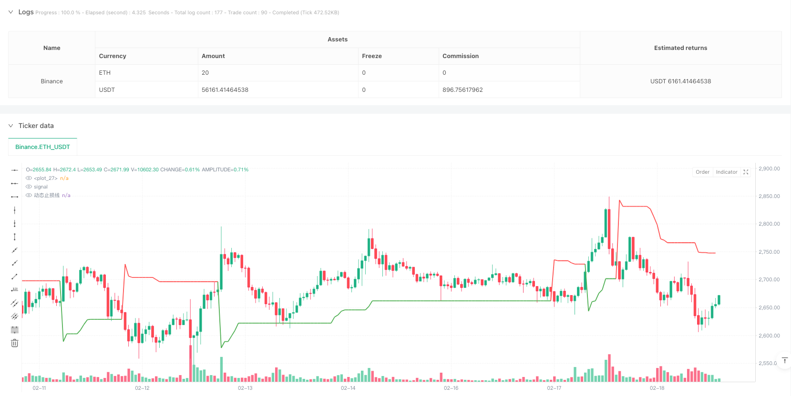
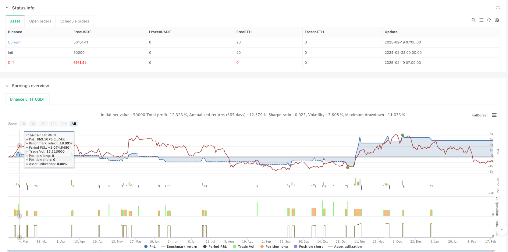

> Name

Advanced Quantitative-Trading-Strategy-Multi-Dimensional-Super-Trend-ATR-Dynamic-Tracking-System
> Author

ianzeng123

> Strategy Description





[trans]
#### Overview
This strategy is a quantitative trading system based on multiple technical indicators. The core is driven by the SuperTrend indicator, combined with the ATR dynamic stop loss mechanism, and uses indicators such as MACD, ADX, and RSI for multi-dimensional trend confirmation and risk control. The strategy uses a six-fold filtering mechanism to identify high-probability trading opportunities, and introduces triple divergence detection to provide early warning of market risks.
#### Strategy Principle
The strategy takes the SuperTrend indicator as the core and dynamically calculates the trend direction through factor and ATR parameters. Entry signals must meet the following conditions at the same time:
1. SuperTrend direction indication
2. MACD histogram position verification
3. ADX trend strength confirmation
4. Confirmation of K-line pattern
5. Volume amplification verification
6. Triple divergence detection
The system uses ATR dynamic stop loss to control risks and combines trend reversal signals with position management.
#### Strategic Advantages
1. Multi-dimensional indicator fusion improves signal reliability
2. The ATR dynamic stop loss mechanism can adapt to market fluctuations
3. The triple divergence detection system provides risk warning function
4. Trading volume verification ensures trading activity
5. Gas fee filtering mechanism reduces transaction costs
6. Complete visualization system facilitates policy monitoring
#### Strategy Risk
1. Multiple filters may result in missing some trading opportunities
2. Parameter optimization has the risk of overfitting
3. Periods of high market volatility may trigger frequent stop losses.
4. Gas fee fluctuations may affect strategy returns
5. Indicator combinations may produce chaotic signals in sideways markets
#### Strategy optimization direction
1. Introduce market cycle identification module to realize parameter adaptation
2. Develop signal weighting system based on machine learning
3. Optimize gas fee prediction model to improve transaction timing
4. Add transaction cost calculation module
5. Develop a position management system based on volatility
#### Summary
This strategy builds a robust quantitative trading system through the integration of multi-dimensional indicators and strict risk control. The modular design of the system facilitates subsequent optimization and expansion, but in practical applications, attention needs to be paid to parameter tuning and market adaptability. Innovative designs such as triple divergence warning and gas fee filtering further enhance the practicality of the strategy. ||
#### Overview
This strategy is a quantitative trading system based on multiple technical indicators, primarily driven by the SuperTrend indicator, combined with ATR dynamic stop-loss mechanism, and utilizing MACD, ADX, RSI, and other indicators for multi-dimensional trend confirmation and risk control. The strategy employs a six-layer filtering mechanism to identify high-probability trading opportunities while incorporating triple divergence detection for early market risk warning.

#### Strategy Principles
The strategy uses SuperTrend indicator as its core, calculating trend direction through factor and ATR parameters. Entry signals must satisfy the following conditions:
1. SuperTrend direction indication
2. MACD histogram position verification
3. ADX trend strength confirmation
4. Candlestick pattern confirmation
5. Volume expansion verification
6. Triple divergence detection

The system implements ATR dynamic stop-loss for risk control and manages positions based on trend reversal signals.

#### Strategy Advantages
1. Multi-dimensional indicator fusion improves signal reliability
2. ATR dynamic stop-loss mechanism adapts to market volatility
3. Triple divergence detection system provides risk warnings
4. Volume verification ensures trading activity
5. Gas fee filtering mechanism reduces transaction costs
6. Complete visualization system facilitates strategy monitoring

#### Strategy Risks
1. Multiple filters may cause missed trading opportunities
2. Parameter optimization faces overfitting risks
3. High market volatility periods may trigger frequent stop-losses
4. Gas fee fluctuations may affect strategy returns
5. Indicator combinations may generate chaotic signals in sideways markets

#### Strategy Optimization Directions
1. Introduce market cycle recognition module for parameter adaptation
2. Develop machine learning-based signal weighting system
3. Optimize Gas fee prediction model for better timing
4. Add transaction cost calculation module
5. Develop volatility-based position management system

#### Summary
This strategy constructs a robust quantitative trading system through multi-dimensional indicator fusion and strict risk control. The modular design facilitates subsequent optimization and expansion, but parameter tuning and market adaptability need attention in practical applications. Innovative designs such as triple divergence warning and Gas fee filtering further enhance the strategy's practicality.[/trans]


> Source (PineScript)

``` pinescript
/*backtest
start: 2024-02-22 00:00:00
end: 2025-02-19 08:00:00
period: 1h
basePeriod: 1h
exchanges: [{"eid":"Binance","currency":"ETH_USDT"}]
*/

//@version=6
strategy("ETH 超级趋势增强策略-精简版", overlay=true, initial_capital=10000, default_qty_type=strategy.percent_of_equity, default_qty_value=100)

// —————————— 参数配置区 ——————————
// 超级趋势参数
atrPeriod = input.int(8, "ATR周期（8-10）", minval=8, maxval=10)
factor = input.float(3.5, "乘数（3.5-4）", minval=3.5, maxval=4, step=0.1)

// MACD参数
fastLength = input.int(10, "MACD快线周期")
slowLength = input.int(21, "MACD慢线周期")
signalLength = input.int(7, "信号线周期")

// ADX参数
adxLength = input.int(18, "ADX周期")
adxThreshold = input.int(28, "ADX趋势阈值")

// 成交量验证
volFilterRatio = input.float(1.8, "成交量放大倍数", step=0.1)

// ATR止损
atrStopMulti = input.float(2.2, "ATR止损乘数", step=0.1)

// —————————— 核心指标计算 ——————————
// 1. 超级趋势（修复索引使用）
[supertrend, direction] = ta.supertrend(factor, atrPeriod)
plot(supertrend, color=direction < 0 ? color.new(color.green, 0) : color.new(color.red, 0), linewidth=2)

// 2. MACD指标
[macdLine, signalLine, histLine] = ta.macd(close, fastLength, slowLength, signalLength)
macdCol = histLine > histLine[1] ? color.green : color.red

// 3. ADX趋势强度
[DIMinus, DIPlus, ADX] = ta.dmi(adxLength, adxLength)

// 4. 成交量验证
volMA = ta.sma(volume, 20)
volValid = volume > volMA * volFilterRatio

// 5. ATR动态止损
atrVal = ta.atr(14)
var float stopPrice = na

// —————————— 三重背离检测 ——————————
// RSI背离检测
rsiVal = ta.rsi(close, 14)
priceHigh = ta.highest(high, 5)
rsiHigh = ta.highest(rsiVal, 5)
divergenceRSI = high >= priceHigh[1] and rsiVal < rsiHigh[1]

// MACD柱状图背离
macdHigh = ta.highest(histLine, 5)
divergenceMACD = high >= priceHigh[1] and histLine < macdHigh[1]

// 成交量背离
volHigh = ta.highest(volume, 5)
divergenceVol = high >= priceHigh[1] and volume < volHigh[1]

tripleDivergence = divergenceRSI and divergenceMACD and divergenceVol

// —————————— 信号生成逻辑 ——————————
// 多头条件（6层过滤）
longCondition = 
  direction < 0 and            // 超级趋势看涨
  histLine > 0 and             // MACD柱在零轴上方
  ADX > adxThreshold and       // 趋势强度达标
  close > open and             // 阳线确认
  volValid and                 // 成交量验证
  not tripleDivergence         // 无三重顶背离

// 空头条件（精简条件）
shortCondition = 
  direction > 0 and            // 超级趋势看跌
  histLine < 0 and             // MACD柱在零轴下方
  ADX > adxThreshold and       // 趋势强度达标
  close < open and             // 阴线确认
  volValid and                 // 成交量验证
  tripleDivergence             // 出现三重顶背离

// —————————— 交易执行模块 ——————————
if (longCondition)
    strategy.entry("Long", strategy.long)
    stopPrice := close - atrVal * atrStopMulti

if (shortCondition)
    strategy.entry("Short", strategy.short)
    stopPrice := close + atrVal * atrStopMulti

// 动态止损触发
strategy.exit("Exit Long", "Long", stop=stopPrice)
strategy.exit("Exit Short", "Short", stop=stopPrice)

// 趋势反转离场
if (direction > 0 and strategy.position_size > 0)
    strategy.close("Long")
    
if (direction < 0 and strategy.position_size < 0)
    strategy.close("Short")

// —————————— 可视化提示 ——————————
plotshape(longCondition, style=shape.triangleup, location=location.belowbar, color=color.green, size=size.small, title="买入信号")
plotshape(shortCondition, style=shape.triangledown, location=location.abovebar, color=color.red, size=size.small, title="卖出信号")
plot(strategy.position_size != 0 ? stopPrice : na, color=color.orange, style=plot.style_linebr, linewidth=2, title="动态止损线")

// —————————— 预警系统 ——————————
alertcondition(tripleDivergence, title="三重顶背离预警", message="ETH出现三重顶背离！")

longCondition := longCondition 
```

> Detail

https://www.fmz.com/strategy/483101

> Last Modified

2025-02-21 13:34:24
