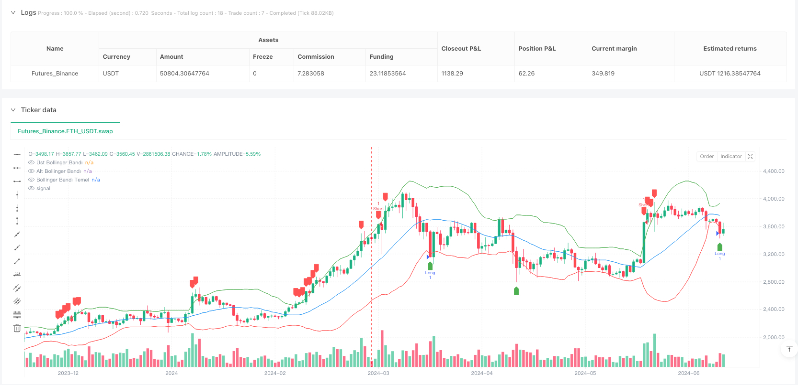
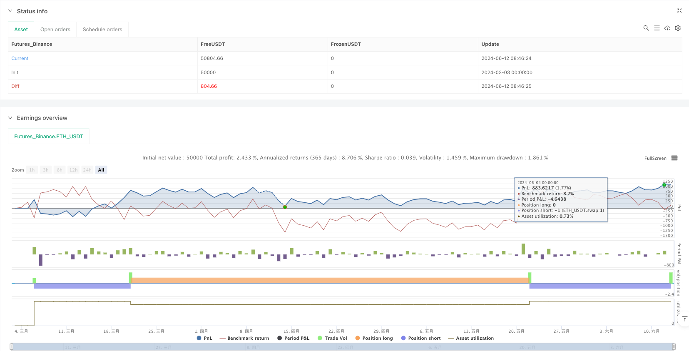

> Name

Bollinger Bands ATR Risk-Reward Ratio Trading Strategy-Bollinger-Bands-ATR-Risk-Reward-Trading-Strategy
> Author

ianzeng123

> Strategy Description




[trans]
#### Overview
The Bollinger Bands ATR risk-reward trading strategy is a quantitative trading system that combines statistical volatility and price anomalies. It mainly uses Bollinger Bands to identify price oversold and overbought areas, and combines it with average true volatility (ATR) for risk management and precise stop-loss and take-profit settings. The core idea of ​​this strategy is to go long when the price breaks through the lower track of the Bollinger Bands and go short when it breaks through the upper track. At the same time, it automatically calculates the stop loss and profit target positions based on the preset risk-reward ratio.
#### Strategy Principle
The principle of this strategy is based on the statistical properties of price reversion to the mean and precise control of risk management:
1. **Bollinger Band Calculation**: Take the 20-period simple moving average (SMA) as the middle rail, and multiply the standard deviation by 2 as the fluctuation range of the upper and lower rails. Bollinger Bands can dynamically adapt to market volatility and provide relative overbought and oversold judgments for trading.
2. **Entry signal generation**:
   - When the closing price is lower than the lower track of the Bollinger Bands, it is considered an oversold area and a long signal is generated.
   - When the closing price is above the upper Bollinger Band, it is considered an overbought area and a short signal is generated.
3. **Risk Management Mechanism**:
   - Calculate market volatility using 14-period ATR
   - The stop loss is set to the distance 2 times ATR above and below the entry price
   - Automatically calculate profit targets based on preset risk-reward ratio (default is 2.0)
4. **Risk to Reward Ratio**: The strategy uses the Risk to Reward Ratio (RR) parameter to optimize fund management and ensure that the potential return of each transaction is a preset multiple of the potential risk. The default value is 2.0, which means that the profit target is twice the stop loss distance.
5. **Automatic risk control**: Set stop-loss and take-profit prices immediately after opening a transaction, eliminating the need for manual intervention and reducing emotional decision-making.
#### Strategic Advantages
1. **Volatility Adaptability**: Bollinger Bands will automatically adjust the width according to recent market volatility, allowing the strategy to adapt to different market environments without the need to frequently adjust parameters.
2. **Objective entry logic**: Entry signals are based on statistical principles rather than subjective judgment, reducing emotional trading. When the price exceeds the statistical range, it often means a temporary extreme state, with a high probability of reversion to the mean.
3. **Dynamic Risk Management**: Use ATR to calculate the stop loss distance, which can automatically adjust according to the actual market fluctuations, avoiding the incompatibility of fixed point stop loss in different fluctuation environments.
4. **Clear Fund Management**: By preset risk-return ratio, each transaction has clear fund management rules to ensure long-term stability. Even if the winning rate is not high, as long as it is strictly implemented, the long-term expected value can still be positive.
5. **Full-automated execution**: The strategy can be fully automatically executed from signal generation to stop-loss and take-profit settings, reducing the delay and emotional interference of manual operations.
6. **Two-way trading**: Supports long and short two-way trading, which can capture opportunities in different market trends and improve the efficiency of capital utilization.
#### Strategy Risk
1. **False Breakout Risk**: In sideways or highly volatile markets, prices may frequently break through the Bollinger Band boundary but then return immediately, causing frequent stop loss triggers. The solution is to add confirmation indicators or delay entry. You can consider waiting for a backtest or rebound after the price breaks through the Bollinger Bands before entering the market.
2. **Counter-trend risk in trending markets**: In a strong trending market, the price may continue to run outside the Bollinger Bands boundary. At this time, counter-trend trading will lead to continuous losses. It is recommended to add a trend filter and only trade with the trend or suspend trading completely in strong trending markets.
3. **Parameter Sensitivity**: Improper settings of Bollinger Band period and standard deviation multiple may result in too much or too little signal. The solution is to find the optimal parameter combination through historical backtesting, and consider dynamically adjusting parameters according to different market cycles.
4. **Excessive trading risk**: During periods of increased volatility, too many trading signals may be generated, leading to increased transaction costs and excessive trading. It is recommended to set a trade interval limit or increase the trade volume filter.
5. **Limitations of fixed risk-return ratio**: Under different market environments, the optimal risk-return ratio may be different. In trending markets you can consider using a higher risk-reward ratio, while in volatile markets you can use a lower ratio but increase your win rate.
6. **Lack of trend identification ability**: The strategy is mainly based on statistical regression thinking and lacks identification of market trends. Consider adding a trend indicator as a filter, such as a moving average system or the ADX indicator.
#### Strategy optimization direction
1. **Add trend filter**: Integrate trend indicators such as moving average crossover or ADX, and only trade when the trend direction is consistent, which can significantly improve the strategy winning rate. For example, you can add 50 and 200 period moving averages to determine the long-term trend, only go long in the long trend, and go short in the short trend.
2. **Dynamic Risk-Reward Ratio**: Dynamically adjust the risk-reward ratio based on market volatility or trend strength. Use a higher risk-reward ratio (such as 3:1 or 4:1) in strong trending markets, while use a lower ratio (such as 1.5:1) in volatile markets but increase your winning rate.
3. **Multiple time frame analysis**: Introduce the Bollinger Bands of higher time frames as filter conditions, and only enter the market when the signals of multiple time frames are consistent, which can reduce false signals.
4. **Optimize entry timing**: You can consider not entering the market immediately after the price breaks through the Bollinger Bands, but waiting for backtesting or forming a specific K-line pattern before entering the market to increase the winning rate.
5. **Increase transaction volume confirmation**: Using transaction volume as a signal confirmation condition, requiring breakthroughs to be accompanied by amplification of transaction volume, can reduce false breakthroughs.
6. **Achieve dynamic take-profit**: A moving take-profit mechanism can be implemented to allow profit extension. For example, when the price moves a certain distance in a favorable direction, the stop loss will be moved to the break-even point or a better position.
7. **Seasonal or time filtering**: Analyze the seasonal characteristics of the market or the best trading period, and weight transactions in the time period with the best historical performance.
8. **Market Environment Classification**: Develop a market environment classification system, divide the market into several states based on indicators such as volatility and trend strength, and use different parameter settings for different states.
#### Summarize
The Bollinger Bands ATR risk-reward ratio trading strategy is a complete trading system based on statistical principles and risk management. It identifies price anomalies through Bollinger Bands, uses ATR to calculate reasonable stop loss positions, and automatically sets profit targets based on the preset risk-reward ratio. The core advantage of this strategy is that it seamlessly combines technical analysis with risk management, can adapt to changes in market volatility, and implements strict capital management for each transaction.
While the strategy is at risk of false breakouts and counter-trend trading, its performance can be significantly improved by adding optimizations such as trend filtering, multi-timeframe analysis, and dynamic risk-reward ratios. This strategy is suitable for traders who want to follow systematic trading rules and pay attention to risk control, especially in markets with higher volatility but mean reversion characteristics.
Ultimately, the key to successfully applying this strategy lies in strict enforcement of trading rules, continuous optimization of parameters, and the flexibility to adjust strategy settings according to different market environments. Through continuous testing and improvement, the strategy can develop into a robust adaptive trading system.
 ||
#### Overview
The Bollinger Bands ATR Risk-Reward Trading Strategy is a quantitative trading system that combines statistical volatility and price anomalies, primarily utilizing Bollinger Bands to identify oversold and overbought areas, while incorporating Average True Range (ATR) for risk management and precise stop-loss and take-profit placement. The core concept of this strategy is to go long when the price breaks below the lower Bollinger Band and short when it breaks above the upper band, while automatically calculating stop-loss and profit targets based on a predetermined risk-reward ratio.

#### Strategy Principles

The strategy is based on the statistical property of price mean reversion and precise risk management control:

1. **Bollinger Bands Calculation**: Uses a 20-period Simple Moving Average (SMA) as the middle band, with standard deviation multiplied by 2 to define the upper and lower bands. Bollinger Bands dynamically adapt to market volatility, providing relative overbought and oversold conditions for trading decisions.

2. **Entry Signal Generation**:
   - When the closing price falls below the lower Bollinger Band, it's considered an oversold area, generating a long signal
   - When the closing price rises above the upper Bollinger Band, it's considered an overbought area, generating a short signal

3. **Risk Management Mechanism**:
   - Uses 14-period ATR to calculate market volatility
   - Sets stop-loss at a distance of 2 times ATR from the entry price
   - Automatically calculates profit targets based on the preset risk-reward ratio (default 2.0)

4. **Risk-Reward Ratio**: The strategy employs a risk-reward ratio (RR) parameter to optimize money management, ensuring that each trade's potential profit is a preset multiple of the potential risk, with a default value of 2.0, meaning the profit target is twice the stop-loss distance.

5. **Automated Risk Control**: Immediately after position entry, stop-loss and take-profit levels are set automatically, eliminating the need for manual intervention and reducing emotional decision-making.

#### Strategy Advantages

1. **Volatility Adaptability**: Bollinger Bands automatically adjust their width according to recent market volatility, allowing the strategy to adapt to different market environments without frequent parameter adjustments.

2. **Objective Entry Logic**: Entry signals are based on statistical principles rather than subjective judgment, reducing emotional trading. When prices exceed the statistical range, it often indicates a temporary extreme state with a high probability of mean reversion.

3. **Dynamic Risk Management**: Using ATR to calculate stop-loss distances allows automatic adjustment based on actual market volatility, avoiding the limitations of fixed-point stops in varying volatility environments.

4. **Clear Money Management**: Through preset risk-reward ratios, each trade follows clear money management rules, ensuring long-term stability. Even with a moderate win rate, strict execution can maintain a positive expectancy over time.

5. **Fully Automated Execution**: The strategy can be fully automated from signal generation to stop-loss and take-profit settings, reducing delays from manual operations and emotional interference.

6. **Bidirectional Trading**: Supports both long and short positions, capturing opportunities in different market trends and improving capital utilization efficiency.

#### Strategy Risks

1. **False Breakout Risk**: In consolidating markets or highly volatile conditions, prices may frequently break through Bollinger Band boundaries but immediately revert, triggering frequent stop-losses. Solution: Add confirmation indicators or delay entry, consider waiting for a retest or reversal after the band breakout before entering.

2. **Counter-Trend Risk in Trending Markets**: In strong trending markets, prices may continue to run outside the Bollinger Bands, leading to consecutive losses with counter-trend trades. Recommendation: Add trend filters, only trade in the direction of the trend in strong trending markets, or completely pause trading.

3. **Parameter Sensitivity**: Inappropriate settings for Bollinger Band period and standard deviation multiplier can result in too many or too few signals. Solution: Find optimal parameter combinations through historical backtesting, consider dynamically adjusting parameters based on different market cycles.

4. **Overtrading Risk**: During periods of increased volatility, too many trading signals may be generated, leading to increased trading costs and overtrading. Recommendation: Set trading interval restrictions or add volume filters.

5. **Limitations of Fixed Risk-Reward Ratio**: The optimal risk-reward ratio may vary in different market environments. Consider using higher risk-reward ratios in trending markets and lower ratios with higher win rates in oscillating markets.

6. **Lack of Trend Recognition**: The strategy primarily relies on statistical mean reversion without recognizing market trends. Consider adding trend indicators as filtering conditions, such as moving average systems or the ADX indicator.

#### Strategy Optimization Directions

1. **Add Trend Filters**: Integrate moving average crossovers or ADX trend indicators, only trading when aligned with the trend direction, which can significantly improve win rate. For example, add 50 and 200 period moving averages to determine long-term trends, only going long in uptrends and short in downtrends.

2. **Dynamic Risk-Reward Ratio**: Adjust the risk-reward ratio dynamically based on market volatility or trend strength. Use higher risk-reward ratios (like 3:1 or 4:1) in strong trending markets, and lower ratios (like 1.5:1) with higher win rates in oscillating markets.

3. **Multi-Timeframe Analysis**: Introduce higher timeframe Bollinger Bands as filtering conditions, only entering when signals across multiple timeframes align, reducing false signals.

4. **Optimize Entry Timing**: Consider not entering immediately when price breaks through Bollinger Bands, but waiting for a retest or specific candlestick pattern formation, improving win rate.

5. **Add Volume Confirmation**: Use volume as a signal confirmation condition, requiring increased volume on breakouts to reduce false breakouts.

6. **Implement Dynamic Take-Profit**: Develop a trailing stop mechanism allowing profits to extend. For example, when price moves favorably by a certain distance, move the stop-loss to breakeven or a better position.

7. **Seasonal or Time Filtering**: Analyze market seasonality or optimal trading sessions, weighting trades during historically best-performing time periods.

8. **Market Environment Classification**: Develop a market environment classification system based on volatility, trend strength, and other indicators to categorize market states and apply different parameter settings for each state.

#### Conclusion

The Bollinger Bands ATR Risk-Reward Trading Strategy is a complete trading system based on statistical principles and risk management, identifying price anomalies through Bollinger Bands, calculating reasonable stop-loss levels with ATR, and automatically setting profit targets based on preset risk-reward ratios. The core advantage of this strategy lies in seamlessly combining technical analysis with risk management, adapting to changes in market volatility, and implementing strict money management for each trade.

While the strategy faces risks from false breakouts and counter-trend trading, its performance can be significantly improved through additions like trend filtering, multi-timeframe analysis, and dynamic risk-reward ratios. This strategy is suitable for traders who wish to follow systematic trading rules and emphasize risk control, particularly performing well in markets with high volatility but mean-reverting characteristics.

Ultimately, the key to successfully applying this strategy lies in strict execution of trading rules, continuous parameter optimization, and flexible adjustment of strategy settings for different market environments. Through ongoing testing and improvement, this strategy can evolve into a robust adaptive trading system.
[/trans]


> Source (PineScript)

``` pinescript
/*backtest
start: 2024-03-03 00:00:00
end: 2024-06-13 00:00:00
period: 1d
basePeriod: 1d
exchanges: [{"eid":"Futures_Binance","currency":"ETH_USDT"}]
*/

//@version=5
strategy("Bollinger Bands & ATR Strategy", overlay=true)

// Kullanıcıdan girdi almak
bollingerLength = input.int(20, title="Bollinger Bantları Periyodu")
bollingerDev = input.float(2.0, title="Bollinger Bantları Standart Sapma")
atrLength = input.int(14, title="ATR Periyodu")
riskRewardRatio = input.float(2.0, title="Risk/Ödül Oranı", minval=1.0)

// Bollinger Bantları hesapla
basis = ta.sma(close, bollingerLength)
dev = bollingerDev * ta.stdev(close, bollingerLength)
upperBand = basis + dev
lowerBand = basis - dev
atrValue = ta.atr(atrLength)

// Al/Sat koşulları
longCondition = close < lowerBand
shortCondition = close > upperBand

// Risk/Ödül hesaplaması
longStopLoss = close - 2 * atrValue
shortStopLoss = close + 2 * atrValue
longTakeProfit = close + (close - longStopLoss) * riskRewardRatio
shortTakeProfit = close - (shortStopLoss - close) * riskRewardRatio

// Pozisyonları açma ve kapama
if (longCondition)
    strategy.entry("Long", strategy.long)
    strategy.exit("Long TP", "Long", limit=longTakeProfit, stop=longStopLoss)

if (shortCondition)
    strategy.entry("Short", strategy.short)
    strategy.exit("Short TP", "Short", limit=shortTakeProfit, stop=shortStopLoss)

// Bollinger Bantları'nı grafikte çiz
plot(upperBand, color=color.green, title="Üst Bollinger Bandı")
plot(lowerBand, color=color.red, title="Alt Bollinger Bandı")
plot(basis, color=color.blue, title="Bollinger Bandı Temel")

// Sinyalleri göster
plotshape(series=longCondition, location=location.belowbar, color=color.green, style=shape.labelup, title="Long Signal")
plotshape(series=shortCondition, location=location.abovebar, color=color.red, style=shape.labeldown, title="Short Signal")

```

> Detail

https://www.fmz.com/strategy/484580

> Last Modified

2025-03-03 09:56:09
