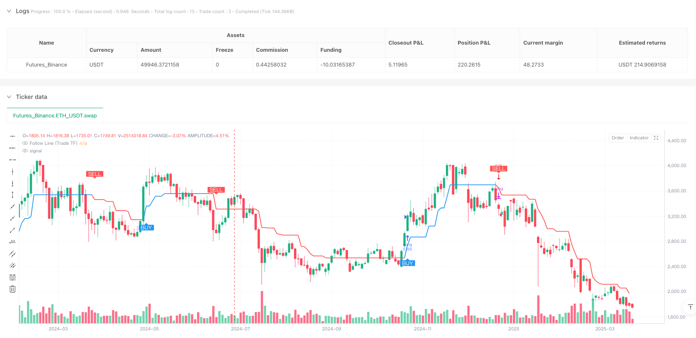
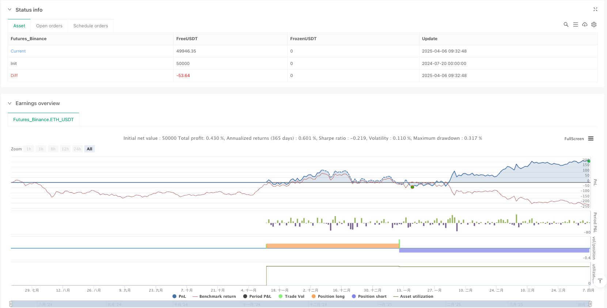

> Name

Bollinger-Bands-and-ATR-Dynamic-Trend-Following-Strategy-Multi-Timeframe-Quantitative-Trading-System
> Author

ianzeng123

> Strategy Description





[trans]

## Strategy Overview
The Bollinger Bands and ATR dynamic trend following strategy is an advanced quantitative trading system that combines the Bollinger Bands' breakthrough signals and the dynamic adjustment function of the average true range (ATR) to identify and track market trends through the "Follow Line" mechanism. This strategy specifically introduces a multi-time frame (HTF) confirmation mechanism, which can filter trading signals according to the trend direction of higher time frames, significantly improving the stability and profitability of the strategy. The system also includes a number of advanced features, such as optional trading period filtering, ATR volatility adaptive adjustment, and a real-time response mechanism to HTF trend changes, forming a comprehensive and flexible quantitative trading solution.
## Strategy Principle
At the heart of this strategy is the "Tracking Line" mechanism, which dynamically identifies and adapts to market trends through the following steps:
1. **Bollinger Band signal generation**: The system first calculates the standard Bollinger Bands. When the price breaks through the upper band, it generates a bullish signal (1). When it breaks through the lower band, it generates a bearish signal (-1). When the price is within the band, the signal is neutral (0).
2. **Tracking line calculation**: Based on the Bollinger Bands signal and the current price position, the system calculates the temporary tracking line value. In the case of a bullish signal, the tracking line is set to the current K-line low minus the ATR value (when ATR filtering is enabled) or the low point is used directly; in the case of a bearish signal, the tracking line is set to the current K-line high point plus the ATR value or the high point is used directly.
3. **Tracking line locking mechanism**: The strategy uses "ratchet" logic to maintain the tracking line - in an upward trend, the new tracking line value is taken as the larger of the temporary value and the previous value; in a downtrend, the new tracking line value is taken as the smaller of the temporary value and the previous value. This ensures that the tracking line can only move in the direction of the trend, forming a dynamic support/resistance level.
4. **Trend Determination**: By comparing the current tracking line value with the previous tracking line value, the system determines the trend direction - rising indicates a bullish trend (1), falling indicates a bearish trend (-1), and flat means maintaining the previous trend.
5. **Multiple Time Frame Analysis**: The strategy uses similar logic to calculate tracking lines and trend status on higher time frames. The appropriate higher time frame can be selected automatically or manually (such as 1 minute automatically corresponding to 15 minutes HTF).
6. **Entry conditions**: When the trend of the trading time frame changes from neutral or downward to upward and HTF confirms an upward trend, a long signal is generated; otherwise, a short signal is generated.
7. **Exit condition**: When the trend of the trading time frame changes to the opposite direction, or the HTF trend changes to the opposite direction (new in v2.5 version), the strategy closes the existing position.
8. **Time filter**: You can choose to only execute transactions during specific trading hours (such as regular US stock trading hours 0930-1600).
## Strategic Advantages
1. **Strong adaptability**: The tracking line mechanism can automatically adjust according to market volatility, especially when ATR filtering is enabled, providing dynamic adaptability to different volatility environments.
2. **Trend confirmation mechanism**: The multi-time frame confirmation function effectively filters out "noise" transactions and only trades when the HTF trend direction is consistent, greatly improving signal quality.
3. **Flexible configuration options**: The strategy provides rich parameter settings, including Bollinger Band cycle and deviation, ATR cycle, time filtering and HTF selection method, etc., which can be optimized according to different markets and trading varieties.
4. **High responsiveness**: The HTF trend change response mechanism newly added in v2.5 version enables the strategy to respond faster to changes in the general trend, stop losses in time and avoid serious retracement.
5. **Visual Assistance**: The strategy draws the trading time frame and HTF tracking line on the chart, and can optionally display buy and sell signal labels, making the trading logic intuitive and clear.
6. **Position Management**: Use the setting of pyramiding=0 to prevent multiple entries in the same direction and avoid unnecessary risk accumulation.
## Strategy Risk
1. **False Breakout Risk**: Despite the use of Bollinger Bands and HTF confirmations, the market may still produce false breakouts, especially in high volatility environments. Solution: You can increase the Bollinger Band deviation value or extend the confirmation period, or even add additional breakthrough confirmation mechanisms.
2. **Parameter sensitivity**: Strategy performance is sensitive to parameters such as ATR cycle and Bollinger Band settings. Solution: Backtesting should be used to find the most suitable parameter combination for specific trading varieties to avoid curve fitting problems caused by over-optimization.
3. **Lagging trend changes**: The tracking line mechanism may respond slowly in the initial stage of the trend, resulting in later entry. Solution: You can consider using a smaller ATR multiplier or Bollinger Band period to improve response speed, but you need to balance signal quality and responsiveness.
4. **Timeframe Dependence**: Improper selection of HTF may lead to excessive filtering or signal conflicts. Solution: It is recommended to use the automatic HTF selection feature, which automatically selects a suitable higher time frame based on the current chart time frame.
5. **Lack of money management**: The strategy itself does not contain a complete money management mechanism. Solution: Appropriate stop loss strategies and position management rules should be combined in practical applications, such as fixed percentage risk or ATR multiple stop loss.
## Strategy optimization direction
1. **Enhanced signal filtering**: You can consider introducing other technical indicators, such as the relative strength index (RSI) or the stochastic indicator (Stochastic) to confirm the entry signal, and only execute transactions when the indicator shows an overbought/oversold state. This will further reduce false breakout signals and increase your winning rate.
2. **Dynamic parameter adjustment**: An adaptive parameter adjustment mechanism based on market conditions can be developed, such as automatically increasing the Bollinger Band deviation value in a high volatility environment and reducing the deviation value in a low volatility environment, so that the strategy can better adapt to different market conditions.
3. **Optimize HTF trend judgment**: The HTF trend confirmation algorithm can be improved, such as introducing exponential moving average crossover or other trend indicators, instead of just relying on the tracking line direction, to obtain more stable trend judgment.
4. **Improved Fund Management**: Integrate a comprehensive fund management system to dynamically adjust position sizes based on market volatility and account size, set ATR-based stop loss levels and profit targets, and maximize risk-adjusted returns.
5. **Add market status analysis**: Introduce market environment classification, distinguish trend markets and oscillating markets, and automatically adjust strategy parameters or trading rules according to market conditions, and even suspend trading in market environments that are not suitable for the strategy.
6. **Multi-strategy integration**: Use this strategy as a component and combine it with other complementary strategies (such as reversal strategies or breakthrough confirmation strategies) to form a complete strategy combination to balance performance in different market environments.
## Summarize
The Bollinger Bands and ATR dynamic trend following strategy is a well-designed quantitative trading system that effectively identifies and tracks market trends by combining Bollinger Bands, ATR and multi-time frame analysis. The core advantage of this strategy lies in its adaptability and flexibility, which can be dynamically adjusted according to market conditions, while improving signal quality and winning rate through the HTF confirmation mechanism.
Although there are some inherent risks, such as parameter sensitivity and false breakthrough problems, these can be mitigated through appropriate parameter optimization and additional filtering mechanisms. Strategic optimization directions, such as enhanced signal filtering, dynamic parameter adjustment and improved fund management, provide a clear path to further improve strategy performance.
Overall, this strategy is particularly suitable for mid- to long-term trend traders, providing a robust framework for identifying trend changes and executing trades during favorable market conditions. With reasonable parameter settings and appropriate risk management, this strategy has the potential to generate stable returns in a variety of market environments. ||
## Strategy Overview

The Bollinger Bands and ATR Dynamic Trend Following Strategy is an advanced quantitative trading system that combines Bollinger Bands breakout signals with Average True Range (ATR) dynamic adjustment through a "Follow Line" mechanism to identify and track market trends. The strategy notably introduces a Higher Timeframe (HTF) confirmation mechanism that filters trading signals based on the trend direction of a higher timeframe, significantly improving strategy stability and profitability. The system also includes multiple advanced features such as optional trading session filtering, ATR volatility-adaptive adjustment, and real-time reaction to HTF trend changes, forming a comprehensive and flexible quantitative trading solution.

## Strategy Principles

The core of this strategy is the "Follow Line" mechanism, which dynamically identifies and adapts to market trends through the following steps:

1. **Bollinger Bands Signal Generation**: The system first calculates standard Bollinger Bands, generating a bullish signal (1) when price breaks above the upper band, a bearish signal (-1) when it breaks below the lower band, and a neutral signal (0) when within the bands.

2. **Follow Line Calculation**: Based on the Bollinger Bands signal and current price position, the system calculates a temporary Follow Line value. In bullish signal cases, the Follow Line is set to the current bar's low minus the ATR value (if ATR filter is enabled) or just the low point; in bearish signal cases, it's set to the current bar's high plus the ATR value or just the high point.

3. **Follow Line Locking Mechanism**: The strategy employs a "ratchet" logic to maintain the Follow Line—in uptrends, the new Follow Line value takes the maximum of the temporary value and the previous value; in downtrends, it takes the minimum. This ensures the Follow Line only moves in the trend direction, forming a dynamic support/resistance level.

4. **Trend Determination**: By comparing the current Follow Line with the previous Follow Line value, the system determines trend direction—rising indicates a bullish trend (1), falling indicates a bearish trend (-1), and flat maintains the previous trend.

5. **Multi-Timeframe Analysis**: The strategy uses similar logic to calculate Follow Line and trend status on a higher timeframe, which can be selected automatically or manually (e.g., 1min automatically corresponds to 15min HTF).

6. **Entry Conditions**: When the trade timeframe trend changes from neutral or bearish to bullish, and the HTF confirms an uptrend, a buy signal is generated; conversely for sell signals.

7. **Exit Conditions**: When the trade timeframe trend changes to the opposite direction, or the HTF trend changes to the opposite direction (new in v2.5), the strategy closes existing positions.

8. **Time Filtering**: Optionally, trades can be executed only during specific trading sessions (such as regular US stock market hours 0930-1600).

## Strategy Advantages

1. **Strong Adaptability**: The Follow Line mechanism automatically adjusts according to market volatility, especially when the ATR filter is enabled, providing dynamic adaptation to different volatility environments.

2. **Trend Confirmation Mechanism**: The multi-timeframe confirmation feature effectively filters out "noise" trades, only trading when the HTF trend direction is aligned, significantly improving signal quality.

3. **Flexible Configuration Options**: The strategy provides rich parameter settings, including Bollinger Bands period and deviation, ATR period, time filtering, and HTF selection methods, which can be optimized for different markets and trading instruments.

4. **High Responsiveness**: The HTF trend change reaction mechanism added in v2.5 enables the strategy to respond more quickly to major trend changes, stopping losses promptly and avoiding severe drawdowns.

5. **Visual Assistance**: The strategy plots the Follow Line for both trade timeframe and HTF on charts, and can optionally display buy/sell signal labels, making the trading logic intuitive and clear.

6. **Position Management**: The pyramiding=0 setting prevents multiple entries in the same direction, avoiding unnecessary risk accumulation.

## Strategy Risks

1. **False Breakout Risk**: Despite using Bollinger Bands and HTF confirmation, the market may still produce false breakouts, especially in high volatility environments. Solution: Increase Bollinger Bands deviation value or extend confirmation periods, even add additional breakout confirmation mechanisms.

2. **Parameter Sensitivity**: Strategy performance is quite sensitive to parameters such as ATR period and Bollinger Bands settings. Solution: Find the most suitable parameter combinations for specific trading instruments through backtesting, avoiding overfitting issues from excessive optimization.

3. **Trend Change Lag**: The Follow Line mechanism may respond relatively slowly in the initial stages of a trend, leading to slightly delayed entries. Solution: Consider using smaller ATR multipliers or Bollinger Bands periods to improve response speed, but balance signal quality and responsiveness.

4. **Timeframe Dependency**: Improper selection of HTF may result in excessive filtering or signal conflicts. Solution: Recommend using the automatic HTF selection feature, which automatically selects an appropriate higher timeframe based on the current chart timeframe.

5. **Lack of Money Management**: The strategy itself does not include a complete money management mechanism. Solution: In practical applications, it should be combined with appropriate stop-loss strategies and position management rules, such as fixed percentage risk or ATR multiple stops.

## Strategy Optimization Directions

1. **Enhanced Signal Filtering**: Consider introducing other technical indicators, such as Relative Strength Index (RSI) or Stochastic, to confirm entry signals, executing trades only when indicators show overbought/oversold conditions. This will further reduce false breakout signals and improve win rates.

2. **Dynamic Parameter Adjustment**: Develop an adaptive parameter adjustment mechanism based on market states, for example, automatically increasing Bollinger Bands deviation in high volatility environments and decreasing it in low volatility environments, allowing the strategy to better adapt to different market conditions.

3. **Optimized HTF Trend Judgment**: Improve the HTF trend confirmation algorithm, such as introducing exponential moving average crossovers or other trend indicators rather than relying solely on Follow Line direction, to obtain more stable trend judgments.

4. **Refined Money Management**: Integrate a comprehensive money management system that dynamically adjusts position size based on market volatility and account size, setting ATR-based stop-loss levels and profit targets to maximize risk-adjusted returns.

5. **Market State Analysis**: Introduce market environment classification to distinguish between trending and ranging markets, and automatically adjust strategy parameters or trading rules based on market state, or even pause trading in market environments unsuitable for this strategy.

6. **Multi-Strategy Integration**: Use this strategy as a component, combined with other complementary strategies (such as reversal strategies or breakout confirmation strategies) to form a complete strategy portfolio, balancing performance across different market environments.

## Summary

The Bollinger Bands and ATR Dynamic Trend Following Strategy is an elegantly designed quantitative trading system that effectively identifies and tracks market trends by combining Bollinger Bands, ATR, and multi-timeframe analysis. The core advantages of this strategy lie in its adaptability and flexibility, allowing it to dynamically adjust according to market conditions while improving signal quality and win rates through the HTF confirmation mechanism.

Despite some inherent risks, such as parameter sensitivity and false breakout issues, these can be mitigated through appropriate parameter optimization and additional filtering mechanisms. Strategic optimization directions, such as enhanced signal filtering, dynamic parameter adjustment, and refined money management, provide clear paths for further improving strategy performance.

Overall, this strategy is particularly suitable for medium to long-term trend traders, providing a robust framework for identifying trend changes and executing trades under favorable market conditions. With reasonable parameter settings and appropriate risk management, this strategy has the potential to generate stable returns across various market environments.[/trans]


> Source (PineScript)

``` pinescript
/*backtest
start: 2024-07-20 00:00:00
end: 2025-04-07 00:00:00
period: 2d
basePeriod: 2d
exchanges: [{"eid":"Futures_Binance","currency":"ETH_USDT"}]
*/

//@version=6
//@fenyesk
//Optional Working Hours and ATR based TP/SL removed
// Added Optional Higher Timeframe Confirmation with Auto/Manual Selection
// Revised for improved profitability: Trend-following Entries/Exits
// v2.5: React to HTF trend changes as well

strategy('Follow Line Strategy Version 2.5 (React HTF)', overlay = true, process_orders_on_close = true, default_qty_type = strategy.percent_of_equity, default_qty_value = 1, pyramiding = 0) // Version bump overlay=true, process_orders_on_close=true, default_qty_type=strategy.percent_of_equity, default_qty_value=1, pyramiding=0) // Prevent multiple entries in the same direction )

// --- Settings ---
// Indicator Parameters
atrPeriodInput = input.int(defval = 5, title = 'ATR Period', minval = 1, group = 'Indicator Settings')
bbPeriodInput = input.int(defval = 21, title = 'Bollinger Bands Period', minval = 1, group = 'Indicator Settings')
bbDeviationInput = input.float(defval = 1.00, title = 'Bollinger Bands Deviation', minval = 0.1, step = 0.1, group = 'Indicator Settings')
useAtrFilterInput = input.bool(defval = true, title = 'Use ATR for Follow Line Offset?', group = 'Indicator Settings')
showSignalsInput = input.bool(title = 'Show Trade Signals on Chart?', defval = true, group = 'Indicator Settings')


// --- Higher Timeframe Confirmation ---
htf_group = 'Higher Timeframe Confirmation'
useHTFConfirmationInput = input.bool(false, title = 'Enable HTF Confirmation?', group = htf_group)
htfSelectionMethodInput = input.string('Auto', title = 'HTF Selection Method', options = ['Auto', 'Manual'], group = htf_group)
manualHTFInput = input.timeframe('240', title = 'Manual Higher Timeframe', group = htf_group) // Default to 4h if Manual
showHTFLineInput = input.bool(false, title = 'Show HTF Follow Line?', group = htf_group)

// --- Determine Higher Timeframe ---
// Revised function with explicit return variable
f_getAutoHTF() =>
    string htfResult = 'D' // Initialize with a default value (e.g., Daily)
    if timeframe.isintraday
        if timeframe.multiplier <= 1 and timeframe.isminutes
            htfResult := '15' // 1min -> 15min
            htfResult
        else if timeframe.multiplier <= 5 and timeframe.isminutes
            htfResult := '240' // 5min -> 4h (240min)
            htfResult
        else if timeframe.multiplier <= 30 and timeframe.isminutes
            htfResult := '240' // 15-30min -> 4h (240min)
            htfResult
        else if timeframe.multiplier == 60 and timeframe.isminutes // 1 hour
            htfResult := 'D' // 1h -> 1 Day
            htfResult
        else if timeframe.multiplier <= 240 and timeframe.isminutes // Up to 4 hours
            htfResult := 'W' // 4h -> 1 Week
            htfResult
    // else // The default "D" is already set if none of the above match
    // htfResult := "D" // Default for other intraday -> 1 Day (already default)
    else if timeframe.isdaily // Daily
        htfResult := 'M' // 1 Day -> 1 Month
        htfResult
    else if timeframe.isweekly // Weekly
        htfResult := 'M' // 1 Week -> 1 Month
        htfResult
    else // Monthly or higher (or unknown)
        htfResult := '3M' // Default to 3 Months
        htfResult
    htfResult // Explicitly return the variable value

autoHTF = f_getAutoHTF()
selectedHTF = htfSelectionMethodInput == 'Auto' ? autoHTF : manualHTFInput

// --- Trade Timeframe Calculations ---
// Bollinger Bands calculation
bbMiddle_trade = ta.sma(close, bbPeriodInput)
bbStdDev_trade = ta.stdev(close, bbPeriodInput)
BBUpper_trade = bbMiddle_trade + bbStdDev_trade * bbDeviationInput
BBLower_trade = bbMiddle_trade - bbStdDev_trade * bbDeviationInput

// ATR calculation
atrValue_trade = ta.atr(atrPeriodInput)

// Signal initialization for Trade TF
var float followLine_trade = na
var int bbSignal_trade = 0
var int trend_trade = 0 // Renamed from iTrend

// Determine BB signal based on current close (Trade TF)
if close > BBUpper_trade
    bbSignal_trade := 1
    bbSignal_trade
else if close < BBLower_trade
    bbSignal_trade := -1
    bbSignal_trade
else
    bbSignal_trade := 0 // Reset signal if price is within bands
    bbSignal_trade

// Calculate potential new FollowLine value for the current bar (Trade TF)
float tempFollowLine_trade = na // Explicit type
if bbSignal_trade == 1
    tempFollowLine_trade := useAtrFilterInput ? low - atrValue_trade : low
    tempFollowLine_trade
else if bbSignal_trade == -1
    tempFollowLine_trade := useAtrFilterInput ? high + atrValue_trade : high
    tempFollowLine_trade

// Determine the final FollowLine for the current bar, applying the "ratchet" logic (Trade TF)
if bbSignal_trade == 1 // Price closed above upper BB
    followLine_trade := na(followLine_trade[1]) ? tempFollowLine_trade : math.max(tempFollowLine_trade, nz(followLine_trade[1], tempFollowLine_trade))
    followLine_trade
else if bbSignal_trade == -1 // Price closed below lower BB
    followLine_trade := na(followLine_trade[1]) ? tempFollowLine_trade : math.min(tempFollowLine_trade, nz(followLine_trade[1], tempFollowLine_trade))
    followLine_trade
else // Price closed within bands, FollowLine continues from previous bar
    if not na(followLine_trade[1])
        followLine_trade := followLine_trade[1]
        followLine_trade
        // else followLine_trade remains na if followLine_trade[1] was na

// Trend direction determination (Based on current FollowLine vs previous FollowLine - Trade TF)
if not na(followLine_trade) and not na(followLine_trade[1])
    if followLine_trade > followLine_trade[1]
        trend_trade := 1
        trend_trade
    else if followLine_trade < followLine_trade[1]
        trend_trade := -1
        trend_trade
    else
        trend_trade := nz(trend_trade[1], 0) // Maintain previous trend if line is flat but valid
        trend_trade
else if not na(followLine_trade) and na(followLine_trade[1])
    trend_trade := bbSignal_trade == 1 ? 1 : bbSignal_trade == -1 ? -1 : 0 // Use ternary for initial trend
    trend_trade
else if na(followLine_trade)
    trend_trade := 0 // Reset trend if FollowLine becomes invalid
    trend_trade


// --- Higher Timeframe Calculations ---
// Function revised to return only one value (as float) based on parameter
f_calculateHTFData(htf_close, htf_high, htf_low, return_type) =>
    // Explicitly type potentially 'na' indicator results
    float htf_atrValue = ta.atr(atrPeriodInput)
    float htf_bbMiddle = ta.sma(htf_close, bbPeriodInput)
    float htf_bbStdDev = ta.stdev(htf_close, bbPeriodInput)
    float htf_BBUpper = na
    float htf_BBLower = na

    // Calculate BBands only if middle/stdev are valid
    if not na(htf_bbMiddle) and not na(htf_bbStdDev)
        htf_BBUpper := htf_bbMiddle + htf_bbStdDev * bbDeviationInput
        htf_BBLower := htf_bbMiddle - htf_bbStdDev * bbDeviationInput
        htf_BBLower

    // Determine BB signal (HTF) - Default to 0
    int htf_bbSignal = 0
    // Check if bands are valid before comparing
    if not na(htf_BBUpper) and not na(htf_BBLower)
        if htf_close > htf_BBUpper
            htf_bbSignal := 1
            htf_bbSignal
        else if htf_close < htf_BBLower
            htf_bbSignal := -1
            htf_bbSignal

    // Calculate potential new FollowLine (HTF)
    float htf_tempFollowLine = na // Explicitly typed float
    if htf_bbSignal == 1
        htf_tempFollowLine := useAtrFilterInput and not na(htf_atrValue) ? htf_low - htf_atrValue : htf_low
        htf_tempFollowLine
    else if htf_bbSignal == -1
        htf_tempFollowLine := useAtrFilterInput and not na(htf_atrValue) ? htf_high + htf_atrValue : htf_high
        htf_tempFollowLine

    // Maintain FollowLine state using 'var'
    var float htf_followLine = na
    var int htf_trend = 0

    // Determine the final FollowLine (HTF)
    if htf_bbSignal == 1
        htf_followLine := na(htf_followLine[1]) ? htf_tempFollowLine : math.max(htf_tempFollowLine, nz(htf_followLine[1], htf_tempFollowLine))
        htf_followLine
    else if htf_bbSignal == -1
        htf_followLine := na(htf_followLine[1]) ? htf_tempFollowLine : math.min(htf_tempFollowLine, nz(htf_followLine[1], htf_tempFollowLine))
        htf_followLine
    else
        if not na(htf_followLine[1])
            htf_followLine := htf_followLine[1]
            htf_followLine
            // else htf_followLine remains na if htf_followLine[1] was na (unless reset below)

    // Reset FollowLine if it's based on invalid temp line
    if na(htf_tempFollowLine) and htf_bbSignal != 0 // If the signal existed but calc failed (e.g., na ATR)
        htf_followLine := na // Reset line
        htf_followLine

    // Determine Trend (HTF)
    if not na(htf_followLine) and not na(htf_followLine[1])
        if htf_followLine > htf_followLine[1]
            htf_trend := 1
            htf_trend
        else if htf_followLine < htf_followLine[1]
            htf_trend := -1
            htf_trend
        else
            htf_trend := nz(htf_trend[1], 0)
            htf_trend
    else if not na(htf_followLine) and na(htf_followLine[1])
        htf_trend := htf_bbSignal == 1 ? 1 : htf_bbSignal == -1 ? -1 : 0
        htf_trend
    else if na(htf_followLine) // Trend is 0 if line becomes (or is) na
        htf_trend := 0
        htf_trend

    // Return the requested value as float type (or na)
    float return_value = na
    if return_type == 'line'
        return_value := htf_followLine
        return_value
    else if return_type == 'trend'
        return_value := float(htf_trend) // Convert int trend to float for consistent return type
        return_value

    return_value // Return the single calculated value


// Explicitly declare variables that will receive the security call result
float followLine_htf = na
int trend_htf = 0 // Initialize with a default value (0 for neutral)

// Request HTF data UNCONDITIONALLY
followLine_htf_result = request.security(syminfo.tickerid, selectedHTF, f_calculateHTFData(close, high, low, 'line'), lookahead = barmerge.lookahead_off)
trend_htf_result_float = request.security(syminfo.tickerid, selectedHTF, f_calculateHTFData(close, high, low, 'trend'), lookahead = barmerge.lookahead_off)

// Conditionally assign the results based on whether the HTF feature is enabled
if useHTFConfirmationInput or showHTFLineInput
    // Assign results, handling potential 'na' values safely
    followLine_htf := followLine_htf_result // Assign float/na directly
    trend_htf := na(trend_htf_result_float) ? 0 : int(nz(trend_htf_result_float)) // Convert float result back to int, default to 0 if na
    trend_htf
else // If HTF features are disabled, set variables to 'na'
    followLine_htf := na
    trend_htf := 0 // or na if preferred
    trend_htf


// HTF Filter
// Use the potentially 'na' followLine_htf and the guaranteed non-'na' trend_htf
htfConfirmsLong = not useHTFConfirmationInput or useHTFConfirmationInput and trend_htf == 1
htfConfirmsShort = not useHTFConfirmationInput or useHTFConfirmationInput and trend_htf == -1

// --- Entry/Exit Conditions ---
// Buy & Sell Conditions (Based on Trade TF trend crossover)
longCondition_trade = nz(trend_trade[1]) <= 0 and trend_trade == 1
shortCondition_trade = nz(trend_trade[1]) >= 0 and trend_trade == -1

// Combined Entry Conditions with Filters
goLong = htfConfirmsLong and longCondition_trade  and strategy.position_size <= 0 // Only enter long if flat or short & HTF confirms
goShort = htfConfirmsShort and shortCondition_trade  and strategy.position_size >= 0 // Only enter short if flat or long & HTF confirms

// Exit conditions based on *either* TTF or HTF changing trend against the position
exitLong = trend_trade == -1 or trend_htf == -1 // TTF to short OR HTF to short
exitShort = trend_trade == 1 or trend_htf == 1 // TTF to long OR HTF to long


// --- Strategy Execution ---

if goLong
    strategy.close('Short', comment = 'Close Short for Long')
    strategy.entry('Long', strategy.long, comment = 'Enter Long')

if goShort
    strategy.close('Long', comment = 'Close Long for Short')
    strategy.entry('Short', strategy.short, comment = 'Enter Short')

if exitLong
    strategy.close('Long', comment = 'Exit Long')

if exitShort
    strategy.close('Short', comment = 'Exit Short')

// --- Alerts ---
// Alerts trigger on the same bar as the entry condition, respecting all filters
// NOTE: Removed dynamic HTF from message as alertcondition requires const string
alertcondition(goLong, title = 'FL Buy Signal', message = 'Follow Line Buy Signal - {{ticker}} {{interval}}')
alertcondition(goShort, title = 'FL Sell Signal', message = 'Follow Line Sell Signal - {{ticker}} {{interval}}')
alertcondition(goLong or goShort, title = 'FL Signal', message = 'Follow Line Signal - {{ticker}} {{interval}}')

// --- Plotting ---
// Plot the Trade Timeframe Follow Line
lineColor_trade = trend_trade > 0 ? color.new(color.blue, 0) : trend_trade < 0 ? color.new(color.red, 0) : color.new(color.gray, 0)
plot(followLine_trade, color = lineColor_trade, linewidth = 2, title = 'Follow Line (Trade TF)')

// Plot the Higher Timeframe Follow Line (optional)
// Use the potentially 'na' followLine_htf and the guaranteed non-'na' trend_htf for coloring
lineColor_htf = trend_htf > 0 ? color.new(color.aqua, 0) : trend_htf < 0 ? color.new(color.orange, 0) : color.new(color.gray, 70)
plot(showHTFLineInput and useHTFConfirmationInput ? followLine_htf : na, color = lineColor_htf, linewidth = 2, style = plot.style_circles, title = 'Follow Line (HTF)', offset = 0)

// Plot shapes on the bar the trade signal occurs (based on trade TF condition), placing them AT the calculated Trade TF price level.
// Use the original trade long/short conditions for plotting shapes for clarity, before plots
plotshape(longCondition_trade and showSignalsInput and not na(followLine_trade) and not na(atrValue_trade) ? followLine_trade - atrValue_trade : na, text = 'BUY', style = shape.labelup, location = location.absolute, color = color.new(color.blue, 0), textcolor = color.new(color.white, 0), offset = 0, size = size.auto)
plotshape(shortCondition_trade and showSignalsInput and not na(followLine_trade) and not na(atrValue_trade) ? followLine_trade + atrValue_trade : na, text = 'SELL', style = shape.labeldown, location = location.absolute, color = color.new(color.red, 0), textcolor = color.new(color.white, 0), offset = 0, size = size.auto)

// Plot BBands for reference if desired
// plot(BBUpper_trade, "Upper BB", color=color.gray)
// plot(BBLower_trade, "Lower BB", color=color.gray)

```

> Detail

https://www.fmz.com/strategy/489732

> Last Modified

2025-04-08 09:51:56
