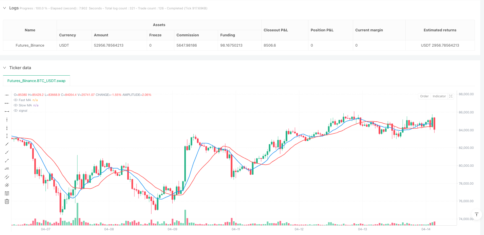
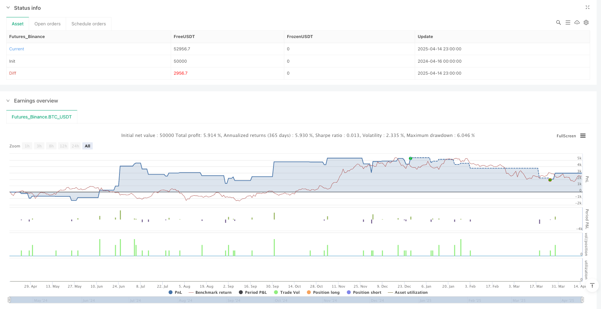

> Name

Multi-Dimensional-Adaptive-Moving-Average-Matrix-with-ATR-Powered-Precision-Trading-Strategy
> Author

ianzeng123

> Strategy Description





[trans]

## Overview
The multi-dimensional adaptive moving average matrix and ATR dynamic precision trading strategy is an advanced quantitative trading system designed for rapidly changing market conditions. The core of this strategy is to combine multiple types of moving averages and ATR (average true range) filters to form a highly flexible and adaptive trading matrix. By accurately capturing market trends and volatility, the strategy is able to identify high-probability entry and exit points in a high-frequency trading environment while implementing strict risk control measures. The distinguishing feature of the strategy is its multi-level adaptability - from flexible selection of multiple moving average types, to dynamic ATR-based stop loss and profit target setting, to multi-time frame trend filtering, allowing it to intelligently adjust the way trading signals are generated in various market environments.
## Strategy Principle
The core principles of this strategy are based on several key components working together:
1. **Advanced Moving Average Matrix**: The strategy implements up to 11 different types of moving averages, including SMA, EMA, SMMA, HMA, TEMA, WMA, VWMA, ZLEMA, ALMA, KAMA and DEMA. Each moving average has its own unique calculation method and response characteristics, which can be flexibly selected according to market conditions. The system uses two moving averages (fast and slow) as the main trend indicators, and their intersection and relative position are used to generate underlying trading signals.
2. **ATR-based risk management**: The strategy uses the ATR indicator to measure market volatility and applies it to multiple aspects:
   - Volatility assessment: Use the ratio of ATR to closing price as a volatility threshold filter
   - Entry filter: ensures that the price must be far enough away from the slow moving average (measured as multiples of ATR) to enter the market
   - Dynamic risk control: Set fixed stop loss, target profit and trailing stop loss based on ATR to adapt risk management to current market volatility
3. **Multi-Time Frame Trend Filtering**: The strategy enhances signal reliability by querying moving average trends on higher time frames (15 minutes), ensuring that trading directions are consistent with the larger market trend.
4. **Volume and Time Window Verification**: Transactions are only executed when minimum volume requirements are met, a volume breakthrough occurs, and within a predefined trading time window, further improving transaction quality.
5. **Signal generation logic**:
   - Long conditions: Price is above the fast and slow moving averages, the fast moving average is above the slow moving average, and the ATR filter, volume conditions and time window requirements are met simultaneously
   - Short conditions: corresponding conditions for the opposite situation
6. **Comprehensive exit logic**: The strategy uses a three-layer exit mechanism: fixed stop loss (multiple of ATR), target profit (multiple of ATR) and trailing stop loss (dynamic adjustment based on ATR), providing comprehensive risk protection for each transaction.
## Strategic Advantages
Analyzing the strategy code, the following significant advantages can be summarized:
1. **Excellent adaptability**: Through switchable multiple moving average types (from HMA to KAMA, etc.), the strategy can adapt to different market conditions. This flexibility allows traders to choose the best indicator based on the current market environment without having to rewrite the entire strategy.
2. **Dynamic Risk Management**: ATR-based risk control mechanism ensures that stop loss and profit targets are automatically adjusted according to market volatility. This approach provides better protection in more volatile markets while allowing more profits to be captured in trending markets.
3. **Multi-layer signal filtering**: By combining moving average crossovers, volume analysis, volatility thresholds and multi-time frame trend filtering, the strategy effectively reduces false signals and improves trading quality. In particular, the trend filtering function on the 15-minute time frame significantly reduces the possibility of counter-trend trading.
4. **Precise entry conditions**: This strategy not only relies on technical indicator crossovers, but also requires sufficient ATR distance between the price and the slow moving average, which helps avoid frequent trading in sideways markets and reduces losses caused by false breakthroughs.
5. **Transparent Performance Monitoring**: The built-in dashboard provides real-time display of key performance indicators, including current profit/loss, equity, ATR (raw value and percentage), and the gap between moving averages, allowing traders to evaluate the status of the strategy at any time.
## Strategy Risk
Although this strategy is well designed, there are still potential risks:
1. **Parameter optimization trap**: The strategy contains a large number of parameters (moving average type and period, ATR period and multiplier, etc.). Over-optimization may lead to curve fitting, making the strategy perform poorly in real trading. The solution is to conduct robust testing across markets and time periods to avoid over-tuning parameters.
2. **Quick reversal risk**: Although ATR dynamic stop loss is used, when the market suddenly reverses (such as after a major news release), the price may jump before the stop loss is triggered, resulting in greater than expected losses. It is recommended to implement additional nightly risk controls or suspend trading before high volatility events.
3. **Signal Delay**: All moving averages are inherently lagging. Even low-latency variants like HMA or ZLEMA can miss ideal entry points in fast markets. Consider incorporating momentum or price action indicators to supplement your existing signaling system.
4. **Volume Dependence**: The strategy signals when volume suddenly increases, but in certain markets or time periods, volume can be misleading. The volume filter should be adjusted if necessary or consider disabling this feature under certain market conditions.
5. **Time window restriction**: The designated trading time window may miss important night or early trading opportunities. It is recommended to adjust trading time settings based on the most active periods for a particular market.
## Strategy optimization direction
After analyzing the code, here are several possible optimization directions:
1. **Adaptive parameter adjustment**: The current strategy uses fixed parameter settings. An advanced optimization is the automatic adjustment of parameters based on market status (trend, volatility, range). For example, you can automatically increase the ATR multiplier during periods of high volatility, or switch moving average types in different market environments.
2. **Integrated Machine Learning Model**: Automatically select the optimal moving average combination by introducing a machine learning layer to predict which moving average type is likely to perform best under current market conditions. This can be achieved by analyzing the relative performance of different indicators in historical data.
3. **Improved Trend Identification**: In addition to the existing 15-minute trend filter, more sophisticated trend identification algorithms such as the Hurst Index or Directional Movement Index (DMI) can be incorporated to more accurately determine trend strength and persistence.
4. **Enhanced Exit Strategies**: Current exit strategies can be further optimized by adding exit signals based on market structure, such as trendline breakouts, key support/resistance levels, or sharp changes in volatility. This can help lock in profits before the trend ends.
5. **Risk-adjusted position sizing**: Enables dynamic position sizing based on current volatility and account funds, rather than using a fixed number of trades. For example, reduce positions during periods of high volatility and moderately increase positions during periods of low volatility to optimize the risk-reward ratio.
6. **Related Market Filtering**: Enhance signal quality by monitoring related markets (such as VIX when trading stock indexes) or cross-asset correlations. When related markets show consistent directional movement, it can add credibility to a trade.
## Summary
The multi-dimensional adaptive moving average matrix and ATR dynamic precision trading strategy represent a comprehensive and advanced quantitative trading method. By combining the advantages of multiple moving average types with strict ATR-based risk control, this strategy is able to adapt to different market conditions while maintaining good risk management. Its multi-level signal filtering mechanism, precise entry conditions and comprehensive exit logic combine to create a powerful system capable of identifying high-probability trading opportunities.
The real value of this strategy lies in its flexibility and adaptability, allowing traders to tailor it to specific markets and personal risk preferences. There is potential for further improvements in the performance of the strategy through the proposed optimization directions, especially adaptive parameter tuning and machine learning integration.
For traders looking to employ a highly technical and disciplined system in a high-frequency trading environment, this strategy provides a solid framework that combines technical precision and risk control, both of which are indispensable. Importantly, traders should verify the performance of the strategy in their target markets through thorough backtesting and simulated trading, and make necessary adjustments based on the specific trading environment. ||
## Overview
The Multi-Dimensional Adaptive Moving Average Matrix with ATR-Powered Precision Trading Strategy is an advanced quantitative trading system designed for rapidly changing market conditions. The core of this strategy lies in combining multiple types of moving averages with ATR (Average True Range) filters to form a highly flexible and adaptive trading matrix. By precisely capturing market trends and volatility, this strategy can identify high-probability entry and exit points in high-frequency trading environments while implementing strict risk control measures. The strategy's notable feature is its multi-layered adaptability - from the flexible selection of various moving average types to dynamic ATR-based stop-loss and profit target settings, to multi-timeframe trend filtering, enabling intelligent adjustment of trading signal generation across various market environments.

## Strategy Principles
The core principles of this strategy are built on the collaborative work of several key components:

1. **Advanced Moving Average Matrix**: The strategy implements up to 11 different types of moving averages, including SMA, EMA, SMMA, HMA, TEMA, WMA, VWMA, ZLEMA, ALMA, KAMA, and DEMA. Each moving average has its unique calculation method and response characteristics, which can be flexibly selected based on market conditions. The system uses two moving averages (fast and slow) as the primary trend indicators, and their crossovers and relative positions are used to generate basic trading signals.

2. **ATR-Based Risk Management**: The strategy uses the ATR indicator to measure market volatility and applies it in multiple aspects:
   - Volatility Assessment: The ratio of ATR to closing price is used as a volatility threshold filtering condition
   - Entry Filters: Ensures that the price must maintain sufficient distance (calculated as multiples of ATR) from the slow moving average to enter
   - Dynamic Risk Control: Sets fixed stop-loss, target profit, and trailing stops based on ATR, adapting risk management to current market volatility

3. **Multi-Timeframe Trend Filtering**: The strategy enhances signal reliability by querying moving average trends in a higher timeframe (15 minutes), ensuring that the trading direction aligns with the larger market trend.

4. **Volume and Time Window Validation**: Trades are only executed when meeting minimum volume requirements, experiencing volume breakouts, and within a predefined trading time window, further improving trade quality.

5. **Signal Generation Logic**:
   - Long Condition: Price above both fast and slow moving averages, fast moving average above slow moving average, while simultaneously meeting ATR filter, volume conditions, and time window requirements
   - Short Condition: Corresponding conditions in the opposite scenario

6. **Comprehensive Exit Logic**: The strategy employs a three-tiered exit mechanism: fixed stop-loss (multiples of ATR), target profit (multiples of ATR), and trailing stop (dynamic adjustment based on ATR), providing comprehensive risk protection for each trade.

## Strategy Advantages
Analyzing the strategy code reveals the following significant advantages:

1. **Exceptional Adaptability**: Through switchable multiple moving average types (from HMA to KAMA, etc.), the strategy can adapt to different market conditions. This flexibility allows traders to select the optimal indicator based on the current market environment without rewriting the entire strategy.

2. **Dynamic Risk Management**: ATR-based risk control mechanisms ensure that stop-losses and profit targets automatically adjust according to market volatility. This approach provides better protection in volatile markets while allowing for capturing more profits in trending markets.

3. **Multi-Layer Signal Filtering**: By combining moving average crossovers, volume analysis, volatility thresholds, and multi-timeframe trend filtering, the strategy effectively reduces false signals and improves trade quality. Particularly, the 15-minute timeframe trend filtering feature significantly reduces the possibility of counter-trend trading.

4. **Precise Entry Conditions**: The strategy not only relies on technical indicator crossovers but also requires sufficient ATR distance between price and the slow moving average, which helps avoid frequent trading in sideways markets and reduces losses from false breakouts.

5. **Transparent Performance Monitoring**: The built-in dashboard provides real-time display of key performance indicators, including current profit/loss, equity, ATR (both raw and percentage), and the gap between moving averages, enabling traders to evaluate the strategy's status at any time.

## Strategy Risks
Despite being well-designed, the strategy still has the following potential risks:

1. **Parameter Optimization Traps**: The strategy includes numerous parameters (moving average types and periods, ATR period and multipliers, etc.), and excessive optimization may lead to curve fitting, causing the strategy to perform poorly in live trading. The solution is to conduct robust cross-market and cross-timeframe testing, avoiding excessive parameter adjustments.

2. **Rapid Reversal Risk**: Despite using ATR dynamic stop-losses, in sudden market reversals (such as after major news releases), prices may gap before stop-losses trigger, resulting in losses beyond expectations. It is recommended to implement additional overnight risk controls or pause trading before high-volatility events.

3. **Signal Delay**: All moving averages inherently have lag. Even low-latency variants like HMA or ZLEMA may miss ideal entry points in fast markets. Consider combining momentum or price action indicators to supplement the existing signal system.

4. **Volume Dependency**: The strategy issues signals during volume surges, but in some markets or periods, volume may be misleading. Adjust volume filters when necessary or consider disabling this feature under specific market conditions.

5. **Time Window Limitations**: The specified trading time window may miss important overnight or early market opportunities. It is recommended to adjust trading time settings according to the most active periods of specific markets.

## Strategy Optimization Directions
After analyzing the code, here are several possible optimization directions:

1. **Adaptive Parameter Adjustment**: Currently, the strategy uses fixed parameter settings. An advanced optimization would be to implement parameters that automatically adjust based on market state (trend, volatility, range). For example, ATR multipliers can automatically increase during high volatility periods, or moving average types can switch in different market environments.

2. **Integration of Machine Learning Models**: Introduce a machine learning layer to predict which moving average type might perform best under current market conditions, thereby automatically selecting the optimal moving average combination. This can be achieved by analyzing the relative performance of different indicators in historical data.

3. **Improved Trend Identification**: In addition to the existing 15-minute trend filter, more complex trend recognition algorithms can be incorporated, such as the Hurst Exponent or Directional Movement Index (DMI), to more accurately determine trend strength and persistence.

4. **Enhanced Exit Strategy**: The current exit strategy can be further optimized by adding exit signals based on market structure, such as trendline breakouts, key support/resistance levels, or abrupt volatility changes. This can help lock in profits before the trend ends.

5. **Risk-Adjusted Position Sizing**: Implement dynamic position sizing adjustments based on current volatility and account funds, rather than using fixed trade quantities. For example, reduce positions during high volatility and moderately increase positions during low volatility to optimize the risk-reward ratio.

6. **Related Market Filtering**: Enhance signal quality by monitoring related markets (such as watching VIX when trading stock indices) or cross-asset correlations. When related markets show consistent directional movement, the credibility of trades can be increased.

## Summary
The Multi-Dimensional Adaptive Moving Average Matrix with ATR-Powered Precision Trading Strategy represents a comprehensive and advanced approach to quantitative trading. By combining the strengths of multiple moving average types with strict ATR-based risk control, the strategy can adapt to different market conditions while maintaining good risk management. Its multi-layered signal filtering mechanism, precise entry conditions, and comprehensive exit logic collectively create a powerful system capable of identifying high-probability trading opportunities.

The true value of this strategy lies in its flexibility and adaptability, allowing traders to customize it according to specific markets and personal risk preferences. Through the suggested optimization directions, especially adaptive parameter adjustment and machine learning integration, the strategy's performance has the potential for further improvement.

For traders seeking to employ a technically strong and disciplined system in high-frequency trading environments, this strategy provides a solid framework combining technical precision and risk control, both of which are essential. Importantly, traders should validate the strategy's performance in their target markets through thorough backtesting and simulated trading, making necessary adjustments according to specific trading environments.[/trans]


> Source (PineScript)

``` pinescript
/*backtest
start: 2024-04-16 00:00:00
end: 2025-04-15 00:00:00
period: 1h
basePeriod: 1h
exchanges: [{"eid":"Futures_Binance","currency":"BTC_USDT"}]
*/

//@version=6
strategy("Dskyz (DAFE) MAtrix with ATR-Powered Precision", 
     overlay=true, 
     default_qty_type=strategy.fixed, 
     initial_capital=1000000, 
     commission_value=0, 
     slippage=1, 
     pyramiding=10)

// ==================================================================
// USER-DEFINED FUNCTIONS
// ==================================================================

// Hull Moving Average (HMA)
hma(src, len) =>
    halfLen = math.round(len * 0.5)
    sqrtLen = math.round(math.sqrt(len))
    wmaf = ta.wma(src, halfLen)
    wmaFull = ta.wma(src, len)
    ta.wma(2 * wmaf - wmaFull, sqrtLen)

// Triple Exponential Moving Average (TEMA)
tema(src, len) =>
    ema1 = ta.ema(src, len)
    ema2 = ta.ema(ema1, len)
    ema3 = ta.ema(ema2, len)
    3 * (ema1 - ema2) + ema3

// Double Exponential Moving Average (DEMA)
dema(src, len) =>
    ema1 = ta.ema(src, len)
    ema2 = ta.ema(ema1, len)
    2 * ema1 - ema2

// VWMA - Volume Weighted Moving Average
vwma(src, len) =>
    ta.vwma(src, len)

// ZLEMA - Zero Lag EMA
zlema(src, len) =>
    lag = math.floor((len - 1) / 2)
    ta.ema(2 * src - src[lag], len)

// ALMA - Arnaud Legoux Moving Average
alma(src, len, offset=0.85, sigma=6) =>
    ta.alma(src, len, offset, sigma)

// Custom Kaufman Adaptive Moving Average (KAMA)
kama(src, len) =>
    fastSC = 2.0 / (2 + 1)
    slowSC = 2.0 / (30 + 1)
    change = math.abs(src - src[len])
    volatility = 0.0
    for i = 0 to len - 1
        volatility += math.abs(src - src[i])
    er = volatility != 0 ? change / volatility : 0.0
    sc = math.pow(er * (fastSC - slowSC) + slowSC, 2)
    var float kama_val = na
    kama_val := na(kama_val) ? ta.sma(src, len) : kama_val + sc * (src - kama_val)
    kama_val

// ==================================================================
// INPUTS
// ==================================================================

fastLength   = input.int(9, "[MA] Fast MA Length", minval=1)
slowLength   = input.int(19, "[MA] Slow MA Length", minval=1)
fastMAType   = input.string("SMA", "Fast MA Type", options=["SMA", "EMA", "SMMA", "HMA", "TEMA", "WMA", "VWMA", "ZLEMA", "ALMA", "KAMA", "DEMA"])
slowMAType   = input.string("SMA", "Slow MA Type", options=["SMA", "EMA", "SMMA", "HMA", "TEMA", "WMA", "VWMA", "ZLEMA", "ALMA", "KAMA", "DEMA"])

atrPeriod           = input.int(14, "ATR Period", minval=1)
atrMultiplier       = input.float(1.5, "ATR Multiplier for Filter", minval=0.1, step=0.1)
useTrendFilter      = input.bool(true, "[Filter Settings] Use 15m Trend Filter")
minVolume           = input.int(10, "Minimum Volume", minval=1)
volatilityThreshold = input.float(1.0, "Volatility Threshold (%)", minval=0.1, step=0.1) / 100
tradingStartHour    = input.int(9, "Trading Start Hour (24h)", minval=0, maxval=23)
tradingEndHour      = input.int(16, "Trading End Hour (24h)", minval=0, maxval=23)
trailOffset         = input.float(0.5, "[Exit Settings] Trailing Stop Offset ATR Multiplier", minval=0.01, step=0.01)
profitTargetATRMult = input.float(1.2, "Profit Target ATR Multiplier", minval=0.1, step=0.1)
fixedStopMultiplier = input.float(1.3, "Fixed Stop Multiplier", minval=0.5, step=0.1)
fixedQuantity       = input.int(2, "Trade Quantity", minval=1)

resetDashboard      = input.bool(false, "Reset Dashboard Stats")

// ==================================================================
// CALCULATIONS
// ==================================================================

volumeOk    = volume >= minVolume
currentHour = hour(time)
timeWindow  = currentHour >= tradingStartHour and currentHour <= tradingEndHour
volumeSpike = volume > 1.2 * ta.sma(volume, 10)

// ATR Calculation
atr          = ta.atr(atrPeriod)
volatility   = nz(atr / close, 0)
volatilityOk = volatility <= volatilityThreshold

// ==================================================================
// MOVING AVERAGES CALCULATIONS
// ==================================================================

var float fastMA = na
var float slowMA = na

// Fast MA Logic
if fastMAType == "SMA"
    fastMA := ta.sma(close, fastLength)
else if fastMAType == "EMA"
    fastMA := ta.ema(close, fastLength)
else if fastMAType == "SMMA"
    fastMA := ta.rma(close, fastLength)
else if fastMAType == "HMA"
    fastMA := hma(close, fastLength)
else if fastMAType == "TEMA"
    fastMA := tema(close, fastLength)
else if fastMAType == "WMA"
    fastMA := ta.wma(close, fastLength)
else if fastMAType == "VWMA"
    fastMA := vwma(close, fastLength)
else if fastMAType == "ZLEMA"
    fastMA := zlema(close, fastLength)
else if fastMAType == "ALMA"
    fastMA := alma(close, fastLength)
else if fastMAType == "KAMA"
    fastMA := kama(close, fastLength)
else if fastMAType == "DEMA"
    fastMA := dema(close, fastLength)

// Slow MA Logic
if slowMAType == "SMA"
    slowMA := ta.sma(close, slowLength)
else if slowMAType == "EMA"
    slowMA := ta.ema(close, slowLength)
else if slowMAType == "SMMA"
    slowMA := ta.rma(close, slowLength)
else if slowMAType == "HMA"
    slowMA := hma(close, slowLength)
else if slowMAType == "TEMA"
    slowMA := tema(close, slowLength)
else if slowMAType == "WMA"
    slowMA := ta.wma(close, slowLength)
else if slowMAType == "VWMA"
    slowMA := vwma(close, slowLength)
else if slowMAType == "ZLEMA"
    slowMA := zlema(close, slowLength)
else if slowMAType == "ALMA"
    slowMA := alma(close, slowLength)
else if slowMAType == "KAMA"
    slowMA := kama(close, slowLength)
else if slowMAType == "DEMA"
    slowMA := dema(close, slowLength)

// ==================================================================
// TREND FILTER & SIGNAL LOGIC
// ==================================================================

// Retrieve 15-minute MAs for trend filtering
[fastMA15m, slowMA15m] = request.security(syminfo.tickerid, "15", [ta.sma(close, fastLength), ta.sma(close, slowLength)])
trend15m    = fastMA15m > slowMA15m ? 1 : fastMA15m < slowMA15m ? -1 : 0
trendLongOk = not useTrendFilter or trend15m >= 0
trendShortOk= not useTrendFilter or trend15m <= 0

// ATR-based Price Filter
atrFilterLong  = close > slowMA + atr * atrMultiplier
atrFilterShort = close < slowMA - atr * atrMultiplier

// Signal Logic: MA alignment + filters
maAbove       = close > fastMA and fastMA > slowMA
maBelow       = close < fastMA and fastMA < slowMA
longCondition = maAbove and trendLongOk and atrFilterLong and volumeOk and volumeSpike and timeWindow and volatilityOk
shortCondition= maBelow and trendShortOk and atrFilterShort and volumeOk and volumeSpike and timeWindow and volatilityOk

// ==================================================================
// ENTRY LOGIC
// ==================================================================

if strategy.position_size == 0 and longCondition
    strategy.entry("Long", strategy.long, qty=fixedQuantity)
if strategy.position_size == 0 and shortCondition
    strategy.entry("Short", strategy.short, qty=fixedQuantity)

// ==================================================================
// EXIT LOGIC
// ==================================================================
if strategy.position_size > 0
    strategy.exit("Long Exit", "Long",
         stop  = strategy.position_avg_price - atr * fixedStopMultiplier,
         limit = strategy.position_avg_price + atr * profitTargetATRMult,
         trail_offset = atr * trailOffset,
         trail_points = atr * trailOffset)
if strategy.position_size < 0
    strategy.exit("Short Exit", "Short",
         stop  = strategy.position_avg_price + atr * fixedStopMultiplier,
         limit = strategy.position_avg_price - atr * profitTargetATRMult,
         trail_offset = atr * trailOffset,
         trail_points = atr * trailOffset)

// ==================================================================
// VISUALS: PLOT MAs
// ==================================================================

plot(fastMA, color=color.blue, linewidth=2, title="Fast MA")
plot(slowMA, color=color.red, linewidth=2, title="Slow MA")

// ==================================================================
// METRICS CALCULATIONS (for Dashboard)
// ==================================================================

// Additional metrics:
atrPct   = close != 0 ? (atr / close) * 100 : na               // ATR as percentage of Close
maGapPct = (slowMA != 0) ? (math.abs(fastMA - slowMA) / slowMA) * 100 : na  // % difference between MAs

// Open PnL Calculation
currentPnL = strategy.position_size != 0 ? (close - strategy.position_avg_price) * strategy.position_size : 0

// Persistent variable for highest equity (for drawdown calculation)
var float highestEquity = strategy.equity
highestEquity := math.max(highestEquity, strategy.equity)
totalDrawdown = strategy.equity - highestEquity

// Reset dashboard metrics if reset toggle is on.
if resetDashboard
    highestEquity := strategy.equity

// ==================================================================
// DASHBOARD: WATERMARK LOGO (Bottom-Right)
// ==================================================================
var table watermarkTable = table.new(position.bottom_right, 1, 1, bgcolor=color.rgb(0, 0, 0, 80), border_color=color.rgb(0, 50, 137), border_width=1)
if barstate.islast
    table.cell(watermarkTable, 0, 0, "⚡ Dskyz - DAFE Trading Systems", text_color=color.rgb(159, 127, 255, 80), text_size=size.large)

// ==================================================================
// DASHBOARD: METRICS TABLE (Bottom-Left)
// ==================================================================
var table dashboard = table.new(position.middle_right, 2, 12, bgcolor=color.new(#000000, 29), border_color=color.rgb(80, 80, 80), border_width=1)
if barstate.islast
    // Row 0 – Dashboard Title (duplicated in both columns to simulate spanning)
    table.cell(dashboard, 0, 0, "⚡(DAFE) Trading Systems", text_color=color.rgb(135, 135, 135), text_size=size.small)
    
    // Row 1 – Position
    table.cell(dashboard, 0, 1, "Position", text_color=color.gray)
    positionText = strategy.position_size > 0 ? "Long" : strategy.position_size < 0 ? "Short" : "Flat"
    table.cell(dashboard, 1, 1, positionText, text_color=strategy.position_size > 0 ? color.green : strategy.position_size < 0 ? color.red : color.blue)
    
    // Row 2 – Current PnL
    table.cell(dashboard, 0, 2, "Current P/L", text_color=color.gray)
    table.cell(dashboard, 1, 2, str.tostring(currentPnL, "#.##"), text_color=(currentPnL > 0 ? color.green : currentPnL < 0 ? color.red : color.gray))
    
    // Row 3 – Equity
    table.cell(dashboard, 0, 3, "Equity", text_color=color.gray)
    table.cell(dashboard, 1, 3, str.tostring(strategy.equity, "#.##"), text_color=color.white)

    // Row 4 – Closed Trades
    table.cell(dashboard, 0, 4, "Closed Trades", text_color=color.gray)
    table.cell(dashboard, 1, 4, str.tostring(strategy.closedtrades), text_color=color.white)

    // Row 5 – Title Step
    table.cell(dashboard, 0, 5, "Metrics", text_color=color.rgb(76, 122, 23))
   
    // Row 6 – Fast MA
    table.cell(dashboard, 0, 6, "Fast MA", text_color=color.gray)
    table.cell(dashboard, 1, 6, str.tostring(fastMA, "#.##"), text_color=color.white)
    
    // Row 7 – Slow MA
    table.cell(dashboard, 0, 7, "Slow MA", text_color=color.gray)
    table.cell(dashboard, 1, 7, str.tostring(slowMA, "#.##"), text_color=color.white)
    
    // Row 8 – ATR (Raw)
    table.cell(dashboard, 0, 8, "ATR", text_color=color.gray)
    table.cell(dashboard, 1, 8, str.tostring(atr, "#.##"), text_color=color.white)
    
    // Row 9 – ATR (%)
    table.cell(dashboard, 0, 9, "ATR (%)", text_color=color.gray)
    table.cell(dashboard, 1, 9, str.tostring(atrPct, "#.##") + "%", text_color=color.white)
    
    // Row 10 – MA Gap (%)
    table.cell(dashboard, 0, 10, "MA Gap (%)", text_color=color.gray)
    table.cell(dashboard, 1, 10, na(maGapPct) ? "N/A" : str.tostring(maGapPct, "#.##") + "%", text_color=color.white)
    
    // Row 11 – Volatility (%)
    table.cell(dashboard, 0, 11, "Volatility (%)", text_color=color.gray)
    table.cell(dashboard, 1, 11, str.tostring(volatility * 100, "#.##") + "%", text_color=color.white)

```

> Detail

https://www.fmz.com/strategy/490801

> Last Modified

2025-04-16 15:50:36
