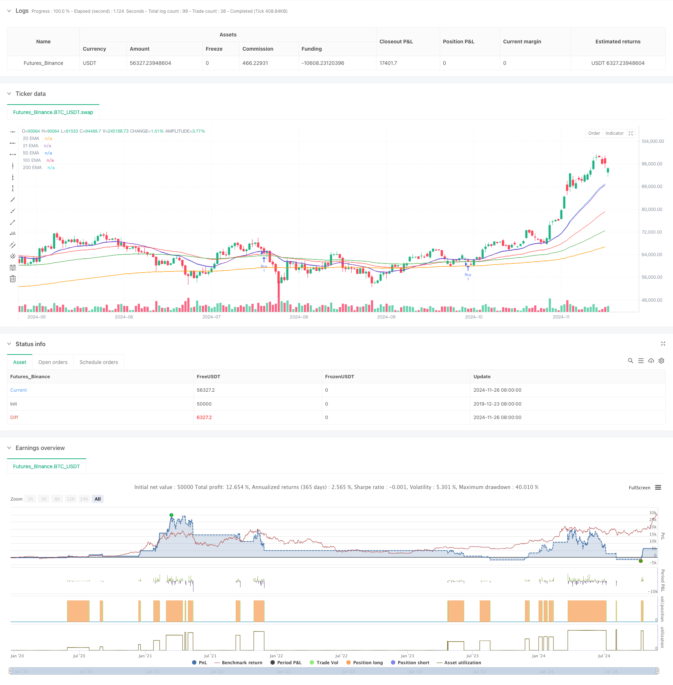

> Name

Multi-EMA-Trend-Following-Strategy-with-Dynamic-ATR-Targets
> Author

ChaoZhang

> Strategy Description



[trans]
#### Overview
This strategy is a trend following trading system based on the Multiple Exponential Moving Averages (EMA) and the True Range Indicator (ATR). The strategy confirms the trend direction by judging the arrangement of multiple moving averages, looks for callback buying opportunities in the upward trend, and uses ATR to dynamically set stop loss and profit targets. This method not only ensures the stability of trend tracking, but also achieves dynamic adaptation to market fluctuations through ATR.
#### Strategy Principle
The core logic of the strategy includes the following key elements:
1. Trend judgment: Using the 20, 50, 100 and 200-day exponential moving averages, when the short-term moving average is above the long-term moving average and shows a long arrangement, the upward trend is confirmed.
2. Entry conditions: On the basis of confirming the trend, wait for the price to pull back to near the 21-day moving average (between the 21-day moving average and the 50-day moving average) to enter the market.
3. Risk management: Set dynamic stop loss and profit targets based on ATR. The stop loss is set to the entry price minus 1.5 times ATR, and the profit target is the entry price plus 3.5 times ATR.
4. Position management: Using a single position mode, there will be no repeated entries when holding positions.
#### Strategic Advantages
1. Rigorous trend confirmation mechanism: Confirming the trend through the arrangement of multiple moving averages can effectively filter out false breakthroughs.
2. Accurate entry timing: Waiting for the callback to the moving average support level to enter the market during the upward trend, which improves the winning rate.
3. Flexible risk management: Use ATR to dynamically set stop loss and profit targets, which can automatically adjust according to market volatility.
4. Clear execution logic: The policy rules are clear and easy to understand and execute.
5. Strong adaptability: can be applied to different market environments and trading varieties.
#### Strategy Risk
1. Risk of volatile market: Stop loss may be triggered frequently in a volatile market.
2. Slippage risk: You may face greater slippage when the market fluctuates violently.
3. Trend reversal risk: A large retracement may occur when the trend reverses.
4. Parameter sensitivity: The choice of moving average period and ATR multiple will significantly affect the strategy performance.
#### Strategy optimization direction
1. Add market environment filtering: You can add trend strength indicators such as ADX to trade in strong trend markets.
2. Optimize position management: the position size can be dynamically adjusted according to the strength of the trend.
3. Improve the stop loss mechanism: you can set a trailing stop loss in combination with the support level.
4. Add exit mechanism: Trend reversal signals can be added as early exit conditions.
5. Parameter adaptation: The moving average parameters can be dynamically adjusted according to the market fluctuation cycle.
#### Summary
This is a trend following strategy with complete structure and rigorous logic. The combination of trend confirmation through multiple moving averages, callback entry and ATR dynamic risk management not only ensures the robustness of the strategy, but also has good adaptability. Although there are some inherent risks, the stability and profitability of the strategy can be further improved through the suggested optimization directions. This strategy is particularly suitable for tracking mid- to long-term trends and is a good choice for traders who expect to obtain stable returns in trending markets.
|| 

#### Overview
This strategy is a trend following trading system based on multiple Exponential Moving Averages (EMA) and Average True Range (ATR). It confirms trend direction through multiple EMA alignments, seeks pullback opportunities in uptrends, and uses ATR for dynamic stop-loss and profit targets. This approach ensures trend following stability while dynamically adapting to market volatility.

#### Strategy Principles
The core logic includes the following key elements:
1. Trend Identification: Uses 20, 50, 100, and 200-day EMAs, confirming an uptrend when shorter EMAs are above longer ones in bullish alignment.
2. Entry Conditions: After trend confirmation, enters when price pulls back to near the 21-day EMA (between 21 and 50 EMAs).
3. Risk Management: Sets dynamic stop-loss and profit targets based on ATR - stop-loss at 1.5 times ATR below entry, profit target at 3.5 times ATR above entry.
4. Position Management: Employs single position approach, avoiding multiple entries while holding positions.

#### Strategy Advantages
1. Rigorous Trend Confirmation: Multiple EMA alignment effectively filters false breakouts.
2. Precise Entry Timing: Waiting for pullbacks to EMA support in uptrends improves win rate.
3. Flexible Risk Management: Dynamic ATR-based stops and targets automatically adjust to market volatility.
4. Clear Execution Logic: Strategy rules are explicit and easy to understand.
5. High Adaptability: Applicable to various market environments and trading instruments.

#### Strategy Risks
1. Choppy Market Risk: Frequent stop-losses may occur in sideways markets.
2. Slippage Risk: Significant slippage possible during high volatility.
3. Trend Reversal Risk: Large drawdowns possible during trend reversals.
4. Parameter Sensitivity: EMA periods and ATR multipliers significantly impact performance.

#### Strategy Optimization Directions
1. Add Market Environment Filters: Incorporate ADX or similar trend strength indicators.
2. Improve Position Management: Dynamically adjust position size based on trend strength.
3. Enhanced Stop-Loss Mechanism: Implement trailing stops based on support levels.
4. Additional Exit Mechanisms: Add trend reversal signals as early exit conditions.
5. Parameter Adaptation: Dynamically adjust EMA parameters based on market cycles.

#### Conclusion
This is a well-structured and logically rigorous trend following strategy. The combination of multiple EMA trend confirmation, pullback entries, and ATR-based dynamic risk management ensures both robustness and adaptability. While inherent risks exist, the suggested optimizations can further enhance strategy stability and profitability. This strategy is particularly suitable for tracking medium to long-term trends and is a solid choice for traders seeking consistent returns in trending markets.[/trans]


> Source (PineScript)

``` pinescript
/*backtest
start: 2019-12-23 08:00:00
end: 2024-11-27 00:00:00
period: 1d
basePeriod: 1d
exchanges: [{"eid":"Futures_Binance","currency":"BTC_USDT"}]
*/

//@version=5
strategy("EMA Crossover and ATR Target Strategy", overlay=true)

// Input parameters
emaShortLength = 20
emaMidLength1 = 50
emaMidLength2 = 100
emaLongLength = 200
atrLength = 14

// Calculate EMAs
ema20 = ta.ema(close, emaShortLength)
ema50 = ta.ema(close, emaMidLength1)
ema100 = ta.ema(close, emaMidLength2)
ema200 = ta.ema(close, emaLongLength)
ema21 = ta.ema(close, 21)

// Calculate ATR
atr = ta.atr(atrLength)

// Conditions for the strategy
emaCondition = ema20 > ema50 and ema50 > ema100 and ema100 > ema200
pullbackCondition = close <= ema21 and close >= ema50  //and close >= ema21 * 0.99  // Near 21 EMA (within 1%)

// Initialize variables for stop loss and take profitss
var float stopLossLevel = na
var float takeProfitLevel = na

// Check conditions on each bar close
if (bar_index > 0) // Ensures there is data to check
    if emaCondition and pullbackCondition and strategy.position_size == 0 // Only buy if no open position
        stopLossLevel := close - (1.5 * atr)  // Set stop loss based on ATR at buy price
        takeProfitLevel := close + (3.5 * atr)   // Set take profit based on ATR at buy price
        strategy.entry("Buy", strategy.long)

// Set stop loss and take profit for the active trade
if strategy.position_size > 0
    strategy.exit("Take Profit", from_entry="Buy", limit=takeProfitLevel, stop=stopLossLevel)

// Plot EMAs for visualizationn
plot(ema20, color=color.blue, title="20 EMA")
plot(ema50, color=color.red, title="50 EMA")
plot(ema100, color=color.green, title="100 EMA")
plot(ema200, color=color.orange, title="200 EMA")
plot(ema21, color=color.purple, title="21 EMA")

```

> Detail

https://www.fmz.com/strategy/473265

> Last Modified

2024-11-28 17:11:02
