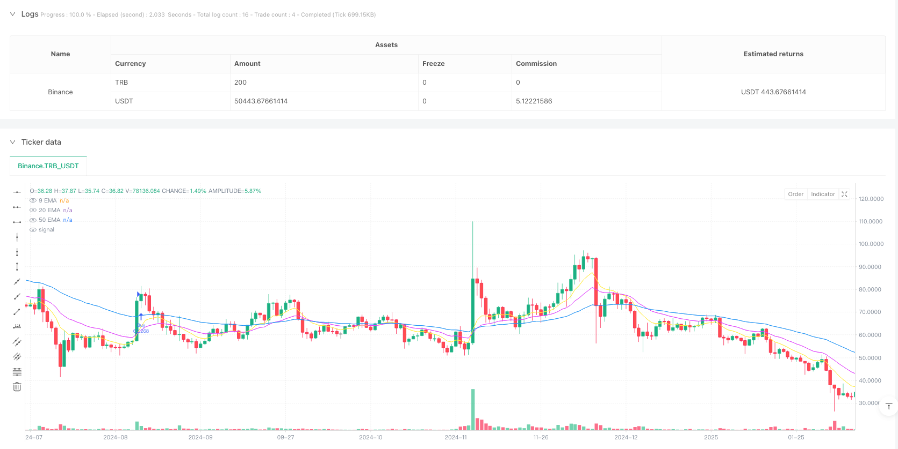
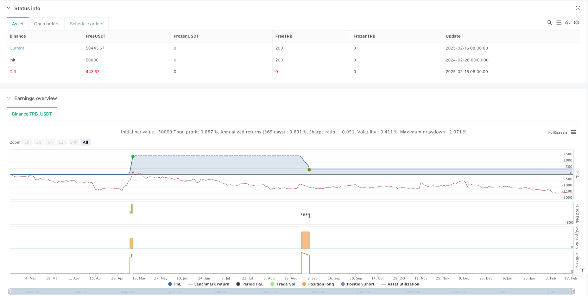

> Name

Multi-EMA-Trend-Following-with-Dynamic-ATR-Based-Exit-Strategy-for-Cryptocurrency-Trading
> Author

ianzeng123

> Strategy Description





[trans]
#### Overview
This is a cryptocurrency trading strategy based on a multi-moving average trend following system that combines RSI and ATR indicators for trade filtering and risk management. This strategy mainly focuses on trading mainstream cryptocurrencies, and controls risks by setting daily trading frequency limits and dynamic stop-profit and stop-loss. The strategy uses three exponential moving averages (EMA) of 9, 20 and 50 periods to determine the trend direction, and uses the relative strength index (RSI) and average true range (ATR) as auxiliary indicators for transaction filtering.
#### Strategy Principle
The core trading logic of the strategy includes the following key parts:
1. Trend judgment: Use three EMAs (9/20/50) to judge the trend direction. When the short-term EMA crosses the mid-term EMA and the price is above the long-term EMA, the upward trend is deemed to be established; otherwise, the downward trend is deemed to be established.
2. Transaction filtering: Use RSI (14) for overbought and oversold filtering. The buy signal requires the RSI to be between 45-70, and the sell signal requires the RSI to be between 30-55.
3. Confirmation of trend strength: The distance between the price and the 50-period EMA is required to be greater than 1.1 times ATR to ensure that the trend is strong enough.
4. Risk management: According to the fluctuation characteristics of different cryptocurrencies, set a stop loss of 2.5-3.2 times ATR and a take-profit of 3.5-5.0 times ATR.
5. Transaction frequency control: Allow at most one transaction per trading day to avoid excessive trading.
#### Strategic Advantages
1. Dynamic risk management: Dynamically adjust the stop-profit and stop-loss positions through ATR to adapt to the high volatility of the cryptocurrency market.
2. Differentiated treatment: Set different risk parameters according to the fluctuation characteristics of different cryptocurrencies.
3. Multiple filtering mechanisms: Combine trend, momentum and volatility indicators to improve transaction quality.
4. Trading frequency limit: Reduce the risk of excessive trading through daily trading limits, which is especially suitable for the high volatility characteristics of the cryptocurrency market.
5. Reasonable fund management: dynamically calculate transaction size based on account size and risk level to protect fund security.
#### Strategy Risk
1. Trend reversal risk: You may suffer large losses when the cryptocurrency market fluctuates violently.
2. Slippage risk: You may face larger slippage when liquidity is insufficient.
3. Trading opportunity restrictions: Daily trading limit may miss opportunities in fast markets.
4. Parameter sensitivity: The settings of multiple indicator parameters will affect the strategy performance and require regular optimization.
5. Market environment dependence: The strategy performs better in trending markets, but may produce false signals in volatile markets.
#### Strategy optimization direction
1. Introduce market fluctuation cycle analysis: parameters can be dynamically adjusted according to different fluctuation cycles of the cryptocurrency market.
2. Optimize trading time filtering: add filtering conditions based on major global trading periods.
3. Improve the exit mechanism: You can add a moving stop loss or a dynamic exit mechanism based on market sentiment.
4. Increase transaction size management: the transaction size can be dynamically adjusted according to market volatility.
5. Add market sentiment indicators: Introduce on-chain data or social media sentiment indicators to enhance transaction filtering.
#### Summary
This strategy achieves a relatively stable cryptocurrency trading system through the comprehensive use of multiple technical indicators. Through differentiated risk parameter settings and strict transaction frequency control, returns and risks are better balanced. The core advantage of the strategy lies in its dynamic risk management mechanism and complete filtering system, but at the same time, attention must be paid to the high volatility and liquidity risks unique to the cryptocurrency market. Through continuous optimization and improvement, this strategy is expected to maintain stable performance in different market environments. ||


#### Overview
This is a cryptocurrency trading strategy based on a multiple EMA trend following system, incorporating RSI and ATR indicators for trade filtering and risk management. The strategy focuses on major cryptocurrencies, implementing daily trade frequency limits and dynamic stop-loss/take-profit levels for risk control. It uses three exponential moving averages (9, 20, and 50 periods) to determine trend direction, with Relative Strength Index (RSI) and Average True Range (ATR) as supplementary indicators for trade filtering.

#### Strategy Principles
The core trading logic includes the following key components:
1. Trend Determination: Uses three EMAs (9/20/50) for trend direction identification, with bullish trends confirmed when the short-term EMA crosses above the medium-term EMA and price is above the long-term EMA; bearish trends are confirmed by the opposite conditions.
2. Trade Filtering: Employs RSI(14) for overbought/oversold filtering, requiring RSI between 45-70 for buy signals and 30-55 for sell signals.
3. Trend Strength Confirmation: Requires price distance from 50-period EMA to exceed 1.1 times ATR to ensure sufficient trend strength.
4. Risk Management: Sets stop-loss at 2.5-3.2 times ATR and take-profit at 3.5-5.0 times ATR, customized for different cryptocurrencies.
5. Trade Frequency Control: Limits trading to one trade per day maximum to prevent overtrading.

#### Strategy Advantages
1. Dynamic Risk Management: Adjusts stop-loss and take-profit levels dynamically using ATR to adapt to high cryptocurrency market volatility.
2. Differentiated Handling: Sets different risk parameters for different cryptocurrencies.
3. Multiple Filtering Mechanisms: Combines trend, momentum, and volatility indicators to improve trade quality.
4. Trade Frequency Limitation: Reduces overtrading risk through daily trade limits, particularly suitable for volatile crypto markets.
5. Rational Money Management: Calculates trade size dynamically based on account size and risk level to protect capital.

#### Strategy Risks
1. Trend Reversal Risk: May incur significant losses during violent cryptocurrency market movements.
2. Slippage Risk: May face substantial slippage during low liquidity periods.
3. Trading Opportunity Limitation: Daily trade limits may cause missed opportunities in fast-moving markets.
4. Parameter Sensitivity: Strategy performance depends on multiple indicator parameters requiring periodic optimization.
5. Market Environment Dependency: Performs well in trending markets but may generate false signals in ranging markets.

#### Strategy Optimization Directions
1. Incorporate Market Cycle Analysis: Dynamically adjust parameters based on different cryptocurrency market cycles.
2. Optimize Time-Based Filtering: Add filters based on major global trading sessions.
3. Enhance Exit Mechanisms: Add trailing stops or dynamic exits based on market sentiment.
4. Improve Position Sizing: Dynamically adjust trade size based on market volatility.
5. Include Market Sentiment Indicators: Incorporate on-chain data or social media sentiment indicators for enhanced filtering.

#### Summary
The strategy achieves a relatively robust cryptocurrency trading system through the comprehensive use of multiple technical indicators. It balances returns and risks well through differentiated risk parameters and strict trade frequency control. The core advantages lie in its dynamic risk management mechanism and comprehensive filtering system, while attention must be paid to the unique high volatility and liquidity risks of cryptocurrency markets. Through continuous optimization and improvement, the strategy has the potential to maintain stable performance across different market environments.[/trans]


> Source (PineScript)

``` pinescript
/*backtest
start: 2015-02-22 00:00:00
end: 2025-02-18 17:23:25
period: 1h
basePeriod: 1h
*/

// This Pine Script™ code is subject to the terms of the Mozilla Public License 2.0 at https://mozilla.org/MPL/2.0/
// © buffalobillcody

//@version=6
strategy("Backtest Last 2880 Baars Filers and Exits", overlay=true, default_qty_type=strategy.percent_of_equity, default_qty_value=2, backtest_fill_limits_assumption=0)

// Define EMAs
shortEMA = ta.ema(close, 9)
longEMA = ta.ema(close, 20)
refEMA = ta.ema(close, 50)

// **Force Strategy to Trade on Historical Bars**
barLimit = bar_index > 10  // Allow trading on past bars
allowTrade = strategy.opentrades == 0 or barLimit  // Enable first trade on history

// **Define ATR for Stop-Loss & Take-Profit**
atrLength = 14
atrValue = ta.atr(atrLength)
atr50 = ta.sma(atrValue, 50)  // 50-period ATR average

// **Relaxed RSI Filters (More Trades Allowed)**
rsi = ta.rsi(close, 14)
rsiFilterBuy = rsi > 45 and rsi < 70  
rsiFilterSell = rsi < 55 and rsi > 30  

// **Reduce Trend Filter - Allow Smaller Price Movement**
minDistance = atrValue * 1.1  
isTrending = math.abs(close - refEMA) > minDistance  

// **Allow Trading in All Conditions (No ATR Filter)**
atrFilter = true  

// **Allow Flat EMA Slopes - Increase Trade Frequency**
emaSlope = ta.linreg(refEMA, 5, 0) > -0.2  
emaSlopeSell = ta.linreg(refEMA, 5, 0) < 0.2  

// **Trade Counter: Allow 1 Trade Per Day**
var int dailyTradeCount = 0
if dayofweek != dayofweek[1]  
    dailyTradeCount := 0  

// **ATR-Based Stop-Loss & Take-Profit Per Pair**
atrSL = switch syminfo.ticker
    "EURUSD" => 3.0 * atrValue,  
    "USDJPY" => 2.5 * atrValue,  
    "GBPUSD" => 3.0 * atrValue,  
    "AUDUSD" => 3.2 * atrValue,  
    "GBPJPY" => 3.0 * atrValue,  
    => 2.5 * atrValue  

atrTP = switch syminfo.ticker
    "EURUSD" => 3.8 * atrValue,  
    "USDJPY" => 3.5 * atrValue,  
    "GBPUSD" => 4.0 * atrValue,  
    "AUDUSD" => 4.0 * atrValue,  
    "GBPJPY" => 5.0 * atrValue,  
    => 3.5 * atrValue  

// **Ensure Trade Size is Not Zero**
riskPerTrade = 2  
accountSize = strategy.equity
tradeSize = (accountSize * (riskPerTrade / 100)) / atrSL
tradeSize := tradeSize < 1 ? 1 : tradeSize  // Minimum lot size of 1

// **Buy/Sell Conditions (Now More Trades Will Trigger)**
buyCondition = ta.crossover(shortEMA, longEMA) and rsiFilterBuy and close > refEMA and close > longEMA and isTrending and emaSlope and allowTrade and dailyTradeCount < 1
sellCondition = ta.crossunder(shortEMA, longEMA) and rsiFilterSell and close < refEMA and close < longEMA and isTrending and emaSlopeSell and allowTrade and dailyTradeCount < 1

// **Execute Trades**
if buyCondition
    strategy.entry("Buy", strategy.long, qty=tradeSize)
    strategy.exit("Take Profit/Stop Loss", from_entry="Buy", limit=close + atrTP, stop=close - atrSL)
    label.new(x=bar_index, y=low, text="BUY", color=color.green, textcolor=color.white, size=size.small, style=label.style_label_down)
    alert("BUY", alert.freq_once_per_bar_close)  
    dailyTradeCount := dailyTradeCount + 1  

if sellCondition
    strategy.entry("Sell", strategy.short, qty=tradeSize)
    strategy.exit("Take Profit/Stop Loss", from_entry="Sell", limit=close - atrTP, stop=close + atrSL)
    label.new(x=bar_index, y=high, text="SELL", color=color.red, textcolor=color.white, size=size.small, style=label.style_label_up)
    alert("SELL", alert.freq_once_per_bar_close)  
    dailyTradeCount := dailyTradeCount + 1  

// **Plot Indicators**
plot(shortEMA, color=color.yellow, title="9 EMA")
plot(longEMA, color=color.fuchsia, title="20 EMA")
plot(refEMA, color=color.blue, title="50 EMA")
```

> Detail

https://www.fmz.com/strategy/482670

> Last Modified

2025-02-20 14:45:33
