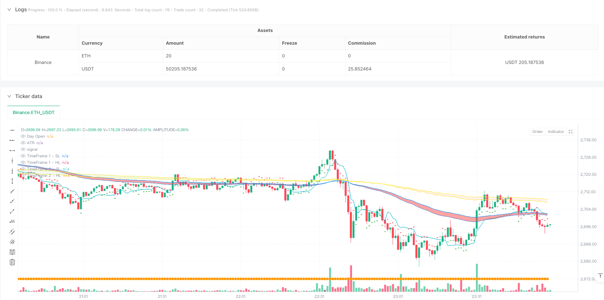
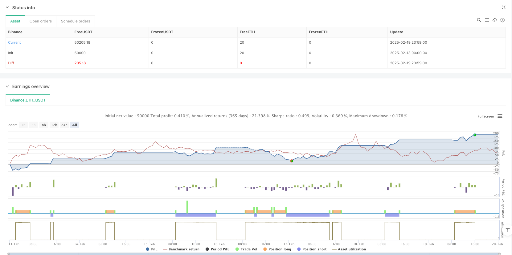

> Name

Multi-Indicator Combination ATR Tracking Stop-Loss Intelligent Trading Strategy-Multi-Indicator-ATR-Trailing-Stop-Smart-Trading-Strategy
> Author

ianzeng123

> Strategy Description





[trans]
#### Overview
This is an intelligent trading strategy that combines multiple technical indicators, mainly based on the ATR indicator to implement the trailing stop loss function. The strategy also integrates multi-dimensional analysis indicators such as moving average clouds (JLines Cloud), trading volume analysis, and intraday opening prices, and is particularly suitable for trading on 3-minute and 5-minute time periods. This strategy dynamically adjusts the stop loss position through ATR and combines the moving average system to determine the trend direction, realizing a comprehensive trading decision-making system.
#### Strategy Principle
The core of the strategy is a trailing stop loss system based on the ATR (Average True Range) indicator. It uses a 10-period ATR and a 2x ATR multiplier to calculate dynamic stop loss lines. At the same time, it integrates the JLines Cloud system of two time periods (72/89 moving average combination), and the optional 5/15 moving average system. The generation of trading signals needs to meet the following conditions:
1. ATR tracks the breakthrough of the stop loss line
2. The trends of JLines Cloud in the two time periods are consistent
3. Price position relative to the opening price of the day
4. Confirmation of abnormal trading volume
#### Strategic Advantages
1. Dynamic stop loss protection - Adapt to market fluctuations through the ATR indicator to provide flexible stop loss protection
2. Multi-dimensional trend confirmation - Use moving average combinations of different time periods to improve the accuracy of trend judgment
3. Transaction volume verification - increase transaction confirmation through abnormal transaction volume analysis
4. Perfect risk management - dual protection mechanism including fixed stop loss and profit target
5. Strong adaptability - parameters can be adjusted according to different market conditions
#### Strategy Risk
1. Parameter sensitivity - the choice of ATR period and multiplier will significantly affect strategy performance
2. Dependence on market conditions – sideways markets may generate frequent false signals
3. Multiple conditions - strict entry conditions may result in missing some trading opportunities
4. Impact of slippage - During periods of high volatility, the actual execution price may deviate significantly from the signal price
#### Strategy optimization direction
1. Dynamic parameter adjustment - ATR parameters can be automatically adjusted according to market volatility
2. Time filter - Add trading time filter to avoid high volatility periods when the market opens and closes
3. Trend strength filtering - Introducing trend strength indicators to improve the accuracy of trend judgment
4. Risk management optimization - implement dynamic take-profit and stop-loss ratios to adapt to different market environments
5. Enhanced transaction volume analysis - refine the transaction volume analysis method to improve the accuracy of transaction confirmation
#### Summary
This is a complete trading system that integrates multiple technical indicators, providing core risk management through ATR tracking stop loss, while using moving average clouds and transaction volume analysis to provide transaction confirmation. The advantage of the strategy lies in its comprehensive market analysis framework and complete risk management system, but it requires parameter optimization based on the specific market environment. Through the suggested optimization direction, the stability and profitability of the strategy are expected to be further improved. ||
#### Overview
This is an intelligent trading strategy that combines multiple technical indicators, primarily based on the ATR indicator for trailing stop loss functionality. The strategy integrates JLines Cloud, volume analysis, and daily opening price among other multi-dimensional analytical indicators, particularly suitable for trading on 3-minute and 5-minute timeframes. The strategy dynamically adjusts stop-loss positions through ATR while using moving average systems to determine trend direction, creating a comprehensive trading decision system.

#### Strategy Principles
The core of the strategy is a trailing stop system built on the ATR (Average True Range) indicator. It uses a 10-period ATR with a 2x ATR multiplier to calculate dynamic stop lines. It also incorporates the JLines Cloud system (72/89 EMA combination) across two timeframes, plus an optional 5/15 EMA system. Trade signals are generated based on:
1. ATR trailing stop line breakouts
2. Consistent trends across both timeframe JLines Clouds
3. Price position relative to daily opening price
4. Confirmation from unusual volume activity

#### Strategy Advantages
1. Dynamic Stop Protection - Self-adapts to market volatility through ATR indicator
2. Multi-dimensional Trend Confirmation - Improves trend judgment accuracy using different timeframe moving average combinations
3. Volume Verification - Enhances trade confirmation through unusual volume analysis
4. Comprehensive Risk Management - Includes dual protection mechanism with fixed stops and profit targets
5. High Adaptability - Parameters can be adjusted for different market conditions

#### Strategy Risks
1. Parameter Sensitivity - ATR period and multiplier choices significantly impact strategy performance
2. Market Condition Dependency - May generate frequent false signals in ranging markets
3. Multiple Condition Restrictions - Strict entry conditions might lead to missed trading opportunities
4. Slippage Impact - Actual execution prices may significantly deviate from signal prices during high volatility

#### Strategy Optimization Directions
1. Dynamic Parameter Adjustment - Automatically adjust ATR parameters based on market volatility
2. Time Filters - Add trading time filters to avoid high volatility periods at market open and close
3. Trend Strength Filtering - Introduce trend strength indicators to improve trend judgment accuracy
4. Risk Management Optimization - Implement dynamic profit/loss ratios for different market environments
5. Enhanced Volume Analysis - Refine volume analysis methods to improve trade confirmation accuracy

#### Summary
This is a complete trading system that integrates multiple technical indicators, providing core risk management through ATR trailing stops while utilizing moving average clouds and volume analysis for trade confirmation. The strategy's strength lies in its comprehensive market analysis framework and robust risk management system, though parameter optimization is needed for specific market environments. Through the suggested optimization directions, the strategy's stability and profitability can be further enhanced.
[/trans]


> Source (PineScript)

``` pinescript
/*backtest
start: 2025-02-13 00:00:00
end: 2025-02-20 00:00:00
period: 1m
basePeriod: 1m
exchanges: [{"eid":"Binance","currency":"ETH_USDT"}]
*/

//@version=6
strategy("AI trade Roney nifty value", overlay=true)

// User Inputs
atrPeriod = input.int(10, "ATR Period")
atrMultiplier = input.float(2, "ATR Multiplier")
target = input.float(40, "Target")
stopLoss = input.float(40, "Stop Loss")

// Calculate ATR-based trailing stop
atr = ta.atr(atrPeriod)
nLoss = atrMultiplier * atr
var float xATRTrailingStop = na

if na(xATRTrailingStop)
    xATRTrailingStop := close - nLoss
else
    if close > xATRTrailingStop[1] and close[1] > xATRTrailingStop[1]
        xATRTrailingStop := math.max(xATRTrailingStop[1], close - nLoss)
    else if close < xATRTrailingStop[1] and close[1] < xATRTrailingStop[1]
        xATRTrailingStop := math.min(xATRTrailingStop[1], close + nLoss)
    else
        xATRTrailingStop := close > xATRTrailingStop[1] ? close - nLoss : close + nLoss

// Define position and entry/exit prices
var int pos = na
pos := close[1] < xATRTrailingStop[1] and close > xATRTrailingStop[1] ? 1 : 
       close[1] > xATRTrailingStop[1] and close < xATRTrailingStop[1] ? -1 : pos[1]

var bool isLong = false
var bool isShort = false

var float entryPrice = na
var float exitPrice = na
var float exitStop = na

// JLines Cloud indicator
sl = input.int(72, "Smaller length")
hl = input.int(89, "Higher length")

res = input.timeframe("1", "JLines - Time Frame 1")
res1 = input.timeframe("3", "JLines - Time Frame 2")
enable515 = input.bool(false, "5/15 EMA")
res2 = input.timeframe("5", "5/15 EMA")

ema1_72 = request.security(syminfo.tickerid, res, ta.ema(close, sl))
ema1_89 = request.security(syminfo.tickerid, res, ta.ema(close, hl))
ema2_72 = request.security(syminfo.tickerid, res1, ta.ema(close, sl))
ema2_89 = request.security(syminfo.tickerid, res1, ta.ema(close, hl))
ema3_5 = request.security(syminfo.tickerid, res2, ta.ema(close, 5))
ema3_15 = request.security(syminfo.tickerid, res2, ta.ema(close, 15))

// Plot JLines Cloud
p1_1 = plot(ema1_72, "TimeFrame 1 - SL", color=color.blue, display=display.none)
p1_2 = plot(ema1_89, "TimeFrame 1 - HL", color=color.blue, display=display.none)
p2_1 = plot(ema2_72, "TimeFrame 2 - SL", color=color.yellow, display=display.none)
p2_2 = plot(ema2_89, "TimeFrame 2 - HL", color=color.yellow, display=display.none)
p3_1 = plot(enable515 ? ema3_5 : na, "Late Day Fade - 5 EMA", color=color.yellow, display=display.none)
p3_2 = plot(enable515 ? ema3_15 : na, "Late Day Fade - 15 EMA", color=color.yellow, display=display.none)

fill(p1_1, p1_2, color=ema1_72 > ema1_89 ? color.new(color.green, 30) : color.new(color.red, 30), title="Background 1")
fill(p2_1, p2_2, color=ema2_72 > ema2_89 ? color.new(color.green, 90) : color.new(color.red, 90), title="Background 2")
fill(p3_1, p3_2, color=enable515 ? (ema3_5 > ema3_15 ? color.new(color.blue, 50) : color.new(color.red, 50)) : na, title="Late Day Fade")

// Plot Buy and Sell signals
plotshape(pos == 1, title="Buy", style=shape.triangleup, location=location.belowbar, color=color.green)
plotshape(pos == -1, title="Sell", style=shape.triangledown, location=location.abovebar, color=color.red)

// Volume Analysis
vol_length = input.int(20, "Volume SMA length", minval=1)
vol_avg = ta.sma(volume, vol_length)

unusual_vol_down = volume > vol_avg * 1.2 and close < open
unusual_vol_up = volume > vol_avg * 1.2 and close > open

barcolor(unusual_vol_down or unusual_vol_up ? color.yellow : na)

// ATR Indicator
len2 = input.int(20, minval=1, title="Smooth")
src = input.source(close, title="Source")
out = ta.vwma(src, len2)
avg1 = math.avg(out, xATRTrailingStop) // FIXED: Replaced `ta.avg()` with `math.avg()`

plot(avg1, color=color.aqua, title="ATR")

// Daily Open Line
dl = input.bool(true, "Show daily Open")
dopen = request.security(syminfo.tickerid, "D", open)
plot(dl ? dopen : na, title="Day Open", color=color.orange, style=plot.style_circles, linewidth=2)

// Strategy Entry Conditions
if pos == 1 and not isLong and ema1_72 > ema1_89 and ema2_72 > ema2_89 and ema1_72 > ema2_72 and close > dopen
    entryPrice := close
    exitPrice := close + target
    exitStop := entryPrice - stopLoss
    strategy.entry("Buy", strategy.long)
    strategy.exit("buy_target", "Buy", limit=exitPrice)
    isLong := true
    isShort := false

if pos == -1 and not isShort and ema1_72 < ema1_89 and ema2_72 < ema2_89 and ema1_72 < ema2_72 and close < dopen
    entryPrice := close
    exitPrice := close - target
    exitStop := entryPrice + stopLoss
    strategy.entry("Sell", strategy.short)
    strategy.exit("Sell_target", "Sell", limit=exitPrice)
    isLong := false
    isShort := true

// Stop Loss Handling
if strategy.position_size > 0 and close < entryPrice - stopLoss
    strategy.close("Buy", comment="Buy_Stop Loss")

if strategy.position_size < 0 and close > entryPrice + stopLoss
    strategy.close("Sell", comment="Sell_Stop Loss")
```

> Detail

https://www.fmz.com/strategy/483028

> Last Modified

2025-02-21 10:03:26
