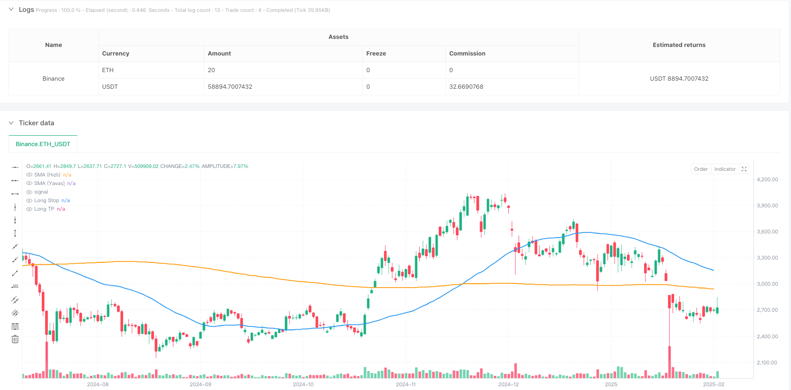
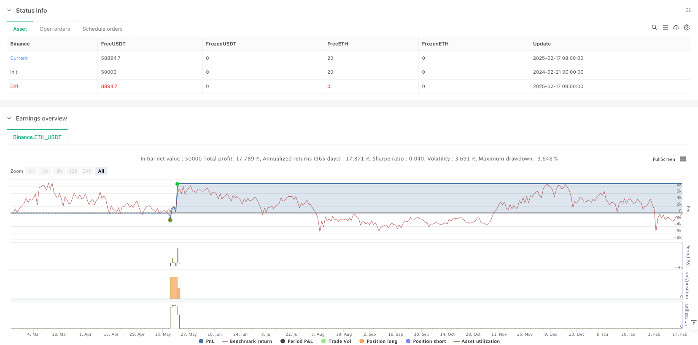

> Name

Multi-Indicator-Trend-Cross-with-ATR-Dynamic-Volatility-Strategy
> Author

ianzeng123

> Strategy Description





[trans]
#### Overview
This strategy is a trend following system that combines multiple technical indicators. It mainly determines the trading direction based on the cross signals of RSI, MACD and SMA, while using the ATR indicator to dynamically adjust stop loss and profit levels. The strategy also integrates volume filters to ensure trading with sufficient market liquidity and a partial take-profit mechanism to optimize money management.
#### Strategy Principle
The strategy uses a triple verification mechanism to confirm trading signals:
1. Determine the main trend direction through the position relationship between the 50 and 200 day moving averages
2. Use RSI crossovers in overbought and oversold areas to find entry opportunities.
3. Combine with MACD indicator to confirm trend momentum
4. Use volume filters to ensure adequate market liquidity
5. Adopt dynamic stop loss and profit target settings based on ATR
The purpose of multiple verification is to reduce false signals and improve transaction accuracy. The strategy opens a position when the long conditions are met (trend upward + RSI above 40 + MACD upward + volume confirmation), and uses 2 times of ATR as stop loss and 4 times as take profit.
#### Strategic Advantages
1. Cross-validation of multiple technical indicators to effectively reduce false signals
2. Dynamic volatility stop-loss mechanism to adapt to different market environments
3. Adopt a partial take-profit strategy to lock in some profits while retaining room for growth.
4. Trading volume filtering ensures sufficient market liquidity
5. Complete risk management system, including fixed stop loss, trailing stop loss and partial profit
#### Strategy Risk
1. Multiple indicators may lead to missing some trading opportunities
2. May suffer large retracements in violently volatile markets
3. Excessive parameter optimization may lead to overfitting
4. Volume filtering may miss good opportunities in low-liquidity markets
5. Dynamic stops can be triggered prematurely during periods of high volatility
#### Strategy optimization direction
1. Consider adding a market volatility adaptation mechanism to dynamically adjust parameters under different volatility environments
2. Introduce multi-period analysis to improve the accuracy of trend judgment
3. Optimize some take-profit ratios and adjust take-profit strategies under different market environments
4. Add trend strength filter to avoid trading in weak trend environment
5. Consider adding seasonal factor analysis to optimize trading timing
#### Summary
This is a comprehensive trend following strategy that uses multiple technical indicators to build a robust trading system. The main feature of the strategy is to adapt to market changes through dynamic stop loss and profit mechanisms while ensuring safety. Although there are some areas that need optimization, the overall framework is reasonable and suitable for further improvement and real-time testing. ||
#### Overview
This strategy is a trend following system that combines multiple technical indicators. It primarily uses cross signals from RSI, MACD and SMA to determine trading direction, while using the ATR indicator to dynamically adjust stop-loss and take-profit levels. The strategy also incorporates a volume filter to ensure trading under sufficient market liquidity and employs partial profit-taking mechanisms to optimize money management.

#### Strategy Principles
The strategy employs a triple verification mechanism to confirm trading signals:
1. Determines main trend direction through the relationship between 50 and 200-day moving averages
2. Uses RSI crosses in overbought/oversold zones to find entry points
3. Confirms trend momentum with MACD indicator
4. Uses volume filter to ensure adequate market liquidity
5. Employs ATR-based dynamic stop-loss and profit targets

The multiple verifications aim to reduce false signals and improve trading accuracy. The strategy opens positions when long conditions are met (uptrend + RSI crosses above 40 + MACD up + volume confirmation) and uses 2x ATR for stop-loss and 4x ATR for take-profit.

#### Strategy Advantages
1. Multiple technical indicator cross-verification effectively reduces false signals
2. Dynamic volatility-based stop-loss mechanism adapts to different market conditions
3. Partial profit-taking strategy locks in profits while maintaining upside potential
4. Volume filtering ensures sufficient market liquidity
5. Comprehensive risk management system including fixed stops, trailing stops and partial profits

#### Strategy Risks
1. Multiple indicators may cause missed trading opportunities
2. May suffer larger drawdowns in highly volatile markets
3. Parameter optimization may lead to overfitting
4. Volume filtering might miss good opportunities in low liquidity markets
5. Dynamic stops may trigger too early during high volatility periods

#### Optimization Directions
1. Consider adding market volatility adaptation mechanism to dynamically adjust parameters in different volatility environments
2. Introduce multi-timeframe analysis to improve trend determination accuracy
3. Optimize partial profit-taking ratios, adjusting take-profit strategy in different market conditions
4. Add trend strength filter to avoid trading in weak trend environments
5. Consider adding seasonality analysis to optimize trading timing

#### Summary
This is a comprehensive trend following strategy that establishes a robust trading system through the coordinated use of multiple technical indicators. The strategy's main feature is its ability to adapt to market changes through dynamic stop-loss and profit mechanisms while maintaining safety. Although there are areas for optimization, the overall framework is sound and suitable for further refinement and live testing.[/trans]


> Source (PineScript)

``` pinescript
/*backtest
start: 2024-02-21 00:00:00
end: 2025-02-18 08:00:00
period: 1d
basePeriod: 1d
exchanges: [{"eid":"Binance","currency":"ETH_USDT"}]
*/

//@version=5
strategy(    title="AI Trade Strategy v2 (Extended) - Fixed",    shorttitle="AI_Trade_v2",    overlay=true,    format=format.price,    initial_capital=100000,    default_qty_type=strategy.percent_of_equity,    default_qty_value=100,    pyramiding=0)

//============================================================================
//=== 1) Basic Indicators (SMA, RSI, MACD) ==================================
//============================================================================

// Time Filter (optional, you can update)
inDateRange = (time >= timestamp("2018-01-01T00:00:00")) and (time <= timestamp("2069-01-01T00:00:00"))

// RSI Parameters
rsiLength  = input.int(14, "RSI Period")
rsiOB      = input.int(60, "RSI Overbought Level")
rsiOS      = input.int(40, "RSI Oversold Level")
rsiSignal  = ta.rsi(close, rsiLength)

// SMA Parameters
smaFastLen = input.int(50, "SMA Fast Period")
smaSlowLen = input.int(200, "SMA Slow Period")
smaFast    = ta.sma(close, smaFastLen)
smaSlow    = ta.sma(close, smaSlowLen)

// MACD Parameters
fastLength     = input.int(12, "MACD Fast Period")
slowLength     = input.int(26, "MACD Slow Period")
signalLength   = input.int(9,  "MACD Signal Period")
[macdLine, signalLine, histLine] = ta.macd(close, fastLength, slowLength, signalLength)

//============================================================================
//=== 2) Additional Filter (Volume) ========================================
//============================================================================
useVolumeFilter    = input.bool(true, "Use Volume Filter?")
volumeMaPeriod     = input.int(20, "Volume MA Period")
volumeMa           = ta.sma(volume, volumeMaPeriod)

// If volume filter is enabled, current bar volume should be greater than x times the average volume
volMultiplier = input.float(1.0, "Volume Multiplier (Volume > x * MA)")
volumeFilter  = not useVolumeFilter or (volume > volumeMa * volMultiplier)

//============================================================================
//=== 3) Trend Conditions (SMA) ============================================
//============================================================================
isBullTrend = smaFast > smaSlow
isBearTrend = smaFast < smaSlow

//============================================================================
//=== 4) Entry Conditions (RSI + MACD + Trend + Volume) ====================
//============================================================================

// RSI crossing above 30 + Bullish Trend + Positive MACD + Volume Filter
longCondition = isBullTrend    and ta.crossover(rsiSignal, rsiOS)    and (macdLine > signalLine)    and volumeFilter 
shortCondition = isBearTrend    and ta.crossunder(rsiSignal, rsiOB)    and (macdLine < signalLine)    and volumeFilter

//============================================================================
//=== 5) ATR-based Stop + Trailing Stop ===================================
//============================================================================
atrPeriod       = input.int(14, "ATR Period")
atrMultiplierSL = input.float(2.0, "Stop Loss ATR Multiplier")
atrMultiplierTP = input.float(4.0, "Take Profit ATR Multiplier")

atrValue = ta.atr(atrPeriod)

//============================================================================
//=== 6) Trade (Position) Management ======================================
//============================================================================
if inDateRange
    //--- Long Entry ---
    if longCondition
        strategy.entry(id="Long", direction=strategy.long, comment="Long Entry")

    //--- Short Entry ---
    if shortCondition
        strategy.entry(id="Short", direction=strategy.short, comment="Short Entry")

    //--- Stop & TP for Long Position ---
    if strategy.position_size > 0
        // ATR-based fixed Stop & TP calculation
        longStopPrice  = strategy.position_avg_price - atrValue * atrMultiplierSL
        longTakeProfit = strategy.position_avg_price + atrValue * atrMultiplierTP

        // PARTIAL EXIT: (Example) take 50% of the position at early TP
        partialTP = strategy.position_avg_price + (atrValue * 2.5)
        strategy.exit(            id         = "Partial TP Long",            stop       = na,            limit      = partialTP,            qty_percent= 50,            from_entry = "Long"        )

        // Trailing Stop + Final ATR Stop
        // WARNING: trail_offset=... is the offset in price units.
        // For example, in BTCUSDT, a value like 300 means a 300 USDT trailing distance.
        float trailingDist = atrValue * 1.5
        strategy.exit(            id          = "Long Exit (Trail)",            stop        = longStopPrice,            limit       = longTakeProfit,            from_entry  = "Long",            trail_offset= trailingDist        )

    //--- Stop & TP for Short Position ---
    if strategy.position_size < 0
        // ATR-based fixed Stop & TP calculation for Short
        shortStopPrice  = strategy.position_avg_price + atrValue * atrMultiplierSL
        shortTakeProfit = strategy.position_avg_price - atrValue * atrMultiplierTP

        // PARTIAL EXIT: (Example) take 50% of the position at early TP
        partialTPShort = strategy.position_avg_price - (atrValue * 2.5)
        strategy.exit(            id         = "Partial TP Short",            stop       = na,            limit      = partialTPShort,            qty_percent= 50,            from_entry = "Short"        )

        // Trailing Stop + Final ATR Stop for Short
        float trailingDistShort = atrValue * 1.5
        strategy.exit(            id          = "Short Exit (Trail)",            stop        = shortStopPrice,            limit       = shortTakeProfit,            from_entry  = "Short",            trail_offset= trailingDistShort        )

//============================================================================
//=== 7) Plot on Chart (SMA, etc.) =========================================
//============================================================================
plot(smaFast, color=color.blue,   linewidth=2, title="SMA (Fast)")
plot(smaSlow, color=color.orange, linewidth=2, title="SMA (Slow)")

// (Optional) Plot Stop & TP levels dynamically:
longStopForPlot  = strategy.position_size > 0 ? strategy.position_avg_price - atrValue * atrMultiplierSL : na
longTPForPlot    = strategy.position_size > 0 ? strategy.position_avg_price + atrValue * atrMultiplierTP : na
shortStopForPlot = strategy.position_size < 0 ? strategy.position_avg_price + atrValue * atrMultiplierSL : na
shortTPForPlot   = strategy.position_size < 0 ? strategy.position_avg_price - atrValue * atrMultiplierTP : na

plot(longStopForPlot,  color=color.red,   style=plot.style_linebr, title="Long Stop")
plot(longTPForPlot,    color=color.green, style=plot.style_linebr, title="Long TP")
plot(shortStopForPlot, color=color.red,   style=plot.style_linebr, title="Short Stop")
plot(shortTPForPlot,   color=color.green, style=plot.style_linebr, title="Short TP")

```

> Detail

https://www.fmz.com/strategy/482884

> Last Modified

2025-02-27 17:30:15
