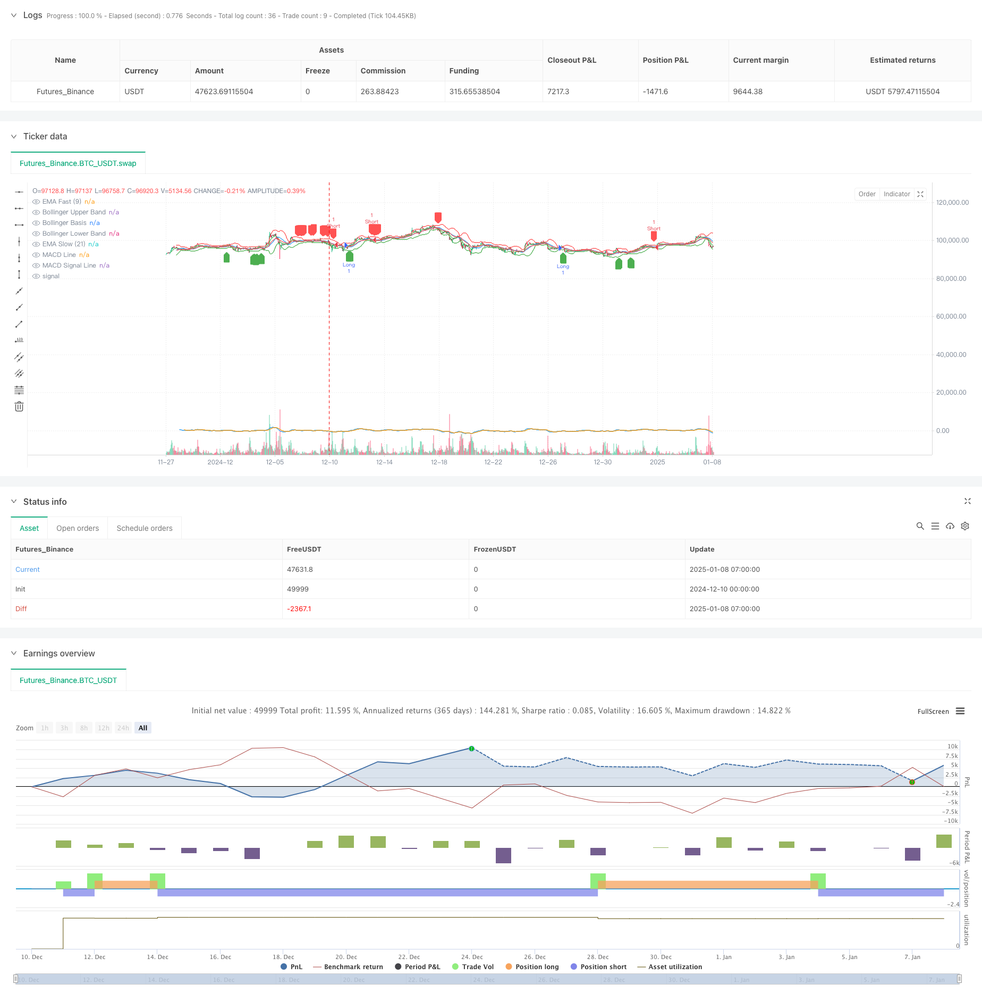

> Name

Multi-Indicator-Trend-Momentum-Trading-Strategy-An-Optimized-Quantitative-Trading-System-Based-on-Bollinger-Bands-Fibonacci-and-ATR
> Author

ChaoZhang

> Strategy Description



[trans]
#### Overview
This strategy is a multi-dimensional technical analysis trading system that combines momentum indicators (RSI, MACD), trend indicators (EMA), volatility indicators (Bollinger Bands, ATR) and price structure indicators (Fibonacci retracements) to capture market opportunities through the synergy of multi-dimensional signals. The strategy design is based on the 15-minute time period, using ATR dynamic stop loss and take profit, and has strong risk control capabilities.
#### Strategy Principle
The core logic of the strategy includes the following dimensions:
1. Trend confirmation: Use the 9/21 period EMA cross to determine the trend direction
2. Momentum verification: Combine RSI oversold and overbought (55/45) and MACD histogram to verify momentum
3. Volatility reference: measure price fluctuations through Bollinger Bands (20 periods, 2 times standard deviation)
4. Support and resistance: Fibonacci 0.382/0.618/0.786 levels calculated using 100 period highs and lows
5. Risk management: 1.5 times stop loss and 3 times take profit based on 14-period ATR
Transactions are carried out only after multiple dimensional signals are triggered together, which improves the accuracy of transactions.
#### Strategic Advantages
1. Multi-dimensional signal cross-validation, significantly reducing false signals
2. Dynamic ATR stop loss and profit, adapting to different market environments
3. Combined with classic technical indicators, easy to understand and maintain
4. Accurate entry timing selection to increase winning rate
5. The risk-return ratio is 1:2, which complies with professional trading standards.
6. Suitable for volatile market environments
#### Strategy Risk
1. Parameter optimization may lead to overfitting
2. Multiple signal conditions may miss part of the market
3. Fixed multiple stop loss may fail in extreme market conditions
4. High requirements on computing resources
5. Transaction costs may affect strategy performance
#### Strategy optimization direction
1. Introduce trading volume factors to verify signal strength
2. Dynamically adjust the RSI threshold to adapt to different markets
3. Add trend strength filter
4. Optimize stop loss and take profit multiples
5. Add time filtering to avoid market shocks
6. Consider introducing machine learning to dynamically optimize parameters
#### Summary
This strategy builds a robust trading system through the coordination of multi-dimensional technical indicators. Its core advantage lies in signal cross-validation and dynamic risk control, but it also requires attention to parameter optimization and market environment adaptability. Subsequent optimization directions mainly focus on dynamic parameter adjustment and signal quality improvement. ||
#### Overview
This strategy is a multi-dimensional technical analysis trading system that combines momentum indicators (RSI, MACD), trend indicators (EMA), volatility indicators (Bollinger Bands, ATR), and price structure indicators (Fibonacci retracements) to capture market opportunities through multi-dimensional signal coordination. The strategy is optimized for 15-minute timeframes and employs ATR-based dynamic stop-loss and take-profit levels, demonstrating strong risk control capabilities.

#### Strategy Principles
The core logic includes the following dimensions:
1. Trend Confirmation: Using 9/21 period EMA crossovers to determine trend direction
2. Momentum Verification: Combining RSI overbought/oversold (55/45) and MACD histogram for momentum validation
3. Volatility Reference: Using Bollinger Bands (20 periods, 2 standard deviations) to measure price volatility
4. Support/Resistance: Fibonacci 0.382/0.618/0.786 levels calculated from 100-period high/low
5. Risk Management: 1.5x ATR stop-loss and 3x ATR take-profit based on 14-period ATR

Trading occurs only when multiple dimensional signals align, improving trading accuracy.

#### Strategy Advantages
1. Multi-dimensional signal cross-validation reduces false signals
2. Dynamic ATR-based stop-loss and take-profit adapts to different market conditions
3. Integration of classic technical indicators makes it easy to understand and maintain
4. Precise entry timing improves win rate
5. Risk-reward ratio of 1:2 meets professional trading standards
6. Suitable for highly volatile market environments

#### Strategy Risks
1. Parameter optimization may lead to overfitting
2. Multiple signal conditions might miss some market moves
3. Fixed multiplier stops may fail in extreme market conditions
4. High computational resource requirements
5. Trading costs may impact strategy performance

#### Strategy Optimization Directions
1. Introduce volume factors to verify signal strength
2. Dynamically adjust RSI thresholds for different markets
3. Add trend strength filters
4. Optimize stop-loss and take-profit multipliers
5. Add time filters to avoid ranging markets
6. Consider implementing machine learning for dynamic parameter optimization

#### Summary
This strategy builds a robust trading system through the coordination of multi-dimensional technical indicators. Its core advantages lie in signal cross-validation and dynamic risk control, but attention must be paid to parameter optimization and market environment adaptability. Future optimization should focus on dynamic parameter adjustment and signal quality improvement.[/trans]


> Source (PineScript)

``` pinescript
/*backtest
start: 2024-12-10 00:00:00
end: 2025-01-08 08:00:00
period: 1h
basePeriod: 1h
exchanges: [{"eid":"Futures_Binance","currency":"BTC_USDT","balance":49999}]
*/

//@version=5
strategy("Optimized Advanced Strategy", overlay=true)

// Bollinger Bandı
length = input(20, title="Bollinger Band Length")
src = close
mult = input.float(2.0, title="Bollinger Band Multiplier")
basis = ta.sma(src, length)
dev = mult * ta.stdev(src, length)
upper = basis + dev
lower = basis - dev

// RSI
rsi = ta.rsi(close, 14)

// MACD
[macdLine, signalLine, _] = ta.macd(close, 12, 26, 9)

// EMA
emaFast = ta.ema(close, 9)
emaSlow = ta.ema(close, 21)

// ATR
atr = ta.atr(14)

// Fibonacci Seviyeleri
lookback = input(100, title="Fibonacci Lookback Period")
highPrice = ta.highest(high, lookback)
lowPrice = ta.lowest(low, lookback)
fiboLevel618 = lowPrice + (highPrice - lowPrice) * 0.618
fiboLevel382 = lowPrice + (highPrice - lowPrice) * 0.382
fiboLevel786 = lowPrice + (highPrice - lowPrice) * 0.786

// Kullanıcı Ayarlı Stop-Loss ve Take-Profit
stopLossATR = atr * 1.5
takeProfitATR = atr * 3

// İşlem Koşulları
longCondition = (rsi < 55) and (macdLine > signalLine) and (emaFast > emaSlow) and (close >= fiboLevel382 and close <= fiboLevel618)
shortCondition = (rsi > 45) and (macdLine < signalLine) and (emaFast < emaSlow) and (close >= fiboLevel618 and close <= fiboLevel786)

// İşlem Girişleri
if (longCondition)
    strategy.entry("Long", strategy.long, stop=close - stopLossATR, limit=close + takeProfitATR, comment="LONG SIGNAL")

if (shortCondition)
    strategy.entry("Short", strategy.short, stop=close + stopLossATR, limit=close - takeProfitATR, comment="SHORT SIGNAL")

// Bollinger Bandını Çizdir
plot(upper, color=color.red, title="Bollinger Upper Band")
plot(basis, color=color.blue, title="Bollinger Basis")
plot(lower, color=color.green, title="Bollinger Lower Band")

// Fibonacci Seviyelerini Çizdir
// line.new(x1=bar_index[1], y1=fiboLevel382, x2=bar_index, y2=fiboLevel382, color=color.blue, width=1, style=line.style_dotted)
// line.new(x1=bar_index[1], y1=fiboLevel618, x2=bar_index, y2=fiboLevel618, color=color.orange, width=1, style=line.style_dotted)
// line.new(x1=bar_index[1], y1=fiboLevel786, x2=bar_index, y2=fiboLevel786, color=color.purple, width=1, style=line.style_dotted)

// Göstergeleri Görselleştir
plot(macdLine, color=color.blue, title="MACD Line")
plot(signalLine, color=color.orange, title="MACD Signal Line")
plot(emaFast, color=color.green, title="EMA Fast (9)")
plot(emaSlow, color=color.red, title="EMA Slow (21)")

// İşlem İşaretleri
plotshape(series=longCondition, location=location.belowbar, color=color.green, style=shape.labelup, title="Long Entry")
plotshape(series=shortCondition, location=location.abovebar, color=color.red, style=shape.labeldown, title="Short Entry")
```

> Detail

https://www.fmz.com/strategy/477972

> Last Modified

2025-01-10 16:22:55
