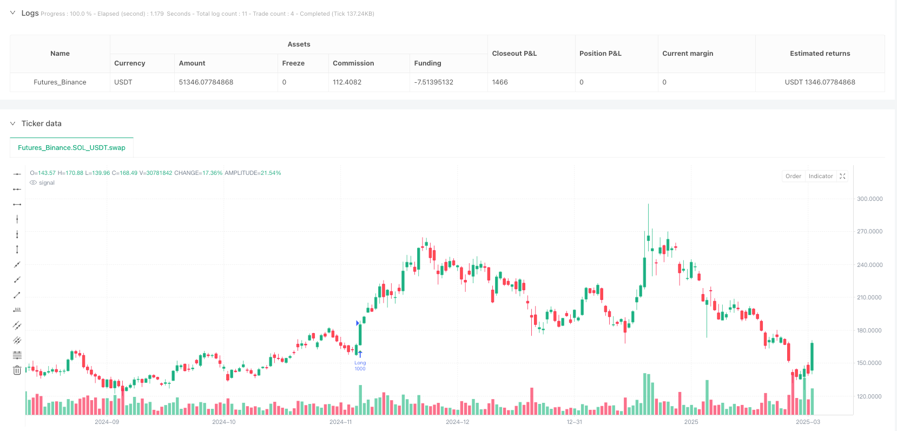
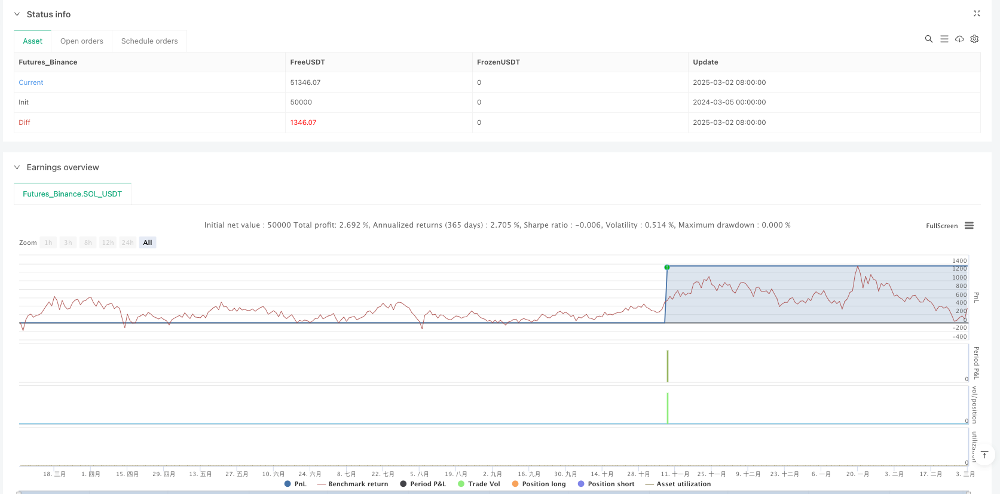

> Name

Multi-MA-Trend-Breakout-Pullback-System-with-ATR-Dynamic-Stop-Loss
> Author

ianzeng123

> Strategy Description





[trans]## Strategy Overview
This strategy is a trading system based on multi-period moving averages, trend identification and volume analysis. The core idea is to identify the intensive area formed by short-term and medium-term moving averages, combined with the trend direction confirmed by the long-term moving average, enter the market when the price breaks through the intensive area and then falls back, and uses ATR dynamic stop loss and moving take-profit mechanisms to manage risks. The strategy is optimized on the basis of the traditional moving average system, adding volume filtering, trend filtering and precise retracement entry conditions, making trading signals more reliable.
#### Strategy Principle
The core principles of this strategy are based on several key components:
1. **Identification of moving average intensive areas**: The strategy uses the 20-day (short-term) and 60-day (medium-term) moving averages to form a dense area. This area usually represents the consensus value area of ​​market participants and has a certain support or resistance effect.
2. **Trend direction confirmation**: Determine the overall trend direction by comparing the relative positions of the 60-day (mid-term) and 120-day (long-term) moving averages. When the mid-term moving average is above the long-term moving average, it is identified as an upward trend; otherwise, it is a downward trend.
3. **Enter the market after a breakthrough and then step back into the market**: The uniqueness of the strategy is not to enter the market directly at the breakthrough point, but to wait for the price to step back into the intensive area after the breakthrough before entering the market. This approach can effectively reduce the risk of false breakthroughs.
4. **Trading volume confirmation**: The entry signal needs to meet the condition that the trading volume exceeds 1.5 times the 20-day average trading volume to ensure that there is sufficient participation in the market to support the price movement.
5. **Risk Management**: The strategy uses dynamic stop loss and moving take profit mechanisms based on the ATR indicator, so that the stop loss and take profit levels can be automatically adjusted according to market volatility and adapted to different market environments.
Judging from the code implementation, the entry conditions for bulls are: the previous day's price breaks through the upper rail of the intensive area (the maximum value of smaShort and smaMid), the price of the day falls back but is still within the intensive area (not lower than the lower rail), and the mid-term trend is upward (smaMid > smaLong), and the trading volume conditions are met. Short entry conditions are the opposite.
#### Strategic Advantages
By in-depth analysis of the code implementation of this strategy, the following advantages can be summarized:
1. **Multi-level confirmation mechanism**: The strategy comprehensively considers the moving average indicators of short, medium and long time periods, and combines price behavior and trading volume to form a multi-level signal confirmation mechanism, which effectively reduces the misjudgment rate.
2. **Reducing risk by stepping back to enter the market**: Unlike the traditional breakthrough strategy of entering the market directly at the breakthrough point, this strategy can obtain a better entry price and reduce transaction costs and risks by waiting for the entry to be stepped back.
3. **Trend filtering improves winning rate**: Determine the direction of the general trend through the relationship between medium and long-term moving averages, and only trade when the direction of the trend is clear, avoiding losses caused by frequent trading in a volatile market.
4. **Dynamic Risk Management**: The ATR-based stop loss and trailing take profit mechanism can automatically adjust the protection position according to market volatility, protecting profits while giving the price enough breathing space.
5. **Trading volume confirmation enhances reliability**: By requiring trading volume to be 1.5 times greater than the average level, it ensures that transactions occur during periods of high market activity and reduces misjudgments in low-liquidity environments.
6. **Strongly adjustable parameters**: The strategy provides multiple adjustable parameters, such as moving average period, ATR multiple, trading volume threshold, etc., allowing traders to flexibly adjust according to different market environments and trading preferences.
#### Strategy Risk
Although this strategy is comprehensively designed, there are still the following potential risks:
1. **Moving average lag**: The moving average is essentially a lagging indicator, which may not reflect price changes in a timely manner in a violently volatile market, resulting in delayed entry or exit signals. The solution is to consider appropriately shortening the moving average period in a highly volatile market, or combining it with other leading indicators to assist decision-making.
2. **Frequent False Breakthroughs**: In a sideways and volatile market, prices may frequently break through dense areas and then return, resulting in frequent transactions and accumulated losses. It is recommended to add additional filtering conditions, such as requiring the breakthrough amplitude to reach a certain percentage, or combining support and resistance level analysis.
3. **Stop loss range setting risk**: ATR stop loss with a fixed multiple may be too loose or too tight in different market environments. The ATR multiple parameter should be adjusted based on the fluctuation characteristics of specific varieties and historical backtest results.
4. **Over-Reliance on Volume**: Volume data in some markets may not be transparent or accurate enough, and over-reliance on volume conditions may result in missing valid signals. Consider making volume conditions optional or incorporating price action analysis.
5. **Parameter Optimization Overfitting**: Multi-parameter systems are prone to fall into the overfitting trap, performing well on historical data but poor real-time results. It is recommended to use Walk-Forward Analysis to verify the stability of the strategy in different time periods.
#### Strategy optimization direction
Based on code analysis, this strategy can be optimized from the following directions:
1. **Add time frame filtering**: Consider adding trend confirmation with a larger time frame to ensure that the trading direction is consistent with the larger cycle trend. The reason for this is that large cycle trends generally have greater persistence and reliability.
2. **Introducing price volatility adaptive mechanism**: It can automatically adjust the moving average period and ATR multiple according to the recent market volatility, so that the strategy can maintain good performance in different market environments. In markets with high volatility, appropriately extend the moving average period and reduce signal frequency; in markets with low volatility, appropriately shorten the moving average period and improve sensitivity.
3. **Add seasonality and time filtering**: Some markets have obvious seasonal characteristics or intra-day time effects. Time filtering conditions can be added to avoid historically underperforming time periods.
4. **Optimize the retracement confirmation logic**: The current retracement confirmation is only based on whether the price is in the intensive area. You can consider adding more refined retracement depth requirements, such as requiring the retracement to a specific proportion of the intensive area (such as 38.2%, 50% retracement), or confirming the end of the retracement based on the K-line pattern.
5. **Add fund management module**: The current strategy uses fixed quantity transactions, which can be improved to dynamic position management based on account size and risk ratio, such as fixed risk ratio or Kelly formula, to optimize the capital curve and maximum drawdown control.
6. **Add market environment identification**: Add classification identification of market environment (trending market/shock market), and use different parameter settings or even different trading strategies in different market environments, so as to avoid frequent trading in unsuitable market environments.
#### Summarize
"Multiple moving average trend breakthrough trading system and ATR dynamic stop loss" is a quantitative trading strategy that combines a variety of mature concepts in technical analysis. It identifies the value range through the moving average intensive area, uses the moving average system to determine the trend direction, and combines the price behavior and trading volume confirmation of breakthrough and retracement to build a relatively complete trading system. The advantage of this strategy lies in the multi-level signal confirmation mechanism and flexible risk management system, which is suitable for medium and long-term trend following transactions.
In practical application of this strategy, attention should be paid to the hysteresis problem of the moving average system and the risk of over-fitting in parameter optimization. By adding adaptive mechanisms, market environment recognition and more sophisticated back-step confirmation logic, this strategy has great room for improvement. In addition, combined with a more complete fund management system, the stability and long-term profitability of the strategy will be further improved.
In general, this is a trading system with reasonable design and clear logic, which embodies the core trading concept of "trend following + dynamic risk management" and is suitable for traders with certain experience to apply in markets with clear trends. || ## Strategy Overview
This strategy is a trading system based on multiple-period moving averages, trend identification, and volume analysis. The core idea is to identify dense zones formed by short-term and mid-term moving averages, confirm trend direction using long-term moving averages, enter trades when price pulls back to the dense zone after a breakout, and manage risk using ATR dynamic stop loss and trailing profit mechanisms. The strategy optimizes traditional moving average systems by adding volume filtering, trend filtering, and precise pullback entry conditions, making trading signals more reliable.

#### Strategy Principles

The core principles of this strategy are based on the following key components:

1. **Moving Average Dense Zone Identification**: The strategy uses 20-day (short-term) and 60-day (mid-term) moving averages to form a dense zone, which typically represents the consensus value area of market participants and has certain support or resistance effects.

2. **Trend Direction Confirmation**: The overall trend direction is determined by comparing the relative positions of the 60-day (mid-term) and 120-day (long-term) moving averages. When the mid-term moving average is above the long-term moving average, it is identified as an uptrend; otherwise, it is a downtrend.

3. **Pullback Entry After Breakout**: The unique aspect of the strategy is that it doesn't enter directly at the breakout point but waits for the price to pull back to the dense zone after breaking out, which can effectively reduce the risk of false breakouts.

4. **Volume Confirmation**: Entry signals require volume to exceed 1.5 times the 20-day average volume, ensuring sufficient market participation to support price movement.

5. **Risk Management**: The strategy uses ATR-based dynamic stop loss and trailing profit mechanisms, allowing stop loss and profit levels to automatically adjust according to market volatility, adapting to different market environments.

From the code implementation, the long entry conditions are: the previous day's price breaks above the upper boundary of the dense zone (maximum of smaShort and smaMid), the current day's price pulls back but remains within the dense zone (not below the lower boundary), the mid-term trend is up (smaMid > smaLong), and volume conditions are met. Short entry conditions are the opposite.

#### Strategy Advantages

Through in-depth analysis of the strategy's code implementation, the following advantages can be summarized:

1. **Multi-level Confirmation Mechanism**: The strategy comprehensively considers moving average indicators from short, medium, and long time periods, combined with price action and volume, forming a multi-level signal confirmation mechanism that effectively reduces misjudgment rates.

2. **Pullback Entry Reduces Risk**: Unlike traditional breakout strategies that enter directly at the breakout point, this strategy waits for pullbacks to enter, obtaining better entry prices and reducing trading costs and risks.

3. **Trend Filtering Improves Win Rate**: By determining major trend direction through the relationship between mid and long-term moving averages, trading only when the trend direction is clear avoids losses from frequent trading in oscillating markets.

4. **Dynamic Risk Management**: ATR-based stop loss and trailing profit mechanisms automatically adjust protection positions based on market volatility, protecting profits while giving price sufficient breathing room.

5. **Volume Confirmation Enhances Reliability**: By requiring volume greater than 1.5 times the average level, trades occur during periods of high market activity, reducing misjudgments in low-liquidity environments.

6. **Strong Parameter Adjustability**: The strategy provides multiple adjustable parameters, such as moving average periods, ATR multiples, volume thresholds, allowing traders to make flexible adjustments based on different market environments and trading preferences.

#### Strategy Risks

Despite the comprehensive design of this strategy, there are still the following potential risks:

1. **Moving Average Lag**: Moving averages are inherently lagging indicators and may not reflect price changes in a timely manner in violently fluctuating markets, leading to delayed entry or exit signals. The solution is to consider shortening moving average periods in high-volatility markets or combining with other leading indicators to assist decision-making.

2. **Frequent False Breakouts**: In sideways oscillating markets, prices may frequently break through the dense zone and then return, leading to frequent trading and accumulated losses. It is recommended to add additional filtering conditions, such as requiring breakout amplitude to reach a certain percentage, or combining support and resistance level analysis.

3. **Stop Loss Range Setting Risk**: Fixed multiple ATR stops may be too loose or too tight in different market environments. The ATR multiple parameter should be adjusted based on the volatility characteristics of the specific instrument and historical backtesting results.

4. **Over-reliance on Volume**: Volume data in some markets may not be transparent or accurate enough, and over-reliance on volume conditions may cause missed valid signals. Consider setting volume conditions as optional or combining with price action analysis.

5. **Parameter Optimization Overfitting**: Multi-parameter systems are prone to overfitting traps, performing well on historical data but poorly in live trading. It is recommended to use Walk-Forward Analysis to verify strategy stability across different time periods.

#### Strategy Optimization Directions

Based on code analysis, the strategy can be optimized in the following directions:

1. **Add Timeframe Filtering**: Consider adding larger timeframe trend confirmation to ensure trading direction is consistent with larger cycle trends. This is because larger cycle trends typically have stronger persistence and reliability.

2. **Introduce Price Volatility Adaptive Mechanism**: Automatically adjust moving average periods and ATR multiples based on recent market volatility, maintaining good performance in different market environments. In high-volatility markets, appropriately extend moving average periods to reduce signal frequency; in low-volatility markets, appropriately shorten moving average periods to increase sensitivity.

3. **Add Seasonality and Time Filtering**: Some markets have obvious seasonal characteristics or intraday time effects. Adding time filtering conditions can avoid historically poor-performing time periods.

4. **Optimize Pullback Confirmation Logic**: Current pullback confirmation is only based on whether the price is within the dense zone. Consider adding more refined pullback depth requirements, such as requiring pullbacks to specific percentage positions in the dense zone (e.g., 38.2%, 50% retracement levels), or combining candlestick patterns to confirm the end of pullbacks.

5. **Add Money Management Module**: The current strategy uses fixed quantity trading. It can be improved to dynamic position management based on account size and risk proportion, such as fixed risk proportion or Kelly formula, to optimize equity curve and maximum drawdown control.

6. **Add Market Environment Recognition**: Add classification recognition of market environments (trending/oscillating markets) and adopt different parameter settings or even different trading strategies in different market environments, avoiding frequent trading in unsuitable market environments.

#### Summary

The "Multi-MA Trend Breakout Pullback System with ATR Dynamic Stop Loss" is a quantitative trading strategy that combines multiple mature concepts in technical analysis. It identifies value zones through moving average dense zones, determines trend direction using moving average systems, and builds a relatively complete trading system by combining breakout pullback price action and volume confirmation. The strategy's advantages lie in its multi-level signal confirmation mechanism and flexible risk management system, suitable for medium to long-term trend-following trading.

In practical application, this strategy needs to pay attention to the lagging problem of moving average systems and the risk of overfitting in parameter optimization. There is considerable room for improvement through adding adaptive mechanisms, market environment recognition, and more refined pullback confirmation logic. Additionally, combining with a more complete money management system will further enhance the strategy's stability and long-term profitability.

Overall, this is a reasonably designed trading system with clear logic, reflecting the core trading philosophy of "trend following + dynamic risk management," suitable for experienced traders to apply in markets with clear trends.[/trans]


> Source (PineScript)

``` pinescript
/*backtest
start: 2024-03-05 00:00:00
end: 2025-03-03 08:00:00
period: 1d
basePeriod: 1d
exchanges: [{"eid":"Futures_Binance","currency":"SOL_USDT"}]
*/

//@version=5
strategy("均线密集区交易系统（优化版2）", shorttitle="MA_Zone_Opt2", overlay=true, initial_capital=10000, default_qty_type=strategy.fixed, default_qty_value=1000, commission_value=0.1)

// === 输入参数 ===
smaShortPeriod = input.int(20, title="短期SMA周期", minval=1)
smaMidPeriod = input.int(60, title="中期SMA周期", minval=1)
smaLongPeriod = input.int(120, title="长期SMA周期", minval=1)
atrPeriod = input.int(14, title="ATR周期", minval=1)
atrMultiplierStop = input.float(3.0, title="止损ATR倍数", minval=1.0)
atrMultiplierTrail = input.float(2.0, title="移动止盈ATR倍数", minval=1.0)
volPeriod = input.int(20, title="成交量周期", minval=1)
volThreshold = input.float(1.5, title="成交量倍数", minval=1.0)

// === 计算均线 ===
smaShort = ta.sma(close, smaShortPeriod)  // MA20
smaMid = ta.sma(close, smaMidPeriod)      // MA60
smaLong = ta.sma(close, smaLongPeriod)    // MA120

// === 计算 ATR 和成交量 ===
atrValue = ta.atr(atrPeriod)
volAvg = ta.sma(volume, volPeriod)
volCondition = volume > volAvg * volThreshold  // 成交量高于平均值 1.5 倍

// === 定义均线密集区（只用 SMA20 和 SMA60） ===
maMax = math.max(smaShort, smaMid)
maMin = math.min(smaShort, smaMid)

// === 趋势过滤：SMA60 和 SMA120 的相对位置 ===
trendUp = smaMid > smaLong  // 60日均线上穿120日均线，上升趋势
trendDown = smaMid < smaLong  // 60日均线下穿120日均线，下降趋势

// === 交易信号逻辑 ===
// 涨破密集区：K线收盘价突破 maMax
breakUp = ta.crossover(close, maMax)
// 跌破密集区：K线收盘价跌破 maMin
breakDown = ta.crossunder(close, maMin)
// 回踩条件：
// 买入 - 前一根K线跌至密集区内，当前K线仍在密集区内，且趋势向上
pullbackUp = close[1] <= maMax and close[1] >= maMin and close >= maMin and trendUp and volCondition
// 卖出 - 前一根K线涨至密集区内，当前K线仍在密集区内，且趋势向下
pullbackDown = close[1] >= maMin and close[1] <= maMax and close <= maMax and trendDown and volCondition

// === 买卖逻辑 ===
// 买入（多单）：涨破后回踩，且趋势向上
if breakUp[1] and pullbackUp
    strategy.entry("Long", strategy.long)
// 动态止损和移动止盈
stopLossPrice = strategy.position_avg_price * (1 - atrMultiplierStop * atrValue / close)
trailStopPrice = close * (1 - atrMultiplierTrail * atrValue / close)
strategy.exit("Long_Exit", "Long", stop=stopLossPrice, trail_points=trailStopPrice, trail_offset=0)

// 卖出（空单）：跌破后回踩，且趋势向下
if breakDown[1] and pullbackDown
    strategy.entry("Short", strategy.short)
// 动态止损和移动止盈
stopLossPriceShort = strategy.position_avg_price * (1 + atrMultiplierStop * atrValue / close)
trailStopPriceShort = close * (1 + atrMultiplierTrail * atrValue / close)
strategy.exit("Short_Exit", "Short", stop=stopLossPriceShort, trail_points=trailStopPriceShort, trail_offset=0)

// === 绘制信号点 ===
plotshape(breakUp[1] and pullbackUp, title="买入信号", location=location.belowbar, color=color.green, style=shape.triangleup, size=size.small)
plotshape(breakDown[1] and pullbackDown, title="卖出信号", location=location.abovebar, color=color.red, style=shape.triangledown, size=size.small)
```

> Detail

https://www.fmz.com/strategy/484917

> Last Modified

2025-03-05 09:58:09
