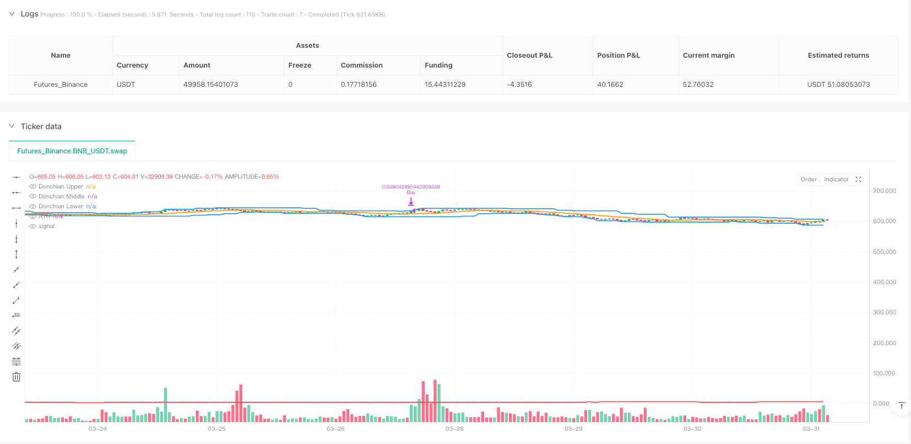
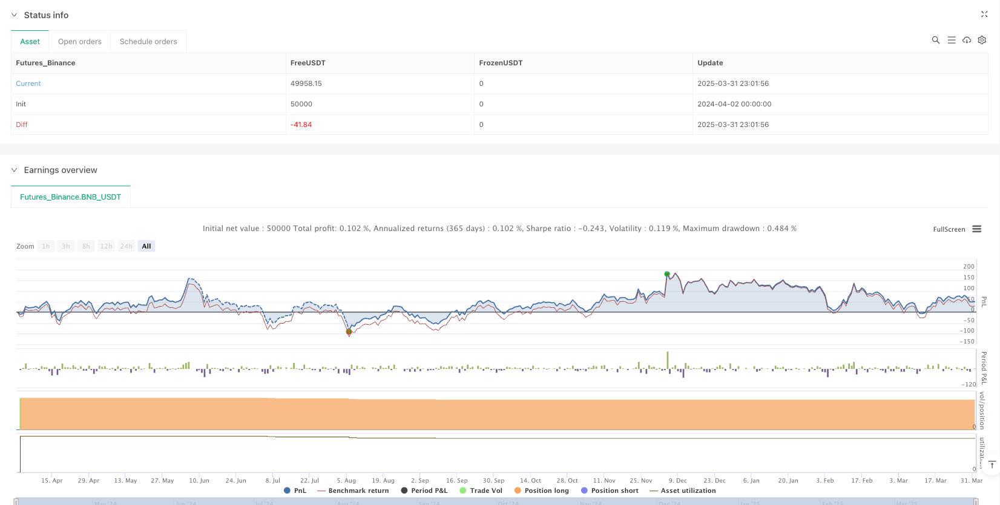

> Name

Multi-Timeframe-Donchian-Channel-and-ATR-Dynamic-Interval-Volatility-Following-Trading-Strategy
> Author

ianzeng123

> Strategy Description





[trans]

#### Strategy Overview
This strategy is a trend following trading system based on the Donchian Channel and Average True Range (ATR). The strategy uses the deviation degree of the Tang Qian channel mid-track of the 4-hour K-line cycle from the current price, and combines ATR as a dynamic fluctuation measurement indicator to find entry and exit opportunities in market fluctuations. This strategy adopts a gradient position increase and stop-loss mechanism, and manages positions by fixing the transaction amount (5.1 USDT) to achieve effective capital utilization in large market fluctuations.
#### Strategy Principle
The core logic of the strategy is based on the following key elements:
1. **Multi-period analysis framework**: The strategy executes transactions on the 1-minute K-line, but uses the data of the 4-hour K-line (240 minutes) to calculate technical indicators to achieve the advantages of multi-period analysis.
2. **Tang Qian Channel Calculation**: Based on 20 periods of 4-hour K-line data, calculate the upper track (highest price), lower track (lowest price), and middle track (simple moving average of the closing price).
3. **Dynamic Interval Determination**: Use 2 times the ATR value as the dynamic trading interval to enable the strategy to adapt to changes in market volatility.
4. **Transaction execution logic**:
   - Initial state (no position): When the middle track of Tang Qian Channel minus the current price is greater than the set interval, the first purchase is executed.
   - Position status: When the difference between the base price and the current price exceeds the interval, increase or decrease the position.
   - Position management: Fixed amount per transaction (5.1 USDT), the transaction quantity is calculated based on the current price.
   - Position closing mechanism: When the price rises beyond the interval, sell is executed. If the position is insufficient, all available positions are sold.
#### Strategic Advantages
1. **Advantages of multi-period analysis**: By executing transactions in a shorter time period (1-minute K-line), but making decisions based on technical indicators in a longer time period (4-hour K-line), it reduces the interference of short-term market noise, while maintaining the ability to track mid- and long-term trends.
2. **Dynamic adaptation to market fluctuations**: Using ATR as a volatility metric, the strategy can automatically adjust the trading interval according to changes in market volatility, setting larger intervals in high-volatility markets and smaller intervals in low-volatility markets.
3. **Gradient position opening mechanism**: When the price continues to fall, the strategy will add positions at each interval to average the cost of opening a position and reduce the risk exposure of a single transaction.
4. **Fixed Amount Transaction**: Using a fixed amount instead of a fixed quantity for each transaction is more in line with risk management principles and avoids the problem of over-investment at high prices or under-investment at low prices.
5. **Complete logging**: The strategy implements detailed transaction log records and visual tags, including transaction type, price, interval, quantity and total positions, etc., to facilitate backtest analysis and strategy optimization.
#### Strategy Risk
1. **Trend reversal risk**: When a strong trend reverses, the strategy may not be able to identify the market turn in time, resulting in substantial losses after continuous addition of positions. Solution: Introduce trend confirmation indicators or set a limit on the maximum number of positions.
2. **Risk of running out of funds**: In a continuous one-way market, multiple additions of a fixed amount may lead to excessive use of funds or excessive concentration. Solution: Set a limit on the total fund usage ratio or dynamically adjust the single transaction amount.
3. **Parameter sensitivity**: The choice of ATR multiple (2 times) and Donchian channel period (20) has a significant impact on strategy performance. Improper parameter settings may result in too many or too few signals. Solution: Find the optimal parameter combination through historical backtesting, or implement a parameter adaptation mechanism.
4. **Liquidity Risk**: In a low-liquidity market, market orders may cause large slippage, affecting the actual execution of the strategy. Solution: Consider using a limit order or adding a liquidity filter.
5. **Commission cost accumulation**: The strategy may trade frequently and generate a large number of transaction costs (set to 0.1%), which may erode profits in the long term. Solution: Optimize trading frequency or consider using an exchange with lower commissions.
#### Strategy optimization direction
1. **Add market environment filtering**: Combine with volatility indicators (such as Bollinger Band width or ATR relative value) to judge the current market environment, adjust strategy parameters or suspend trading under different market conditions. This avoids the costs associated with frequent trading in low-volatility or volatile markets.
2. **Dynamic adjustment of ATR multiples**: The ATR multiples can be dynamically adjusted based on historical volatility or market trend strength. Use smaller multiples in strong trending markets to track prices more closely, and use larger multiples in volatile markets to reduce false signals.
3. **Introducing a stop loss mechanism**: Set a maximum loss limit or trailing stop loss to prevent excessive losses in a single transaction. Especially after adding positions multiple times, you should consider setting a comprehensive stop loss level to protect the safety of your funds.
4. **Optimize position management**: Consider using decreasing or increasing transaction amounts instead of fixed amounts, and dynamically adjust the capital ratio of each transaction based on the size of the established position or market volatility.
5. **Add trading time filter**: Analyze the performance of different trading sessions and avoid inefficient or high-risk periods, such as the crossover time of Asian, European, and American trading sessions or before and after the release of major economic data.
6. **Integrate other indicators for confirmation**: You can combine RSI, MACD and other indicators as auxiliary confirmation to improve the quality of trading signals and reduce mistaken entry situations.
7. **Adaptive Donchian Channel Period**: Dynamically adjust the calculation period of Donchian Channel according to the market status. Use shorter periods in high-volatility markets to improve response speed, and use longer periods in low-volatility markets to reduce noise.
#### Summary
The multi-period Donchian channel and ATR dynamic interval fluctuation tracking trading strategy is a quantitative trading system that combines technical analysis and risk management. By using 4-hour cycle data to execute decisions on the 1-minute K-line, the strategy achieves effective tracking of mid-term trends, while using ATR to dynamically adjust trading intervals to adapt to different market environments. Fixed amount trading and gradient position building mechanisms help risk control and cost averaging.
This strategy is particularly suitable for volatile market environments, but you need to pay attention to trend reversal risks and fund management issues. By adding optimization measures such as market environment filtering, dynamic parameter adjustment, and stop-loss mechanisms, the robustness and long-term profitability of the strategy can be further improved. In practical applications, it is recommended to conduct sufficient backtesting, optimize parameters for specific trading varieties, and implement strict risk control measures to ensure the safety of funds. ||
#### Strategy Overview
This strategy is a trend-following trading system based on the Donchian Channel and Average True Range (ATR). It utilizes the deviation between the middle band of the Donchian Channel calculated on 4-hour candles and the current price, combined with ATR as a dynamic volatility measurement indicator, to identify entry and exit opportunities in market fluctuations. The strategy employs a gradient position building and stop-loss mechanism, managing positions through fixed trading amounts (5.1 USDT) to achieve effective capital utilization during high volatility market conditions.

#### Strategy Principles
The core logic of the strategy is based on the following key elements:

1. **Multi-timeframe Analysis Framework**: The strategy executes trades on 1-minute candles but calculates technical indicators using 4-hour candle (240-minute) data, leveraging the advantages of multi-timeframe analysis.
2. **Donchian Channel Calculation**: Based on 20 periods of 4-hour candle data, it calculates the upper band (highest price), lower band (lowest price), and middle band (simple moving average of closing prices).
3. **Dynamic Interval Determination**: Uses twice the ATR value as a dynamic trading interval, allowing the strategy to self-adapt to changes in market volatility.
4. **Trade Execution Logic**:
   - Initial state (no position): Executes first purchase when the Donchian middle band minus the current price exceeds the set interval.
   - Position state: Adds or reduces positions when the difference between the base price and current price exceeds the interval.
   - Position management: Fixed amount (5.1 USDT) per trade, calculating the trading quantity based on the current price.
   - Closing mechanism: Executes selling when the price rises above the interval; if the position is insufficient, sells all available positions.

#### Strategy Advantages
1. **Multi-timeframe Analysis Benefits**: By executing trades on shorter timeframes (1-minute candles) but making decisions based on longer timeframe (4-hour candles) technical indicators, it reduces interference from short-term market noise while maintaining the ability to track medium to long-term trends.
2. **Dynamic Adaptation to Market Volatility**: Using ATR as a volatility measure, the strategy can automatically adjust trading intervals according to changes in market volatility, setting larger intervals in high-volatility markets and smaller intervals in low-volatility markets.
3. **Gradient Position Building Mechanism**: When prices continue to fall, the strategy adds positions at each interval point, averaging entry costs and reducing risk exposure from single trades.
4. **Fixed Amount Trading**: Each trade uses a fixed amount rather than a fixed quantity, which better aligns with risk management principles, avoiding excessive investment at high price points or insufficient investment at low price points.
5. **Comprehensive Logging**: The strategy implements detailed trade logging and visual labeling, including trade type, price, interval, quantity, and total position information, facilitating backtesting analysis and strategy optimization.

#### Strategy Risks
1. **Trend Reversal Risk**: During strong trend reversals, the strategy may fail to identify market turns in a timely manner, leading to significant losses after consecutive position additions. Solution: Introduce trend confirmation indicators or set limits on maximum position additions.
2. **Capital Depletion Risk**: In continuous one-way markets, multiple fixed-amount additions may lead to rapid or excessive capital concentration. Solution: Set total capital usage ratio limits or dynamically adjust single trade amounts.
3. **Parameter Sensitivity**: The choice of ATR multiplier (2x) and Donchian Channel period (20) significantly impacts strategy performance; improper parameter settings may lead to excessive or insufficient signals. Solution: Find optimal parameter combinations through historical backtesting or implement parameter adaptive mechanisms.
4. **Liquidity Risk**: In low-liquidity markets, market orders may result in significant slippage, affecting the actual execution of the strategy. Solution: Consider using limit orders or adding liquidity filtering conditions.
5. **Commission Cost Accumulation**: The strategy may trade frequently, generating substantial transaction costs (set at 0.1%), potentially eroding profits over time. Solution: Optimize trading frequency or consider exchanges with lower commissions.

#### Strategy Optimization Directions
1. **Add Market Environment Filtering**: Combine volatility indicators (such as Bollinger Band width or relative ATR values) to determine the current market environment and adjust strategy parameters or pause trading in different market states. This helps avoid cost losses from frequent trading in low-volatility or oscillating markets.
2. **Dynamic Adjustment of ATR Multiplier**: Dynamically adjust the ATR multiplier based on historical volatility or market trend strength, using smaller multipliers in strong trend markets to track prices more closely and larger multipliers in oscillating markets to reduce false signals.
3. **Introduce Stop-Loss Mechanisms**: Set maximum loss limits or trailing stops to prevent excessive losses on single trades. Especially after multiple position additions, consider setting comprehensive stop-loss levels to protect capital.
4. **Optimize Position Management**: Consider using decreasing or increasing trade amounts rather than fixed amounts, dynamically adjusting the capital proportion of each trade based on the size of existing positions or market volatility.
5. **Add Trading Time Filters**: Analyze performance across different trading sessions to avoid inefficient or high-risk periods, such as crossover times between Asian, European, and American trading sessions or before/after major economic data releases.
6. **Integrate Other Confirmation Indicators**: Combine with indicators such as RSI, MACD for auxiliary confirmation to improve signal quality and reduce false entries.
7. **Adaptive Donchian Channel Period**: Dynamically adjust the calculation period of the Donchian Channel based on market conditions, using shorter periods in high-volatility markets to improve response speed and longer periods in low-volatility markets to reduce noise.

#### Conclusion
The Multi-Timeframe Donchian Channel and ATR Dynamic Interval Volatility Following Trading Strategy is a quantitative trading system that combines technical analysis and risk management. By utilizing 4-hour period data to execute decisions on 1-minute candles, the strategy achieves effective tracking of medium-term trends while using ATR to dynamically adjust trading intervals to adapt to different market environments. Fixed amount trading and gradient position building mechanisms help with risk control and cost averaging.

This strategy is particularly suitable for high-volatility market environments but requires attention to trend reversal risks and capital management issues. Through optimization measures such as adding market environment filtering, dynamic parameter adjustments, and stop-loss mechanisms, the strategy's robustness and long-term profitability can be further improved. In practical applications, it is recommended to conduct thorough backtesting, optimize parameters for specific trading instruments, and implement strict risk control measures to ensure capital safety.[/trans]


> Source (PineScript)

``` pinescript
/*backtest
start: 2024-04-02 00:00:00
end: 2025-04-01 00:00:00
period: 1h
basePeriod: 1h
exchanges: [{"eid":"Futures_Binance","currency":"BNB_USDT"}]
*/

//@version=5
strategy("Donchian Channel and ATR Strategy", overlay=true, currency="USDT", commission_type=strategy.commission.percent, commission_value=0.1)

// 用pine编写策略，实时执行。
// 获得suiusdt合约的4小时K线，用4小时k线20周期，计算唐奇安通道 和ATR。
// 最新的 ATR * 2 为间隔。每次买卖金额都是5.1usdt，根据金额计算交易数量。

// 策略基于1分钟k线执行。
// 开始时，baseprice为空。
// 如果 唐奇安通道中轨 - 当前价格  > 间隔， 则市价买入5.1usdt，记录成交价格为 baseprice。
// 重新计算计算唐奇安通道 和ATR, 还是使用4小时K线的20个周期。

// baseprice不为空，
// 如果 baseprice - 当前价格  > 间隔， 则市价买入5.1usdt，记录成交价格为 baseprice；
// 如果 当前价格 - baseprice > 间隔， 则市价卖出5.1usdt，记录成交价格为 baseprice。
// 卖出时，判断仓位是否足够卖出，不够则卖出剩余的仓位。卖出后，如果没有仓位了，设置baseprice为空。

// 标签和日志记录：买还是卖（buy/sell），初次买入标记为initBuy，价格，间隔，买入的数量，买入后仓位的总数量。
// 用不同颜色区分买卖。


// 获取4小时K线数据
resolution_4h = "240"  // 4小时K线
high_4h = request.security(syminfo.tickerid, resolution_4h, high)
low_4h = request.security(syminfo.tickerid, resolution_4h, low)
close_4h = request.security(syminfo.tickerid, resolution_4h, close)

// 计算唐奇安通道和ATR（基于4小时K线）
length = 20
donchian_upper = ta.highest(high_4h, length)
donchian_lower = ta.lowest(low_4h, length)
donchian_middle = ta.sma(close_4h, length)
atr_value = ta.atr(length)  // 使用4小时K线计算ATR

// 设置交易参数
trade_amount = 5.1  // 每次交易金额（USDT）
var float baseprice = na  // 当前基准价格
var float total_position_qty = 0  // 总仓位数量

// 日志记录函数
log_trade(action, price, interval, qty, total_qty, color) =>
    log_text = str.format("{0} @ {1} | Interval: {2} | Qty: {3} | Total Qty: {4}", 
                          action, str.tostring(price), str.tostring(interval), 
                          str.tostring(qty), str.tostring(total_qty))


// 策略逻辑
interval = atr_value * 2  // 间隔 = ATR * 2
if (na(baseprice))
    if (donchian_middle - close > interval)  // 使用1分钟K线的close价格判断
        qty = trade_amount / close  // 计算交易数量
        strategy.entry("Buy", strategy.long, qty=qty)
        baseprice := close  // 更新基准价格
        total_position_qty += qty  // 更新总仓位数量
        log_trade("initBuy", baseprice, interval, qty, total_position_qty, color.green)  // 记录日志和标签

else
    if (baseprice - close > interval)  // 使用1分钟K线的close价格判断
        qty = trade_amount / close
        strategy.entry("Buy", strategy.long, qty=qty)
        baseprice := close
        total_position_qty += qty
        log_trade("Buy", baseprice, interval, qty, total_position_qty, color.blue)

    else if (close - baseprice > interval)
        if (total_position_qty > 0)
            qty = trade_amount / close
            if (total_position_qty >= qty)
                strategy.close("Buy", qty=qty)
                total_position_qty -= qty
                log_trade("Sell", baseprice, interval, qty, total_position_qty, color.red)
            else
                strategy.close("Buy")
                total_position_qty := 0
                log_trade("Sell (Full Position)", baseprice, interval, total_position_qty, 0, color.red)
        baseprice := na  // 清空基准价格

// 绘制唐奇安通道和ATR（基于4小时K线）
plot(donchian_upper, title="Donchian Upper", color=color.blue, linewidth=2)
plot(donchian_middle, title="Donchian Middle", color=color.orange, linewidth=2)
plot(donchian_lower, title="Donchian Lower", color=color.blue, linewidth=2)
plot(atr_value, title="ATR", color=color.red, linewidth=2)
```

> Detail

https://www.fmz.com/strategy/489150

> Last Modified

2025-04-02 11:05:13
