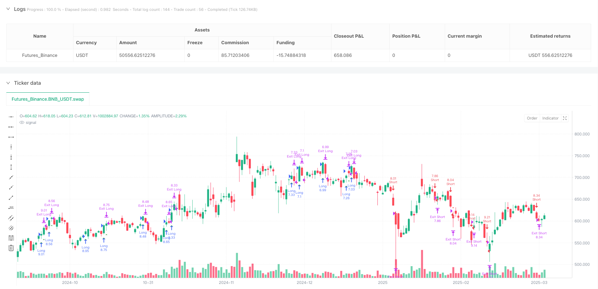
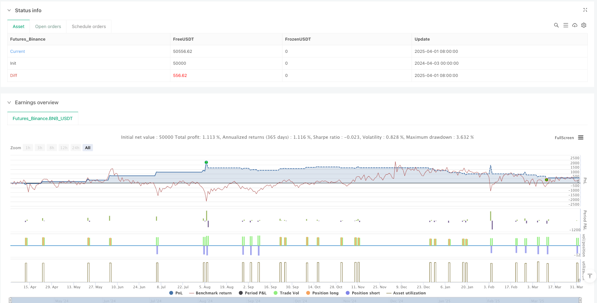

> Name

Multi-Timeframe-Momentum-Breakout-Trading-Strategy-with-Trend-Following-and-ATR-Risk-Management
> Author

ianzeng123

> Strategy Description





[trans]

## Strategy Overview
This Momentum Breakout Trading Strategy is a technical analysis-driven trading system designed to capture breakouts that are consistent with the dominant trend. This strategy cleverly combines the exponential moving average (EMA), the relative strength indicator (RSI) and the average true range (ATR) to form a comprehensive trading framework that not only contains clear long and short entry conditions, but also has a dynamic stop loss mechanism based on volatility.
The core idea of ​​this strategy is to capture the accelerating price movement after confirming the direction of the trend and waiting for the price to break through a recently formed support or resistance level. At the same time, the RSI indicator acts as a momentum filter, helping to avoid risky trades in overbought or oversold conditions. In terms of risk management, the strategy uses ATR-based stop loss and trailing stop loss, so that the stop loss point can be dynamically adjusted according to the actual market volatility instead of using a fixed point.
#### Strategy Principle
The strategy works based on several key components:
1. **Trend Identification**: Use two exponential moving averages (EMA) with different periods to determine market direction. The relative positions of fast EMA (default 20 periods) and slow EMA (default 50 periods) determine trend judgment. When the fast EMA is above the slow EMA, it is considered an uptrend; otherwise, it is considered a downtrend.
2. **Momentum Filter**: Apply the 14-period RSI indicator to avoid entering trades under extreme conditions. When the RSI is above 70, avoid going long to avoid entering an overbought condition; when the RSI is below 30, avoid going short to avoid entering an oversold condition.
3. **Breakthrough logic**: Detect whether the price breaks through the highest point or lowest point within the configurable period (default 5 K lines), excluding the current K line. These points serve as resistance and support levels respectively.
4. **Admission conditions**:
   - Long entry: price breaks recent resistance + uptrend confirmation (fast EMA > slow EMA) + RSI is not overbought
   - Short entry: price breaks recent support + downtrend confirmation (fast EMA < slow EMA) + RSI is not oversold
5. **Position Management**:
   - Stop loss setting based on ATR:
     - Long Stop Loss = Entry Price - (ATR * Multiplier)
     - Short Stop = Entry Price + (ATR * Multiplier)
   - Trailing Stop:
     - Also use ATR* trail multipliers as trail_points and trail_offset
     - The default stop loss and trailing multiplier are both 1.5x ATR
The strategy also includes a webhook alert feature that sends JSON-formatted alerts to execute market orders, as well as a visual alert feature that marks entry points on the chart.
#### Strategic Advantages
After deep analysis of the code, several significant advantages of this strategy can be summarized:
1. **Synergy of trend and breakthrough**: By combining EMA trend confirmation and price breakthrough, the strategy can avoid breakout transactions in counter-trends and improve the success rate of transactions. This "go with the flow" approach helps capture more reliable price movements.
2. **Dynamic Risk Management**: ATR-based stop loss and trailing stop loss mechanisms enable risk control to adapt to market volatility. When volatility expands, the stop loss position will be looser; when volatility shrinks, the stop loss position will be tighter. This dynamic adjustment is more in line with the actual market situation than a fixed point stop loss.
3. **Multiple filtering mechanism**: Through the combination of EMA trend filtering and RSI momentum filtering, the strategy can avoid entering the market under unfavorable market conditions and reduce losses caused by false breakthroughs.
4. **Clear Trading Rules**: The strategy defines clear entry and exit conditions, leaving no room for subjective judgment, which helps eliminate the impact of emotional factors on trading decisions.
5. **Customizable parameters**: The strategy provides multiple adjustable parameters, including EMA period, RSI setting, breakthrough period and ATR multiplier, etc. Users can optimize according to different market environments and trading varieties.
6. **Integrated alert function**: The built-in webhook alert function facilitates integration with automated trading systems, improving the practicality and execution efficiency of the strategy.
#### Strategy Risk
Although this strategy is well designed, there are still some potential risks and challenges:
1. **False Breakout Risk**: Despite the trend and RSI filtering, the market may still experience a situation where the price retraces quickly after a brief breakthrough, causing the stop loss to be triggered. Solution: You can consider adding a confirmation mechanism, such as requiring the price to maintain a certain time or range after a breakthrough before triggering entry.
2. **Trend reversal risk**: EMA, as a lagging indicator, responds slowly at trend turning points, which may lead to trading in the original trend direction when the trend has begun to reverse. Solution: You can add more sensitive trend indicators as auxiliary, or add trend strength filtering.
3. **Parameter optimization overfitting**: Over-optimizing parameters may cause the strategy to perform well on historical data, but not perform well in real trading. Solution: Backtesting should be done using a long enough test period and multiple market environments to avoid overfitting to a specific market stage.
4. **Changes in Market Volatility**: Although ATR can adapt to changes in volatility, the stop loss may still not be loose enough in the event of a sudden and large increase in volatility (such as a major news event). Solution: You can consider manually adjusting the ATR multiplier during special periods, or adding an early warning mechanism for volatility changes.
5. **Psychological Pressure of Continuous Loss**: If the market encounters frequent oscillations, it may lead to continuous stop losses and put psychological pressure on traders. Solution: Set up reasonable fund management rules, limit the risk of a single transaction, and have a mechanism to suspend transactions in adverse market conditions.
#### Strategy optimization direction
Based on code analysis, this strategy also has the following possible optimization directions:
1. **Add trading volume confirmation**: The current strategy only relies on price data. You can consider adding trading volume indicators as a breakthrough confirmation condition to reduce the risk of false breakthroughs. An increase in volume is often a strong indicator of the effectiveness of a breakout.
2. **Multiple time frame analysis**: Introduce trend judgment in higher time frames to ensure that the trading direction is consistent with the larger trend. This can be achieved through the security function to obtain high time frame data.
3. **Dynamic adjustment of position size**: Dynamically adjust position size based on ATR or other volatility indicators, increasing positions when volatility is low, and reducing positions when volatility is high, to optimize the risk-reward ratio.
4. **Add profit target**: In addition to trailing stop loss, you can also set a profit target based on ATR and take partial profits when a specific risk-return ratio is reached.
5. **Enhance entry conditions**: Consider adding candlestick patterns, post-breakout backtest confirmation or other technical indicators as auxiliary confirmation to improve the quality of entry.
6. **Optimize RSI filtering conditions**: The current RSI filtering may be too strict. Consider using a dynamic RSI threshold, or judging based on the rate of change of RSI rather than the absolute value.
7. **Retracement control mechanism**: Increase the overall strategy retracement control, such as suspending transactions or reducing the position size when a specific retracement percentage is reached to protect funds.
#### Summarize
"Momentum Breakout Trading Strategy" is a complete trading system that combines trend following, momentum analysis, and volatility risk management. By identifying the trend direction with EMA, filtering extreme market conditions with RSI, and entering the market at breakpoints of support and resistance, this strategy provides a systematic approach to capturing breakthrough opportunities in the market.
The core advantage of the strategy lies in its comprehensiveness and adaptability, focusing not only on entry timing, but also on risk control and position management. The dynamic stop-loss mechanism based on ATR enables the strategy to adjust the protection mechanism with market volatility, which can maintain a certain degree of adaptability in different market environments.
Although there are some potential risks, such as the challenges of false breakouts and trend reversals, the strategy is expected to further improve its stability and profitability through recommended optimization directions, such as adding volume confirmation, multi-time frame analysis, and dynamic position management.
For technical analysis enthusiasts with certain trading experience, this is a strategy framework worth trying and further customizing. Parameter adjustments and strategy enhancements can be made according to personal risk preferences and trading styles. ||
## Strategy Overview

This Momentum Breakout Strategy is a technically-driven trading system designed to capture breakout movements aligned with the prevailing trend. The strategy cleverly combines Exponential Moving Averages (EMAs), Relative Strength Index (RSI), and Average True Range (ATR) to form a comprehensive trading framework that includes clear long/short entry conditions and volatility-based dynamic stop-loss mechanisms.

The core concept of this strategy is to wait for price breakouts of recent support or resistance levels after confirming trend direction, thereby capturing accelerated price movements. Meanwhile, the RSI indicator serves as a momentum filter, helping to avoid risky entries during overbought or oversold conditions. For risk management, the strategy employs ATR-based stop-losses and trailing stops, allowing stop points to dynamically adjust according to actual market volatility rather than using fixed levels.

#### Strategy Principles

The operation of this strategy is based on several key components:

1. **Trend Identification**: Uses two Exponential Moving Averages (EMAs) with different periods to determine market direction. The relative position of the fast EMA (default 20 periods) and slow EMA (default 50 periods) determines trend judgment. When the fast EMA is above the slow EMA, it's considered an uptrend; otherwise, it's considered a downtrend.

2. **Momentum Filter**: Applies a 14-period RSI indicator to avoid entries during extreme conditions. Avoids long entries when RSI is above 70 to prevent entering during overbought conditions; avoids short entries when RSI is below 30 to prevent entering during oversold conditions.

3. **Breakout Logic**: Detects whether prices break through the highest or lowest points within a configurable period (default 5 candles), excluding the current candle. These points serve as resistance and support levels respectively.

4. **Entry Conditions**:
   - Long Entry: Price breaks above recent resistance + Uptrend confirmed (Fast EMA > Slow EMA) + RSI not in overbought condition
   - Short Entry: Price breaks below recent support + Downtrend confirmed (Fast EMA < Slow EMA) + RSI not in oversold condition

5. **Position Management**:
   - Stop-Loss based on ATR:
     - Long stop-loss = Entry price - (ATR * multiplier)
     - Short stop-loss = Entry price + (ATR * multiplier)
   - Trailing Stop:
     - Similarly uses ATR * trailing multiplier for both trail_points and trail_offset
     - Default stop-loss and trailing multiplier are both 1.5x ATR

The strategy also includes webhook alert functionality to send JSON-formatted alerts for market orders and visual cues to mark entry points on the chart.

#### Strategy Advantages

After in-depth analysis of the code, several significant advantages of this strategy can be summarized:

1. **Synergy of Trend and Breakout**: By combining EMA trend confirmation and price breakouts, the strategy avoids breakout trading against the trend, increasing the success rate of trades. This "trend-following" approach helps capture more reliable price movements.

2. **Dynamic Risk Management**: The ATR-based stop-loss and trailing stop mechanism allows risk control to adapt to market volatility. When volatility expands, stop-loss positions become wider; when volatility contracts, stop-loss positions become tighter. This dynamic adjustment is more in line with actual market conditions than fixed-point stops.

3. **Multiple Filtering Mechanisms**: Through the combination of EMA trend filtering and RSI momentum filtering, the strategy can avoid entering during unfavorable market states, reducing losses from false breakouts.

4. **Clear Trading Rules**: The strategy defines explicit entry and exit conditions with no room for subjective judgment, which helps eliminate emotional factors in trading decisions.

5. **Customizable Parameters**: The strategy provides multiple adjustable parameters, including EMA periods, RSI settings, breakout periods, and ATR multipliers, allowing users to optimize according to different market environments and trading instruments.

6. **Integrated Alert Functionality**: The built-in webhook alert functionality facilitates integration with automated trading systems, enhancing the strategy's practicality and execution efficiency.

#### Strategy Risks

Despite its reasonable design, the strategy still has some potential risks and challenges:

1. **False Breakout Risk**: Despite trend and RSI filtering, the market may still experience situations where prices briefly break through before quickly retracing, triggering stop-losses. Solution: Consider adding confirmation mechanisms, such as requiring prices to maintain a certain duration or amplitude after breakout before triggering entry.

2. **Trend Reversal Risk**: As a lagging indicator, EMA responds slowly at trend turning points, which may lead to trading in the original trend direction even when the trend has already begun to reverse. Solution: Add more sensitive trend indicators as auxiliary tools or incorporate trend strength filtering.

3. **Parameter Optimization Overfitting**: Excessive parameter optimization may cause the strategy to perform well on historical data but poorly in live trading. Solution: Use sufficiently long testing periods and multiple market environments for backtesting to avoid overfitting to specific market phases.

4. **Market Volatility Changes**: Although ATR can adapt to volatility changes, in cases of sudden substantial increases in volatility (such as major news events), stops may still not be wide enough. Solution: Consider manually adjusting ATR multipliers during special periods or adding early warning mechanisms for volatility changes.

5. **Psychological Pressure from Consecutive Losses**: Frequent market oscillations may lead to consecutive stop-losses, causing psychological pressure on traders. Solution: Establish reasonable fund management rules, limit single-trade risk, and implement mechanisms to pause trading during unfavorable market environments.

#### Strategy Optimization Directions

Based on code analysis, there are several possible optimization directions for this strategy:

1. **Add Volume Confirmation**: The current strategy relies solely on price data. Consider adding volume indicators as breakout confirmation conditions to reduce the risk of false breakouts. Increased volume is usually an important indicator of breakout validity.

2. **Multi-Timeframe Analysis**: Introduce trend determination from higher timeframes to ensure that trading direction aligns with larger trends. This can be achieved by using the security function to obtain higher timeframe data.

3. **Dynamic Position Sizing**: Dynamically adjust position size based on ATR or other volatility indicators, increasing positions when volatility is lower and decreasing positions when volatility is higher, to optimize the risk-reward ratio.

4. **Add Profit Targets**: In addition to trailing stops, consider setting ATR-based profit targets to partially take profits when specific risk-reward ratios are reached.

5. **Enhance Entry Conditions**: Consider adding candlestick patterns, post-breakout retest confirmation, or other technical indicators as auxiliary confirmations to improve entry quality.

6. **Optimize RSI Filtering Conditions**: The current RSI filtering may be too strict. Consider using dynamic RSI thresholds or basing judgments on RSI rate of change rather than absolute values.

7. **Drawdown Control Mechanism**: Add overall strategy drawdown control, such as pausing trading or reducing position size when reaching a specific drawdown percentage, to protect capital.

#### Summary

The "Momentum Breakout Trading Strategy" is a complete trading system that combines trend following, momentum analysis, and volatility-based risk management. By using EMAs to identify trend direction, RSI to filter extreme market conditions, and entering at support/resistance breakout points, this strategy provides a systematic approach to capturing breakout opportunities in the market.

The core advantages of the strategy lie in its comprehensiveness and adaptability, focusing not only on entry timing but also on risk control and position management. The ATR-based dynamic stop-loss mechanism allows the strategy to adjust protection mechanisms with market volatility, maintaining adaptability across different market environments.

Despite some potential risks, such as false breakouts and trend reversal challenges, through the suggested optimization directions like adding volume confirmation, multi-timeframe analysis, and dynamic position management, this strategy has the potential to further enhance its stability and profitability.

For technical analysis enthusiasts with certain trading experience, this is a strategy framework worth trying and further customizing, which can be parameter-adjusted and strategy-enhanced according to individual risk preferences and trading styles.[/trans]


> Source (PineScript)

``` pinescript
/*backtest
start: 2024-04-03 00:00:00
end: 2025-04-02 00:00:00
period: 1d
basePeriod: 1d
exchanges: [{"eid":"Futures_Binance","currency":"BNB_USDT"}]
*/

//@version=6
strategy("Ruben.Ramiro - Momentum Breakout Strategy", overlay=true, initial_capital=10000, default_qty_type=strategy.percent_of_equity, default_qty_value=10)

// ** Adjustable Parameters **
// Moving averages for trend detection
emaFastLen    = input.int(20, "Fast EMA", minval=1)
emaSlowLen    = input.int(50, "Slow EMA", minval=1)
// RSI
rsiLen        = input.int(14, "RSI Period", minval=1)
rsiOverbought = input.int(70, "RSI Overbought", minval=1, maxval=100)
rsiOversold   = input.int(30, "RSI Oversold", minval=1, maxval=100)
// Breakout (resistance and support)
breakoutPeriod = input.int(5, "Breakout Periods", minval=1)
// ATR for risk management
atrLen       = input.int(14, "ATR Period", minval=1)
atrMultSL    = input.float(1.5, "ATR Stop-Loss Multiplier", step=0.1)
atrMultTrail = input.float(1.5, "ATR Trailing Stop Multiplier", step=0.1)

// ** Technical Indicators **
emaFast = ta.ema(close, emaFastLen)
emaSlow = ta.ema(close, emaSlowLen)
rsi     = ta.rsi(close, rsiLen)
atr     = ta.atr(atrLen)

// ** Support and Resistance Calculation **
recentResistance = ta.highest(high, breakoutPeriod)[1]  // Highest high of the last N periods
recentSupport    = ta.lowest(low, breakoutPeriod)[1]    // Lowest low of the last N periods

// ** Entry Conditions **
bullishTrend   = emaFast > emaSlow
bearishTrend   = emaFast < emaSlow
notOverbought  = rsi < rsiOverbought
notOversoldExt = rsi > rsiOversold

// Long Entry: Breakout above resistance + bullish trend + not overbought
longCondition  = close > recentResistance and bullishTrend and notOverbought
// Short Entry: Breakout below support + bearish trend + not extremely oversold
shortCondition = close < recentSupport and bearishTrend and notOversoldExt

// ** Trade Execution **
if (longCondition)
    strategy.entry("Long", strategy.long)
if (shortCondition)
    strategy.entry("Short", strategy.short)

// ** Stop-Loss and Trailing Stop Management **
if (strategy.position_size > 0)  // If a Long position is open
    stopLong = strategy.position_avg_price - atr * atrMultSL
    strategy.exit("Exit Long", from_entry="Long", stop=stopLong, trail_points=atr * atrMultTrail, trail_offset=atr * atrMultTrail)
    
if (strategy.position_size < 0)  // If a Short position is open
    stopShort = strategy.position_avg_price + atr * atrMultSL
    strategy.exit("Exit Short", from_entry="Short", stop=stopShort, trail_points=atr * atrMultTrail, trail_offset=atr * atrMultTrail)

// ** Chart Visualization **
plotshape(series=longCondition, location=location.belowbar, color=color.green, style=shape.triangleup, title="Long Entry")
plotshape(series=shortCondition, location=location.abovebar, color=color.red, style=shape.triangledown, title="Short Entry")

// ** Alerts for Webhook-Ready JSON in Alpaca **
alertcondition(longCondition, title="Long Entry Alert", message='{"symbol":"{{ticker}}","qty":1,"side":"buy","type":"market","limit_price":"{{close}}","time_in_force":"gtc"}')
alertcondition(shortCondition, title="Short Entry Alert", message='{"symbol":"{{ticker}}","qty":1,"side":"sell","type":"market","limit_price":"{{close}}","time_in_force":"gtc"}')

```

> Detail

https://www.fmz.com/strategy/489284

> Last Modified

2025-04-03 15:17:50
