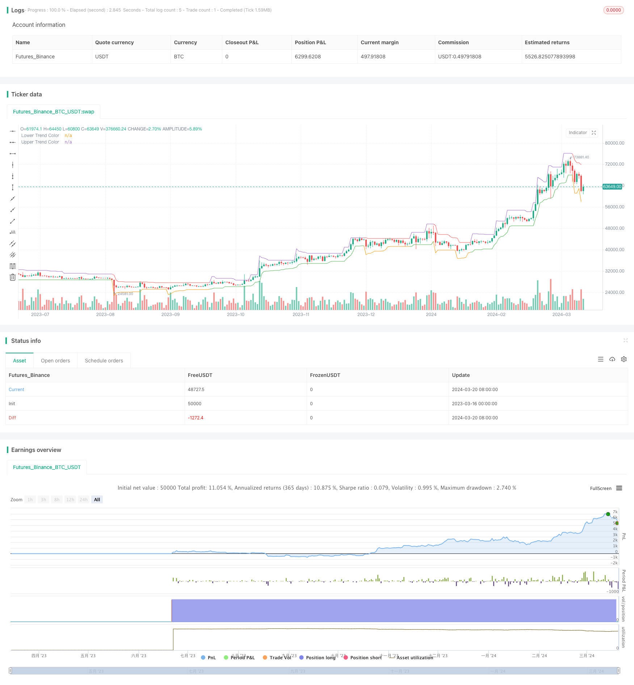

> Name

Trend Breakout Strategy ATR-Trend-Breakout-Strategy
> Author

ChaoZhang

> Strategy Description



[trans]
## Overview
This is a quantitative trading strategy that uses the ATR indicator and closing prices to capture trend breakouts. This strategy determines the trend direction by dynamically calculating the upper and lower trend lines, and generates trading signals when the closing price breaks through the trend line. This strategy sets stop loss and target price at the same time, and can carry out trailing stop loss based on volatility.
## Strategy Principle
1. Calculate ATR signal: atr_signal = atr(atr_period)
2. Calculate upper and lower trend lines:
   - Lower trendline: lower_trend = low - atr_mult*atr_signal
   - Upper trend line: upper_trend = high + atr_mult*atr_signal
3. Dynamically adjust the trend line. If the trend line breaks through, it will remain unchanged, otherwise it will be updated to the latest value.
4. Color the trend line based on the relative position of the closing price and the trend line to determine the trend direction.
5. Generate trading signals:
   - Long signal: There are currently no open positions and the closing price breaks the upper trend line
   - Short signal: There are currently no open positions and the closing price breaks the lower trend line
6. Set stop loss and target price:
   - Stop loss: latest trading price ± ATR fluctuation factor when breaking through
   - Target price: latest transaction price ± stop loss width * profit and loss ratio rr
7. Trailing Stop:
   - Long stop loss: highest upper trend line
   - Short Stop: Lowest Lower Trend Line
## Advantage Analysis
1. Dynamically adjust the trend line based on volatility to adapt to different market conditions
2. The trend line has directional color markings for easy identification of trends.
3. Use ATR as a measure of volatility and set reasonable stop losses and target prices.
4. The trailing stop loss function ensures profits while minimizing drawdowns.
5. High degree of parameterization, adaptable to different varieties and cycles
## Risk Analysis
1. Trend breakout strategies tend to generate too many signals in volatile markets, leading to losses.
2. Improper selection of ATR parameters may cause the trend line to be too sensitive or slow, affecting signal quality.
3. A fixed profit-loss ratio may not adapt to different market characteristics.
4. Trailing stop loss may cause you to leave the market and miss the trend.   
Solution:
1. Introduce trend filters or oscillators to assist judgment to avoid losses in volatile markets
2. Optimize ATR parameters respectively according to the variety and cycle characteristics.
3. Optimize the profit-loss ratio and trailing stop-loss logic to improve the strategy’s profit-risk ratio
4. The trend identification method can be combined to improve the trailing stop loss and capture more trend profits.
## Optimization direction
1. Combine multiple time periods, use large periods to identify trends, and use small periods to trigger signals
2. Add volume and price indicator verification before the trend line breaks through to improve the effectiveness of the signal.
3. Optimize position management and increase band operations
4. Optimize parameters for stop loss and profit/loss ratio
5. Improve the trailing stop loss logic to reduce premature stop loss in trending markets.
Multiple time periods help filter noise and make trend grasp more stable. Verification of volume and price indicators before a breakthrough can eliminate false signals. Optimization of position management can improve capital utilization efficiency. Optimization of stop loss and profit-loss ratio parameters can improve the strategy's return-to-risk ratio. The improvement of the trailing stop logic can obtain more trend profits while controlling retracements.
## Summary
This strategy uses ATR as a measure of volatility, dynamically adjusts the trend line position, and captures trend breakthroughs. Set stop loss and profit targets reasonably, and use trailing stop loss to lock in profits. Adjustable parameters and strong adaptability. However, the trend breakthrough strategy is also susceptible to the impact of volatile market conditions and needs further optimization and improvement. Strategy performance and stability can be improved by combining multiple cycles, screening signals, optimizing position management, and parameter optimization. Quantitative strategies require continuous testing and optimization based on understanding the essence of the strategy, and strive to provide more ideas and directions for beginners.
|| 

## Overview
This is a quantitative trading strategy that captures trend breakouts using the ATR indicator and closing prices. The strategy dynamically calculates upper and lower trend lines to determine the trend direction and generates trading signals when the closing price breaks through the trend lines. The strategy also sets stop-loss and target price levels and allows for trailing stops based on volatility.

## Strategy Principles
1. Calculate ATR signal: atr_signal = atr(atr_period)
2. Calculate upper and lower trend lines:
   - Lower trend line: lower_trend = low - atr_mult*atr_signal
   - Upper trend line: upper_trend = high + atr_mult*atr_signal
3. Dynamically adjust trend lines, keeping them unchanged if they are broken, otherwise updating to the latest values
4. Color-code the trend lines based on the relative position of the closing price to identify trend direction
5. Generate trading signals:
   - Long signal: No current position and closing price breaks above the upper trend line
   - Short signal: No current position and closing price breaks below the lower trend line
6. Set stop-loss and target prices:
   - Stop-loss: Latest entry price ± ATR range * factor at the time of breakout
   - Target price: Latest entry price ± stop-loss range * reward/risk ratio (rr)
7. Trailing stop:
   - Long stop: Highest upper trend line
   - Short stop: Lowest lower trend line

## Advantages Analysis  
1. Dynamically adjusts trend lines based on volatility to adapt to different market conditions
2. Color-coded trend lines with directionality for easy trend identification 
3. Uses ATR as a volatility measure to set reasonable stop-loss and target prices
4. Trailing stop functionality to lock in profits while minimizing drawdowns
5. Highly parameterized to suit different instruments and timeframes

## Risk Analysis
1. Trend breakout strategies can generate excessive signals leading to losses in choppy markets
2. Improper selection of ATR parameters may result in overly sensitive or sluggish trend lines, affecting signal quality
3. Fixed reward/risk ratio may not adapt well to different market characteristics 
4. Trailing stops may cut losses and miss out on trend moves

Solutions:
1. Introduce trend filters or oscillator indicators to avoid losses in ranging markets
2. Optimize ATR parameters separately based on instrument and timeframe characteristics
3. Optimize reward/risk ratio and trailing stop logic to improve strategy risk-adjusted returns
4. Combine with trend recognition methods to improve trailing stops and capture more trend profits

## Optimization Directions
1. Combine multiple timeframes, using higher timeframes to identify trends and lower timeframes to trigger signals
2. Add volume and price indicators for validation before trend line breakouts to improve signal validity
3. Optimize position sizing and incorporate swing trading
4. Perform parameter optimization for stop-loss and reward/risk ratio
5. Improve trailing stop logic to reduce premature stops during trend moves

Multi-timeframe analysis helps filter out noise for more stable trend identification. Volume and price confirmation before breakouts can eliminate false signals. Position sizing optimization improves capital efficiency. Optimizing stop-loss and reward/risk parameters can enhance risk-adjusted returns. Refining trailing stop logic allows capturing more trend profits while controlling drawdowns. 

## Summary
This strategy uses ATR as a volatility gauge to dynamically adjust trend line positions and capture trend breakouts. It sets reasonable stop-losses and profit targets, employing trailing stops to lock in gains. The parameters are adjustable for strong adaptability. However, trend breakout strategies are susceptible to whipsaw losses in choppy conditions and require further optimization and refinement. Combining multiple timeframes, filtering signals, optimizing position sizing, parameter optimization, and other techniques can improve the strategy's performance and robustness. Quantitative strategies demand continuous testing and optimization based on a solid understanding of the underlying principles in order to provide aspiring traders with more ideas and guidance.

[/trans]

> Strategy Arguments


|Argument|Default|Description|
|----|----|----|
|v_input_1|120|ATR Period|
|v_input_2|2|ATR Multiplier|
|v_input_3|true|Direction (Long=1, Short=-1, Both = 0)|
|v_input_4|0.75|Stop Level Deviation (% Chan.)|
|v_input_5|2|Reward to Risk Multiplier|
|v_input_6|20|Trail Stop Bar Start|
|v_input_7|false|Enable Colored Candles|


> Source (PineScript)

``` pinescript
/*backtest
start: 2023-03-16 00:00:00
end: 2024-03-21 00:00:00
period: 1d
basePeriod: 1h
exchanges: [{"eid":"Futures_Binance","currency":"BTC_USDT"}]
*/

//@version=4
strategy(title = "Claw-Pattern", overlay=true, calc_on_every_tick=true, default_qty_type= strategy.percent_of_equity,default_qty_value=10, currency="USD")
//Developer: Trading Strategy Guides
//Creator: Trading Strategy Guides
//Date: 3/18/2024
//Description: A trend trading system strategy 

atr_period = input(title="ATR Period", defval=120, type=input.integer)
atr_mult = input(title="ATR Multiplier", defval=2, type=input.integer)
dir = input(title="Direction (Long=1, Short=-1, Both = 0)", defval=1, type=input.integer)
factor = input(title="Stop Level Deviation (% Chan.)", defval=0.75, type=input.float)
rr = input(title="Reward to Risk Multiplier", defval=2, type=input.integer)
trail_bar_start = input(title="Trail Stop Bar Start", defval=20, type=input.integer)
col_candles = input(title="Enable Colored Candles", defval=false, type=input.bool)

atr_signal = atr(atr_period)

lower_trend = low - atr_mult*atr_signal
upper_trend = high + atr_mult*atr_signal

upper_trend := upper_trend > upper_trend[1] and close < upper_trend[1] ? upper_trend[1] : upper_trend
lower_trend := lower_trend < lower_trend[1] and close > lower_trend[1] ? lower_trend[1] : lower_trend

upper_color = barssince(cross(close, upper_trend[1])) > barssince(cross(close, lower_trend[1])) ? color.red : na
lower_color = barssince(cross(close, upper_trend[1])) > barssince(cross(close, lower_trend[1])) ? na : color.green

trend_line = lower_trend

plot(lower_trend, color=lower_color, title="Lower Trend Color")
plot(upper_trend, color=upper_color, title="Upper Trend Color")

is_buy = strategy.position_size == 0 and crossover(close, upper_trend[1]) and upper_color[1]==color.red and (dir == 1 or dir == 0)
is_sell = strategy.position_size == 0 and crossover(close, lower_trend[1]) and lower_color[1]==color.green and (dir == -1 or dir == 0)

if is_buy
    strategy.entry("Enter Long", strategy.long)
else if is_sell
    strategy.entry("Enter Short", strategy.short)
```

> Detail

https://www.fmz.com/strategy/445820

> Last Modified

2024-03-22 14:48:37
