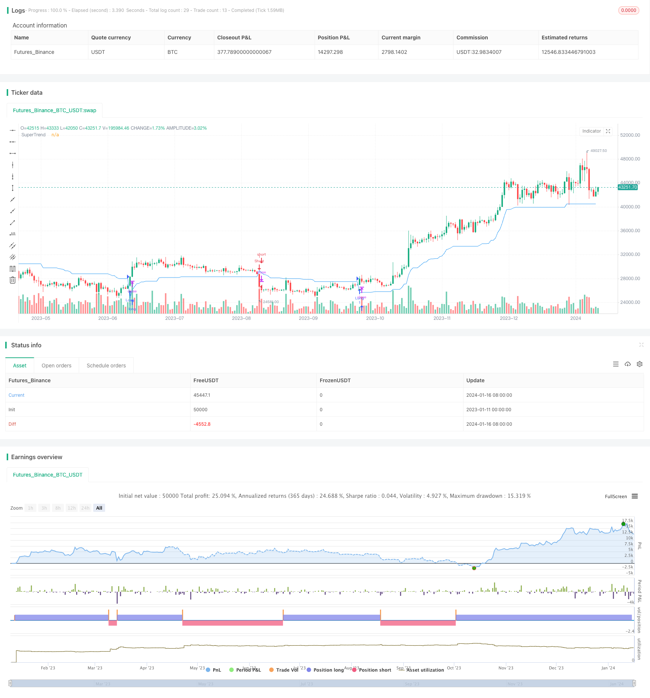

> Name

ATR-based-SuperTrend-Strategy based on average true volatility
> Author

ChaoZhang

> Strategy Description


 [trans]

## Overview
This strategy builds a SuperTrend channel based on the Average True Range (ATR) indicator, and generates buy and sell signals based on the price breaking through the SuperTrend channel. This strategy combines the advantages of trend following and stop loss management, and can effectively track the trend direction.
## Strategy Principle
The upper and lower rails of the supertrend channel are calculated by the following formula:
Upper track = (highest price + lowest price) / 2 + ATR(n) * factor
Lower track = (highest price + lowest price) / 2 - ATR(n) * factor
Among them, ATR(n) represents the average true amplitude of n days, and the factor is an adjustable parameter, which defaults to 3.
When the closing price is above the upper band, it is a bullish signal, and when the closing price is below the lower band, it is a bearish signal. The strategy determines entries and exits based on bullish and bearish signals.
## Advantage Analysis
- Use the ATR indicator to determine the channel range based on market volatility, which can effectively track trends
- Determine the timing of market entry based on channel breakthroughs to avoid false breakthroughs
- The channel range can be adjusted according to factor parameters to adapt to markets with different volatility
- Integrate the advantages of trend following and stop loss management
## Risk Analysis
- Improper setting of factor parameters may result in insufficient profit or too close a stop loss
- When the market fluctuates, the super-trend channel sends out frequent trading signals, which may lead to over-trading.
- Need to optimize the matching of ATR period parameters and factor parameters
Risk resolution:
- Adjust factor parameters for different markets to reduce the risk of excessive stop loss
- Add conditional filtering to avoid frequent transactions in volatile markets
- Comprehensive consideration of market volatility, position holding time and other factors to match the ATR cycle
## Optimization direction
- Combine with other indicators to filter signals and optimize entry timing
- Add trailing stop loss to lock in more profits
- Optimization of different varieties and cycle parameters
- Optimize the matching of ATR period and factor parameters
## Summarize
This strategy uses supertrend channels to achieve trend following and stop loss management. The matching of ATR period and factor parameters is crucial to the strategy effect. The next step will be to further optimize the strategy in terms of parameter optimization and signal filtering to enable it to adapt to a more complex market environment.
||

## Overview

This strategy builds a SuperTrend channel based on the Average True Range (ATR) indicator to generate buy and sell signals when the price breaks through the channel. It combines the advantages of trend following and stop loss management.

## Strategy Logic  

The upper and lower bands of the SuperTrend channel are calculated as:

Upper Band = (Highest Price + Lowest Price) / 2 + ATR(n) * Factor
Lower Band = (Highest Price + Lowest Price) / 2 - ATR(n) * Factor

Where ATR(n) is the n-period Average True Range and Factor is an adjustable parameter, default to 3.  

A bullish signal is generated when the closing price crosses above the upper band. A bearish signal is generated when the closing price crosses below the lower band. The strategy determines entries and exits based on these signals.

## Advantage Analysis   

- Uses ATR to determine channel range based on market volatility, effectively tracking trends
- Looks for channel breakouts to determine entry timing, avoiding false breakouts  
- Adjustable channel range via factor parameter, adaptable to markets with different volatility
- Integrates the advantages of trend following and stop loss management

## Risk Analysis

- Improper factor parameter setting may lead to insufficient profit taking or excessive stop loss
- Frequent trading signals may occur during market consolidation, potentially overtrading
- Need to optimize match between ATR period and factor parameter  

Risk Solving Methods:

- Adjust factor parameter based on different markets to reduce excessive stop loss
- Add condition filtering to avoid frequent trading during consolidation
- Comprehensively consider volatility, holding period etc. to match ATR period  

## Optimization Directions  

- Incorporate other indicators to filter signals and optimize entries 
- Add moving stop loss tracking to lock in more profits
- Parameter optimization for different products and timeframes
- Optimize match between ATR period and factor parameters   

## Summary  

This strategy uses the SuperTrend channel for trend tracking and stop loss management. The match between ATR period and factor parameters is crucial. Next step is to further optimize the strategy via parameter tuning, signal filtering etc., making it adaptable to more complex market environments.

[/trans]

> Strategy Arguments


|Argument|Default|Description|
|----|----|----|
|v_input_int_1|10|ATR Length|
|v_input_float_1|3|Factor|


> Source (PineScript)

``` pinescript
/*backtest
start: 2023-01-11 00:00:00
end: 2024-01-17 00:00:00
period: 1d
basePeriod: 1h
exchanges: [{"eid":"Futures_Binance","currency":"BTC_USDT"}]
*/

//@version=5
strategy("Supertrend Backtest", shorttitle="STBT", overlay=true)

// Input for ATR Length
atrLength = input.int(10, title="ATR Length", minval=1)
atrFactor = input.float(3.0, title="Factor", minval=0.01, step=0.01)

// Calculate SuperTrend
[supertrend, direction] = ta.supertrend(atrFactor, atrLength)
supertrend := barstate.isfirst ? na : supertrend

// Define entry and exit conditions
longCondition = ta.crossover(close, supertrend)
shortCondition = ta.crossunder(close, supertrend)

// Plot the SuperTrend
plot(supertrend, color=color.new(color.blue, 0), title="SuperTrend")

// Plot Buy and Sell signals
plotshape(series=longCondition, style=shape.triangleup, location=location.belowbar, color=color.green, size=size.small, title="Buy Signal")
plotshape(series=shortCondition, style=shape.triangledown, location=location.abovebar, color=color.red, size=size.small, title="Sell Signal")

// Strategy Entry and Exit
strategy.entry("Long", strategy.long, when=longCondition)
strategy.entry("Short", strategy.short, when=shortCondition)


```

> Detail

https://www.fmz.com/strategy/439204

> Last Modified

2024-01-18 12:26:33
