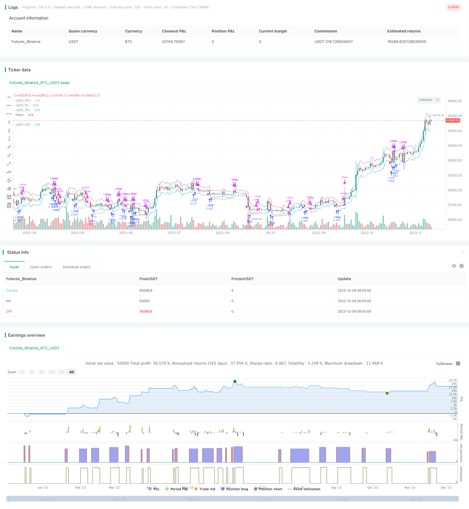

> Name

Quantitative trading strategy ATR-Channel-Mean-Reversion-Quantitative-Trading-Strategy based on ATR channel moving average reversal
> Author

ChaoZhang

> Strategy Description


[trans]

## Overview
This strategy is a long-only strategy. It uses the price to break through the lower limit of the ATR channel to determine the timing of entry, and uses the moving average of the ATR channel or the upper limit of the ATR channel as a take-profit exit. At the same time, it will also use ATR to calculate the stop loss price. This strategy is suitable for quick short-term trading.
## Strategy Principle
When the price falls below the lower limit of the ATR channel, it indicates that the price has experienced an abnormal decline. At this time, the strategy will be long when the next K-line opens. The stop loss price is the entry price minus the ATR stop loss coefficient multiplied by ATR. The take-profit price is the moving average of the ATR channel or the upper limit of the ATR channel. If the closing price of the current K-line is lower than the lowest price of the previous K-line, the lowest price of the previous K-line will be the take-profit price.
Specifically, this strategy mainly includes the following logic:
1. Calculate ATR and ATR channel moving average
2. Determine time filter conditions
3. When the price is lower than the lower limit of the ATR channel, the mark can be used for long entry.
4. Enter long when the next K-line opens
5. Record the entry price
6. Calculate stop loss price
7. When the price is higher than the moving average of the ATR channel or the upper limit of the ATR channel, close the position and take profit
8. Stop loss and exit when the price is lower than the stop loss price
## Advantage Analysis
This strategy has the following advantages:
1. Use the ATR channel to determine entry and take profit, which has high reliability
2. When going long, only enter the market after an abnormal decline to avoid chasing high prices.
3. Strict stop loss rules and effective risk control
4. Suitable for quick short-term transactions, no need to hold positions for a long time
5. Simple and easy-to-understand rules, easy to implement and optimize
## Risk Analysis
There are also some risks with this strategy:
1. Transaction fees and slippage risks caused by frequent transactions
2. Stop loss may be triggered continuously
3. Improper parameter optimization may affect the strategy effect
4. When the underlying price fluctuates greatly, the stop loss may be too large.
The above risks can be reduced by adjusting the ATR cycle and reducing the stop loss coefficient. It is also important to choose a brokerage with lower transaction fees.
## Optimization direction
This strategy can also be optimized from the following aspects:
1. Add other indicator filters to avoid missing the best entry opportunity
2. Optimize ATR cycle parameters
3. Consider adding a re-entry mechanism
4. Dynamically adjust the stop loss range
5. Add trend judgment rules to avoid entering against the trend
## Summarize
Overall, this strategy is a simple and practical short-term moving average reversal strategy. It has clear entry rules, strict stop loss mechanism and perfect take profit method. It also provides some optimization space for parameter adjustment. If traders can choose appropriate targets and use stop loss to control risks, this strategy should be able to achieve good results.
|| 

## Overview

This is a long-only strategy that identifies entry signals when prices break below the lower band of the ATR channel, and takes profit when prices reach the middle band (EMA) or upper band of the ATR channel. It also uses ATR to calculate stop loss levels. This strategy is suitable for quick short-term trades.  

## Strategy Logic

When the price breaks below the lower ATR band, it signals an anomaly drop. The strategy will go long at the next candle's open. The stop loss is set at entry price minus ATR stop loss multiplier times ATR. Take profit is at the middle band (EMA) or upper ATR band. If current bar's close is lower than previous bar's low, then use previous bar's low as take profit.

Specifically, the key logic includes:

1. Calculate ATR and middle band (EMA)
2. Define time filters 
3. Identify long signal when price < lower ATR band  
4. Enter long at next bar's open
5. Record entry price
6. Calculate stop loss price
7. Take profit when price > middle band (EMA) or upper ATR band
8. Stop out when price < stop loss price

## Advantage Analysis 

The advantages of this strategy:

1. Uses ATR channel for reliable entry and exit signals
2. Only long after anomaly drop avoids chasing highs 
3. Strict stop loss controls risk
4. Suitable for quick short-term trades
5. Simple logic easy to implement and optimize

## Risk Analysis

There are some risks:

1. High trading frequency leads to higher transaction costs and slippage
2. Consecutive stop loss triggers may happen
3. Inappropriate parameter optimization impacts performance
4. Large price swings may result in oversized stop loss

These risks can be reduced by adjusting ATR period, stop loss multiplier etc. Choosing brokers with low trading fees is also important.

## Optimization Directions

The strategy can be improved by:

1. Adding other filter indicators to avoid missing best entry signals
2. Optimizing ATR period 
3. Considering re-entry mechanism
4. Adaptive stop loss size
5. Adding trend filter to avoid counter-trend trades

## Conclusion

In summary, this is a simple and practical mean reversion strategy based on ATR channel. It has clear entry rules, strict stop loss, and reasonable take profit. There is also room for parameter tuning. If traders can choose the right symbol and control risk with stop loss, this strategy can achieve good results.

[/trans]

> Strategy Arguments


|Argument|Default|Description|
|----|----|----|
|v_input_1|1.5|SL Multiplier|
|v_input_2_close|0|Source: close|high|low|open|hl2|hlc3|hlcc4|ohlc4|
|v_input_int_1|10|ATR & MA PERIOD|
|v_input_3|timestamp(01 Jan 1995 13:30 +0000)|(?Time Filter)Start Filter|
|v_input_4|timestamp(1 Jan 2099 19:30 +0000)|End Filter|


> Source (PineScript)

``` pinescript
/*backtest
start: 2022-12-04 00:00:00
end: 2023-12-10 00:00:00
period: 1d
basePeriod: 1h
exchanges: [{"eid":"Futures_Binance","currency":"BTC_USDT"}]
*/

// This source code is subject to the terms of the Mozilla Public License 2.0 at https://mozilla.org/MPL/2.0/
// © Bcullen175

//@version=5
strategy("ATR Mean Reversion", overlay=true, initial_capital=100000,default_qty_type=strategy.percent_of_equity, default_qty_value=100, commission_type=strategy.commission.percent, commission_value=6E-5) // Brokers rate (ICmarkets = 6E-5)
SLx = input(1.5, "SL Multiplier", tooltip = "Multiplies ATR to widen stop on volatile assests, Higher values reduce risk:reward but increase winrate, Values below 1.2 are not reccomended")
src = input(close, title="Source")
period = input.int(10, "ATR & MA PERIOD")
plot(open+ta.atr(period))
plot(open-ta.atr(period))
plot((ta.ema(src, period)), title = "Mean", color=color.white)

i_startTime     = input(title="Start Filter", defval=timestamp("01 Jan 1995 13:30 +0000"), group="Time Filter", tooltip="Start date & time to begin searching for setups")
i_endTime       = input(title="End Filter", defval=timestamp("1 Jan 2099 19:30 +0000"), group="Time Filter", tooltip="End date & time to stop searching for setups")

// Check filter(s)
f_dateFilter = true

atr = ta.atr(period)

// Check buy/sell conditions
var float buyPrice = 0
buyCondition    = low < (open-ta.atr(period)) and strategy.position_size == 0 and f_dateFilter
sellCondition   = (high > (ta.ema(close, period)) and strategy.position_size > 0 and close < low[1]) or high > (open+ta.atr(period))
stopDistance    = strategy.position_size > 0 ? ((buyPrice - atr)/buyPrice) : na
stopPrice       = strategy.position_size > 0 ? (buyPrice - SLx*atr): na
stopCondition   = strategy.position_size > 0 and low < stopPrice

// Enter positions
if buyCondition
    strategy.entry(id="Long", direction=strategy.long)

if buyCondition[1]
    buyPrice := open

// Exit positions
if sellCondition or stopCondition
    strategy.close(id="Long", comment="Exit" + (stopCondition ? "SL=true" : ""))
    buyPrice := na

// Draw pretty colors
plot(buyPrice, color=color.lime, style=plot.style_linebr)
plot(stopPrice, color=color.red, style=plot.style_linebr, offset=-1)

```

> Detail

https://www.fmz.com/strategy/434995

> Last Modified

2023-12-11 15:38:25
