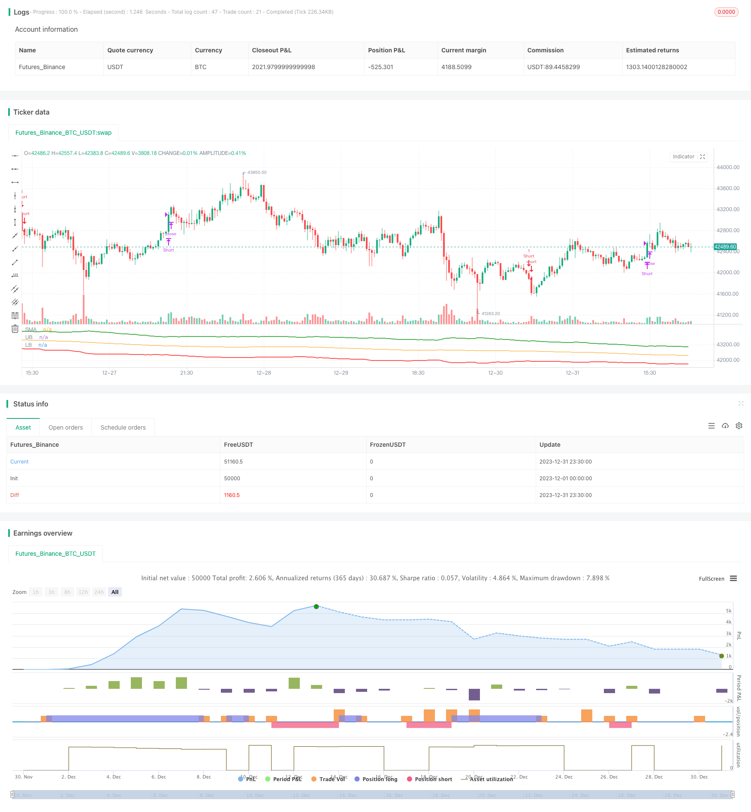

> Name

Quantitative trading strategy based on ATR channel breakout An-ATR-Channel-Breakout-Quantitative-Trading-Strategy
> Author

ChaoZhang

> Strategy Description


[trans]
## Overview
This strategy is based on trading channels formed by calculating the average true range (ATR). Specifically, it calculates the SMA moving average of a certain period, and then uses the ATR value to determine the upper and lower rails of the channel. When the price breaks through the upper rail of the channel, go long, when the price falls below the lower rail of the channel, go short, and close the position when the price falls below the SMA moving average again.
## Strategy Principle
The core logic of this strategy is based on the Average True Range (ATR) channel. The ATR indicator can effectively reflect market volatility and stock price trends, and is usually used to determine stop loss lines and profit targets. The strategy first calculates the SMA moving average of n periods (default 150 periods), and then determines the position of the upper and lower rails of the channel based on the ATR value and reference coefficient. The specific calculation formula is as follows:
Upper rail = SMA moving average + ATR value × upper rail coefficient (default 4)
Lower rail = SMA moving average - ATR value × lower rail coefficient (default 4)
When the stock price rises and breaks through the upper track, it means that the stock price has begun to enter the trend channel, indicating that the stock price will continue to rise, and you will go long at this time; when the stock price falls and breaks through the lower track, it means that the stock price has begun to reverse and fall, and you will go short at this time. The closing signal is to close all long orders when the stock price falls below the SMA moving average again; to close all short orders when the stock price rises above the SMA moving average again.
## Strategic Advantages
1. Using the average true amplitude ATR as the channel range reference can more accurately capture market fluctuations. ATR can effectively measure market volatility and thus set a more appropriate channel range.
2. SMA moving average + ATR channel, double filtering ensures that trading signals are more reliable. Trading signals are only issued when the price breaks through the upper and lower rails of the channel, avoiding unnecessary false signals.
3. Through parameter optimization, you can seize the opportunities of rising and falling stock prices to the greatest extent and take advantage of the trend to make profits. Both channel width and period can be optimized.
4. The strategy logic is simple, clear, easy to understand and easy to implement. The idea of ​​judging long and short based on indicators and channels is very intuitive.
5. Including long and short two-way trading strategies, you can gain profits in both rising and falling stock prices.
## Risk Analysis
1. Channel breakthrough transactions are prone to losses at key nodes. If the breakthrough is a false breakthrough, large losses may occur in the short term.
2. The SMA moving average has high systemic risks and cannot reflect market changes in a timely manner. The price may have entered a downtrend but the SMA has not yet turned.
3. Improper setting of ATR and coefficient parameters will affect the rationality of the channel range.
4. In a bull market, short trades will continue to lose money. On the contrary, in a short bear market, long transactions will continue to lose money.
Solutions corresponding to risks:
1. Appropriately adjust the trading frequency to reduce the risk of false breakthroughs. Or set a second layer of filtering conditions to avoid losses at key points.
2. Combine with MACD, KDJ and other indicators to double confirm SMA to avoid systemic risks.
3. Do a good job in parameter optimization, select the appropriate ATR period and channel coefficient, and ensure that the channel range is reasonable.
4. Choose the trend trading direction based on the judgment of the large-level market structure. Go long in the bull market and go short in the bear market.
## Optimization direction
This strategy can be optimized from the following directions:
1. Add other technical indicator filters to avoid false breakthroughs. You can detect the signals of MACD, KDJ and other indicators while the channel breaks through, and make multi-layer confirmation.
2. Optimize ATR and channel coefficient parameters to make the channel range more in line with the current market status. This requires a lot of backtesting and optimization to determine the best combination of parameters.
3. Add automatic stop loss strategy to control the maximum loss risk of a single transaction. Trailing stop is a common option.
4. You can stop losses in time when the trend deviates. For example, stop loss when the price deviates from the SMA moving average beyond a certain range.
5. Combined with larger-level market structure analysis indicators, differentiate between long and short markets and make breakthrough transactions in the corresponding direction. For example, identify trends at the weekly level and then trade breakouts intraday.
## Summarize
This strategy is based on the dual-rail form of SMA moving average + ATR channel, and trades in the corresponding direction when the price breaks through the upper and lower rails of the channel. It is a typical channel breakthrough strategy. The advantage is that dual indicator filtering makes breakthrough signals relatively reliable; the disadvantage is that there is a certain degree of risk of false breakthroughs. Through parameter optimization, adding stop-loss strategies, and combining trend judgment with further improvements, the strategy can be made more reliable and consistent with the market structure, thereby obtaining more stable returns. This strategy is simple and easy to operate and is worthy of exploration and optimization practice.
||

## Overview
This strategy trades based on channels formed using the Average True Range (ATR). Specifically, it calculates a SMA line over a certain period, then uses the ATR values to determine the upper and lower bands of the channel. It goes long when the price breaks out above the upper band, and goes short when the price breaks below the lower band. Positions are closed when the price crosses back below the SMA line.  

## Strategy Logic  
The core logic of this strategy is based on ATR channels. The ATR indicator can effectively reflect market volatility and price movements, and is usually used to determine stop loss and take profit levels. The strategy first calculates the SMA line over n periods (default 150), then uses the ATR value and coefficient to determine the upper and lower channel bands. The specific formulas are:

Upper Band = SMA + ATR Value × Upper Band Coefficient (default 4) 
Lower Band = SMA - ATR Value × Lower Band Coefficient (default 4)

When the price breaks out above the upper band, it indicates the start of a trend channel and upside momentum, so a long position is taken. When the price breaks below the lower band, it signals the start of a reversal, so a short position is taken. Exits occur when the price crosses back below the SMA line, closing out all longs, or crosses back above the SMA line, closing out all shorts.  

## Advantages
1. Using ATR as the reference for channel range can more accurately capture market volatility. ATR effectively measures market volatility for better channel sizing.

2. The dual filters of SMA and ATR channel ensure more reliable trade signals, reducing false signals.  

3. Parameters can be optimized to maximize the capture of upside and downside price movements for trend trading profits. Both channel width and lookback period are tunable.

4. Simple and clear logic that is easy to understand and implement. Intuitive long/short decisions based on indicators and channel breakouts. 

5. Includes both long and short trades to profit from up and down trends.

## Risk Analysis
1. Channel breakout trades are prone to losses at key reversal points if breakout turns out to be false.

2. SMA has systemic risk of lagging market turns. Price may already be falling but SMA has yet to turn down.  

3. Poor ATR parameter and coefficient settings can result in irrational channel ranges.

4. Persistent short losses in bull market uptrends, and persistent long losses in bear market downtrends.

Possible solutions:
1. Adjust trade frequency or add filters to avoid losses from false breakouts. 

2. Add cross-confirmation with MACD, KDJ to avoid SMA systemic lag risk.

3. Optimize ATR period and coefficient to ensure reasonable channel range.  

4. Determine overall market regime for trend bias. Go long in bull trending markets and short in bear trends.

## Enhancement Opportunities
Some ways this strategy can be enhanced:

1. Add additional indicator filters to reduce false breakout whipsaws, using MACD, KDJ etc. to confirm signals.

2. Optimize ATR period and channel coefficient to fit current market volatility conditions through extensive backtesting.

3. Incorporate automated stop loss to control maximum loss per trade. Trailing stops are a common implementation.  

4. Cut losses quickly when price diverges away from SMA baseline. 

5. Incorporate higher timeframe trend analysis to determine bull/bear bias for breakout direction. For example, use weekly to determine overall trend for daily breakout entries.

## Summary
This is a classic channel breakout strategy using SMA and ATR channel bands. Its strength lies in more reliable signals from the dual filters, while weakness is the risk of false breakouts. Further improvements can be made through parameter optimization, stop losses, and trend analysis to make it more robust and aligned with market conditions. With tune-up, it can achieve more consistent profits. The simplicity of this strategy makes it worth exploring and optimizing in practice.  

[/trans]

> Strategy Arguments


|Argument|Default|Description|
|----|----|----|
|v_input_int_1|150|SMA Length|
|v_input_int_2|30|ATR Length|
|v_input_float_1|4|Upperband Offset|
|v_input_float_2|4|Lowerband Offset|


> Source (PineScript)

``` pinescript
/*backtest
start: 2023-12-01 00:00:00
end: 2023-12-31 23:59:59
period: 30m
basePeriod: 15m
exchanges: [{"eid":"Futures_Binance","currency":"BTC_USDT"}]
*/

// This Pine Script™ code is subject to the terms of the Mozilla Public License 2.0 at https://mozilla.org/MPL/2.0/
// © omererkan

//@version=5
strategy(title="ATR Channel Breakout")

smaLength = input.int(150, title="SMA Length")
atrLength = input.int(30, title="ATR Length")

ubOffset = input.float(4, title="Upperband Offset", step=0.50)
lbOffset = input.float(4, title="Lowerband Offset", step=0.50)


smaValue = ta.sma(close, smaLength)
atrValue = ta.atr(atrLength)

upperBand = smaValue + (ubOffset * atrValue)
lowerBand = smaValue - (lbOffset * atrValue)


plot(smaValue, title="SMA", color=color.orange)
plot(upperBand, title="UB", color=color.green, linewidth=2)
plot(lowerBand, title="LB", color=color.red, linewidth=2)


enterLong = ta.crossover(close, upperBand)
exitLong  = ta.crossunder(close, smaValue)


enterShort = ta.crossunder(close, lowerBand)
exitShort  = ta.crossover(close, smaValue)


if enterLong
    strategy.entry("Long", strategy.long)

if enterShort
    strategy.entry("Short", strategy.short)


if exitLong
    strategy.close("Long", "Close Long")

if exitShort
    strategy.close("Short", "Close Short")
```

> Detail

https://www.fmz.com/strategy/439715

> Last Modified

2024-01-23 12:00:04
