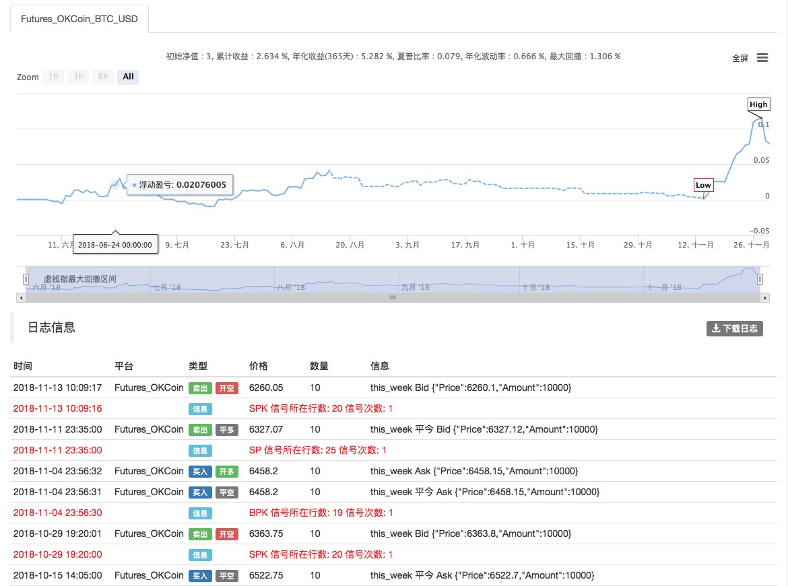
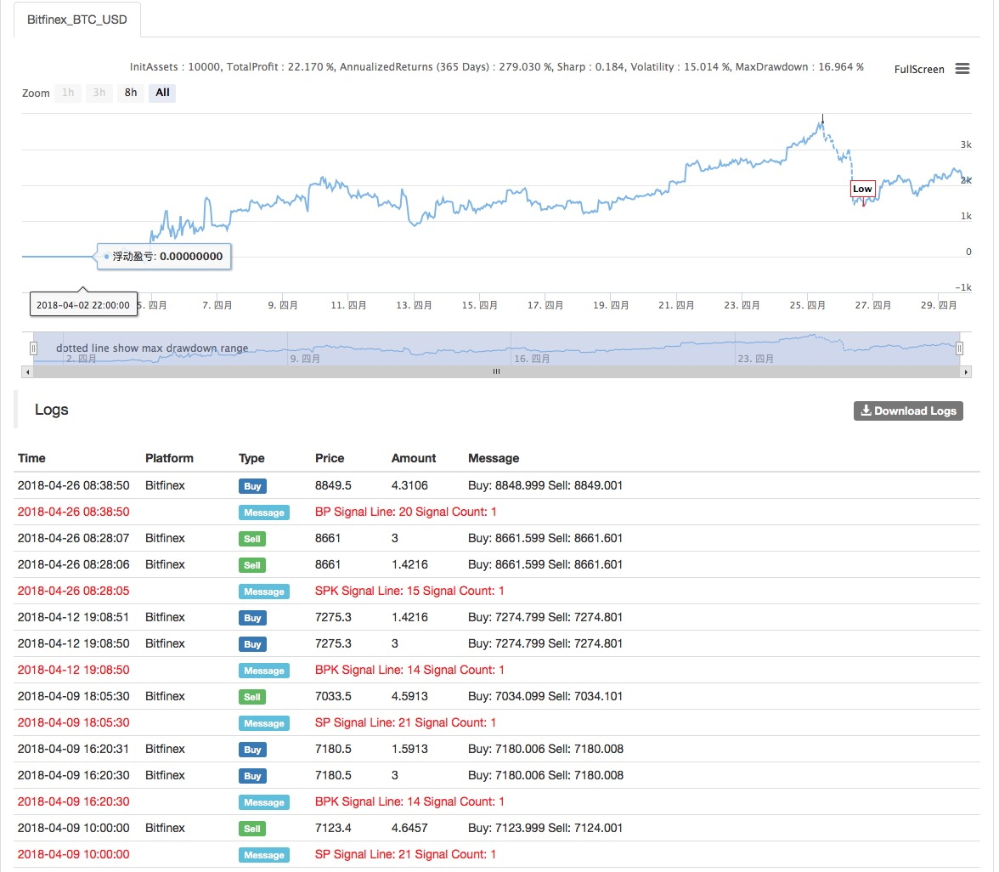
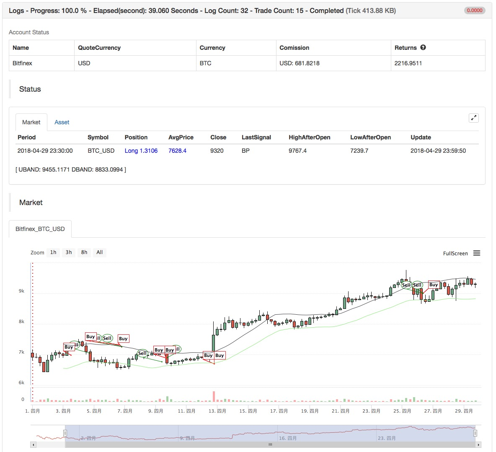

> Name

Channel-strategy-based-on-ATR
> Author

Archimedes' bathtub
> Strategy Description

[trans]
- Name: Channel strategy based on ATR volatility indicator
- Idea: Channel adaptive strategy, fixed stop loss + floating take profit
- Data period: multi-period
- OKEX Futures
- Contract: this_week current week
- Official website: www.quantinfo.com


- Main picture:
  Draw UBAND, formula: UBAND^^MAC+M*ATR;
  Draw DBAND, formula: DBAND^^MAC-M*ATR;
- Sub-picture:
  None
||

- Strategy name: Channel strategy based on ATR volatility index
- Strategy idea: Channel Adaptive Strategy, Fixed Stop + Floating Stop
- Data Cycle: Multi-Cycle

    
   

- Main chart:
  Draw UBAND, formula: UBAND ^^ MAC + MATR;
  Draw DBAND, formula: DBAND ^^ MAC-MATR;

- Secondary chart:
  none

[/trans]

> Strategy Arguments


|Argument|Default|Description|
|----|----|----|
|SLOSS|2|stop loss percentage|stop loss percentage|
|N|200|ATR index parameter|ATR index parameter|
|M|4|upper and lower track coefficients|

> Source (MyLanguage)

``` pascal
(*backtest
start: 2018-06-01 00:00:00
end: 2018-07-01 00:00:00
period: 1h
exchanges: [{"eid":"Futures_OKCoin","currency":"BTC_USD"}]
args: [["TradeAmount",10,126961],["ContractType","this_week",126961]]
*)

TR1:=MAX(MAX((HIGH-LOW),ABS(REF(CLOSE,1)-HIGH)),ABS(REF(CLOSE,1)-LOW));
ATR:=MA(TR1,N);
MAC:=MA(C,N);
UBAND^^MAC+M*ATR;
DBAND^^MAC-M*ATR;
H>=HHV(H,N),BPK;
L<=LLV(L,N),SPK;
(H>=HHV(H,M*N) OR C<=UBAND) AND BKHIGH>=BKPRICE*(1+M*SLOSS*0.01),SP;
(L<=LLV(L,M*N) OR C>=DBAND) AND SKLOW<=SKPRICE*(1-M*SLOSS*0.01),BP;
// 止损
// stop loss
C>=SKPRICE*(1+SLOSS*0.01),BP;
C<=BKPRICE*(1-SLOSS*0.01),SP;
AUTOFILTER;
```

> Detail

https://www.fmz.com/strategy/128126

> Last Modified

2018-12-18 12:55:34
