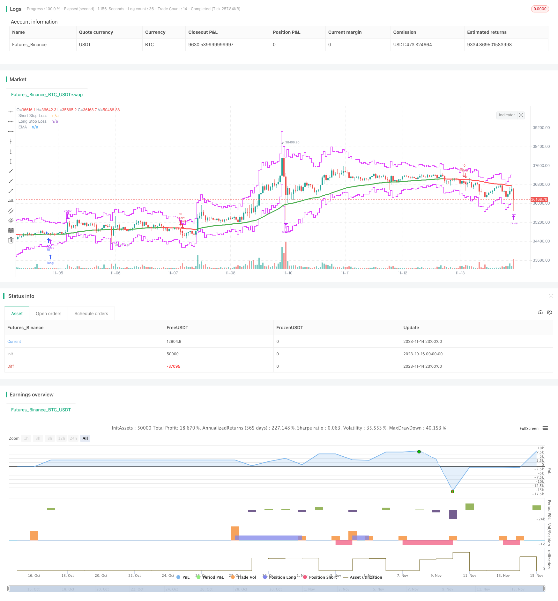

> Name

Dual-Moving-Average-Deviation-Combined-with-ATR-Indicator-Trend-Following-Strategy
> Author

ChaoZhang

> Strategy Description


[trans]

## Overview
This strategy uses the golden cross and dead cross of the double EMA moving average to form signals, and cooperates with the ATR indicator to determine the market volatility to achieve a trend-following strategy of buying low and selling high. When the fast line crosses the slow line, and the ATR indicator is lower than the previous day, it is regarded as a long signal to go long; when the fast line crosses the slow line, and the ATR indicator is higher than the previous day, it is regarded as a short signal to go short.
## Strategy Principle
1. Use a dual EMA with lengths of 20 and 55. When the fast line crosses the slow line and produces a golden cross, it is regarded as a long signal; when the fast line crosses below the slow line and produces a dead cross, it is regarded as a short signal.
2. Use the ATR indicator with a length of 14. The ATR indicator can reflect the volatility and risk level of the market. When the ATR is lower than the previous day, it means that the market volatility has weakened, and it is suitable to intervene in the long position; when the ATR is higher than the previous day, it means that the market volatility has increased, and it is suitable to intervene in the short position.
3. Only go long when the fast line crosses the slow line and the ATR is lower than the previous day; only go short when the fast line crosses the slow line and the ATR is higher than the previous day. Avoid getting involved easily when the market is volatile.
4. The ATR indicator is also used to set stop loss and take profit levels. The stop loss level is the current price minus ATR multiplied by the stop loss multiple; the take profit level is the current price plus ATR multiplied by the take profit multiple.
5. The default stop loss multiple is 3 times ATR, and the take profit multiple is 3 times ATR by default. This allows both stop loss and take profit levels to dynamically follow market fluctuations.
## Strategic Advantages
1. The use of dual moving average systems can provide strong confirmation of long and short status judgments. Avoid being misled by false breakthroughs that often occur in the market.
2. The introduction of the ATR indicator allows the strategy to only intervene when volatility is low, which can filter out many false signals and reduce system risks.
3. ATR dynamic stop loss and take profit can set the stop loss and take profit according to the market fluctuation level. Avoid taking a stop loss that is too close or a take profit that is too shallow.
4. You can set whether to use moving average crossover as an additional exit mechanism. The profit and loss results of the system can be further optimized.
5. Dynamic stop loss and take profit levels can be set based on ATR, which is more in line with trend trading logic. Stop loss will not be too sensitive and take profit will not be too loose.
## Strategy Risk
1. There is a certain lag in the judgment signal of the dual moving average system. Strong short-term trends may be missed.
2. When volatility is high, ATR will rise, and you may miss the opportunity to intervene. ATR parameters should be adjusted appropriately.
3. When holding a position for a long time, the stop loss level may be too close and should be relaxed appropriately based on the strength of the trend.
4. The moving average system is less effective in judging the twists and turns of consolidation scenarios. It should be confirmed in conjunction with other indicators.
5. ATR parameters should be adjusted according to different varieties and different cycles. Improper parameter selection will affect system profits and losses.
## Strategy optimization direction
1. You can test moving average combinations of different length parameters to find moving average parameters that better match the trend characteristics of the variety.
2. Other indicators such as MACD and KD can be introduced to confirm the moving average crossover signal and improve Entscheidungssicherheit.
3. The ATR parameters can be optimized through backtesting to make them more consistent with the smooth fluctuation characteristics of the variety.
4. The ATR multiple factor can be set as an adjustable variable, and the stop-profit and stop-loss positions can be dynamically adjusted according to the strength of the trend.
5. You can combine the trend strength indicator to lower the stop loss requirement when the trend is not strong, and increase the take profit requirement when the trend is strong.
## Summarize
This strategy integrates the trend judgment of the double EMA moving average and the risk control of the ATR volatility indicator to form a more complete trend following system. The focus of strategy optimization is to adjust the moving average and ATR parameters to make them more consistent with the characteristics of the variety, and to design a dynamic stop-profit and stop-loss mechanism to follow changes in trend intensity. Through parameter optimization and logic optimization, this strategy can become an excellent trend following strategy.
||


## Overview

This strategy uses the golden cross and dead cross signals formed by dual EMA moving averages, combined with the ATR indicator to judge market volatility, to implement a low-buying-high-selling trend following strategy. When the fast line crosses above the slow line, and the ATR indicator is lower than the previous day, it is considered a bullish signal to go long. When the fast line crosses below the slow line, and the ATR indicator is higher than the previous day, it is considered a bearish signal to go short.

## Strategy Logic

1. Use dual EMA moving averages of length 20 and 55. When the fast line crosses above the slow line and generates a golden cross, it is considered a bullish signal. When the fast line crosses below the slow line and generates a dead cross, it is considered a bearish signal.

2. Use ATR indicator of length 14. The ATR indicator reflects the volatility and risk level of the market. When the ATR is lower than the previous day, it indicates that market volatility is weakening and it is suitable to go long. When the ATR is higher than the previous day, it indicates that market volatility is increasing and it is suitable to go short.

3. Only go long when the fast line golden crosses the slow line and the ATR is lower than the previous day. Only go short when the fast line dead crosses the slow line and the ATR is higher than the previous day. This avoids intervene when market volatility is high.

4. The ATR indicator is also used to set stop loss and take profit levels. The stop loss is set at current price minus ATR multiplied by the stop loss multiplier. The take profit is set at current price plus ATR multiplied by the take profit multiplier. 

5. The default stop loss multiplier is 3xATR and the default take profit multiplier is 3xATR. This allows the stop loss and take profit to dynamically follow market volatility.

## Advantages of the Strategy

1. Using a dual moving average system provides stronger confirmation of long/short status. It avoids being misled by false breakouts that frequently occur in the market.

2. Introducing the ATR indicator allows the strategy to only engage when volatility is low. This filters out many false signals and reduces system risk.

3. The dynamic ATR stop loss/take profit allows the stops and targets to be set according to market volatility level. This prevents stops being too close or targets being too shallow.

4. It is possible to set moving average crossover as an additional exit mechanism. This can further optimize the system's profitability.

5. Dynamic stop loss and take profit levels based on ATR fit better with the trend trading logic. The stop loss is not too sensitive and the take profit is not too loose.

## Risks of the Strategy

1. Dual moving averages have some lag in signals. This may miss stronger short-term trends.

2. When volatility is high, ATR rises and may miss entry opportunities. ATR parameters need to be adjusted accordingly.

3. For long holding periods, the stop loss may get too close. It needs to be relaxed according to the trend strength.

4. Moving averages perform poorly in choppy ranging markets. Other indicators are needed for confirmation.

5. ATR parameters need to be adjusted for different products and timeframes. Incorrect parameters will negatively impact performance.

## Improvement Areas

1. Test different length moving average combinations to find parameters that match the trend characteristics of the product.

2. Incorporate other indicators like MACD, KD to confirm moving average crossover signals and improve Entscheidungssicherheit. 

3. Optimize ATR parameters through backtesting to better match the volatility characteristics of the product.

4. Make the ATR multiplier factor adjustable to dynamically adjust stop loss/take profit according to trend strength.

5. Incorporate a trend strength indicator to reduce stop loss requirements in weak trends, and increase take profit in strong trends.

## Summary

This strategy integrates the trend judgment of dual EMAs and the risk control of the ATR volatility indicator to form a relatively complete trend following system. The focus for optimization is adjusting the moving average and ATR parameters to match the product characteristics, and designing dynamic stop loss/take profit mechanisms to follow changes in trend strength. With parameter and logic optimization, this strategy can become an excellent trend following strategy.
[/trans]

> Strategy Arguments


|Argument|Default|Description|
|----|----|----|
|v_input_1|20|Fast Moving Average|
|v_input_2|55|Slow Moving Average|
|v_input_3_close|0|Source: close|high|low|open|hl2|hlc3|hlcc4|ohlc4|
|v_input_4|14|ATR Length|
|v_input_5|3|Stop Loss Multiple|
|v_input_6|3|Take Profit Multiple|
|v_input_7|true|Plot EMA?|
|v_input_8|false|Exit with Slow MA Crossover?|
|v_input_9|true|Exit with ATR?|


> Source (PineScript)

``` pinescript
/*backtest
start: 2023-10-16 00:00:00
end: 2023-11-15 00:00:00
period: 1h
basePeriod: 15m
exchanges: [{"eid":"Futures_Binance","currency":"BTC_USDT"}]
*/

//@version=4
// **********************************************
// PtahX EMA/ATR Strategy Public Release
// EMA Strategy with ATR & "Fear Factor" built in 
// written by PtahX October 2019
// * modifications welcome 
// * please let me know if you improve it so I can continue to learn :) 
// * use at your own risk - I'm a new programmer and still learning
// * Best of luck on your trades!!

// Take Profit (TP) option based on ATR or MA Crossover 
//***********************************************

strategy(title="PtahX EMA/ATR Strategy", overlay=true, pyramiding=1, calc_on_every_tick=true, default_qty_value=1, initial_capital=10000, slippage=2)

//***************************** 
// Global Inputs
//***************************** 

fastMA = input(title="Fast Moving Average", defval=20, step=1)
slowMA = input(title="Slow Moving Average", defval=55, step=1)
source = input(close, title="Source")
atrLength = input(title="ATR Length", defval=14, minval=7, step=1)
slMultiplier = input(title="Stop Loss Multiple", type=input.float, defval=3, minval=1, step=0.2)
tpMultiplier = input(title= "Take Profit Multiple", type=input.float, defval=3, minval=1, step=0.2)
maPlot = input(true, title="Plot EMA?")
maCrossoverExit =  input(false, title="Exit with Slow MA Crossover?")
atrExit = input(true, title="Exit with ATR?")
//***********************************
// ATR
//***********************************
atr = atr(atrLength)


//***********************************
// Volatility Filter
//**********************************
// During uptrends the ATR indicator tends to post lower volatility. 
// During downtrends, the ATR indicator tends to post higher volatility

volatilityBullish = atr < atr[1] 
volatilityBearish = atr > atr[1]


//***********************************
// Moving Averages
//***********************************
    
// Double Line Plot Code (used for Entries & Exits not plotted by default)
fast = ema(source, fastMA)
slow = ema(source, slowMA)
maLong = crossover(fast, slow)
maShort = crossunder(fast, slow) 

// Single Line Plot Code
bullish = slow > slow[1]
bearish = slow < slow[1]
barColor = bullish ? color.green : bearish ? color.red : color.blue


//***************************** 
// Entries
//***************************** 

entryLong = maLong and volatilityBullish
entryShort = maShort and volatilityBearish

if entryLong
    sLoss = source - atr * slMultiplier
    strategy.entry("Long", strategy.long, qty=10)
    strategy.exit("Long Exit", "Long", stop=sLoss)


if entryShort
    sLoss = source + atr * slMultiplier
    tProfit = close > slowMA
    strategy.entry("Short", strategy.short, qty=10)
    strategy.exit("Short Exit", "Short", stop=sLoss)


//***************************** 
// Exits
//*****************************

exitLong = 0
exitShort = 0

if maCrossoverExit
    exitLong = maShort
    exitShort = maLong
    strategy.exit("Long Exit", "Long", when = exitLong)
    strategy.exit("Short Exit", "Short", when = exitShort)

if atrExit
    exitLong = source + atr * tpMultiplier
    exitShort = source - atr * tpMultiplier
    strategy.exit("Long Exit", "Long", limit = exitLong)
    strategy.exit("Short Exit", "Short", limit = exitShort)


//******************************
// ATR Based Exit/ Stop Plotting 
//******************************

// Stop Loss Calculations
longStopLoss = source - atr(atrLength) * slMultiplier
shortStopLoss = source + atr(atrLength) * slMultiplier

longTakeProfit = source - atr(atrLength) * slMultiplier
shortTakeProfit = source + atr(atrLength) * slMultiplier
  

//*********************************
//Chart Plotting
//*********************************

//ATR Based Stop Losses
plot(shortStopLoss, color=color.fuchsia, offset=0, transp=0, show_last=5, linewidth=2, style=plot.style_stepline, title="Short Stop Loss")
plot(longStopLoss, color=color.fuchsia, offset=0, transp=0, show_last=5, linewidth=2, style=plot.style_stepline, title="Long Stop Loss")


// Single Slow EMA Option
plot(slow and maPlot ? slow : na, title="EMA", color=barColor, linewidth=3)


```

> Detail

https://www.fmz.com/strategy/432313

> Last Modified

2023-11-16 11:25:23
