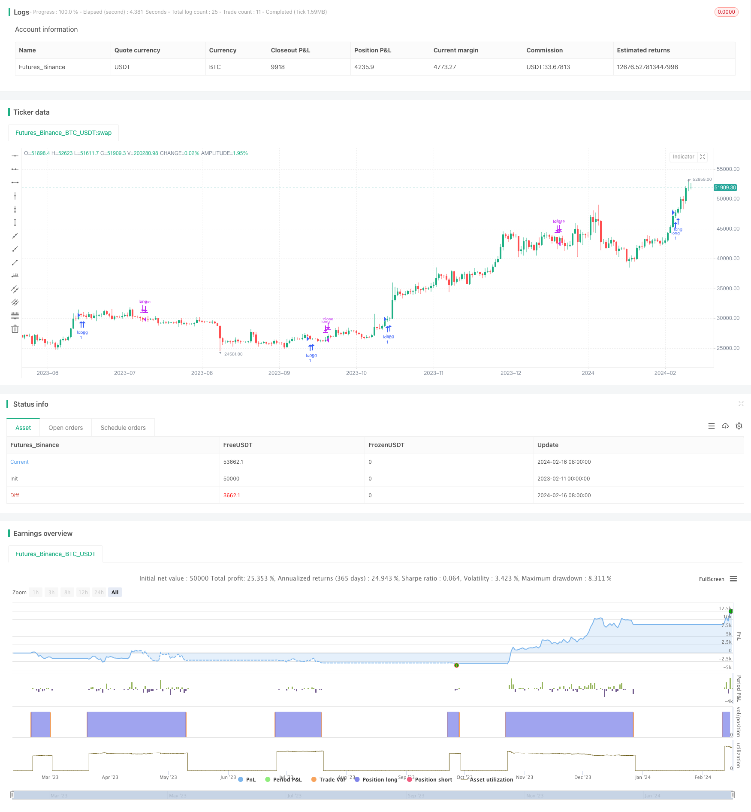

> Name

Long-term trend strategy ATR-EOM-and-VORTEX-Based-Long-Trend-Strategy based on ATREOM and VORTEX
> Author

ChaoZhang

> Strategy Description


[trans]
## Overview
This strategy is a long-term trend strategy for use in the stock and cryptocurrency markets. It combines three indicators: ATR (Average True Range), EOM (Easy Moving Average) and VORTEX (Vortex Indicator) to identify the trend direction.
## Strategy Principle
- ATR is used to measure market volatility. Here we calculate the 10-period ATR and then smooth the ATR through the 5-period EMA. If the current ATR is higher than EMAATR, it means that it is currently in a highly volatile market and is a bull market; on the contrary, it is a bear market.
- EOM is a volume and price indicator. Here we calculate the EOM for 10 periods. If EOM is positive, it means that the current market is experiencing a surge in volume and energy, which is a bull market; if EOM is negative, it is a bear market.
- VORTEX represents the vortex indicator, which is used to determine the long-term trend direction. We calculate the sum of the absolute values ​​of price fluctuations in the past 10 periods to obtain VMP and VMM respectively. Then use the sum of ATR as the denominator of normalization to calculate VIP and VIM. Take the average of the two. If it is greater than 1, it means it is a bull market, and if it is less than 1, it is a bear market.
In summary, this strategy uses ATR and EMAATR to determine short-term volatility, EOM to determine volume and price characteristics, and VORTEX to determine the long-term trend, to determine the final long-only direction.

## Advantage Analysis
- This strategy combines three major categories of indicators to identify the trend direction, including volatility, volume and price, and trend, with comprehensive judgment and strong signals.
- Both ATR and VORTEX have certain smoothing characteristics, which can effectively filter the noise of the oscillating market and avoid erroneous long signals.
- Only going long and not short can minimize the risk of losses caused by short-term adjustments.
- As a trend following strategy, it focuses on capturing medium and long-term directional opportunities, which is conducive to obtaining profits from the main market trends.
## Risk Analysis
- The backtest data is insufficient, the actual performance needs to be verified, and the parameter settings also need to be further optimized and tested.
- It is not possible to search for profit opportunities brought by reversal or shock market conditions, and there are certain limitations in the upper limit of profit.
- Pure trend strategies cannot effectively control position risks, and there is a certain degree of capital lock-in risk.
- It is impossible to go short, unable to hedge position risks, and the room for loss is relatively large.
## Optimization direction
- Test the stability of different ATR and VORTEX cycle parameters.
- Try to introduce stop loss mechanisms, such as trailing stop loss, time stop loss, etc., to control single losses.
- Set the position ratio based on the ATR value, and reduce the risk when the volatility is high.
- Combine the reversal factor to confirm the entry timing to avoid unnecessary locking of funds.

## Summarize
This strategy is a long-term trend tracking strategy. It uses the three major indicators of ATR, EOM and VORTEX to confirm the trend direction before entering the market. It only goes long but not short, in order to capture the excess returns brought by the main trend. It has the advantages of comprehensive judgment and clear signals, but it also has the disadvantages of insufficient data and weak risk control capabilities. In the future, improvements and optimizations can be made from the introduction of stop loss, optimized parameter settings, position management, etc.
||

## Overview

This strategy is a long-term trend strategy for stock and cryptocurrency markets. It combines three indicators - ATR (Average True Range), EOM (Ease of Movement) and VORTEX to identify trend directions.

## Strategy Logic  

- ATR measures market volatility. Here we calculate the 10-period ATR and smooth it with a 5-period EMA. If the current ATR is above EMA of ATR, it indicates high volatility and a bull market. Otherwise, it is a bear market.

- EOM belongs to volume-price indicators. Here we calculate the 10-period EOM. If EOM is positive, it suggests increasing trading volumes and a bull market. Otherwise it is a bear market.

- VORTEX represents vortex indicator to judge long-term trend directions. We calculate the sum of absolute price fluctuations over last 10 periods to get VMP and VMM. Then use sum of ATR as denominator to normalize and obtain VIP and VIM. Average them, if greater than 1 suggests bull and less than 1 suggests bear markets.   

In summary, this strategy combines ATR/EMAATR for short-term volatility, EOM for volume-price features and VORTEX for long-term trend to determine the final long-only direction.

## Advantage Analysis

- This strategy synthesizes three major types of indicators, including volatility, volume-price and trend to identify trend directions with comprehensive judgments and strong signals.  

- Both ATR and VORTEX have smoothing features to filter out noises from ranged markets and avoid false long signals.   

- Only long without short can maximize risk avoidance from short-term pullbacks. 

- As a trend following strategy, it focuses on capturing medium-to-long term directional opportunities and benefits from the main trend.

## Risk Analysis  

- Insufficient backtest data with real-trading performance to be verified and parameters to be further optimized and tested.

- Unable to search for profit opportunities from reversals or range-bound markets, limiting profit potential.  

- Pure trend strategy cannot effectively control position risks with certain capital locking risks. 

- Unable to short for hedging with larger loss space.

## Optimization Directions

- Test stability of different periods for ATR and VORTEX. 

- Attempt to introduce stop loss methods e.g. moving stop loss, time stop loss to control single loss.

- Set position sizing based on ATR values to reduce risk in high volatility environments.   

- Incorporate mean-reversion factors to confirm entry timing and avoid unnecessary capital locking.

## Conclusion

This long-term trend following strategy enters based on confirmations from ATR, EOM and VORTEX across three categories, and only goes long without short to benefit from main trend. It has the advantage of comprehensive judgments and clear signals, but the disadvantages of insufficient data validation, weak risk control capabilities. Future improvements can be made in areas like introducing stop loss, optimizing parameter settings and position sizing.

[/trans]

> Strategy Arguments


|Argument|Default|Description|
|----|----|----|
|v_input_1|10|atr_lenght|
|v_input_2|5|ema_atr_length|
|v_input_3|10|lengthEOM|
|v_input_4|10|Length|


> Source (PineScript)

``` pinescript
/*backtest
start: 2023-02-11 00:00:00
end: 2024-02-17 00:00:00
period: 1d
basePeriod: 1h
exchanges: [{"eid":"Futures_Binance","currency":"BTC_USDT"}]
*/

// This source code is subject to the terms of the Mozilla Public License 2.0 at https://mozilla.org/MPL/2.0/
// © SoftKill21

//@version=4
strategy("atr+eom+vortex strat", overlay=true )

//atr and ema
atr_lenght=input(10)
atrvalue = atr(atr_lenght)


//plot(atrvalue)
ema_atr_length=input(5)
ema_atr = ema(atrvalue,ema_atr_length)

//plot(ema_atr,color=color.white)

//EOM and ema
lengthEOM = input(10, minval=1)
div = 10//input(10000, title="Divisor", minval=1)
eom = sma(div * change(hl2) * (high - low) / volume, lengthEOM)
// + - 0 long/short

//VORTEX
period_ = input(10, title="Length", minval=2)
VMP = sum( abs( high - low[1]), period_ )
VMM = sum( abs( low - high[1]), period_ )
STR = sum( atr(1), period_ )
VIP = VMP / STR
VIM = VMM / STR
avg_vortex=(VIP+VIM)/2
//plot(avg_vortex)

long= atrvalue > ema_atr and eom > 0 and avg_vortex>1 
short=atrvalue < ema_atr and eom < 0 and avg_vortex<1 

strategy.entry("long",1,when=long)
//strategy.entry("short",0,when=short)

strategy.close("long",when=short)
```

> Detail

https://www.fmz.com/strategy/442011

> Last Modified

2024-02-18 16:01:07
